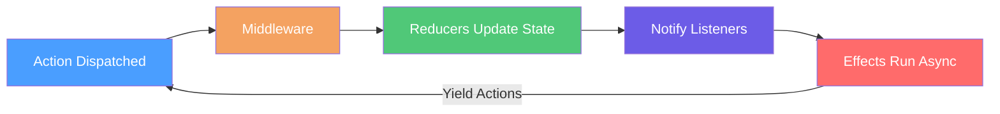

# Effects

## Overview

Effects handle asynchronous side effects triggered by actions. They run after reducers have updated state and can perform operations like HTTP calls, timers, or navigation—and optionally dispatch additional actions as results.
([IActionEffect](https://github.com/Gibbs-Morris/mississippi/blob/main/src/Reservoir.Abstractions/IActionEffect%7BTState%7D.cs),
[Store](https://github.com/Gibbs-Morris/mississippi/blob/main/src/Reservoir/Store.cs))

## What Is an Effect?

An effect is a handler that performs asynchronous work in response to an action. Unlike reducers which synchronously compute new state, effects handle operations that cannot be expressed as pure functions—network requests, timers, browser APIs, and other I/O.

Effects are feature-scoped: each effect is registered for a specific feature state type and only receives actions dispatched to the store.

## When to Use Effects

Use effects when you need to:

- **Call external APIs** — HTTP requests or other outbound calls
- **Perform navigation** — Redirect after a successful action
- **Set timers** — Schedule delayed actions
- **Perform logging or analytics** — Emit telemetry without dispatching follow-up actions
([IActionEffect remarks](https://github.com/Gibbs-Morris/mississippi/blob/main/src/Reservoir.Abstractions/IActionEffect%7BTState%7D.cs),
[SimpleActionEffectBase remarks](https://github.com/Gibbs-Morris/mississippi/blob/main/src/Reservoir.Abstractions/SimpleActionEffectBase.cs))

## Effect Execution Flow

Effects run after reducers have processed an action:



All matching effects for a feature state are invoked. Effects can yield additional actions that flow back through the dispatch pipeline.
([RootActionEffect](https://github.com/Gibbs-Morris/mississippi/blob/main/src/Reservoir/RootActionEffect.cs#L24-L30))

## The IActionEffect Interface

All effects implement [`IActionEffect<TState>`](https://github.com/Gibbs-Morris/mississippi/blob/main/src/Reservoir.Abstractions/IActionEffect%7BTState%7D.cs):

```csharp
public interface IActionEffect<in TState>
    where TState : class, IFeatureState
{
    bool CanHandle(IAction action);

    IAsyncEnumerable<IAction> HandleAsync(
        IAction action,
        TState currentState,
        CancellationToken cancellationToken
    );
}
```

| Member | Purpose |
|--------|---------|
| `CanHandle` | Returns `true` if this effect handles the given action |
| `HandleAsync` | Performs async work and yields resulting actions |

:::note State Parameter Guidance
The `currentState` parameter is included for interface consistency and future extensibility. However, effects should prefer extracting all needed data from the action itself to remain predictable and testable.
([IActionEffect remarks](https://github.com/Gibbs-Morris/mississippi/blob/main/src/Reservoir.Abstractions/IActionEffect%7BTState%7D.cs#L19-L24))
:::

## Base Classes

Reservoir provides two base classes that handle action type checking and dispatch:

| Base Class | Use When |
|------------|----------|
| [`ActionEffectBase<TAction, TState>`](https://github.com/Gibbs-Morris/mississippi/blob/main/src/Reservoir.Abstractions/ActionEffectBase.cs) | Effect needs to yield additional actions |
| [`SimpleActionEffectBase<TAction, TState>`](https://github.com/Gibbs-Morris/mississippi/blob/main/src/Reservoir.Abstractions/SimpleActionEffectBase.cs) | Effect performs work but yields no actions |

Both base classes:

- Implement `CanHandle` by checking if the action is of type `TAction`
- Dispatch to a strongly-typed `HandleAsync` method

## ActionEffectBase

Use [`ActionEffectBase`](https://github.com/Gibbs-Morris/mississippi/blob/main/src/Reservoir.Abstractions/ActionEffectBase.cs) when your effect needs to yield additional actions:

```csharp
// From Reservoir.L0Tests
private sealed class TestEffect : ActionEffectBase<TestAction, TestState>
{
    public override async IAsyncEnumerable<IAction> HandleAsync(
        TestAction action,
        TestState currentState,
        [EnumeratorCancellation] CancellationToken cancellationToken
    )
    {
        await Task.Yield();
        yield return new OtherAction();
    }
}
```

The base class handles:

- Type checking in `CanHandle` — returns `true` only for `TAction`
- Dispatch to your typed `HandleAsync` — returns empty enumerable for non-matching actions

([ActionEffectBase source](https://github.com/Gibbs-Morris/mississippi/blob/main/src/Reservoir.Abstractions/ActionEffectBase.cs#L28-L53))

## SimpleActionEffectBase

Use [`SimpleActionEffectBase`](https://github.com/Gibbs-Morris/mississippi/blob/main/src/Reservoir.Abstractions/SimpleActionEffectBase.cs) when your effect performs side effects but does not need to dispatch additional actions:

```csharp
// From Reservoir.L0Tests
private sealed class TestSimpleEffect : SimpleActionEffectBase<TestAction, TestState>
{
    public TestAction? HandledAction { get; private set; }

    public bool WasHandled { get; private set; }

    public override Task HandleAsync(
        TestAction action,
        TestState currentState,
        CancellationToken cancellationToken
    )
    {
        WasHandled = true;
        HandledAction = action;
        return Task.CompletedTask;
    }
}
```

The base class handles:

- Type checking in `CanHandle` — returns `true` only for `TAction`
- Wrapping your `Task`-returning handler as an `IAsyncEnumerable<IAction>` that yields nothing

([SimpleActionEffectBase source](https://github.com/Gibbs-Morris/mississippi/blob/main/src/Reservoir.Abstractions/SimpleActionEffectBase.cs#L28-L72))

## Registering Effects

Register effects using `AddActionEffect<TState, TEffect>()`:

```csharp
services.AddReservoir();
services.AddActionEffect<MyFeatureState, LoadDataEffect>();
services.AddActionEffect<MyFeatureState, LogAnalyticsEffect>();
```

([ReservoirRegistrations.AddActionEffect](https://github.com/Gibbs-Morris/mississippi/blob/main/src/Reservoir/ReservoirRegistrations.cs#L31-L42))

This method:

1. Registers the effect as `IActionEffect<TState>` with transient lifetime
2. Registers the `IRootActionEffect<TState>` compositor
3. Registers the feature state

:::tip Effects Are Transient
Effects are registered as transient services. Keep them stateless—any state should flow through actions and feature state.
([ActionEffectBase remarks](https://github.com/Gibbs-Morris/mississippi/blob/main/src/Reservoir.Abstractions/ActionEffectBase.cs#L23-L25))
:::

## How Effects Are Dispatched

When an action is dispatched, the store triggers effects after reducers and listener notifications:

1. **Action type indexing** — `RootActionEffect` pre-indexes effects by action type at construction for fast lookup
2. **Matching** — Effects registered for the exact action type are invoked first
3. **Fallback** — Effects whose action type could not be determined at construction use `CanHandle` filtering
4. **All effects run** — All matching effects are invoked (reducers also run all matching reducers in order)
5. **Yielded actions** — Actions yielded by effects are dispatched back through the store pipeline

([RootActionEffect dispatch logic](https://github.com/Gibbs-Morris/mississippi/blob/main/src/Reservoir/RootActionEffect.cs#L103-L125))

## Error Handling

Effects are responsible for their own error handling. The store catches exceptions to prevent effect failures from breaking dispatch:

- Non-critical exceptions during enumeration stop that effect and are swallowed
- The store swallows exceptions while invoking effects to keep dispatch stable
- Effects should emit error actions rather than throwing

([Store error handling](https://github.com/Gibbs-Morris/mississippi/blob/main/src/Reservoir/Store.cs#L276-L328),
[RootActionEffect error handling](https://github.com/Gibbs-Morris/mississippi/blob/main/src/Reservoir/RootActionEffect.cs#L140-L260))

## Cancellation

Client-side action effects are non-cancellable once started. The store passes `CancellationToken.None` to `HandleAsync`:

> Client-side action effects are intentionally non-cancellable once started. We pass CancellationToken.None to HandleAsync to indicate that the effect should not depend on external cancellation and must handle its own lifetime.

([Store.TriggerEffectsAsync](https://github.com/Gibbs-Morris/mississippi/blob/main/src/Reservoir/Store.cs#L305-L309))

## Testing Effects

Reservoir.L0Tests show how effects behave when they handle matching and non-matching actions:

```csharp
// From Reservoir.L0Tests
[Fact]
public async Task HandleAsyncDispatchesToTypedMethodForMatchingAction()
{
    // Arrange
    TestEffect sut = new();
    TestAction action = new("test");
    TestState state = new();

    // Act
    List<IAction> results = [];
    await foreach (IAction result in sut.HandleAsync(action, state, CancellationToken.None))
    {
        results.Add(result);
    }

    // Assert
    Assert.Single(results);
    Assert.IsType<OtherAction>(results[0]);
}
```

([ActionEffectBaseTests](https://github.com/Gibbs-Morris/mississippi/blob/main/tests/Reservoir.L0Tests/ActionEffectBaseTests.cs#L99-L117))

For `SimpleActionEffectBase`, verify the side effect occurred:

```csharp
// From Reservoir.L0Tests
[Fact]
public async Task HandleAsyncInvokesSimpleHandlerAndYieldsNoActions()
{
    // Arrange
    TestSimpleEffect sut = new();
    IActionEffect<TestState> effect = sut;
    TestAction action = new("test-value");
    TestState state = new();

    // Act
    List<IAction> results = [];
    await foreach (IAction result in effect.HandleAsync(action, state, CancellationToken.None))
    {
        results.Add(result);
    }

    // Assert
    Assert.Empty(results);
    Assert.True(sut.WasHandled);
    Assert.Equal(action, sut.HandledAction);
}
```

([SimpleActionEffectBaseTests](https://github.com/Gibbs-Morris/mississippi/blob/main/tests/Reservoir.L0Tests/SimpleActionEffectBaseTests.cs#L99-L123))

## Summary

| Concept | Description |
|---------|-------------|
| **Effects** | Handle async side effects triggered by actions |
| **Feature-scoped** | Each effect is registered for a specific `IFeatureState` type |
| **Run after reducers** | Effects execute after state updates and listener notifications |
| **All effects invoke** | All matching effects run; reducers also run all matching reducers in order |
| **ActionEffectBase** | Use when effect yields additional actions |
| **SimpleActionEffectBase** | Use when effect performs work but yields nothing |
| **Transient lifetime** | Effects are stateless; state flows through actions |
| **Error handling** | Effects should emit error actions rather than throwing |

([Store error handling](https://github.com/Gibbs-Morris/mississippi/blob/main/src/Reservoir/Store.cs#L276-L328))

## Next Steps

- [Reservoir Overview](./reservoir.md) — See the end-to-end dispatch pipeline
- [Feature State](./feature-state.md) — Learn how to define feature state that effects operate on
- [Store](./store.md) — Understand the central hub that coordinates effects, reducers, and state
