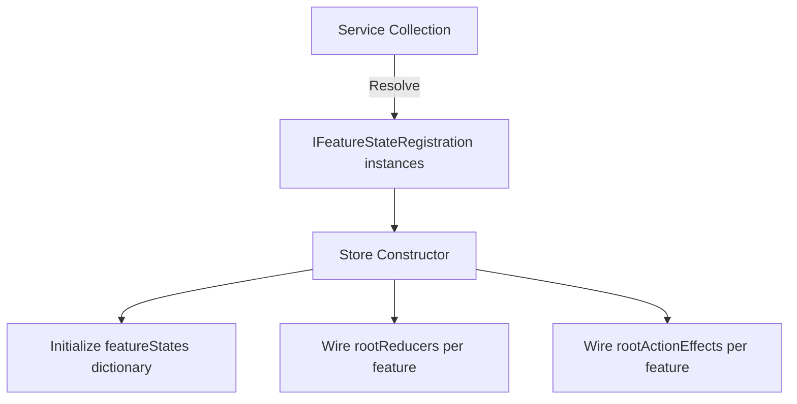

# Feature State

Feature states are independent slices of the Reservoir state tree. Each feature state represents a self-contained piece of application state (UI selection, form data, command status) with its own reducers and effects.
([IFeatureState](https://github.com/Gibbs-Morris/mississippi/blob/main/src/Reservoir.Abstractions/State/IFeatureState.cs))

## What Is Feature State?

A feature state is an immutable record that implements [`IFeatureState`](https://github.com/Gibbs-Morris/mississippi/blob/main/src/Reservoir.Abstractions/State/IFeatureState.cs). Each feature state:

- Has a unique `FeatureKey` that identifies it in the store
- Is registered independently with its own reducers and effects
- Can be accessed via `store.GetState<TState>()`

```csharp
public interface IFeatureState
{
    static abstract string FeatureKey { get; }
}
```

The `FeatureKey` must be unique across all registered feature states.
([IFeatureState remarks](https://github.com/Gibbs-Morris/mississippi/blob/main/src/Reservoir.Abstractions/State/IFeatureState.cs#L11-L14))

## When to Use Feature State

Use feature state when you need to:

- **Track UI state** — Selected items, expanded panels, navigation context
- **Manage form data** — Input values, validation state, submission status
- **Store command status** — Loading, success, failure states for async operations
- **Cache read data** — Projection data, lookup tables, user preferences

Each concern gets its own feature state, keeping state slices focused and testable.

## Defining Feature State

Feature states are immutable records with a static `FeatureKey`:

```csharp
// From Spring sample
internal sealed record EntitySelectionState : IFeatureState
{
    public static string FeatureKey => "entitySelection";

    public string? EntityId { get; init; }
}
```

([EntitySelectionState](https://github.com/Gibbs-Morris/mississippi/blob/main/samples/Spring/Spring.Client/Features/EntitySelection/EntitySelectionState.cs))

```csharp
// From Reservoir.L0Tests
private sealed record TestFeatureState : IFeatureState
{
    public static string FeatureKey => "test-feature";

    public int Counter { get; init; }
}
```

([StoreTests.TestFeatureState](https://github.com/Gibbs-Morris/mississippi/blob/main/tests/Reservoir.L0Tests/StoreTests.cs#L144-L154))

:::tip Use Immutable Records
Feature states should be immutable records. Use the `with` expression to create new instances with updated values. This ensures proper change detection and prevents accidental mutation.
:::

## Registering Feature State

Feature state is registered automatically when you add reducers or effects:

```csharp
// AddReducer automatically registers the feature state
services.AddReducer<SetEntityIdAction, EntitySelectionState>(
    (state, action) => state with { EntityId = action.EntityId });

// AddActionEffect also registers the feature state
services.AddActionEffect<EntitySelectionState, MyEffect>();
```

For feature states without reducers or effects, register directly:

```csharp
public static IServiceCollection AddFeatureState<TState>(
    this IServiceCollection services
)
    where TState : class, IFeatureState, new();
```

([ReservoirRegistrations.AddFeatureState](https://github.com/Gibbs-Morris/mississippi/blob/main/src/Reservoir/ReservoirRegistrations.cs#L53-L65))

:::note Automatic Deduplication
`AddFeatureState` uses `TryAddEnumerable` to prevent duplicate registrations. You can call it multiple times for the same state type without side effects.
([ReservoirRegistrations source](https://github.com/Gibbs-Morris/mississippi/blob/main/src/Reservoir/ReservoirRegistrations.cs#L59-L63))
:::

## Accessing Feature State

Use `store.GetState<TState>()` to retrieve the current state:

```csharp
EntitySelectionState selection = store.GetState<EntitySelectionState>();
string? currentEntityId = selection.EntityId;
```

From a Blazor component inheriting `StoreComponent`:

```csharp
protected override void OnStateChanged()
{
    EntitySelectionState selection = GetState<EntitySelectionState>();
    // React to state changes
}
```

([IStore.GetState](https://github.com/Gibbs-Morris/mississippi/blob/main/src/Reservoir.Abstractions/IStore.cs#L38-L44),
[Store.GetState](https://github.com/Gibbs-Morris/mississippi/blob/main/src/Reservoir/Store.cs#L112-L125))

If the feature state is not registered, `GetState` throws:

```
InvalidOperationException: No feature state registered for 'entitySelection'.
Call AddFeatureState<EntitySelectionState>() during service registration.
```

## Modular Application Architecture

Reservoir's feature state model scales naturally from small to large applications:

### Small Apps: Single Feature

For simple apps, a single feature state may suffice:

```csharp
services.AddReservoir();
services.AddReducer<IncrementAction, CounterState>(
    (state, action) => state with { Count = state.Count + 1 });
```

### Medium Apps: Feature Folders

Organize state by feature folder, each with its own state, actions, reducers, and effects:

```
Features/
  EntitySelection/
    EntitySelectionState.cs
    SetEntityIdAction.cs
    EntitySelectionReducers.cs
  BankAccount/
    BankAccountState.cs
    BankAccountActions.cs
    BankAccountReducers.cs
    BankAccountEffects.cs
```

Each feature registers independently:

```csharp
// EntitySelection feature
services.AddReducer<SetEntityIdAction, EntitySelectionState>(
    (state, action) => state with { EntityId = action.EntityId });

// BankAccount feature
services.AddReducer<OpenAccountAction, BankAccountState, OpenAccountReducer>();
services.AddActionEffect<BankAccountState, OpenAccountEffect>();
```

### Large Apps: Feature Modules

For large applications, encapsulate feature registration in extension methods:

```csharp
public static class EntitySelectionFeature
{
    public static IServiceCollection AddEntitySelectionFeature(
        this IServiceCollection services)
    {
        services.AddReducer<SetEntityIdAction, EntitySelectionState>(
            (state, action) => state with { EntityId = action.EntityId });
        return services;
    }
}

public static class BankAccountFeature
{
    public static IServiceCollection AddBankAccountFeature(
        this IServiceCollection services)
    {
        services.AddReducer<OpenAccountAction, BankAccountState, OpenAccountReducer>();
        services.AddReducer<DepositAction, BankAccountState, DepositReducer>();
        services.AddActionEffect<BankAccountState, DepositEffect>();
        return services;
    }
}
```

Compose features in `Program.cs`:

```csharp
services.AddReservoir();
services.AddEntitySelectionFeature();
services.AddBankAccountFeature();
services.AddUserPreferencesFeature();
```

This pattern:

- Keeps each feature self-contained and testable
- Enables features to be developed in parallel
- Allows features to be included/excluded per deployment
- Scales to dozens of features without registration clutter

## How Feature State Works

When the store is created, it collects all `IFeatureStateRegistration` instances from DI:



Each registration provides:

| Property | Description |
|----------|-------------|
| `FeatureKey` | Unique identifier for the feature state |
| `InitialState` | Default state instance (created via `new TState()`) |
| `RootReducer` | Composite reducer for this feature (if any) |
| `RootActionEffect` | Composite effect for this feature (if any) |

([IFeatureStateRegistration](https://github.com/Gibbs-Morris/mississippi/blob/main/src/Reservoir.Abstractions/State/IFeatureStateRegistration.cs),
[FeatureStateRegistration](https://github.com/Gibbs-Morris/mississippi/blob/main/src/Reservoir/State/FeatureStateRegistration.cs),
[Store constructor](https://github.com/Gibbs-Morris/mississippi/blob/main/src/Reservoir/Store.cs#L50-L90))

## Best Practices

### Keep Feature States Focused

Each feature state should represent one cohesive concern:

```csharp
// Good: focused on entity selection
internal sealed record EntitySelectionState : IFeatureState
{
    public static string FeatureKey => "entitySelection";
    public string? EntityId { get; init; }
}

// Good: focused on command execution status
internal sealed record CommandState : IFeatureState
{
    public static string FeatureKey => "command";
    public bool IsLoading { get; init; }
    public string? Error { get; init; }
}
```

### Use Descriptive Feature Keys

Feature keys appear in error messages and debugging. Use descriptive, kebab-case or camelCase keys:

```csharp
public static string FeatureKey => "entitySelection";    // Good
public static string FeatureKey => "user-preferences";   // Good
public static string FeatureKey => "x";                  // Avoid
```

### Initialize with Sensible Defaults

Feature states are created via parameterless constructor. Ensure defaults are valid:

```csharp
internal sealed record EntitySelectionState : IFeatureState
{
    public static string FeatureKey => "entitySelection";
    
    // Default: no entity selected
    public string? EntityId { get; init; } = null;
    
    // Default: not loading
    public bool IsLoading { get; init; } = false;
}
```

## Summary

| Concept | Description |
|---------|-------------|
| **Feature state** | Immutable record implementing `IFeatureState` |
| **FeatureKey** | Unique string identifier for the state slice |
| **Registration** | Automatic via `AddReducer`/`AddActionEffect`, or explicit via `AddFeatureState` |
| **Access** | `store.GetState<TState>()` or `GetState<TState>()` in components |
| **Modularity** | Each feature registers independently; compose via extension methods |
| **Scaling** | From single-feature apps to large modular systems |

([IFeatureState](https://github.com/Gibbs-Morris/mississippi/blob/main/src/Reservoir.Abstractions/State/IFeatureState.cs),
[IFeatureStateRegistration](https://github.com/Gibbs-Morris/mississippi/blob/main/src/Reservoir.Abstractions/State/IFeatureStateRegistration.cs),
[ReservoirRegistrations](https://github.com/Gibbs-Morris/mississippi/blob/main/src/Reservoir/ReservoirRegistrations.cs))

## Next Steps

- **Store** — Understand the central hub that coordinates feature states, reducers, and effects *(coming soon)*
- [Reducers](./reducers.md) — Learn how reducers update feature state
- [Effects](./effects.md) — Learn how effects perform async operations
