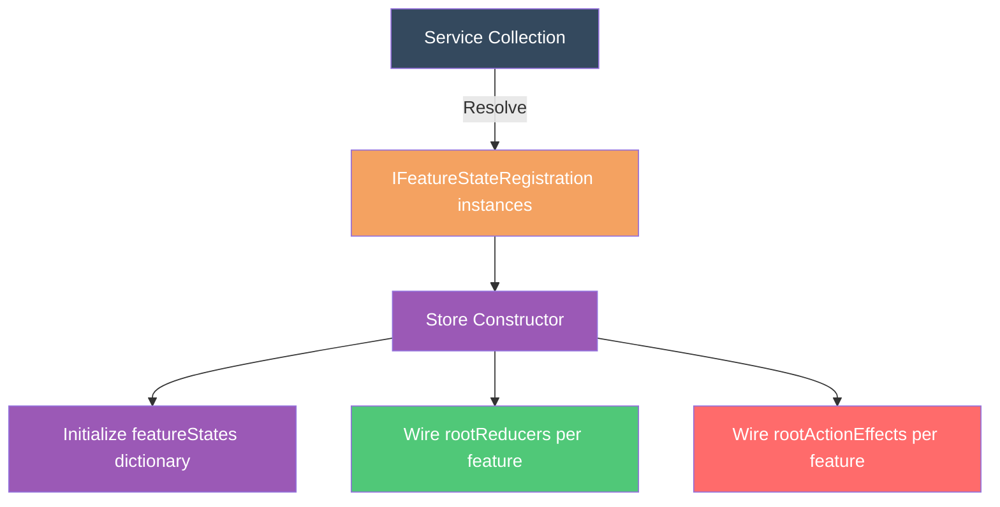

# Feature State

## Overview

Feature states are independent slices of the Reservoir state tree. Each feature state represents a self-contained piece of application state (UI, forms, session) with its own reducers and effects.
([IFeatureState](https://github.com/Gibbs-Morris/mississippi/blob/main/src/Reservoir.Abstractions/State/IFeatureState.cs))

## What Is Feature State?

A feature state is an immutable record that implements [`IFeatureState`](https://github.com/Gibbs-Morris/mississippi/blob/main/src/Reservoir.Abstractions/State/IFeatureState.cs). Each feature state:

- Has a unique `FeatureKey` that identifies it in the store
- Is registered independently with its own reducers and effects
- Can be accessed via `store.GetState<TState>()`

```csharp
public interface IFeatureState
{
    static abstract string FeatureKey { get; }
}
```

The `FeatureKey` must be unique across all registered feature states.
([IFeatureState](https://github.com/Gibbs-Morris/mississippi/blob/main/src/Reservoir.Abstractions/State/IFeatureState.cs))

## When to Use Feature State

Use feature state to model localized UI, forms, and session-oriented state that should live in the store.

## Defining Feature State

Feature states are immutable records with a static `FeatureKey`:

```csharp
// From Spring sample
internal sealed record EntitySelectionState : IFeatureState
{
    public static string FeatureKey => "entitySelection";

    public string? EntityId { get; init; }
}
```

([EntitySelectionState](https://github.com/Gibbs-Morris/mississippi/blob/main/samples/Spring/Spring.Client/Features/EntitySelection/EntitySelectionState.cs))

```csharp
// From Reservoir.L0Tests
private sealed record TestFeatureState : IFeatureState
{
    public static string FeatureKey => "test-feature";

    public int Counter { get; init; }
}
```

([StoreTests.TestFeatureState](https://github.com/Gibbs-Morris/mississippi/blob/main/tests/Reservoir.L0Tests/StoreTests.cs#L144-L153))

:::tip Immutable Record Usage
In the Spring sample, reducers update feature state by returning new record instances with `state with { ... }`.
([Spring sample reducer](https://github.com/Gibbs-Morris/mississippi/blob/main/samples/Spring/Spring.Client/Features/EntitySelection/EntitySelectionReducers.cs))
:::

## Registering Feature State

Feature state is registered automatically when you add reducers or effects:

```csharp
// AddReducer automatically registers the feature state
services.AddReducer<SetEntityIdAction, EntitySelectionState>(
    (state, action) => state with { EntityId = action.EntityId });

// AddActionEffect also registers the feature state
services.AddActionEffect<EntitySelectionState, MyEffect>();
```

For feature states without reducers or effects, register directly:

```csharp
public static IServiceCollection AddFeatureState<TState>(
    this IServiceCollection services
)
    where TState : class, IFeatureState, new();
```

([ReservoirRegistrations.AddFeatureState](https://github.com/Gibbs-Morris/mississippi/blob/main/src/Reservoir/ReservoirRegistrations.cs#L53-L65))

:::note Automatic Deduplication
`AddFeatureState` uses `TryAddEnumerable` to prevent duplicate registrations. You can call it multiple times for the same state type without side effects.
([ReservoirRegistrations source](https://github.com/Gibbs-Morris/mississippi/blob/main/src/Reservoir/ReservoirRegistrations.cs#L58-L63))
:::

## Accessing Feature State

Use `store.GetState<TState>()` to retrieve the current state:

```csharp
EntitySelectionState selection = store.GetState<EntitySelectionState>();
string? currentEntityId = selection.EntityId;
```

From a Blazor component inheriting `StoreComponent`:

```csharp
private EntitySelectionState Selection => GetState<EntitySelectionState>();
```

([IStore.GetState](https://github.com/Gibbs-Morris/mississippi/blob/main/src/Reservoir.Abstractions/IStore.cs#L35-L44),
[Store.GetState](https://github.com/Gibbs-Morris/mississippi/blob/main/src/Reservoir/Store.cs#L112-L125))

If the feature state is not registered, `GetState` throws:

```text
InvalidOperationException: No feature state registered for 'entitySelection'.
Call AddFeatureState<EntitySelectionState>() during service registration.
```

## How Feature State Works

When the store is created, it collects all `IFeatureStateRegistration` instances from DI:



Each registration provides:

| Property | Description |
|----------|-------------|
| `FeatureKey` | Unique identifier for the feature state |
| `InitialState` | Default state instance (created via `new TState()`) |
| `RootReducer` | Composite reducer for this feature (if any) |
| `RootActionEffect` | Composite effect for this feature (if any) |

([IFeatureStateRegistration](https://github.com/Gibbs-Morris/mississippi/blob/main/src/Reservoir.Abstractions/State/IFeatureStateRegistration.cs),
[FeatureStateRegistration](https://github.com/Gibbs-Morris/mississippi/blob/main/src/Reservoir/State/FeatureStateRegistration.cs),
[Store constructor](https://github.com/Gibbs-Morris/mississippi/blob/main/src/Reservoir/Store.cs#L58-L86))

## Feature Key and Initialization

The `FeatureKey` must be unique across all registered feature states. Initial state instances are created via `new TState()` in the registration path, so each feature state type must have a parameterless constructor.
([IFeatureState](https://github.com/Gibbs-Morris/mississippi/blob/main/src/Reservoir.Abstractions/State/IFeatureState.cs),
[FeatureStateRegistration](https://github.com/Gibbs-Morris/mississippi/blob/main/src/Reservoir/State/FeatureStateRegistration.cs))

## Summary

| Concept | Description |
|---------|-------------|
| **Feature state** | Immutable record implementing `IFeatureState` |
| **FeatureKey** | Unique string identifier for the state slice |
| **Registration** | Automatic via `AddReducer`/`AddActionEffect`, or explicit via `AddFeatureState` |
| **Access** | `store.GetState<TState>()` or `GetState<TState>()` in components |
| **Initialization** | Initial state is created via `new TState()` in the registration path |

([IFeatureState](https://github.com/Gibbs-Morris/mississippi/blob/main/src/Reservoir.Abstractions/State/IFeatureState.cs),
[IFeatureStateRegistration](https://github.com/Gibbs-Morris/mississippi/blob/main/src/Reservoir.Abstractions/State/IFeatureStateRegistration.cs),
[ReservoirRegistrations](https://github.com/Gibbs-Morris/mississippi/blob/main/src/Reservoir/ReservoirRegistrations.cs))

## Next Steps

- [Reservoir Overview](./reservoir.md) — See how feature state participates in dispatch
- [Store](./store.md) — Understand the central hub that coordinates feature states, reducers, and effects
- [Reducers](./reducers.md) — Learn how reducers update feature state
- [Effects](./effects.md) — Learn how effects perform async operations
