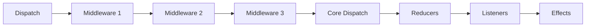

# Middleware

Middleware forms a pipeline between `Dispatch` and reducers. Each middleware can inspect, transform, or block actions, and perform side operations like logging or analytics.
([IMiddleware](https://github.com/Gibbs-Morris/mississippi/blob/main/src/Reservoir.Abstractions/IMiddleware.cs))

## What Is Middleware?

Middleware intercepts actions before they reach reducers. Unlike effects (which run after reducers), middleware runs during dispatch and can:

- **Log actions** — Record every action for debugging or analytics
- **Transform actions** — Modify or replace actions before reducers see them
- **Block actions** — Prevent actions from reaching reducers and effects
- **Perform side operations** — Execute operations like logging, analytics, or persistence
([IMiddleware remarks](https://github.com/Gibbs-Morris/mississippi/blob/main/src/Reservoir.Abstractions/IMiddleware.cs#L11-L19),
[Store.CoreDispatch](https://github.com/Gibbs-Morris/mississippi/blob/main/src/Reservoir/Store.cs#L213-L231))

## The IMiddleware Interface

All middleware implements [`IMiddleware`](https://github.com/Gibbs-Morris/mississippi/blob/main/src/Reservoir.Abstractions/IMiddleware.cs):

```csharp
public interface IMiddleware
{
    void Invoke(
        IAction action,
        Action<IAction> nextAction
    );
}
```

| Parameter | Purpose |
|-----------|---------|
| `action` | The action being dispatched |
| `nextAction` | Delegate to continue the pipeline; call this to pass the action forward |

:::warning Blocking Actions
If you do not call `nextAction`, the action is blocked from reaching subsequent middleware and reducers.
([IMiddleware remarks](https://github.com/Gibbs-Morris/mississippi/blob/main/src/Reservoir.Abstractions/IMiddleware.cs#L17-L19))
:::

## Middleware Pipeline Order

Middleware executes in registration order. The store builds the pipeline in reverse so that the first registered middleware runs first:



([Store.BuildMiddlewarePipeline](https://github.com/Gibbs-Morris/mississippi/blob/main/src/Reservoir/Store.cs#L197-L210))

## Creating Middleware

Implement `IMiddleware` and call `nextAction` to continue the pipeline:

```csharp
// From Reservoir.L0Tests
private sealed class TestMiddleware : IMiddleware
{
    private readonly Action onInvoke;

    public TestMiddleware(
        Action onInvoke
    ) =>
        this.onInvoke = onInvoke;

    public void Invoke(
        IAction action,
        Action<IAction> nextAction
    )
    {
        onInvoke();
        nextAction(action);
    }
}
```

([StoreTests.TestMiddleware](https://github.com/Gibbs-Morris/mississippi/blob/main/tests/Reservoir.L0Tests/StoreTests.cs#L158-L178))

### Ordered Middleware Example

To verify pipeline order, middleware can record its position:

```csharp
// From Reservoir.L0Tests
private sealed class OrderedMiddleware : IMiddleware
{
    private readonly int order;
    private readonly List<int> orderList;

    public OrderedMiddleware(
        int order,
        List<int> orderList
    )
    {
        this.order = order;
        this.orderList = orderList;
    }

    public void Invoke(
        IAction action,
        Action<IAction> nextAction
    )
    {
        orderList.Add(order);
        nextAction(action);
    }
}
```

([StoreTests.OrderedMiddleware](https://github.com/Gibbs-Morris/mississippi/blob/main/tests/Reservoir.L0Tests/StoreTests.cs#L43-L68))

## Registering Middleware

Register middleware using `AddMiddleware<TMiddleware>()`:

```csharp
public static IServiceCollection AddMiddleware<TMiddleware>(
    this IServiceCollection services
)
    where TMiddleware : class, IMiddleware;
```

([ReservoirRegistrations.AddMiddleware](https://github.com/Gibbs-Morris/mississippi/blob/main/src/Reservoir/ReservoirRegistrations.cs#L73-L81))

Middleware is registered as transient and resolved when the store is created.
([ReservoirRegistrations.AddMiddleware](https://github.com/Gibbs-Morris/mississippi/blob/main/src/Reservoir/ReservoirRegistrations.cs#L73-L81),
[Store constructor](https://github.com/Gibbs-Morris/mississippi/blob/main/src/Reservoir/Store.cs#L50-L90))

### Runtime Registration

You can also register middleware directly on the store after construction:

```csharp
public void RegisterMiddleware(
    IMiddleware middleware
);
```

([Store.RegisterMiddleware](https://github.com/Gibbs-Morris/mississippi/blob/main/src/Reservoir/Store.cs#L131-L139))

:::note Registration Timing
Middleware registered after dispatch has started will be included in subsequent dispatches. Each `Dispatch` call rebuilds the pipeline.
([Store.Dispatch](https://github.com/Gibbs-Morris/mississippi/blob/main/src/Reservoir/Store.cs#L95-L110),
[Store.BuildMiddlewarePipeline](https://github.com/Gibbs-Morris/mississippi/blob/main/src/Reservoir/Store.cs#L197-L210))
:::

## Testing Middleware

The store tests verify middleware behavior:

```csharp
// From Reservoir.L0Tests
[Fact]
public void MiddlewarePipelineExecutesInOrder()
{
    // Arrange
    List<int> order = [];
    sut.RegisterMiddleware(new OrderedMiddleware(1, order));
    sut.RegisterMiddleware(new OrderedMiddleware(2, order));
    sut.RegisterMiddleware(new OrderedMiddleware(3, order));

    // Act
    sut.Dispatch(new IncrementAction());

    // Assert
    Assert.Equal([1, 2, 3], order);
}
```

([StoreTests.MiddlewarePipelineExecutesInOrder](https://github.com/Gibbs-Morris/mississippi/blob/main/tests/Reservoir.L0Tests/StoreTests.cs#L449-L463))

```csharp
// From Reservoir.L0Tests
[Fact]
public void RegisterMiddlewareAddsToDispatchPipeline()
{
    // Arrange
    bool middlewareInvoked = false;
    sut.RegisterMiddleware(new TestMiddleware(() => middlewareInvoked = true));

    // Act
    sut.Dispatch(new IncrementAction());

    // Assert
    Assert.True(middlewareInvoked);
}
```

([StoreTests.RegisterMiddlewareAddsToDispatchPipeline](https://github.com/Gibbs-Morris/mississippi/blob/main/tests/Reservoir.L0Tests/StoreTests.cs#L490-L502))

## Summary

| Concept | Description |
|---------|-------------|
| **Middleware** | Intercepts actions before reducers |
| **Pipeline order** | Executes in registration order |
| **Invoke pattern** | Call `nextAction` to continue; omit to block |
| **Registration** | `AddMiddleware<T>()` or `store.RegisterMiddleware()` |
| **Transient lifetime** | Middleware is registered as transient and resolved when the store is created |
| **Dispatch order** | Runs before reducers and effects in the dispatch pipeline |

([ReservoirRegistrations.AddMiddleware](https://github.com/Gibbs-Morris/mississippi/blob/main/src/Reservoir/ReservoirRegistrations.cs#L73-L81),
[Store.CoreDispatch](https://github.com/Gibbs-Morris/mississippi/blob/main/src/Reservoir/Store.cs#L213-L231))

## Next Steps

- [Feature State](./feature-state.md) — Learn how to define feature state that middleware can inspect
- [Store](./store.md) — Understand the central hub that coordinates middleware, reducers, and effects
