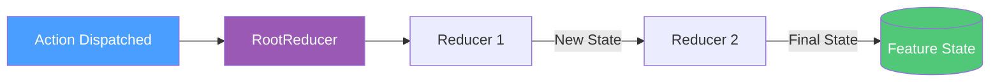

# Action Reducers

Action reducers are pure functions that take the current state and an action, and return a new state. They are the synchronous heart of Reservoir's state management.

## What Is a Reducer?

A reducer answers the question: *"Given this state and this action, what is the new state?"*

```csharp
// (state, action) => newState
public static CounterState Increment(CounterState state, IncrementAction action)
    => state with { Count = state.Count + 1 };
```

Reducers must be **pure functions**:

- Given the same state and action, they always return the same new state
- They must not have side effects (no HTTP calls, no logging, no mutations)

([IActionReducer](https://github.com/Gibbs-Morris/mississippi/blob/main/src/Reservoir.Abstractions/IActionReducer.cs#L46-L49))

## Registration Options

Reservoir provides two ways to register reducers, depending on your preference.

### Option 1: Delegate Reducers (Recommended for Simple Cases)

Register a static method or lambda directly with `AddReducer`:

```csharp
// Using a static method from a reducer class
services.AddReducer<SetEntityIdAction, EntitySelectionState>(EntitySelectionReducers.SetEntityId);

// Using an inline lambda
services.AddReducer<IncrementAction, CounterState>(
    (state, action) => state with { Count = state.Count + 1 });
```

This approach uses [`DelegateActionReducer<TAction, TState>`](https://github.com/Gibbs-Morris/mississippi/blob/main/src/Reservoir/DelegateActionReducer.cs) internally.

**When to use**: Simple reducers that don't need injected dependencies.

### Option 2: Class-Based Reducers

Create a class that inherits from [`ActionReducerBase<TAction, TState>`](https://github.com/Gibbs-Morris/mississippi/blob/main/src/Reservoir.Abstractions/ActionReducerBase.cs) and register it with the three-type-parameter overload:

```csharp
// The reducer class
public sealed class SetEntityIdReducer : ActionReducerBase<SetEntityIdAction, EntitySelectionState>
{
    public override EntitySelectionState Reduce(EntitySelectionState state, SetEntityIdAction action)
        => state with { EntityId = action.EntityId };
}

// Registration
services.AddReducer<SetEntityIdAction, EntitySelectionState, SetEntityIdReducer>();
```

**When to use**: Reducers that need constructor-injected services (though this is rare—reducers should typically be pure).

([AddReducer overloads](https://github.com/Gibbs-Morris/mississippi/blob/main/src/Reservoir/ReservoirRegistrations.cs#L86-L130))

## Organizing Reducers

A common pattern is to group reducer functions in a static class per feature:

```csharp
// EntitySelectionReducers.cs
internal static class EntitySelectionReducers
{
    public static EntitySelectionState SetEntityId(
        EntitySelectionState state,
        SetEntityIdAction action
    ) =>
        state with
        {
            EntityId = string.IsNullOrEmpty(action.EntityId) ? null : action.EntityId,
        };
    
    public static EntitySelectionState ClearSelection(
        EntitySelectionState state,
        ClearSelectionAction action
    ) =>
        state with { EntityId = null };
}
```

Then register each reducer separately:

```csharp
services.AddReducer<SetEntityIdAction, EntitySelectionState>(EntitySelectionReducers.SetEntityId);
services.AddReducer<ClearSelectionAction, EntitySelectionState>(EntitySelectionReducers.ClearSelection);
```

([Spring sample: EntitySelectionReducers](https://github.com/Gibbs-Morris/mississippi/blob/main/samples/Spring/Spring.Client/Features/EntitySelection/EntitySelectionReducers.cs))

## How Reducers Are Invoked

When an action is dispatched, the store calls [`RootReducer<TState>`](https://github.com/Gibbs-Morris/mississippi/blob/main/src/Reservoir/RootReducer.cs) for each registered feature state. The root reducer:

1. Looks up reducers registered for the action's exact type
2. Calls each matching reducer in registration order
3. Passes the output of one reducer as input to the next



Multiple reducers can handle the same action type. They run in sequence, each receiving the state produced by the previous reducer.

([RootReducer.Reduce](https://github.com/Gibbs-Morris/mississippi/blob/main/src/Reservoir/RootReducer.cs#L108-L136))

## Returning New State

Reducers must return a **new state instance** when state changes. Use `with` expressions for immutable records:

```csharp
// ✅ Correct: returns new state instance
public static CounterState Increment(CounterState state, IncrementAction action)
    => state with { Count = state.Count + 1 };

// ❌ Wrong: mutates existing state
public static CounterState IncrementBad(CounterState state, IncrementAction action)
{
    state.Count++; // Don't do this!
    return state;
}
```

If the reducer doesn't need to change state (action doesn't apply), return the original state instance:

```csharp
public static MyState MaybeUpdate(MyState state, SomeAction action)
{
    if (!action.ShouldApply)
        return state; // No change—return same instance
    
    return state with { Value = action.NewValue };
}
```

## Automatic Registration Side Effects

Both `AddReducer` overloads automatically:

1. Register the [`IRootReducer<TState>`](https://github.com/Gibbs-Morris/mississippi/blob/main/src/Reservoir.Abstractions/IRootReducer.cs) that composes all reducers for the feature
2. Register the [`IFeatureStateRegistration`](https://github.com/Gibbs-Morris/mississippi/blob/main/src/Reservoir.Abstractions/State/IFeatureStateRegistration.cs) that provides initial state

You don't need to call `AddFeatureState` or `AddRootReducer` separately when using `AddReducer`.

([ReservoirRegistrations](https://github.com/Gibbs-Morris/mississippi/blob/main/src/Reservoir/ReservoirRegistrations.cs#L86-L130))

## Summary

| Concept | Description |
|---------|-------------|
| **Reducer** | Pure function: `(state, action) => newState` |
| **Delegate registration** | `AddReducer<TAction, TState>(func)` for simple cases |
| **Class registration** | `AddReducer<TAction, TState, TReducer>()` when you need DI |
| **Base class** | `ActionReducerBase<TAction, TState>` handles type checking |
| **Immutability** | Always return new state instances with `with` expressions |

## Next Steps

Detailed documentation for related components is coming soon:

- **Action Effects** — Handle async operations triggered by actions
- **Feature State** — Organize state into feature slices
