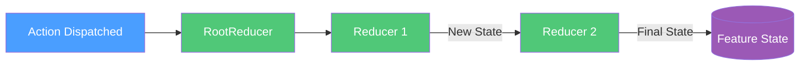

# Action Reducers

## Overview

Action reducers are pure functions that take the current state and an action, and return a new state. They are the synchronous heart of Reservoir's state management.

## What Is a Reducer?

A reducer answers the question: *"Given this state and this action, what is the new state?"*

```csharp
public static EntitySelectionState SetEntityId(EntitySelectionState state, SetEntityIdAction action)
    => state with
    {
        EntityId = string.IsNullOrEmpty(action.EntityId) ? null : action.EntityId,
    };
```

Reducers must be **pure functions**:

- Given the same state and action, they always return the same new state
- They must not have side effects (no HTTP calls, no logging, no mutations)

([IActionReducer](https://github.com/Gibbs-Morris/mississippi/blob/main/src/Reservoir.Abstractions/IActionReducer.cs#L46-L49))

## Registration Options

Reservoir provides two ways to register reducers, depending on your preference.

### Option 1: Delegate Reducers

Register a static method or lambda directly with `AddReducer` on a feature builder:

```csharp
// Using a static method from a reducer class
IMississippiClientBuilder mississippi = builder.AddMississippiClient();
IReservoirBuilder reservoir = mississippi.AddReservoir();

reservoir.AddFeature<EntitySelectionState>()
    .AddReducer<SetEntityIdAction>(EntitySelectionReducers.SetEntityId)
    .Done();

```

This approach uses [`DelegateActionReducer<TAction, TState>`](https://github.com/Gibbs-Morris/mississippi/blob/main/src/Reservoir/DelegateActionReducer.cs) internally.

This option registers a delegate-based reducer for the action/state pair.
([ReservoirFeatureBuilder.AddReducer](https://github.com/Gibbs-Morris/mississippi/blob/main/src/Reservoir/Builders/ReservoirFeatureBuilder.cs#L53-L76))

### Option 2: Class-Based Reducers

Create a class that inherits from [`ActionReducerBase<TAction, TState>`](https://github.com/Gibbs-Morris/mississippi/blob/main/src/Reservoir.Abstractions/ActionReducerBase.cs) and register it with the three-type-parameter overload:

```csharp
// Example skeleton (replace MyAction/MyState with your types)
public sealed class MyReducer : ActionReducerBase<MyAction, MyState>
{
    public override MyState Reduce(MyState state, MyAction action)
        => state;
}

// Registration
reservoir.AddFeature<MyState>()
    .AddReducer<MyAction, MyReducer>()
    .Done();
```

This option registers the reducer class as a transient service and composes it into the root reducer.
([ReservoirFeatureBuilder.AddReducer](https://github.com/Gibbs-Morris/mississippi/blob/main/src/Reservoir/Builders/ReservoirFeatureBuilder.cs#L53-L76))

## Organizing Reducers

A common pattern is to group reducer functions in a static class per feature:

```csharp
// EntitySelectionReducers.cs
internal static class EntitySelectionReducers
{
    public static EntitySelectionState SetEntityId(
        EntitySelectionState state,
        SetEntityIdAction action
    ) =>
        state with
        {
            EntityId = string.IsNullOrEmpty(action.EntityId) ? null : action.EntityId,
        };
    
    // Add more reducer methods as needed for this feature.
}
```

Then register each reducer separately:

```csharp
reservoir.AddFeature<EntitySelectionState>()
    .AddReducer<SetEntityIdAction>(EntitySelectionReducers.SetEntityId)
    .Done();
```

([Spring sample: EntitySelectionReducers](https://github.com/Gibbs-Morris/mississippi/blob/main/samples/Spring/Spring.Client/Features/EntitySelection/EntitySelectionReducers.cs))

## How Reducers Are Invoked

When an action is dispatched, the store calls [`RootReducer<TState>`](https://github.com/Gibbs-Morris/mississippi/blob/main/src/Reservoir/RootReducer.cs) for each registered feature state. The root reducer:

1. Looks up reducers registered for the action's exact type
2. Calls each matching reducer in registration order
3. Passes the output of one reducer as input to the next



Multiple reducers can handle the same action type. They run in sequence, each receiving the state produced by the previous reducer.

([RootReducer.Reduce](https://github.com/Gibbs-Morris/mississippi/blob/main/src/Reservoir/RootReducer.cs#L108-L136))

## State Updates

Reducers return a **new state instance** when state changes. Feature states are expected to be immutable records, so the C# `with` expression is a common update pattern.
([IFeatureState](https://github.com/Gibbs-Morris/mississippi/blob/main/src/Reservoir.Abstractions/State/IFeatureState.cs),
[Spring sample reducer](https://github.com/Gibbs-Morris/mississippi/blob/main/samples/Spring/Spring.Client/Features/EntitySelection/EntitySelectionReducers.cs))

```csharp
// ✅ Correct: use `with` to create new state
public static EntitySelectionState SetEntityId(EntitySelectionState state, SetEntityIdAction action)
    => state with
    {
        EntityId = string.IsNullOrEmpty(action.EntityId) ? null : action.EntityId,
    };

// Use `with` to update only the properties that changed
```

If the reducer doesn't need to change state, return the original state instance unchanged:

```csharp
// Example skeleton (replace MyState/SomeAction with your types)
public static MyState MaybeUpdate(MyState state, SomeAction action)
{
    if (!action.ShouldApply)
        return state; // No change—return same instance
    
    return state with { Value = action.NewValue };
}
```

## Automatic Registration Side Effects

`AddFeature` and `AddReducer` automatically:

1. Register the [`IRootReducer<TState>`](https://github.com/Gibbs-Morris/mississippi/blob/main/src/Reservoir.Abstractions/IRootReducer.cs) that composes all reducers for the feature
2. Register the [`IFeatureStateRegistration`](https://github.com/Gibbs-Morris/mississippi/blob/main/src/Reservoir.Abstractions/State/IFeatureStateRegistration.cs) that provides initial state

You don't need to register a root reducer separately when using `AddReducer` on the feature builder.

([ReservoirBuilder.AddFeature](https://github.com/Gibbs-Morris/mississippi/blob/main/src/Reservoir/Builders/ReservoirBuilder.cs#L60-L65),
[ReservoirFeatureBuilder.AddReducer](https://github.com/Gibbs-Morris/mississippi/blob/main/src/Reservoir/Builders/ReservoirFeatureBuilder.cs#L53-L76))

## Summary

| Concept | Description |
|---------|-------------|
| **Reducer** | Pure function: `(state, action) => newState` |
| **Delegate registration** | `AddFeature().AddReducer<TAction>(func)` |
| **Class registration** | `AddFeature().AddReducer<TAction, TReducer>()` |
| **Base class** | `ActionReducerBase<TAction, TState>` handles type checking |
| **Immutability** | Feature states are expected to be immutable records; reducers return new instances when state changes |

## Next Steps

- [Reservoir Overview](./reservoir.md) — Understand how reducers fit into the dispatch pipeline
- [Effects](./effects.md) — Handle async operations triggered by actions
- [Feature State](./feature-state.md) — Organize state into feature slices
- [Store](./store.md) — Understand the central hub that coordinates reducers, effects, and state
