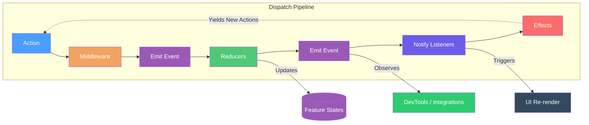

# Reservoir

## Overview

Reservoir is a Redux-inspired state management library in the Mississippi framework. It manages local feature states using a dispatch pipeline defined by [`IStore`](https://github.com/Gibbs-Morris/mississippi/blob/main/src/Reservoir.Abstractions/IStore.cs) and inspired by [Redux](https://redux.js.org/) and [Flux](https://facebookarchive.github.io/flux/).

## Core Components

Reservoir consists of six core components that work together to manage application state:

| Component | Purpose |
|-----------|---------|
| **Action** | Records that describe what happened or what the user intends (actions should be immutable) ([IAction](https://github.com/Gibbs-Morris/mississippi/blob/main/src/Reservoir.Abstractions/Actions/IAction.cs)) |
| **Action Reducer** | Pure functions that transform state based on actions ([IActionReducer](https://github.com/Gibbs-Morris/mississippi/blob/main/src/Reservoir.Abstractions/IActionReducer.cs)) |
| **Selector** | Pure functions that derive computed values from state with optional memoization ([Selectors](selectors.md)) |
| **Action Effect** | Handlers for async side effects (API calls, navigation, timers) ([IActionEffect](https://github.com/Gibbs-Morris/mississippi/blob/main/src/Reservoir.Abstractions/IActionEffect%7BTState%7D.cs)) |
| **Feature State** | State slices representing distinct areas of the application (feature states should be immutable) ([IFeatureState](https://github.com/Gibbs-Morris/mississippi/blob/main/src/Reservoir.Abstractions/State/IFeatureState.cs)) |
| **Store** | Central container that manages feature states and coordinates dispatch ([IStore](https://github.com/Gibbs-Morris/mississippi/blob/main/src/Reservoir.Abstractions/IStore.cs)) |

## How It Works

When a user interaction or system event occurs, an action is dispatched to the store. The store processes the action through a pipeline:



1. **Action Dispatched**: An [`IAction`](https://github.com/Gibbs-Morris/mississippi/blob/main/src/Reservoir.Abstractions/Actions/IAction.cs) is dispatched to the [`IStore`](https://github.com/Gibbs-Morris/mississippi/blob/main/src/Reservoir.Abstractions/IStore.cs).

2. **Middleware Pipeline**: Actions pass through registered [`IMiddleware`](https://github.com/Gibbs-Morris/mississippi/blob/main/src/Reservoir.Abstractions/IMiddleware.cs) components for logging, analytics, or transformation.

3. **Store Events**: The store emits [`StoreEventBase`](./store.md#observable-store-events) events through `IStore.StoreEvents`, enabling external integrations (like [DevTools](./devtools.md)) to observe activity via composition.

4. **Reducers Execute**: The store invokes [`IRootReducer<TState>`](https://github.com/Gibbs-Morris/mississippi/blob/main/src/Reservoir.Abstractions/IRootReducer.cs) for each feature state. Matching reducers produce new immutable state.

5. **Listeners Notified**: Subscribed listeners (via `Store.Subscribe()`) are notified synchronously after the action is processed.

6. **Effects Triggered**: [`IRootActionEffect<TState>`](https://github.com/Gibbs-Morris/mississippi/blob/main/src/Reservoir.Abstractions/IRootActionEffect.cs) dispatches to matching effects asynchronously. Effects can yield new actions, continuing the cycle.

## Benefits

### Testability and Stability

- **Reducers are pure functions**: given the same state and action, they always return the same new state ([IActionReducer](https://github.com/Gibbs-Morris/mississippi/blob/main/src/Reservoir.Abstractions/IActionReducer.cs)).
- **Selectors enable testable business logic**: extract derived values into pure functions that can be unit tested without component infrastructure ([Selectors](selectors.md#why-use-selectors)).
- **Effects handle async side effects**: action effects run asynchronous work triggered by actions ([IActionEffect](https://github.com/Gibbs-Morris/mississippi/blob/main/src/Reservoir.Abstractions/IActionEffect%7BTState%7D.cs)).
- **Feature states are immutable**: feature states are expected to be immutable records ([IFeatureState](https://github.com/Gibbs-Morris/mississippi/blob/main/src/Reservoir.Abstractions/State/IFeatureState.cs)).

### Clear Responsibilities

- **Reducers** handle synchronous state transitions.
- **Effects** handle asynchronous operations and side effects.
- **Middleware** handles cross-cutting concerns like logging or analytics.

## Blazor Integration

Reservoir provides [`StoreComponent`](store-component.md) in `Mississippi.Reservoir.Blazor` as a base class for Blazor components that need store access:

```csharp
public class MyComponent : StoreComponent
{
    protected override void OnInitialized()
    {
        base.OnInitialized();
        // Component auto-subscribes to store changes
    }
    
    private void HandleClick()
    {
        // Dispatch actions to the store
        Dispatch(new MyAction());
    }
    
    private MyFeatureState State => GetState<MyFeatureState>();
}
```

The base class:

- Automatically subscribes to store changes on initialization
- Triggers re-render when any state changes via `StateHasChanged`
- Disposes the subscription when the component is disposed

See [StoreComponent](store-component.md) for detailed usage guidance, including when to use it and when to avoid it.

## Quick Example

Here's a minimal example showing all core components working together:

```csharp
// 1. Define Feature State
public sealed record CounterState : IFeatureState
{
    public static string FeatureKey => "counter";
    public int Count { get; init; }
}

// 2. Define Actions
public sealed record IncrementAction : IAction;
public sealed record DecrementAction : IAction;

// 3. Define Reducer (pure function)
public static class CounterReducers
{
    public static CounterState Increment(CounterState state, IncrementAction action)
        => state with { Count = state.Count + 1 };
    
    public static CounterState Decrement(CounterState state, DecrementAction action)
        => state with { Count = state.Count - 1 };
}

// 4. Register in DI
IMississippiClientBuilder mississippi = builder.AddMississippiClient();
IReservoirBuilder reservoir = mississippi.AddReservoir();

reservoir.AddFeature<CounterState>(featureBuilder =>
{
    featureBuilder.AddReducer<IncrementAction>(CounterReducers.Increment);
    featureBuilder.AddReducer<DecrementAction>(CounterReducers.Decrement);
});
```

:::note
`AddFeature<TState>(...)` registers the feature state and executes the feature builder configuration. `AddReducer` registers the root reducer, and `mississippi.AddReservoir()` registers the `IStore` that coordinates dispatch.
([ReservoirBuilder.AddFeature](https://github.com/Gibbs-Morris/mississippi/blob/main/src/Reservoir/Builders/ReservoirBuilder.cs#L35-L44),
[ReservoirFeatureBuilder.AddReducer](https://github.com/Gibbs-Morris/mississippi/blob/main/src/Reservoir/Builders/ReservoirFeatureBuilder.cs#L45-L74),
[ReservoirBuilderExtensions.AddReservoir](https://github.com/Gibbs-Morris/mississippi/blob/main/src/Reservoir/ReservoirBuilderExtensions.cs#L20-L25))
:::

## Built-in Features

Reservoir.Blazor includes ready-to-use features for common Blazor application needs:

| Feature | Description |
|---------|-------------|
| [Built-in Navigation](built-in-navigation.md) | Redux-style navigation state with actions for routing, history management, and query parameters |
| [Built-in Lifecycle](built-in-lifecycle.md) | Application lifecycle tracking with initialization phases for loading states |

Register both with a single call:

```csharp
IMississippiClientBuilder mississippi = builder.AddMississippiClient();
IReservoirBuilder reservoir = mississippi.AddReservoir();
reservoir.AddReservoirBlazorBuiltIns();
```

## Learn More

Detailed documentation for each core component:

- [Actions](actions.md) — Defining and organizing actions
- [Reducers](reducers.md) — Writing pure reducer functions
- [Effects](effects.md) — Handling async side effects
- [Feature State](feature-state.md) — Designing state slices
- [Store](store.md) — Configuration and advanced usage
- [Middleware](middleware.md) — Cross-cutting concerns
- [StoreComponent](store-component.md) — Blazor base component for store integration
- [Selectors](selectors.md) — Deriving computed values from state with optional memoization
- [Built-in Navigation](built-in-navigation.md) — Navigation state management
- [Built-in Lifecycle](built-in-lifecycle.md) — Application lifecycle management
- [Testing](testing.md) — Unit testing reducers and effects with StoreTestHarness
- [DevTools](devtools.md) — Redux DevTools integration for time-travel debugging

## Source Code

Reservoir is implemented across these packages:

| Package | Purpose |
|---------|---------|
| [`Mississippi.Reservoir.Abstractions`](https://github.com/Gibbs-Morris/mississippi/tree/main/src/Reservoir.Abstractions) | Interfaces and base classes |
| [`Mississippi.Reservoir`](https://github.com/Gibbs-Morris/mississippi/tree/main/src/Reservoir) | Core implementation (Store, RootReducer, RootActionEffect) |
| [`Mississippi.Reservoir.Blazor`](https://github.com/Gibbs-Morris/mississippi/tree/main/src/Reservoir.Blazor) | Blazor integration (StoreComponent, built-in features) |
| [`Mississippi.Reservoir.Testing`](https://github.com/Gibbs-Morris/mississippi/tree/main/src/Reservoir.Testing) | Test harness for unit testing reducers and effects |
