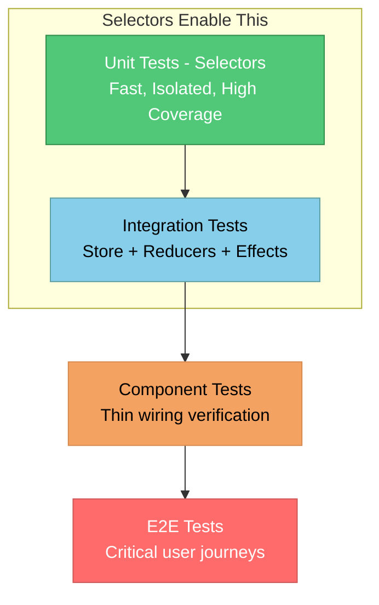
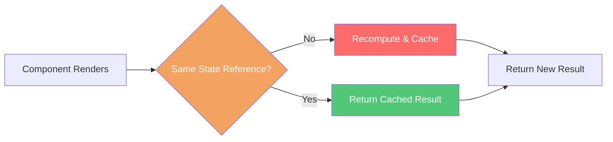
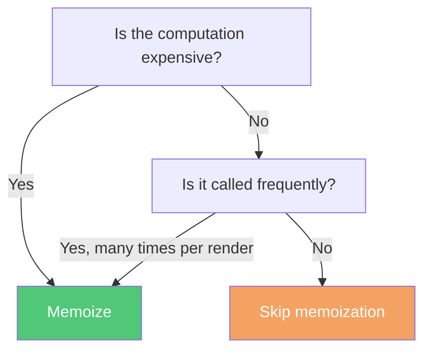

# Selectors

## Overview

Selectors are pure functions that derive computed values from store state. They encapsulate state access logic, promote reuse, and can be memoized to avoid redundant recomputation when state hasn't changed.

:::tip Opinionated Guidance
Mississippi provides **opinionated patterns** for when to use each approach. Following these patterns ensures consistent, maintainable, and testable code across your application.
:::

## When to Use What: The Decision Matrix

Mississippi provides three ways to access and derive state. Each has a specific purpose:

| Access Pattern | When to Use | Example |
|----------------|-------------|---------|
| **InletComponent Helpers** | Raw projection data/metadata access | `GetProjection<T>(id)` |
| **Selector Classes** | Derived/computed values | `Select(AccountSelectors.IsOpen(id))` |
| **Cross-State Selectors** | Combining multiple feature states | `Select(CompositeSelectors.IsOperationInProgress(id))` |

### ✅ DO Use InletComponent Helpers For

- Getting raw projection data: `GetProjection<BankAccountDto>(entityId)`
- Checking raw metadata: `IsProjectionLoading<T>(entityId)`, `IsProjectionConnected<T>(entityId)`
- Getting raw errors: `GetProjectionError<T>(entityId)`

These helpers provide clean, ergonomic access to projection state without requiring selectors.

### ✅ DO Use Selectors For

- **Derived values**: `IsAccountOpen`, `HasSufficientBalance`, `FormattedBalance`
- **Cross-state logic**: Combining aggregate state with projection state
- **Reusable computations**: Logic needed in multiple components
- **Expensive computations**: Values that benefit from memoization

### ❌ DON'T

- Write inline lambdas in components
- Compute derived values directly in component properties
- Mix helper calls with inline logic
- Create selectors that only wrap raw access (use helpers instead)

## Why Use Selectors?

:::tip The Enterprise Testing Advantage
In enterprise applications, high unit test coverage is non-negotiable. **Selectors are the primary mechanism for testing client-side business logic without complex UI tests**. By extracting derived logic into pure functions, you make your business rules trivially testable.
:::

### The Problem: Untestable Business Logic Trapped in Components

Without selectors, business logic gets scattered across components and becomes **extremely difficult to test**:

```csharp
// ❌ BAD: Business logic trapped in component - testing this requires:
// 1. Rendering the entire Blazor component
// 2. Setting up mock stores, DI containers, and SignalR connections
// 3. Triggering UI interactions to observe the computed values
// 4. Parsing rendered HTML to verify results
public partial class AccountDashboard : InletComponent
{
    private IEnumerable<BankAccountBalanceProjectionDto>? AllAccounts =>
        GetProjection<AllAccountsProjectionDto>(UserId)?.Accounts;

    // 🔴 Complex business logic that's HARD TO TEST without rendering component
    private IEnumerable<AccountSummary> HighValueAccountsWithPendingTransactions =>
        AllAccounts?
            .Where(a => a.Balance > 10_000m)
            .Where(a => a.PendingTransactionCount > 0)
            .OrderByDescending(a => a.Balance)
            .Select(a => new AccountSummary(
                a.AccountId,
                a.HolderName,
                a.Balance,
                FormatRiskLevel(a)))
        ?? Enumerable.Empty<AccountSummary>();

    // 🔴 More business logic buried in component
    private string FormatRiskLevel(BankAccountBalanceProjectionDto account) =>
        account.Balance > 100_000m ? "High Value" :
        account.PendingTransactionCount > 5 ? "High Activity" :
        "Normal";

    // 🔴 Cross-state derivation mixed with UI concerns
    private bool ShowUrgentWarning =>
        HighValueAccountsWithPendingTransactions.Any(a =>
            GetProjectionError<BankAccountBalanceProjectionDto>(a.AccountId) is not null ||
            Store.GetState<AlertsFeatureState>()?.HasCriticalAlerts is true);
}
```

**To test `HighValueAccountsWithPendingTransactions`, you would need to:**

1. Set up a full Blazor test host with `bunit`
2. Configure dependency injection with mock stores
3. Initialize projection state with test data
4. Render the component
5. Access internal properties via reflection or test the rendered HTML

This is **expensive, fragile, and slow**.

### The Solution: Pure, Testable Selectors

Extract the same logic into selectors—**pure functions that are trivially testable**:

```csharp
// ✅ GOOD: Business logic in pure, testable selectors
public static class AccountDashboardSelectors
{
    public static Func<ProjectionsFeatureState, IEnumerable<AccountSummary>>
        GetHighValueAccountsWithPendingTransactions(string userId)
    {
        ArgumentNullException.ThrowIfNull(userId);
        return state =>
        {
            ArgumentNullException.ThrowIfNull(state);

            var accounts = state.GetProjection<AllAccountsProjectionDto>(userId)?.Accounts;
            if (accounts is null) return Enumerable.Empty<AccountSummary>();

            return accounts
                .Where(a => a.Balance > 10_000m)
                .Where(a => a.PendingTransactionCount > 0)
                .OrderByDescending(a => a.Balance)
                .Select(a => new AccountSummary(
                    a.AccountId,
                    a.HolderName,
                    a.Balance,
                    FormatRiskLevel(a)));
        };
    }

    public static string FormatRiskLevel(BankAccountBalanceProjectionDto account) =>
        account.Balance > 100_000m ? "High Value" :
        account.PendingTransactionCount > 5 ? "High Activity" :
        "Normal";

    public static Func<ProjectionsFeatureState, AlertsFeatureState, bool>
        ShowUrgentWarning(string userId)
    {
        ArgumentNullException.ThrowIfNull(userId);
        return (projectionsState, alertsState) =>
        {
            ArgumentNullException.ThrowIfNull(projectionsState);
            ArgumentNullException.ThrowIfNull(alertsState);

            var highValueAccounts = GetHighValueAccountsWithPendingTransactions(userId)(projectionsState);
            var hasProjectionErrors = highValueAccounts.Any(a =>
                projectionsState.GetProjectionError<BankAccountBalanceProjectionDto>(a.AccountId) is not null);

            return hasProjectionErrors || alertsState.HasCriticalAlerts;
        };
    }
}

// Component becomes thin - just wiring, no business logic
public partial class AccountDashboard : InletComponent
{
    private IEnumerable<AccountSummary> HighValueAccountsWithPendingTransactions =>
        Select(AccountDashboardSelectors.GetHighValueAccountsWithPendingTransactions(UserId));

    private bool ShowUrgentWarning =>
        Select(AccountDashboardSelectors.ShowUrgentWarning(UserId));
}
```

### Testing: Component vs. Selector

Here's the same business logic tested **with** and **without** selectors:

```csharp
// ❌ COMPONENT TEST: Complex, slow, fragile
[Fact]
public void HighValueAccounts_FiltersAndSortsCorrectly_ComponentTest()
{
    // Arrange - extensive setup required
    using var ctx = new TestContext();
    var mockStore = new Mock<IStore>();
    var projectionsState = CreateTestProjectionsState();
    mockStore.Setup(s => s.GetState<ProjectionsFeatureState>()).Returns(projectionsState);

    ctx.Services.AddSingleton(mockStore.Object);
    ctx.Services.AddSingleton(Mock.Of<IInletClient>());
    ctx.Services.AddSingleton(Mock.Of<IDispatcher>());
    // ... more DI setup ...

    // Act - render and extract values (fragile)
    var component = ctx.RenderComponent<AccountDashboard>(
        parameters => parameters.Add(p => p.UserId, "user-1"));

    // Assert - how do you even access HighValueAccountsWithPendingTransactions?
    // Option 1: Make it public (breaks encapsulation)
    // Option 2: Test rendered HTML (fragile, tests UI not logic)
    // Option 3: Use reflection (maintenance nightmare)
}

// ✅ SELECTOR TEST: Simple, fast, reliable
[Fact]
public void GetHighValueAccountsWithPendingTransactions_FiltersAndSorts_Correctly()
{
    // Arrange - just create state
    var state = new ProjectionsFeatureState()
        .WithEntry("user-1", new ProjectionEntry<AllAccountsProjectionDto>(
            new AllAccountsProjectionDto
            {
                Accounts = new[]
                {
                    new BankAccountBalanceProjectionDto { AccountId = "a1", Balance = 5_000m, PendingTransactionCount = 2 },   // Below threshold
                    new BankAccountBalanceProjectionDto { AccountId = "a2", Balance = 50_000m, PendingTransactionCount = 0 },  // No pending
                    new BankAccountBalanceProjectionDto { AccountId = "a3", Balance = 15_000m, PendingTransactionCount = 1 },  // Included
                    new BankAccountBalanceProjectionDto { AccountId = "a4", Balance = 200_000m, PendingTransactionCount = 3 }, // Included, highest
                }
            },
            Version: 1, IsLoading: false, IsConnected: true, Error: null));

    // Act - just call the pure function
    var selector = AccountDashboardSelectors.GetHighValueAccountsWithPendingTransactions("user-1");
    var result = selector(state).ToList();

    // Assert - direct, clear assertions
    Assert.Equal(2, result.Count);
    Assert.Equal("a4", result[0].AccountId);  // Highest balance first
    Assert.Equal("a3", result[1].AccountId);
    Assert.Equal("High Value", result[0].RiskLevel);
}

[Theory]
[InlineData(150_000, 2, "High Value")]
[InlineData(8_000, 10, "High Activity")]
[InlineData(8_000, 2, "Normal")]
public void FormatRiskLevel_CategorizesByBalanceAndActivity(
    decimal balance, int pendingCount, string expected)
{
    // Arrange
    var account = new BankAccountBalanceProjectionDto
    {
        Balance = balance,
        PendingTransactionCount = pendingCount
    };

    // Act
    string result = AccountDashboardSelectors.FormatRiskLevel(account);

    // Assert
    Assert.Equal(expected, result);
}
```

### The Testing Pyramid for Client State



:::info Enterprise Test Coverage Strategy
For enterprise applications requiring 80%+ code coverage:

- **Selectors** provide the bulk of business logic coverage with fast, isolated unit tests
- **Reducers** cover state transitions (also pure functions)
- **Component tests** verify only the wiring—that the right selectors are called
- **E2E tests** cover critical user journeys, not business logic edge cases

This approach achieves high coverage **without slow, brittle UI tests**.
:::

### Benefits Comparison

| Aspect | Inline Logic | Selectors |
|--------|-------------|-----------|
| **Testability** | Requires full component rendering, mocking, DI setup | Pure function call with test state |
| **Test Speed** | Slow (component lifecycle, rendering) | Fast (milliseconds per test) |
| **Test Reliability** | Fragile (UI changes break tests) | Stable (logic unchanged by UI) |
| **Coverage** | Hard to achieve high coverage | Easy 100% logic coverage |
| **Reusability** | Copy-paste across components | Import and use anywhere |
| **Maintainability** | Update every component | Update one selector |
| **Performance** | Recomputes every render | Memoization available |
| **Debugging** | Logic buried in UI | Isolated, inspectable |
| **Code Review** | Mixed UI + business logic | Separated concerns |

### Memoization: Performance + Testability

For expensive computations, memoization provides both **performance benefits** and **testable caching behavior**:

```csharp
public static class ExpensiveSelectors
{
    // Memoized: caches result when state reference unchanged
    private static readonly Func<ProjectionsFeatureState, IReadOnlyList<AccountSummary>>
        CachedGetSortedHighValueAccounts = Memoize.Create<ProjectionsFeatureState, IReadOnlyList<AccountSummary>>(
            state => state.GetProjection<AllAccountsProjectionDto>("all")?
                .Accounts?
                .Where(a => a.Balance > 10_000m)
                .OrderByDescending(a => a.Balance)
                .ThenBy(a => a.HolderName)
                .Select(a => new AccountSummary(a.AccountId, a.HolderName, a.Balance, ""))
                .ToList()
            ?? new List<AccountSummary>());

    public static IReadOnlyList<AccountSummary> GetSortedHighValueAccounts(ProjectionsFeatureState state) =>
        CachedGetSortedHighValueAccounts(state);
}

// Test that memoization works correctly
[Fact]
public void GetSortedHighValueAccounts_WithSameState_ReturnsCachedResult()
{
    // Arrange
    var state = CreateStateWithManyAccounts();

    // Act
    var sw = Stopwatch.StartNew();
    var first = ExpensiveSelectors.GetSortedHighValueAccounts(state);
    var firstTime = sw.ElapsedTicks;

    sw.Restart();
    var second = ExpensiveSelectors.GetSortedHighValueAccounts(state);
    var secondTime = sw.ElapsedTicks;

    // Assert
    Assert.Same(first, second);  // Same reference = cached
    Assert.True(secondTime < firstTime / 10, "Second call should be >10x faster");
}
```

## Core API

### IStore Extension Methods

The `SelectorExtensions` class provides extension methods for `IStore`:

```csharp
// Single-state selector
public static TResult Select<TState, TResult>(
    this IStore store,
    Func<TState, TResult> selector)
    where TState : class, IFeatureState;

// Two-state selector (cross-feature derived values)
public static TResult Select<TState1, TState2, TResult>(
    this IStore store,
    Func<TState1, TState2, TResult> selector)
    where TState1 : class, IFeatureState
    where TState2 : class, IFeatureState;

// Three-state selector
public static TResult Select<TState1, TState2, TState3, TResult>(
    this IStore store,
    Func<TState1, TState2, TState3, TResult> selector)
    where TState1 : class, IFeatureState
    where TState2 : class, IFeatureState
    where TState3 : class, IFeatureState;
```

**Source**: [`SelectorExtensions.cs`](https://github.com/Gibbs-Morris/mississippi/blob/main/src/Reservoir.Abstractions/SelectorExtensions.cs)

### StoreComponent Methods

`StoreComponent` provides protected `Select` methods that delegate to the store:

```csharp
protected TResult Select<TState, TResult>(Func<TState, TResult> selector)
    where TState : class, IFeatureState
    => Store.Select(selector);
```

Use these in component properties and methods to derive values from state.

**Source**: [`StoreComponent.cs`](https://github.com/Gibbs-Morris/mississippi/blob/main/src/Reservoir.Blazor/StoreComponent.cs)

## Writing Selectors

### Basic Pattern

Create a static class with pure selector methods:

```csharp
public static class EntitySelectionSelectors
{
    public static string? GetEntityId(EntitySelectionState state)
    {
        ArgumentNullException.ThrowIfNull(state);
        return state.EntityId;
    }

    public static bool HasEntitySelected(EntitySelectionState state)
    {
        ArgumentNullException.ThrowIfNull(state);
        return !string.IsNullOrEmpty(state.EntityId);
    }
}
```

:::tip Key Rules for Selectors

- **Pure functions**: No side effects, same input → same output
- **Single responsibility**: Each selector computes one value
- **Null validation**: Always validate state parameters
- **Prefer static methods**: Enables easy testing and composition

:::

### Using Selectors in Components

```csharp
public partial class MyPage : StoreComponent
{
    private string? SelectedEntityId => 
        Select<EntitySelectionState, string?>(EntitySelectionSelectors.GetEntityId);
    
    private bool HasSelection => 
        Select<EntitySelectionState, bool>(EntitySelectionSelectors.HasEntitySelected);
}
```

### Cross-State Selectors

Derive values from multiple feature states:

```csharp
public static class DashboardSelectors
{
    public static bool CanSubmit(
        EntitySelectionState selectionState,
        SignalRConnectionState connectionState)
    {
        ArgumentNullException.ThrowIfNull(selectionState);
        ArgumentNullException.ThrowIfNull(connectionState);
        
        return selectionState.EntityId is not null 
            && connectionState.Status == SignalRConnectionStatus.Connected;
    }
}

// Usage
private bool CanSubmit => Select<EntitySelectionState, SignalRConnectionState, bool>(
    DashboardSelectors.CanSubmit);
```

## Projection Selectors: The Factory Pattern

### The Challenge

Projections are **entity-keyed**: accessing a projection requires both the feature state AND an entity ID:

```csharp
// Standard selectors only receive the state
Func<ProjectionsFeatureState, bool> selector = ???;  // Where does entityId come from?
```

### The Solution: Factory Selectors

Factory selectors are methods that **return a selector function** after closing over the entity ID:

```csharp
public static class BankAccountProjectionSelectors
{
    /// <summary>
    ///     Creates a selector that checks if the bank account is open.
    /// </summary>
    public static Func<ProjectionsFeatureState, bool> IsAccountOpen(string entityId)
    {
        ArgumentNullException.ThrowIfNull(entityId);
        return state =>
        {
            ArgumentNullException.ThrowIfNull(state);
            return state.GetProjection<BankAccountBalanceProjectionDto>(entityId)?.IsOpen is true;
        };
    }

    /// <summary>
    ///     Creates a selector that returns the account balance.
    /// </summary>
    public static Func<ProjectionsFeatureState, decimal> GetBalance(string entityId)
    {
        ArgumentNullException.ThrowIfNull(entityId);
        return state =>
        {
            ArgumentNullException.ThrowIfNull(state);
            return state.GetProjection<BankAccountBalanceProjectionDto>(entityId)?.Balance ?? 0m;
        };
    }

    /// <summary>
    ///     Creates a selector that checks if the projection is loading.
    /// </summary>
    public static Func<ProjectionsFeatureState, bool> IsLoading(string entityId)
    {
        ArgumentNullException.ThrowIfNull(entityId);
        return state =>
        {
            ArgumentNullException.ThrowIfNull(state);
            return state.IsProjectionLoading<BankAccountBalanceProjectionDto>(entityId);
        };
    }
}
```

**Source**: [`BankAccountProjectionSelectors.cs`](https://github.com/Gibbs-Morris/mississippi/blob/main/samples/Spring/Spring.Client/Features/BankAccountBalance/Selectors/BankAccountProjectionSelectors.cs)

### Using Factory Selectors in Components

```csharp
public partial class AccountPage : InletComponent
{
    private string? SelectedEntityId => 
        Select<EntitySelectionState, string?>(EntitySelectionSelectors.GetEntityId);

    // Factory selector - creates closure over entityId
    private bool IsAccountOpen => 
        string.IsNullOrEmpty(SelectedEntityId)
            ? false
            : Select(BankAccountProjectionSelectors.IsAccountOpen(SelectedEntityId));

    private decimal Balance =>
        string.IsNullOrEmpty(SelectedEntityId)
            ? 0m
            : Select(BankAccountProjectionSelectors.GetBalance(SelectedEntityId));
}
```

### When to Use Factory Selectors vs InletComponent Helpers

| Scenario | Use This | Why |
|----------|----------|-----|
| Raw projection data | `GetProjection<T>(id)` | Simpler, no selector overhead |
| Raw metadata | `IsProjectionLoading<T>(id)` | Direct access is cleaner |
| Derived value from projection | `Select(Selectors.IsOpen(id))` | Reusable, testable logic |
| Cross-state logic | Composite selector | Combines multiple feature states |

## Composite Selectors: Cross-State Derivation

When derived values depend on **multiple feature states**, use composite selectors:

```csharp
public static class BankAccountCompositeSelectors
{
    /// <summary>
    ///     Checks if any operation (command or projection load) is in progress.
    /// </summary>
    public static Func<BankAccountAggregateState, ProjectionsFeatureState, bool> IsOperationInProgress(
        string? entityId)
    {
        return (aggregateState, projectionsState) =>
        {
            ArgumentNullException.ThrowIfNull(aggregateState);
            ArgumentNullException.ThrowIfNull(projectionsState);
            
            if (aggregateState.IsExecuting)
            {
                return true;
            }

            if (string.IsNullOrEmpty(entityId))
            {
                return false;
            }

            return projectionsState.IsProjectionLoading<BankAccountBalanceProjectionDto>(entityId);
        };
    }

    /// <summary>
    ///     Gets the most relevant error message from aggregate or projection state.
    /// </summary>
    public static Func<BankAccountAggregateState, ProjectionsFeatureState, string?> GetErrorMessage(
        string? entityId)
    {
        return (aggregateState, projectionsState) =>
        {
            ArgumentNullException.ThrowIfNull(aggregateState);
            ArgumentNullException.ThrowIfNull(projectionsState);

            // Aggregate errors take priority (command failures are more actionable)
            if (!string.IsNullOrEmpty(aggregateState.ErrorMessage))
            {
                return aggregateState.ErrorMessage;
            }

            // Fall back to projection errors
            if (!string.IsNullOrEmpty(entityId))
            {
                return projectionsState
                    .GetProjectionError<BankAccountBalanceProjectionDto>(entityId)?.Message;
            }

            return null;
        };
    }
}
```

**Source**: [`BankAccountCompositeSelectors.cs`](https://github.com/Gibbs-Morris/mississippi/blob/main/samples/Spring/Spring.Client/Features/BankAccountAggregate/Selectors/BankAccountCompositeSelectors.cs)

### Using Composite Selectors

```csharp
// Two-state selector
private bool IsOperationInProgress =>
    Select<BankAccountAggregateState, ProjectionsFeatureState, bool>(
        BankAccountCompositeSelectors.IsOperationInProgress(SelectedEntityId));

// Unified error handling across state slices
private string? ErrorMessage =>
    Select<BankAccountAggregateState, ProjectionsFeatureState, string?>(
        BankAccountCompositeSelectors.GetErrorMessage(SelectedEntityId));
```

## Memoization

### Why Memoize?

Selectors run on every render. For expensive computations, memoization caches results when state hasn't changed:



### Memoize Utility

The `Memoize` class creates cached selector functions:

```csharp
public static class Memoize
{
    public static Func<TState, TResult> Create<TState, TResult>(
        Func<TState, TResult> selector)
        where TState : class;
}
```

**Source**: [`Memoize.cs`](https://github.com/Gibbs-Morris/mississippi/blob/main/src/Reservoir/Selectors/Memoize.cs)

### Creating Memoized Selectors

```csharp
public static class ExpensiveSelectors
{
    // Create the memoized version once
    private static readonly Func<LargeDataState, IReadOnlyList<Summary>> CachedComputeSummary =
        Memoize.Create<LargeDataState, IReadOnlyList<Summary>>(ComputeSummary);

    // Expose the memoized function
    public static IReadOnlyList<Summary> GetSummary(LargeDataState state) =>
        CachedComputeSummary(state);

    // The expensive computation
    private static IReadOnlyList<Summary> ComputeSummary(LargeDataState state)
    {
        ArgumentNullException.ThrowIfNull(state);
        // ... expensive LINQ, grouping, sorting
        return state.Items
            .GroupBy(x => x.Category)
            .Select(g => new Summary(g.Key, g.Count()))
            .ToList();
    }
}
```

### How Memoization Works

Memoization uses **reference equality** to determine if state has changed, with a lock-free thread-safe design:

```csharp
public static Func<TState, TResult> Create<TState, TResult>(
    Func<TState, TResult> selector)
    where TState : class
{
    // Immutable cache entry enables lock-free atomic updates
    CacheEntry<TState, TResult>? cache = null;

    return state =>
    {
        // Volatile read for proper memory barrier
        CacheEntry<TState, TResult>? current = Volatile.Read(ref cache);

        // Reference comparison - fast!
        if (current is not null && ReferenceEquals(state, current.Input))
        {
            return current.Result;
        }

        // Recompute and update cache atomically via single reference write
        TResult result = selector(state);
        Volatile.Write(ref cache, new CacheEntry<TState, TResult>(state, result));
        return result;
    };
}
```

:::info Lock-Free Design
This implementation is **lock-free**, avoiding contention and deadlock risks. Under heavy concurrent load, the selector may be called more than once for the same state (benign race), but results are always correct because **selectors must be pure functions**.
:::

:::note When Memoization Helps
Memoization is most beneficial when:

- Selector performs expensive computation (filtering, sorting, grouping)
- Component re-renders frequently but state rarely changes
- Same selector is called multiple times per render

For simple property access, memoization overhead may exceed the benefit.
:::

## Framework-Provided Selectors

Mississippi includes selectors for built-in framework state:

### SignalRConnectionSelectors

```csharp
public static class SignalRConnectionSelectors
{
    // Connection state
    public static bool IsConnected(SignalRConnectionState state);
    public static bool IsDisconnected(SignalRConnectionState state);
    public static bool IsReconnecting(SignalRConnectionState state);
    public static SignalRConnectionStatus GetStatus(SignalRConnectionState state);

    // Connection details
    public static string? GetConnectionId(SignalRConnectionState state);
    public static int GetReconnectAttemptCount(SignalRConnectionState state);

    // Timestamps
    public static DateTimeOffset? GetLastConnectedAt(SignalRConnectionState state);
    public static DateTimeOffset? GetLastDisconnectedAt(SignalRConnectionState state);
    public static DateTimeOffset? GetLastMessageReceivedAt(SignalRConnectionState state);

    // Error handling
    public static string? GetLastError(SignalRConnectionState state);
}
```

**Source**: [`SignalRConnectionSelectors.cs`](https://github.com/Gibbs-Morris/mississippi/blob/main/src/Inlet.Client/SignalRConnection/SignalRConnectionSelectors.cs)

Usage:

```csharp
private bool IsDisconnected => 
    Select<SignalRConnectionState, bool>(SignalRConnectionSelectors.IsDisconnected);
```

## Testing Selectors

Selectors are pure functions, making them trivial to unit test:

```csharp
[Fact]
public void HasEntitySelected_WhenEntityIdSet_ReturnsTrue()
{
    // Arrange
    var state = new EntitySelectionState { EntityId = "123" };

    // Act
    bool result = EntitySelectionSelectors.HasEntitySelected(state);

    // Assert
    Assert.True(result);
}

[Fact]
public void HasEntitySelected_WhenEntityIdNull_ReturnsFalse()
{
    // Arrange
    var state = new EntitySelectionState { EntityId = null };

    // Act
    bool result = EntitySelectionSelectors.HasEntitySelected(state);

    // Assert
    Assert.False(result);
}
```

### Testing Memoized Selectors

```csharp
[Fact]
public void MemoizedSelector_WithSameReference_ReturnsCachedResult()
{
    // Arrange
    int computeCount = 0;
    Func<TestState, int> selector = state => { computeCount++; return state.Value * 2; };
    var memoized = Memoize.Create(selector);
    var state = new TestState { Value = 21 };

    // Act
    int first = memoized(state);
    int second = memoized(state);

    // Assert
    Assert.Equal(42, first);
    Assert.Equal(42, second);
    Assert.Equal(1, computeCount); // Only computed once
}
```

### Testing Factory Selectors

Factory selectors are just as easy to test—invoke the factory, then test the returned function:

```csharp
[Fact]
public void IsAccountOpen_WhenProjectionExists_ReturnsOpenStatus()
{
    // Arrange
    var projection = new BankAccountBalanceProjectionDto { IsOpen = true };
    var state = new ProjectionsFeatureState()
        .WithEntry("account-123", new ProjectionEntry<BankAccountBalanceProjectionDto>(
            projection, Version: 1, IsLoading: false, IsConnected: true, Error: null));

    // Get the selector function
    Func<ProjectionsFeatureState, bool> selector = 
        BankAccountProjectionSelectors.IsAccountOpen("account-123");

    // Act
    bool result = selector(state);

    // Assert
    Assert.True(result);
}

[Fact]
public void IsAccountOpen_WhenProjectionNotLoaded_ReturnsFalse()
{
    // Arrange
    var state = new ProjectionsFeatureState(); // Empty

    // Get the selector function
    Func<ProjectionsFeatureState, bool> selector = 
        BankAccountProjectionSelectors.IsAccountOpen("account-123");

    // Act
    bool result = selector(state);

    // Assert
    Assert.False(result);
}
```

### Testing Composite Selectors

```csharp
[Fact]
public void IsOperationInProgress_WhenAggregateExecuting_ReturnsTrue()
{
    // Arrange
    var aggregateState = new BankAccountAggregateState { IsExecuting = true };
    var projectionsState = new ProjectionsFeatureState();

    var selector = BankAccountCompositeSelectors.IsOperationInProgress("account-123");

    // Act
    bool result = selector(aggregateState, projectionsState);

    // Assert
    Assert.True(result);
}

[Fact]
public void IsOperationInProgress_WhenProjectionLoading_ReturnsTrue()
{
    // Arrange
    var aggregateState = new BankAccountAggregateState { IsExecuting = false };
    var projectionsState = new ProjectionsFeatureState()
        .WithEntry("account-123", new ProjectionEntry<BankAccountBalanceProjectionDto>(
            null, Version: -1, IsLoading: true, IsConnected: true, Error: null));

    var selector = BankAccountCompositeSelectors.IsOperationInProgress("account-123");

    // Act
    bool result = selector(aggregateState, projectionsState);

    // Assert
    Assert.True(result);
}
```

## Best Practices

### DO

- ✅ Keep selectors pure—no side effects
- ✅ Validate inputs with `ArgumentNullException.ThrowIfNull`
- ✅ Use meaningful names that describe the derived value
- ✅ Co-locate selectors with the feature state they derive from
- ✅ Memoize expensive computations
- ✅ Use factory selectors for entity-keyed projections
- ✅ Use composite selectors for cross-state logic
- ✅ Handle null entity IDs gracefully (return defaults)

### DON'T

- ❌ Write inline lambdas in components
- ❌ Compute derived values in component properties without selectors
- ❌ Access services or external state in selectors
- ❌ Modify input state objects
- ❌ Use selectors for side effects (use effects instead)
- ❌ Over-memoize simple property access
- ❌ Create selectors that only wrap raw access (use helpers instead)

## Performance Considerations

### When Selectors Improve Performance

| Scenario | Performance Impact | Recommendation |
|----------|-------------------|----------------|
| Simple property access | Neutral | Use helpers or selectors |
| Computed values (formatting, math) | Slight improvement | Use selectors |
| Filtering/sorting collections | Significant improvement | Use memoized selectors |
| Multiple components using same logic | Caching wins | Use memoized selectors |

### When to Memoize



:::tip Performance Rule of Thumb

- **Simple selectors** (property access, boolean checks): No memoization needed
- **Medium selectors** (string formatting, simple math): Memoization optional
- **Complex selectors** (LINQ, grouping, sorting): Always memoize

:::

## Maintainability Guidelines

### Selector Organization

Organize selectors by feature, co-located with the state they derive from:

```text
Features/
├── BankAccountAggregate/
│   ├── State/
│   │   └── BankAccountAggregateState.cs
│   └── Selectors/
│       ├── BankAccountAggregateSelectors.cs    # Single-state
│       └── BankAccountCompositeSelectors.cs    # Cross-state
├── BankAccountBalance/
│   ├── Dtos/
│   │   └── BankAccountBalanceProjectionDto.cs
│   └── Selectors/
│       └── BankAccountProjectionSelectors.cs   # Factory selectors
└── EntitySelection/
    ├── EntitySelectionState.cs
    └── Selectors/
        └── EntitySelectionSelectors.cs
```

### Naming Conventions

| Pattern | Naming | Example |
|---------|--------|---------|
| Boolean getter | `Is*`, `Has*`, `Can*` | `IsAccountOpen`, `HasError` |
| Value getter | `Get*` | `GetBalance`, `GetErrorMessage` |
| Composite | `*CompositeSelectors` | `BankAccountCompositeSelectors` |
| Factory | Same as regular, returns `Func<>` | `IsAccountOpen(entityId)` |

## Repository Examples

### Spring Sample

The [Spring sample](https://github.com/Gibbs-Morris/mississippi/tree/main/samples/Spring/Spring.Client) demonstrates all selector patterns:

**Single-State Selectors:**

- [`EntitySelectionSelectors.cs`](https://github.com/Gibbs-Morris/mississippi/blob/main/samples/Spring/Spring.Client/Features/EntitySelection/Selectors/EntitySelectionSelectors.cs) — Entity selection state
- [`BankAccountAggregateSelectors.cs`](https://github.com/Gibbs-Morris/mississippi/blob/main/samples/Spring/Spring.Client/Features/BankAccountAggregate/Selectors/BankAccountAggregateSelectors.cs) — Aggregate command state

**Factory Selectors (Entity-Keyed):**

- [`BankAccountProjectionSelectors.cs`](https://github.com/Gibbs-Morris/mississippi/blob/main/samples/Spring/Spring.Client/Features/BankAccountBalance/Selectors/BankAccountProjectionSelectors.cs) — Projection state

**Composite Selectors (Cross-State):**

- [`BankAccountCompositeSelectors.cs`](https://github.com/Gibbs-Morris/mississippi/blob/main/samples/Spring/Spring.Client/Features/BankAccountAggregate/Selectors/BankAccountCompositeSelectors.cs) — Aggregate + Projection

**Usage in Components:**

- [`Index.razor.cs`](https://github.com/Gibbs-Morris/mississippi/blob/main/samples/Spring/Spring.Client/Pages/Index.razor.cs) — All patterns in action

## See Also

- [Store](store.md) — The central state container
- [StoreComponent](store-component.md) — Base class for state-connected components
- [Feature State](feature-state.md) — Defining slices of state
- [Reducers](reducers.md) — Updating state in response to actions
