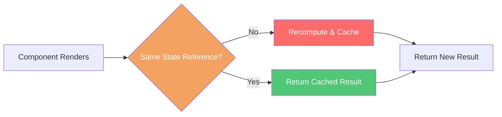

# Selectors

## Overview

Selectors are pure functions that derive computed values from store state. They encapsulate state access logic, promote reuse, and can be memoized to avoid redundant recomputation when state hasn't changed.

## Why Use Selectors?

Without selectors, components access state directly and compute derived values inline:

```csharp
// Scattered logic across components
private bool HasSelectedEntity => GetState<EntitySelectionState>().EntityId != null;
private bool IsDisconnected => GetState<SignalRConnectionState>().Status != SignalRConnectionStatus.Connected;
```

With selectors, the logic lives in one place:

```csharp
// Centralized, reusable, testable
private bool HasSelectedEntity => Select<EntitySelectionState, bool>(EntitySelectionSelectors.HasEntitySelected);
private bool IsDisconnected => Select<SignalRConnectionState, bool>(SignalRConnectionSelectors.IsDisconnected);
```

| Without Selectors | With Selectors |
|-------------------|----------------|
| Logic scattered across components | Logic centralized in selector classes |
| Duplicate derivation code | Single source of truth |
| Harder to unit test | Pure functions, easy to test |
| No built-in caching | Memoization available |

## Core API

### IStore Extension Methods

The `SelectorExtensions` class provides extension methods for `IStore`:

```csharp
// Single-state selector
public static TResult Select<TState, TResult>(
    this IStore store,
    Func<TState, TResult> selector)
    where TState : class, IFeatureState;

// Two-state selector (cross-feature derived values)
public static TResult Select<TState1, TState2, TResult>(
    this IStore store,
    Func<TState1, TState2, TResult> selector)
    where TState1 : class, IFeatureState
    where TState2 : class, IFeatureState;

// Three-state selector
public static TResult Select<TState1, TState2, TState3, TResult>(
    this IStore store,
    Func<TState1, TState2, TState3, TResult> selector)
    where TState1 : class, IFeatureState
    where TState2 : class, IFeatureState
    where TState3 : class, IFeatureState;
```

**Source**: [`SelectorExtensions.cs`](https://github.com/Gibbs-Morris/mississippi/blob/main/src/Reservoir.Abstractions/SelectorExtensions.cs)

### StoreComponent Methods

`StoreComponent` provides protected `Select` methods that delegate to the store:

```csharp
protected TResult Select<TState, TResult>(Func<TState, TResult> selector)
    where TState : class, IFeatureState
    => Store.Select(selector);
```

Use these in component properties and methods to derive values from state.

**Source**: [`StoreComponent.cs`](https://github.com/Gibbs-Morris/mississippi/blob/main/src/Reservoir.Blazor/StoreComponent.cs)

## Writing Selectors

### Basic Pattern

Create a static class with pure selector methods:

```csharp
public static class EntitySelectionSelectors
{
    public static string? GetEntityId(EntitySelectionState state)
    {
        ArgumentNullException.ThrowIfNull(state);
        return state.EntityId;
    }

    public static bool HasEntitySelected(EntitySelectionState state)
    {
        ArgumentNullException.ThrowIfNull(state);
        return !string.IsNullOrEmpty(state.EntityId);
    }
}
```

:::tip Key Rules for Selectors

- **Pure functions**: No side effects, same input → same output
- **Single responsibility**: Each selector computes one value
- **Null validation**: Always validate state parameters
- **Prefer static methods**: Enables easy testing and composition

:::

### Using Selectors in Components

```csharp
public partial class MyPage : StoreComponent
{
    private string? SelectedEntityId => 
        Select<EntitySelectionState, string?>(EntitySelectionSelectors.GetEntityId);
    
    private bool HasSelection => 
        Select<EntitySelectionState, bool>(EntitySelectionSelectors.HasEntitySelected);
}
```

### Cross-State Selectors

Derive values from multiple feature states:

```csharp
public static class DashboardSelectors
{
    public static bool CanSubmit(
        EntitySelectionState selectionState,
        SignalRConnectionState connectionState)
    {
        ArgumentNullException.ThrowIfNull(selectionState);
        ArgumentNullException.ThrowIfNull(connectionState);
        
        return selectionState.EntityId is not null 
            && connectionState.Status == SignalRConnectionStatus.Connected;
    }
}

// Usage
private bool CanSubmit => Select<EntitySelectionState, SignalRConnectionState, bool>(
    DashboardSelectors.CanSubmit);
```

## Memoization

### Why Memoize?

Selectors run on every render. For expensive computations, memoization caches results when state hasn't changed:



### Memoize Utility

The `Memoize` class creates cached selector functions:

```csharp
public static class Memoize
{
    public static Func<TState, TResult> Create<TState, TResult>(
        Func<TState, TResult> selector)
        where TState : class;
}
```

**Source**: [`Memoize.cs`](https://github.com/Gibbs-Morris/mississippi/blob/main/src/Reservoir/Selectors/Memoize.cs)

### Creating Memoized Selectors

```csharp
public static class ExpensiveSelectors
{
    // Create the memoized version once
    private static readonly Func<LargeDataState, IReadOnlyList<Summary>> CachedComputeSummary =
        Memoize.Create<LargeDataState, IReadOnlyList<Summary>>(ComputeSummary);

    // Expose the memoized function
    public static IReadOnlyList<Summary> GetSummary(LargeDataState state) =>
        CachedComputeSummary(state);

    // The expensive computation
    private static IReadOnlyList<Summary> ComputeSummary(LargeDataState state)
    {
        ArgumentNullException.ThrowIfNull(state);
        // ... expensive LINQ, grouping, sorting
        return state.Items
            .GroupBy(x => x.Category)
            .Select(g => new Summary(g.Key, g.Count()))
            .ToList();
    }
}
```

### How Memoization Works

Memoization uses **reference equality** to determine if state has changed, with a lock-free thread-safe design:

```csharp
public static Func<TState, TResult> Create<TState, TResult>(
    Func<TState, TResult> selector)
    where TState : class
{
    // Immutable cache entry enables lock-free atomic updates
    CacheEntry<TState, TResult>? cache = null;

    return state =>
    {
        // Volatile read for proper memory barrier
        CacheEntry<TState, TResult>? current = Volatile.Read(ref cache);

        // Reference comparison - fast!
        if (current is not null && ReferenceEquals(state, current.Input))
        {
            return current.Result;
        }

        // Recompute and update cache atomically via single reference write
        TResult result = selector(state);
        Volatile.Write(ref cache, new CacheEntry<TState, TResult>(state, result));
        return result;
    };
}
```

:::info Lock-Free Design
This implementation is **lock-free**, avoiding contention and deadlock risks. Under heavy concurrent load, the selector may be called more than once for the same state (benign race), but results are always correct because **selectors must be pure functions**.
:::

:::note When Memoization Helps
Memoization is most beneficial when:

- Selector performs expensive computation (filtering, sorting, grouping)
- Component re-renders frequently but state rarely changes
- Same selector is called multiple times per render

For simple property access, memoization overhead may exceed the benefit.
:::

## Framework-Provided Selectors

Mississippi includes selectors for built-in framework state:

### SignalRConnectionSelectors

```csharp
public static class SignalRConnectionSelectors
{
    // Connection state
    public static bool IsConnected(SignalRConnectionState state);
    public static bool IsDisconnected(SignalRConnectionState state);
    public static bool IsReconnecting(SignalRConnectionState state);
    public static SignalRConnectionStatus GetStatus(SignalRConnectionState state);

    // Connection details
    public static string? GetConnectionId(SignalRConnectionState state);
    public static int GetReconnectAttemptCount(SignalRConnectionState state);

    // Timestamps
    public static DateTimeOffset? GetLastConnectedAt(SignalRConnectionState state);
    public static DateTimeOffset? GetLastDisconnectedAt(SignalRConnectionState state);
    public static DateTimeOffset? GetLastMessageReceivedAt(SignalRConnectionState state);

    // Error handling
    public static string? GetLastError(SignalRConnectionState state);
}
```

**Source**: [`SignalRConnectionSelectors.cs`](https://github.com/Gibbs-Morris/mississippi/blob/main/src/Inlet.Client/SignalRConnection/SignalRConnectionSelectors.cs)

Usage:

```csharp
private bool IsDisconnected => 
    Select<SignalRConnectionState, bool>(SignalRConnectionSelectors.IsDisconnected);
```

## Testing Selectors

Selectors are pure functions, making them trivial to unit test:

```csharp
[Fact]
public void HasEntitySelected_WhenEntityIdSet_ReturnsTrue()
{
    // Arrange
    var state = new EntitySelectionState { EntityId = "123" };

    // Act
    bool result = EntitySelectionSelectors.HasEntitySelected(state);

    // Assert
    Assert.True(result);
}

[Fact]
public void HasEntitySelected_WhenEntityIdNull_ReturnsFalse()
{
    // Arrange
    var state = new EntitySelectionState { EntityId = null };

    // Act
    bool result = EntitySelectionSelectors.HasEntitySelected(state);

    // Assert
    Assert.False(result);
}
```

### Testing Memoized Selectors

```csharp
[Fact]
public void MemoizedSelector_WithSameReference_ReturnsCachedResult()
{
    // Arrange
    int computeCount = 0;
    Func<TestState, int> selector = state => { computeCount++; return state.Value * 2; };
    var memoized = Memoize.Create(selector);
    var state = new TestState { Value = 21 };

    // Act
    int first = memoized(state);
    int second = memoized(state);

    // Assert
    Assert.Equal(42, first);
    Assert.Equal(42, second);
    Assert.Equal(1, computeCount); // Only computed once
}
```

## Best Practices

### DO

- ✅ Keep selectors pure—no side effects
- ✅ Validate inputs with `ArgumentNullException.ThrowIfNull`
- ✅ Use meaningful names that describe the derived value
- ✅ Co-locate selectors with the feature state they derive from
- ✅ Memoize expensive computations

### DON'T

- ❌ Access services or external state in selectors
- ❌ Modify input state objects
- ❌ Use selectors for side effects (use effects instead)
- ❌ Over-memoize simple property access

## Repository Examples

### Spring Sample

The [Spring sample](https://github.com/Gibbs-Morris/mississippi/tree/main/samples/Spring/Spring.Client) demonstrates selector patterns:

- [`EntitySelectionSelectors.cs`](https://github.com/Gibbs-Morris/mississippi/blob/main/samples/Spring/Spring.Client/Features/EntitySelection/Selectors/EntitySelectionSelectors.cs) — Entity selection state selectors
- [`Index.razor.cs`](https://github.com/Gibbs-Morris/mississippi/blob/main/samples/Spring/Spring.Client/Pages/Index.razor.cs) — Using selectors in components

## See Also

- [Store](store.md) — The central state container
- [StoreComponent](store-component.md) — Base class for state-connected components
- [Feature State](feature-state.md) — Defining slices of state
- [Reducers](reducers.md) — Updating state in response to actions
