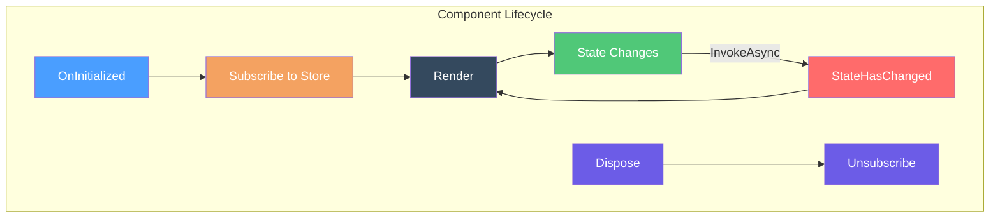

# StoreComponent

## Overview

`StoreComponent` is an abstract Blazor base class that integrates components with the Reservoir state management system. It provides protected helpers for dispatching actions and reading state, and automatically subscribes to store changes to trigger re-renders.

## Core Responsibilities

StoreComponent bridges Blazor's component model with the Reservoir store:

- **Inherits from `ComponentBase`**
    ([StoreComponent.cs#L22-L25](https://github.com/Gibbs-Morris/mississippi/blob/main/src/Reservoir.Blazor/StoreComponent.cs#L22-L25))
- **Implements `IDisposable`** and disposes the store subscription in `Dispose(bool)`
    ([StoreComponent.cs#L58-L74](https://github.com/Gibbs-Morris/mississippi/blob/main/src/Reservoir.Blazor/StoreComponent.cs#L58-L74))
- **Injects `IStore`**
    ([StoreComponent.cs#L33-L34](https://github.com/Gibbs-Morris/mississippi/blob/main/src/Reservoir.Blazor/StoreComponent.cs#L33-L34))
- **Auto-subscribes** in `OnInitialized` and calls `StateHasChanged` via `InvokeAsync`
    ([StoreComponent.cs#L86-L100](https://github.com/Gibbs-Morris/mississippi/blob/main/src/Reservoir.Blazor/StoreComponent.cs#L86-L100))



## API Reference

### Store Property

The injected store instance, available to derived components:

```csharp
[Inject]
protected IStore Store { get; set; }
```

**Source**: [`StoreComponent.cs#L33-L34`](https://github.com/Gibbs-Morris/mississippi/blob/main/src/Reservoir.Blazor/StoreComponent.cs#L33-L34)

### Dispatch

Dispatches an action to the store:

```csharp
protected void Dispatch(IAction action)
```

This method delegates directly to [`Store.Dispatch(action)`](store.md#dispatching-actions). Use it to trigger state changes from user interactions or component logic.

**Source**: [`StoreComponent.cs#L47-L52`](https://github.com/Gibbs-Morris/mississippi/blob/main/src/Reservoir.Blazor/StoreComponent.cs#L47-L52)

### GetState

Retrieves the current value of a feature state:

```csharp
protected TState GetState<TState>() where TState : class, IFeatureState
```

This method delegates to [`Store.GetState<TState>()`](store.md#reading-state). The generic constraint ensures only registered feature states can be retrieved.

**Source**: [`StoreComponent.cs#L81-L83`](https://github.com/Gibbs-Morris/mississippi/blob/main/src/Reservoir.Blazor/StoreComponent.cs#L81-L83)

## Lifecycle

### OnInitialized

When the component initializes, StoreComponent subscribes to the store:

```csharp
protected override void OnInitialized()
{
    base.OnInitialized();
    storeSubscription?.Dispose();  // Dispose any existing subscription
    storeSubscription = Store.Subscribe(OnStoreChanged);
}
```

**Source**: [`StoreComponent.cs#L86-L95`](https://github.com/Gibbs-Morris/mississippi/blob/main/src/Reservoir.Blazor/StoreComponent.cs#L86-L95)

### State Change Notification

When the store notifies subscribers, the component re-renders:

```csharp
private void OnStoreChanged()
{
    _ = InvokeAsync(StateHasChanged);
}
```

**Source**: [`StoreComponent.cs#L97-L100`](https://github.com/Gibbs-Morris/mississippi/blob/main/src/Reservoir.Blazor/StoreComponent.cs#L97-L100)

### Dispose

When the component is disposed, the store subscription is cleaned up:

```csharp
protected virtual void Dispose(bool disposing)
{
    if (disposed) return;
    disposed = true;
    if (disposing)
    {
        storeSubscription?.Dispose();
        storeSubscription = null;
    }
}
```

The `disposed` flag short-circuits repeated disposal attempts.

**Source**: [`StoreComponent.cs#L58-L74`](https://github.com/Gibbs-Morris/mississippi/blob/main/src/Reservoir.Blazor/StoreComponent.cs#L58-L74)

## Repository Examples

### Spring Sample Page Component

The [Spring sample's Index page](https://github.com/Gibbs-Morris/mississippi/blob/main/samples/Spring/Spring.Client/Pages/Index.razor) demonstrates a typical usage pattern:

```razor
@page "/"
@inherits InletComponent
```

The code-behind uses `GetState<TState>()` to read state and `Dispatch()` to trigger actions:

```csharp
// Reading state (Index.razor.cs)
private string? SelectedEntityId => GetState<EntitySelectionState>().EntityId;

// Dispatching actions (Index.razor.cs)  
private void Deposit() => Dispatch(new DepositFundsAction(SelectedEntityId!, depositAmount));
```

**Source**: [`Index.razor.cs#L124`](https://github.com/Gibbs-Morris/mississippi/blob/main/samples/Spring/Spring.Client/Pages/Index.razor.cs#L124) and [`Index.razor.cs#L159`](https://github.com/Gibbs-Morris/mississippi/blob/main/samples/Spring/Spring.Client/Pages/Index.razor.cs#L159)

### Spring Sample Button Markup

In the Spring sample, buttons are simple HTML elements that call methods on the page:

```razor
<!-- Index.razor - buttons call methods, they don't inherit StoreComponent -->
<button type="button" @onclick="Deposit" disabled="@(IsExecutingOrLoading || !IsAccountOpen)">
    Deposit £
</button>
```

The `Deposit` method on the page (which inherits `InletComponent`) dispatches the action:

```csharp
private void Deposit() => Dispatch(new DepositFundsAction(SelectedEntityId!, depositAmount));
```

**Source**: [`Index.razor#L92`](https://github.com/Gibbs-Morris/mississippi/blob/main/samples/Spring/Spring.Client/Pages/Index.razor#L92)

## Extending StoreComponent

For specialized scenarios, you can create intermediate base classes that extend StoreComponent. Mississippi provides [`InletComponent`](https://github.com/Gibbs-Morris/mississippi/blob/main/src/Inlet.Client/InletComponent.cs) as an example:

```csharp
public abstract class InletComponent : StoreComponent
{
    [Inject]
    protected IInletStore InletStore { get; set; } = default!;

    protected T? GetProjection<T>(string entityId) where T : class =>
        InletStore.GetProjection<T>(entityId);
    
    // Additional projection helpers...
}
```

`InletComponent` adds server-synced projection capabilities while inheriting the core store integration from `StoreComponent`.

**Source**: [`InletComponent.cs#L16-L122`](https://github.com/Gibbs-Morris/mississippi/blob/main/src/Inlet.Client/InletComponent.cs#L16-L122)

## Testing StoreComponent Derivatives

When testing components that derive from StoreComponent, you need to provide a mock or real store instance. The test suite demonstrates the pattern:

```csharp
// Create a test component that exposes protected members
private sealed class TestStoreComponent : StoreComponent
{
    public void SetStore(IStore store) => Store = store;
    public void TestDispatch(IAction action) => Dispatch(action);
    public TState TestGetState<TState>() where TState : class, IFeatureState => GetState<TState>();
    public void TestOnInitialized() => OnInitialized();
}
```

**Source**: [`StoreComponentTests.cs#L91-L117`](https://github.com/Gibbs-Morris/mississippi/blob/main/tests/Reservoir.Blazor.L0Tests/StoreComponentTests.cs#L91-L117)

## Next Steps

- [Reservoir Overview](./reservoir.md) — Learn where StoreComponent fits in the system
- [Store](./store.md) — The central state container that StoreComponent wraps
- [Actions](./actions.md) — The action types dispatched via `Dispatch()`
- [Feature State](./feature-state.md) — The state slices retrieved via `GetState<TState>()`
- [Reducers](./reducers.md) — How dispatched actions transform state
