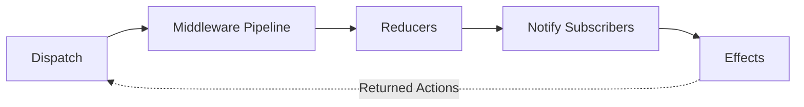

# Store

The Store is the central state container for Reservoir. It coordinates feature states, dispatches actions through the middleware pipeline, invokes reducers to update state, notifies subscribers, and triggers effects for async operations.
([IStore](https://github.com/Gibbs-Morris/mississippi/blob/main/src/Reservoir.Abstractions/IStore.cs))

## What Is the Store?

The Store implements [`IStore`](https://github.com/Gibbs-Morris/mississippi/blob/main/src/Reservoir.Abstractions/IStore.cs) and provides three core operations:

| Method | Description |
|--------|-------------|
| `Dispatch(IAction)` | Sends an action through the pipeline |
| `GetState<TState>()` | Retrieves current feature state |
| `Subscribe(Action)` | Registers a listener for state changes |

```csharp
public interface IStore : IDisposable
{
    void Dispatch(IAction action);

    TState GetState<TState>()
        where TState : class, IFeatureState;

    IDisposable Subscribe(Action listener);
}
```

([IStore](https://github.com/Gibbs-Morris/mississippi/blob/main/src/Reservoir.Abstractions/IStore.cs#L24-L55))

## Registering the Store

Register the Store via `AddReservoir()`:

```csharp
services.AddReservoir();
```

This registers `IStore` as scoped, resolving all `IFeatureStateRegistration` and `IMiddleware` instances from DI:

```csharp
public static IServiceCollection AddReservoir(
    this IServiceCollection services
)
{
    services.TryAddScoped<IStore>(sp => new Store(
        sp.GetServices<IFeatureStateRegistration>(),
        sp.GetServices<IMiddleware>()));
    return services;
}
```

([ReservoirRegistrations.AddReservoir](https://github.com/Gibbs-Morris/mississippi/blob/main/src/Reservoir/ReservoirRegistrations.cs#L139-L148))

:::note Scoped Lifetime
The Store is registered as **scoped** to align with Blazor's per-circuit/per-request model. Each Blazor circuit (or HTTP request scope) gets its own Store instance with independent state.
:::

## Dispatch Pipeline

When you call `store.Dispatch(action)`, the action flows through a well-defined pipeline:



### Pipeline Steps

1. **Middleware Pipeline** — Each registered middleware can inspect, modify, or short-circuit the action
2. **Reducers** — All root reducers process the action and update their feature states
3. **Notify Subscribers** — All registered listeners are invoked synchronously
4. **Effects** — Root effects handle the action asynchronously; returned actions are dispatched

```csharp
private void CoreDispatch(IAction action)
{
    // First, run reducers for feature states
    ReduceFeatureStates(action);

    // Hook for derived classes
    OnActionDispatched(action);

    // Notify listeners of state change
    NotifyListeners();

    // Finally, trigger action effects asynchronously
    _ = TriggerEffectsAsync(action);
}
```

([Store.CoreDispatch](https://github.com/Gibbs-Morris/mississippi/blob/main/src/Reservoir/Store.cs#L214-L228))

## Dispatching Actions

Use `Dispatch` to send actions to the store:

```csharp
IStore store = serviceProvider.GetRequiredService<IStore>();
store.Dispatch(new IncrementAction());
```

From a Blazor component inheriting `StoreComponent`:

```csharp
protected void OnButtonClick()
{
    Dispatch(new IncrementAction());
}
```

([StoreComponent.Dispatch](https://github.com/Gibbs-Morris/mississippi/blob/main/src/Reservoir.Blazor/StoreComponent.cs#L46-L51))

### Dispatch Rules

- **Synchronous** — Reducers and subscriber notifications run synchronously on the calling thread
- **Effects are async** — Effects run asynchronously after dispatch returns
- **Thread-safe state** — Feature states use `ConcurrentDictionary` for safe concurrent access
- **Null actions throw** — `Dispatch(null)` throws `ArgumentNullException`
- **Disposed throws** — Dispatching to a disposed store throws `ObjectDisposedException`

## Reading State

Use `GetState<TState>()` to retrieve the current value of a feature state:

```csharp
EntitySelectionState selection = store.GetState<EntitySelectionState>();
string? entityId = selection.EntityId;
```

From a Blazor component:

```csharp
protected override void OnInitialized()
{
    EntitySelectionState selection = GetState<EntitySelectionState>();
    // Use state for initial render
}
```

([StoreComponent.GetState](https://github.com/Gibbs-Morris/mississippi/blob/main/src/Reservoir.Blazor/StoreComponent.cs#L77-L80))

### GetState Rules

- Returns the current snapshot of the feature state
- Throws `InvalidOperationException` if the feature state is not registered:

```
No feature state registered for 'entitySelection'.
Call AddFeatureState<EntitySelectionState>() during service registration.
```

([Store.GetState](https://github.com/Gibbs-Morris/mississippi/blob/main/src/Reservoir/Store.cs#L112-L125))

## Subscribing to Changes

Use `Subscribe` to register a listener that runs after every dispatch:

```csharp
IDisposable subscription = store.Subscribe(() =>
{
    Console.WriteLine("State changed!");
});

// Later: unsubscribe
subscription.Dispose();
```

### Subscription Behavior

- Listeners are called synchronously after reducers complete and before effects run
- Listeners receive no parameters—query state via `GetState<TState>()`
- Dispose the returned `IDisposable` to unsubscribe
- Subscriptions can be disposed multiple times safely

```csharp
// From test: unsubscribed listeners don't receive further notifications
IDisposable subscription = store.Subscribe(() => callCount++);
store.Dispatch(new IncrementAction()); // callCount = 1
subscription.Dispose();
store.Dispatch(new IncrementAction()); // callCount still 1
```

([StoreTests.UnsubscribedListenerDoesNotReceiveNotifications](https://github.com/Gibbs-Morris/mississippi/blob/main/tests/Reservoir.L0Tests/StoreTests.cs#L637-L651))

## Blazor Integration

For Blazor components, inherit from `StoreComponent` instead of managing subscriptions manually:

```csharp
public class CounterComponent : StoreComponent
{
    private int Count => GetState<CounterState>().Count;

    private void Increment()
    {
        Dispatch(new IncrementAction());
    }
}
```

`StoreComponent` handles:

- **Automatic subscription** — Subscribes to the store in `OnInitialized`
- **Automatic re-render** — Calls `StateHasChanged` when state changes
- **Automatic cleanup** — Disposes the subscription when the component is disposed

```csharp
protected override void OnInitialized()
{
    base.OnInitialized();
    storeSubscription = Store.Subscribe(OnStoreChanged);
}

private void OnStoreChanged()
{
    _ = InvokeAsync(StateHasChanged);
}
```

([StoreComponent](https://github.com/Gibbs-Morris/mississippi/blob/main/src/Reservoir.Blazor/StoreComponent.cs#L22-L102))

## Store Lifecycle

### Construction

The Store can be constructed two ways:

1. **Via DI (recommended)** — `AddReservoir()` registers the Store with feature registrations and middleware resolved from DI
2. **Manually** — Pass feature registrations and middleware directly to the constructor

```csharp
// Manual construction (for testing)
var store = new Store(
    featureRegistrations: [new FeatureStateRegistration<TestState>()],
    middlewaresCollection: [new LoggingMiddleware()]
);
```

([Store constructor](https://github.com/Gibbs-Morris/mississippi/blob/main/src/Reservoir/Store.cs#L58-L86))

### Disposal

The Store implements `IDisposable`. When disposed:

- All subscriptions are cleared
- All feature states, reducers, and effects are cleared
- Subsequent `Dispatch`, `GetState`, or `Subscribe` calls throw `ObjectDisposedException`

```csharp
store.Dispose();
// Throws ObjectDisposedException:
store.Dispatch(new SomeAction());
```

([Store.Dispose](https://github.com/Gibbs-Morris/mississippi/blob/main/src/Reservoir/Store.cs#L104-L108),
[Store.Dispose(bool)](https://github.com/Gibbs-Morris/mississippi/blob/main/src/Reservoir/Store.cs#L156-L179))

## Effect Error Handling

Effects run asynchronously after dispatch. If an effect throws:

- The exception is **swallowed** to prevent breaking the dispatch pipeline
- Other effects continue to run
- Effects should handle their own errors by emitting error actions

```csharp
// From Store.TriggerEffectsAsync
catch (Exception)
{
    // Action effects should handle their own errors by emitting error actions.
    // Swallow exceptions here to prevent effect failures from breaking dispatch.
}
```

([Store.TriggerEffectsAsync](https://github.com/Gibbs-Morris/mississippi/blob/main/src/Reservoir/Store.cs#L278-L332))

:::tip Effect Error Pattern
Effects should catch exceptions and emit error actions rather than letting exceptions propagate:

```csharp
public override async IAsyncEnumerable<IAction> HandleAsync(
    LoadDataAction action,
    MyState currentState,
    [EnumeratorCancellation] CancellationToken cancellationToken)
{
    try
    {
        var data = await api.GetDataAsync(cancellationToken);
        yield return new LoadDataSucceededAction(data);
    }
    catch (Exception ex)
    {
        yield return new LoadDataFailedAction(ex.Message);
    }
}
```
:::

## Store Internals

For advanced scenarios, understanding the Store's internal structure helps:

| Field | Type | Purpose |
|-------|------|---------|
| `featureStates` | `ConcurrentDictionary<string, object>` | Maps FeatureKey → current state |
| `rootReducers` | `ConcurrentDictionary<string, object>` | Maps FeatureKey → `IRootReducer<TState>` |
| `rootActionEffects` | `ConcurrentDictionary<string, object>` | Maps FeatureKey → `IRootActionEffect<TState>` |
| `middlewares` | `List<IMiddleware>` | Ordered middleware pipeline |
| `listeners` | `List<Action>` | Registered subscribers |

([Store fields](https://github.com/Gibbs-Morris/mississippi/blob/main/src/Reservoir/Store.cs#L20-L38))

### Middleware Pipeline Building

Middleware wraps around the core dispatch in reverse registration order (last registered wraps first):

```csharp
private Action<IAction> BuildMiddlewarePipeline(Action<IAction> coreDispatch)
{
    Action<IAction> next = coreDispatch;

    // Build pipeline in reverse order (last middleware wraps first)
    for (int i = middlewares.Count - 1; i >= 0; i--)
    {
        IMiddleware middleware = middlewares[i];
        Action<IAction> currentNext = next;
        next = action => middleware.Invoke(action, currentNext);
    }

    return next;
}
```

([Store.BuildMiddlewarePipeline](https://github.com/Gibbs-Morris/mississippi/blob/main/src/Reservoir/Store.cs#L199-L212))

## Summary

| Concept | Description |
|---------|-------------|
| **Store** | Central state container implementing `IStore` |
| **Dispatch** | Sends actions through middleware → reducers → notify → effects |
| **GetState** | Returns current feature state snapshot |
| **Subscribe** | Registers listener called after every dispatch |
| **Lifetime** | Scoped (per Blazor circuit / HTTP request) |
| **Disposal** | Clears all state and subscriptions; subsequent calls throw |
| **Error handling** | Effects swallow exceptions; emit error actions instead |

([IStore](https://github.com/Gibbs-Morris/mississippi/blob/main/src/Reservoir.Abstractions/IStore.cs),
[Store](https://github.com/Gibbs-Morris/mississippi/blob/main/src/Reservoir/Store.cs),
[StoreComponent](https://github.com/Gibbs-Morris/mississippi/blob/main/src/Reservoir.Blazor/StoreComponent.cs))

## Next Steps

- [Actions](./actions.md) — Define what can happen in your application
- [Reducers](./reducers.md) — Update state in response to actions
- [Effects](./effects.md) — Handle async operations and side effects
- [Middleware](./middleware.md) — Intercept and transform actions
- [Feature State](./feature-state.md) — Organize state into modular slices
