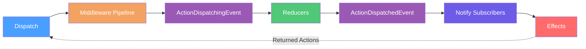

# Store

## Overview

The Store is the central state container for Reservoir. It coordinates feature states, dispatches actions through the middleware pipeline, invokes reducers to update state, notifies subscribers, and triggers effects for async operations.
([IStore](https://github.com/Gibbs-Morris/mississippi/blob/main/src/Reservoir.Abstractions/IStore.cs))

## What Is the Store?

The Store implements [`IStore`](https://github.com/Gibbs-Morris/mississippi/blob/main/src/Reservoir.Abstractions/IStore.cs) and provides five core operations:

| Method | Description |
|--------|-------------|
| `Dispatch(IAction)` | Sends an action through the pipeline |
| `GetState<TState>()` | Retrieves current feature state |
| `GetStateSnapshot()` | Returns all feature states as a dictionary |
| `Subscribe(Action)` | Registers a listener for state changes |
| `StoreEvents` | Observable stream for external integrations |

```csharp
public interface IStore : IDisposable
{
    IObservable<StoreEventBase> StoreEvents { get; }

    IReadOnlyDictionary<string, object> GetStateSnapshot();

    void Dispatch(IAction action);

    TState GetState<TState>()
        where TState : class, IFeatureState;

    IDisposable Subscribe(Action listener);
}
```

([IStore](https://github.com/Gibbs-Morris/mississippi/blob/main/src/Reservoir.Abstractions/IStore.cs#L32-L85))

## Registering the Store

Register the Store via `AddReservoir()`:

```csharp
services.AddReservoir();
```

This registers `IStore` as scoped, resolving all `IFeatureStateRegistration` and `IMiddleware` instances from DI:

```csharp
public static IServiceCollection AddReservoir(
    this IServiceCollection services
)
{
    services.TryAddScoped<IStore>(sp => new Store(
        sp.GetServices<IFeatureStateRegistration>(),
        sp.GetServices<IMiddleware>()));
    return services;
}
```

([ReservoirRegistrations.AddReservoir](https://github.com/Gibbs-Morris/mississippi/blob/main/src/Reservoir/ReservoirRegistrations.cs#L139-L148))

:::note Scoped Lifetime
The Store is registered as **scoped**. Its lifetime follows the dependency-injection scope configured by the host.
:::

## Dispatch Pipeline

When you call `store.Dispatch(action)`, the action flows through a well-defined pipeline:



### Pipeline Steps

1. **Middleware Pipeline** — Each registered middleware can inspect, modify, or short-circuit the action
2. **Reducers** — All root reducers process the action and update their feature states
3. **Notify Subscribers** — All registered listeners are invoked synchronously
4. **Effects** — Root effects handle the action asynchronously; returned actions are dispatched

```csharp
private void CoreDispatch(IAction action)
{
    // Emit pre-dispatch event
    storeEventSubject.OnNext(new ActionDispatchingEvent(action));

    // Run reducers for feature states
    ReduceFeatureStates(action);

    // Emit post-dispatch event with current state snapshot
    storeEventSubject.OnNext(new ActionDispatchedEvent(action, GetStateSnapshot()));

    // Notify listeners of state change
    NotifyListeners();

    // Finally, trigger action effects asynchronously
    _ = TriggerEffectsAsync(action);
}
```

([Store.CoreDispatch](https://github.com/Gibbs-Morris/mississippi/blob/main/src/Reservoir/Store.cs#L238-L256))

## Dispatching Actions

Call `Dispatch` on the store to send actions through the pipeline.
([IStore.Dispatch](https://github.com/Gibbs-Morris/mississippi/blob/main/src/Reservoir.Abstractions/IStore.cs#L55-L64))

Components inheriting `StoreComponent` can call its protected `Dispatch` helper.
([StoreComponent.Dispatch](https://github.com/Gibbs-Morris/mississippi/blob/main/src/Reservoir.Blazor/StoreComponent.cs#L43-L51))

### Dispatch Rules

- **Synchronous reducers and listeners** — Reducers run first, then subscribers are notified
- **Effects are async** — Effects are triggered asynchronously after the reducers and notifications
- **Null actions throw** — `Dispatch(null)` throws `ArgumentNullException`
- **Disposed throws** — Dispatching to a disposed store throws `ObjectDisposedException`

([Store.CoreDispatch](https://github.com/Gibbs-Morris/mississippi/blob/main/src/Reservoir/Store.cs#L214-L228),
[StoreTests.DispatchAfterDisposeThrowsObjectDisposedException](https://github.com/Gibbs-Morris/mississippi/blob/main/tests/Reservoir.L0Tests/StoreTests.cs#L327-L335),
[StoreTests.DispatchWithNullActionThrowsArgumentNullException](https://github.com/Gibbs-Morris/mississippi/blob/main/tests/Reservoir.L0Tests/StoreTests.cs#L338-L345))

## Reading State

Use `GetState<TState>()` to retrieve the current value of a feature state. For example, the Spring sample reads from `EntitySelectionState` like this:

```csharp
private string? SelectedEntityId => GetState<EntitySelectionState>().EntityId;
```

([Spring.Index](https://github.com/Gibbs-Morris/mississippi/blob/main/samples/Spring/Spring.Client/Pages/Index.razor.cs#L121-L125),
[StoreComponent.GetState](https://github.com/Gibbs-Morris/mississippi/blob/main/src/Reservoir.Blazor/StoreComponent.cs#L76-L83))

### GetState Rules

- Returns the current snapshot of the feature state
- Throws `InvalidOperationException` if the feature state is not registered:

```text
No feature state registered for 'entitySelection'.
Call AddFeatureState<EntitySelectionState>() during service registration.
```

([Store.GetState](https://github.com/Gibbs-Morris/mississippi/blob/main/src/Reservoir/Store.cs#L131-L144))

## Subscribing to Changes

Use `Subscribe` to register a listener that runs after every dispatch.
([IStore.Subscribe](https://github.com/Gibbs-Morris/mississippi/blob/main/src/Reservoir.Abstractions/IStore.cs#L76-L84))

### Subscription Behavior

- Listeners are called synchronously after reducers complete and before effects run
- Listeners receive no parameters—query state via `GetState<TState>()`
- Dispose the returned `IDisposable` to unsubscribe
- Subscriptions can be disposed multiple times safely

([Store.CoreDispatch](https://github.com/Gibbs-Morris/mississippi/blob/main/src/Reservoir/Store.cs#L214-L228),
[StoreTests.SubscriptionDisposeCanBeCalledMultipleTimes](https://github.com/Gibbs-Morris/mississippi/blob/main/tests/Reservoir.L0Tests/StoreTests.cs#L600-L626))

For an example of unsubscribe behavior, see the unit test.
([StoreTests.UnsubscribedListenerDoesNotReceiveNotifications](https://github.com/Gibbs-Morris/mississippi/blob/main/tests/Reservoir.L0Tests/StoreTests.cs#L637-L651))

## Blazor Integration

For Blazor components, inherit from [`StoreComponent`](store-component.md) instead of managing subscriptions manually:

`InletComponent` is a concrete example of a component that derives from `StoreComponent`.
([InletComponent](https://github.com/Gibbs-Morris/mississippi/blob/main/src/Inlet.Client/InletComponent.cs#L13-L21))

[`StoreComponent`](store-component.md) handles:

- **Automatic subscription** — Subscribes to the store in `OnInitialized`
- **Automatic re-render** — Calls `StateHasChanged` when state changes
- **Automatic cleanup** — Disposes the subscription when the component is disposed

```csharp
protected override void OnInitialized()
{
    base.OnInitialized();
    storeSubscription = Store.Subscribe(OnStoreChanged);
}

private void OnStoreChanged()
{
    _ = InvokeAsync(StateHasChanged);
}
```

([StoreComponent](https://github.com/Gibbs-Morris/mississippi/blob/main/src/Reservoir.Blazor/StoreComponent.cs#L22-L102))

## Store Lifecycle

### Construction

The Store can be constructed two ways:

1. **Via DI (recommended)** — `AddReservoir()` registers the Store with feature registrations and middleware resolved from DI
2. **Manually** — Pass feature registrations and middleware directly to the constructor

Manual construction is used in tests to validate middleware behavior.
([Store constructor](https://github.com/Gibbs-Morris/mississippi/blob/main/src/Reservoir/Store.cs#L58-L86),
[StoreTests.ConstructorWithMiddlewareCollectionRegistersMiddleware](https://github.com/Gibbs-Morris/mississippi/blob/main/tests/Reservoir.L0Tests/StoreTests.cs#L253-L266))

### Disposal

The Store implements `IDisposable`. When disposed:

- All subscriptions are cleared
- All feature states, reducers, and effects are cleared
- Subsequent `Dispatch`, `GetState`, or `Subscribe` calls throw `ObjectDisposedException`

([StoreTests.DispatchAfterDisposeThrowsObjectDisposedException](https://github.com/Gibbs-Morris/mississippi/blob/main/tests/Reservoir.L0Tests/StoreTests.cs#L327-L335),
[Store.Dispose](https://github.com/Gibbs-Morris/mississippi/blob/main/src/Reservoir/Store.cs#L124-L129),
[Store.Dispose(bool)](https://github.com/Gibbs-Morris/mississippi/blob/main/src/Reservoir/Store.cs#L183-L208))

## Effect Error Handling

Effects run asynchronously after dispatch. If an effect throws:

- The exception is **swallowed** to prevent breaking the dispatch pipeline
- Other effects continue to run
- Effects should handle their own errors by emitting error actions

([Store.TriggerEffectsAsync](https://github.com/Gibbs-Morris/mississippi/blob/main/src/Reservoir/Store.cs#L372-L426))

## Observable Store Events

The store exposes an observable stream of events via `StoreEvents`, enabling external integrations to observe store activity without subclassing. [DevTools](./devtools.md) uses this pattern to report actions and state to the browser extension.

### StoreEvents Property

```csharp
IObservable<StoreEventBase> StoreEvents { get; }
```

Subscribers receive events synchronously during dispatch. Keep handlers fast to avoid blocking the pipeline.

([IStore.StoreEvents](https://github.com/Gibbs-Morris/mississippi/blob/main/src/Reservoir.Abstractions/IStore.cs#L36-L51))

### Store Event Types

| Event | When Emitted | Payload |
|-------|--------------|---------|
| `StoreInitializedEvent` | Once during store construction | `InitialSnapshot` |
| `ActionDispatchingEvent` | Before reducers run | `Action` |
| `ActionDispatchedEvent` | After reducers, before effects | `Action`, `StateSnapshot` |
| `StateRestoredEvent` | After system action restores state | `PreviousSnapshot`, `NewSnapshot`, `Cause` |

All events inherit from `StoreEventBase`.

([StoreEventBase](https://github.com/Gibbs-Morris/mississippi/blob/main/src/Reservoir.Abstractions/Events/StoreEventBase.cs),
[ActionDispatchingEvent](https://github.com/Gibbs-Morris/mississippi/blob/main/src/Reservoir.Abstractions/Events/ActionDispatchingEvent.cs),
[ActionDispatchedEvent](https://github.com/Gibbs-Morris/mississippi/blob/main/src/Reservoir.Abstractions/Events/ActionDispatchedEvent.cs),
[StateRestoredEvent](https://github.com/Gibbs-Morris/mississippi/blob/main/src/Reservoir.Abstractions/Events/StateRestoredEvent.cs),
[StoreInitializedEvent](https://github.com/Gibbs-Morris/mississippi/blob/main/src/Reservoir.Abstractions/Events/StoreInitializedEvent.cs))

### Example: Subscribing to Events

```csharp
store.StoreEvents.Subscribe(new ActionObserver());

private sealed class ActionObserver : IObserver<StoreEventBase>
{
    public void OnNext(StoreEventBase evt)
    {
        if (evt is ActionDispatchedEvent dispatched)
        {
            Console.WriteLine($"Action: {dispatched.Action.GetType().Name}");
        }
    }
    
    public void OnCompleted() { }
    public void OnError(Exception error) { }
}
```

## System Actions

System actions implement `ISystemAction` and are handled directly by the store rather than by user-defined reducers. They enable external components (like DevTools) to command the store through the standard dispatch mechanism, maintaining unidirectional data flow.

### ISystemAction

```csharp
public interface ISystemAction : IAction { }
```

System actions do not trigger user reducers or effects. They are processed internally and emit `StateRestoredEvent` to notify observers.

([ISystemAction](https://github.com/Gibbs-Morris/mississippi/blob/main/src/Reservoir.Abstractions/Actions/ISystemAction.cs))

### Built-in System Actions

| Action | Purpose | Parameters |
|--------|---------|------------|
| `RestoreStateAction` | Restore state from a snapshot | `Snapshot`, `NotifyListeners` (default: true) |
| `ResetToInitialStateAction` | Reset to initial state | `NotifyListeners` (default: true) |

([RestoreStateAction](https://github.com/Gibbs-Morris/mississippi/blob/main/src/Reservoir.Abstractions/Actions/RestoreStateAction.cs),
[ResetToInitialStateAction](https://github.com/Gibbs-Morris/mississippi/blob/main/src/Reservoir.Abstractions/Actions/ResetToInitialStateAction.cs))

### Example: Time-Travel

```csharp
// Save a snapshot
var snapshot = store.GetStateSnapshot();

// ... user performs actions ...

// Restore to saved snapshot
store.Dispatch(new RestoreStateAction(snapshot));

// Or reset to initial state
store.Dispatch(new ResetToInitialStateAction());
```

## GetStateSnapshot

Returns a dictionary of all current feature states keyed by feature key:

```csharp
IReadOnlyDictionary<string, object> GetStateSnapshot();
```

Use this for:

- Saving state for later restoration
- Reporting current state to external tools
- Debugging and logging

([IStore.GetStateSnapshot](https://github.com/Gibbs-Morris/mississippi/blob/main/src/Reservoir.Abstractions/IStore.cs#L49-L53))

## Store Internals

For advanced scenarios, understanding the Store's internal structure helps:

| Field | Type | Purpose |
|-------|------|---------|
| `featureStates` | `ConcurrentDictionary<string, object>` | Maps FeatureKey → current state |
| `rootReducers` | `ConcurrentDictionary<string, object>` | Maps FeatureKey → `IRootReducer<TState>` |
| `rootActionEffects` | `ConcurrentDictionary<string, object>` | Maps FeatureKey → `IRootActionEffect<TState>` |
| `middlewares` | `List<IMiddleware>` | Ordered middleware pipeline |
| `listeners` | `List<Action>` | Registered subscribers |
| `storeEventSubject` | `StoreEventSubject<StoreEventBase>` | Observable subject for store events |

([Store fields](https://github.com/Gibbs-Morris/mississippi/blob/main/src/Reservoir/Store.cs#L23-L45))

### Middleware Pipeline Building

Middleware wraps around the core dispatch in reverse registration order (last registered wraps first):

```csharp
private Action<IAction> BuildMiddlewarePipeline(Action<IAction> coreDispatch)
{
    Action<IAction> next = coreDispatch;

    // Build pipeline in reverse order (last middleware wraps first)
    for (int i = middlewares.Count - 1; i >= 0; i--)
    {
        IMiddleware middleware = middlewares[i];
        Action<IAction> currentNext = next;
        next = action => middleware.Invoke(action, currentNext);
    }

    return next;
}
```

([Store.BuildMiddlewarePipeline](https://github.com/Gibbs-Morris/mississippi/blob/main/src/Reservoir/Store.cs#L221-L236))

## Summary

| Concept | Description |
|---------|-------------|
| **Store** | Central state container implementing `IStore` |
| **Dispatch** | Sends actions through middleware → reducers → notify → effects |
| **GetState** | Returns current feature state snapshot |
| **GetStateSnapshot** | Returns all feature states as a dictionary |
| **StoreEvents** | Observable stream for external integrations (DevTools, logging) |
| **System Actions** | `ISystemAction` for store-internal operations (time-travel) |
| **Subscribe** | Registers listener called after every dispatch |
| **Lifetime** | Scoped (per DI scope) |
| **Disposal** | Clears all state and subscriptions; subsequent calls throw |
| **Error handling** | Effects swallow exceptions; emit error actions instead |

([IStore](https://github.com/Gibbs-Morris/mississippi/blob/main/src/Reservoir.Abstractions/IStore.cs),
[Store](https://github.com/Gibbs-Morris/mississippi/blob/main/src/Reservoir/Store.cs),
[StoreComponent](https://github.com/Gibbs-Morris/mississippi/blob/main/src/Reservoir.Blazor/StoreComponent.cs))

## Next Steps

- [Reservoir Overview](./reservoir.md) — Understand the dispatch pipeline end-to-end
- [DevTools](./devtools.md) — See how DevTools uses StoreEvents and system actions
- [Actions](./actions.md) — Define what can happen in your application
- [Reducers](./reducers.md) — Update state in response to actions
- [Effects](./effects.md) — Handle async operations and side effects
- [Middleware](./middleware.md) — Intercept and transform actions
- [Feature State](./feature-state.md) — Organize state into modular slices
- [StoreComponent](./store-component.md) — Blazor base component for store integration
