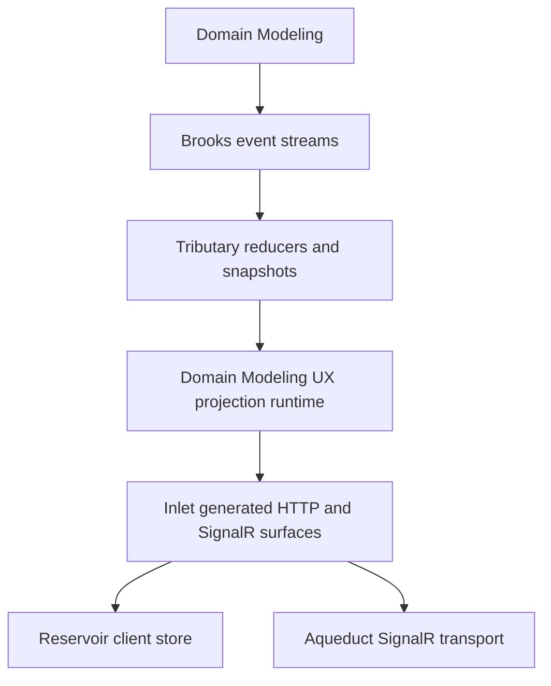

# Architectural Model

## Overview

Mississippi is an opinionated application model for building event-sourced systems on Orleans.

It combines aggregate command execution, event streams, reducer-driven read models, generated HTTP surfaces, SignalR notifications, and Redux-style client state into one framework shape. The framework is designed so that application teams spend most of their time on domain records, handlers, reducers, and steps instead of repeating transport and registration code.

## The Problem This Solves

CQRS, event sourcing, Orleans, and real-time clients are individually well understood. The real cost appears in the seams between them - the duplicated mappings, mirrored DTOs, and hand-wired plumbing that multiply with every new aggregate or projection.

Teams often end up maintaining the same mappings in several places:

- command records, controllers, DTOs, and client request objects
- event streams, reducers, snapshots, and read endpoints
- SignalR subscription plumbing and client-side refresh logic
- test setup for domain logic versus test setup for infrastructure

Mississippi eliminates that seam work by letting a small set of domain-facing types drive the surrounding runtime and client surface.

## Core Idea

Mississippi starts from a few explicit domain artifacts and composes outward.

- Aggregate state records define write-side state.
- Command handlers validate commands against current state and emit events.
- Reducers rebuild both aggregate state and projection state from events.
- Projection types define read models over the same brook.
- Inlet generators derive gateway and client scaffolding from those types and attributes.
- Reservoir keeps client state predictable by reducing actions into immutable feature slices.

## How It Works

This diagram shows the verified cross-area composition.

In public package terms, the major responsibilities break down like this.

| Area | Verified role |
| --- | --- |
| Domain Modeling | Aggregates, sagas, event effects, generic aggregate grains, UX projection grains, and test harnesses |
| Brooks | Event-stream identity, append and cursor behavior, and storage abstractions |
| Tributary | Event reducers, root reducers, and snapshot-oriented reconstruction |
| Inlet | Source generation for aggregate, projection, and saga surfaces across runtime, gateway, and client layers |
| Reservoir | Redux-style store, action reducers, middleware, and action effects |
| Aqueduct | Orleans-backed SignalR client, group, and server-directory grains |

## Guarantees

- Mississippi has a real end-to-end composition model rather than a single server-side helper package. The repository contains dedicated runtime, gateway, and client projects for the same concepts.
- Aggregate, projection, and saga generation is attribute-driven. For example, `[GenerateAggregateEndpoints]`, `[GenerateProjectionEndpoints]`, `[GenerateCommand]`, and `[GenerateSagaEndpoints]` each drive concrete generator output.
- The same model is visible in the Spring sample, where domain records, generated endpoints, Blazor client code, and SignalR-backed projection updates are used together.

## Non-Guarantees

- Mississippi does not make the domain model disappear. Developers still write commands, events, handlers, reducers, saga steps, and projection types explicitly.
- Mississippi is not a general-purpose wrapper that infers arbitrary architecture from any C# codebase. It depends on conventions, namespaces, and generator attributes.
- Mississippi is not promising public API stability yet. The repository is explicitly pre-1.0.

## Trade-Offs

- The framework reduces boilerplate by being opinionated. That increases leverage, but it also means teams must learn Mississippi-specific conventions.
- The model is easier to follow when a team accepts the separation between write state, read models, generated transport, and client store behavior. Teams looking for a minimal abstraction layer may find this too structured.
- Several Mississippi areas can be adopted independently, but the strongest payoff comes from using the pieces together.

## Related Tasks and Reference

- Use [Write Model](./write-model.md) when the question is about commands, events, reducers, and effects inside aggregates.
- Use [Read Models and Client Sync](./read-models-and-client-sync.md) when the question is about projections, generated GET endpoints, SignalR notifications, and client refresh behavior.
- Use [Sagas and Orchestration](./sagas-and-orchestration.md) when the question is about ordered steps and compensation.
- Use [Domain Modeling](../domain-modeling/index.md) or [Inlet](../inlet/index.md) when you need subsystem-specific detail.

## Summary

Mississippi eliminates the seam work between event sourcing, Orleans, and client delivery. Write domain logic once, and the framework generates the runtime, gateway, and client surfaces around it.

## Next Steps

- [Write Model](./write-model.md)
- [Read Models and Client Sync](./read-models-and-client-sync.md)
- [Sagas and Orchestration](./sagas-and-orchestration.md)
- [Design Goals and Trade-Offs](./design-goals-and-trade-offs.md)
