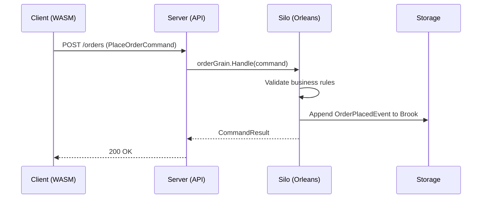
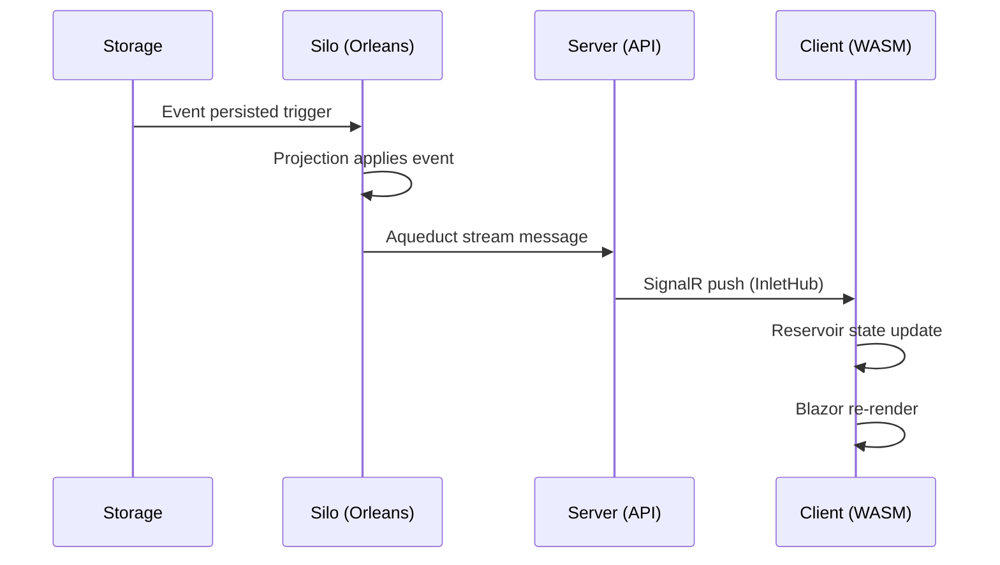

Mississippi is a **three-tier framework** where each component lives in a
specific deployment target. Understanding this layout helps you reason about
where code runs and how data flows.

## Deployment Stack

The diagram below shows how Mississippi components stack across the three tiers.
Components at the top span multiple tiers; components lower in the stack are
tier-specific.

```text
┌─────────────────────────────────────────────────────────────────────────────┐
│                              INLET                                          │
│                    (spans Client ↔ Server ↔ Silo)                           │
│         Client subscription management and real-time update delivery        │
├─────────────────────────────────────────────────────────────────────────────┤
│                             AQUEDUCT                                        │
│                       (spans Server ↔ Silo)                                 │
│              Orleans-backed SignalR backplane for multi-server              │
├───────────────────────┬─────────────────────────┬───────────────────────────┤
│       CLIENT          │        SERVER           │          SILO             │
│   (Blazor WASM)       │    (ASP.NET API)        │    (Orleans Host)         │
├───────────────────────┼─────────────────────────┼───────────────────────────┤
│                       │                         │                           │
│   ┌───────────────┐   │   ┌───────────────┐     │   ┌───────────────┐       │
│   │   Reservoir   │   │   │  Controllers  │     │   │  Aggregates   │       │
│   │    (Store)    │   │   │  (Commands)   │     │   │   (Grains)    │       │
│   └───────────────┘   │   └───────────────┘     │   └───────────────┘       │
│                       │                         │                           │
│   ┌───────────────┐   │   ┌───────────────┐     │   ┌───────────────┐       │
│   │   Reservoir   │   │   │   InletHub    │     │   │ UX Projections│       │
│   │  (Reducers)   │   │   │  (SignalR)    │     │   │   (Grains)    │       │
│   └───────────────┘   │   └───────────────┘     │   └───────────────┘       │
│                       │                         │                           │
│   ┌───────────────┐   │                         │   ┌───────────────┐       │
│   │   Reservoir   │   │                         │   │    Brooks     │       │
│   │   (Effects)   │   │                         │   │ (Event Store) │       │
│   └───────────────┘   │                         │   └───────────────┘       │
│                       │                         │                           │
│   ┌───────────────┐   │                         │   ┌───────────────┐       │
│   │ Inlet Client  │   │                         │   │   Snapshots   │       │
│   │  (SignalR)    │   │                         │   │  (Checkpoints)│       │
│   └───────────────┘   │                         │   └───────────────┘       │
│                       │                         │                           │
├───────────────────────┴─────────────────────────┴───────────────────────────┤
│                           STORAGE (Azure)                                   │
│                                                                             │
│    ┌─────────────┐    ┌─────────────┐    ┌─────────────┐                    │
│    │  Cosmos DB  │    │Blob Storage │    │   (Other)   │                    │
│    │   (Brooks,  │    │  (Locking,  │    │  Pluggable  │                    │
│    │  Snapshots) │    │Orleans State│    │             │                    │
│    └─────────────┘    └─────────────┘    └─────────────┘                    │
└─────────────────────────────────────────────────────────────────────────────┘
```

## Component Placement Summary

| Component | Tier | SDK Package | Purpose |
| --- | --- | --- | --- |
| **Reservoir** | Client | `Sdk.Client` | Redux-style state container |
| **Inlet Client** | Client | `Sdk.Client` | SignalR subscription manager |
| **Controllers** | Server | `Sdk.Server` | Command and query endpoints |
| **InletHub** | Server | `Sdk.Server` | SignalR hub for client connections |
| **Aggregates** | Silo | `Sdk.Silo` | Command handling grains |
| **UX Projections** | Silo | `Sdk.Silo` | Read model grains |
| **Brooks** | Silo | `Sdk.Silo` | Event stream persistence |
| **Snapshots** | Silo | `Sdk.Silo` | Projection state checkpoints |
| **Aqueduct** | Server + Silo | Both | Cross-server message delivery |
| **Inlet** | All tiers | All | End-to-end subscription flow |

## Data Flow by Tier

### Write Path (Command → Event)



### Read Path (Event → UI)



## Why Three Tiers?

Mississippi uses three tiers to separate concerns and enable scaling:

| Tier | Scales By | Stateful? | Responsibility |
| --- | --- | --- | --- |
| **Client** | User count | Yes (browser) | UI rendering, local state |
| **Server** | Load balancer | No (stateless) | HTTP/SignalR routing |
| **Silo** | Orleans cluster | Yes (grains) | Business logic, persistence |

The **Server tier is stateless**—you can add or remove API servers behind a load
balancer without coordination. The **Silo tier is stateful**—Orleans manages
grain placement and rebalancing across the cluster.

Aqueduct bridges the stateless API servers with the stateful silo, ensuring
SignalR messages reach the correct server regardless of which silo processed
the event.

## SDK Package Mapping

Each tier has a corresponding SDK meta-package:

```bash
# Blazor WebAssembly project
dotnet add package Mississippi.Sdk.Client

# ASP.NET API project
dotnet add package Mississippi.Sdk.Server

# Orleans silo project
dotnet add package Mississippi.Sdk.Silo
```

See [SDK Reference](../platform/sdk.md) for what each package includes.

## Pluggable Storage Providers

Mississippi abstracts storage behind provider interfaces. The default providers
use Cosmos DB, but you can swap them:

| Abstraction | Default Provider | Can Replace With |
| --- | --- | --- |
| `IBrookStorageProvider` | Cosmos DB | SQL Server, PostgreSQL, custom |
| `ISnapshotStorageProvider` | Cosmos DB | File system, S3, custom |

To replace a provider, implement the interface and register it in DI:

```csharp
// Replace the default Cosmos brook storage
services.AddSingleton<IBrookStorageProvider, SqlServerBrookStorageProvider>();
```

This pluggability means you can start with Azure defaults and migrate to other
providers as requirements change—without rewriting business logic.

## Related Topics

- [Why Mississippi?](./why-mississippi.md) — Benefits for enterprise teams
- [Components](../platform/index.md) — Component-by-component tour
- [Start Here](../index.md) — Framework overview
