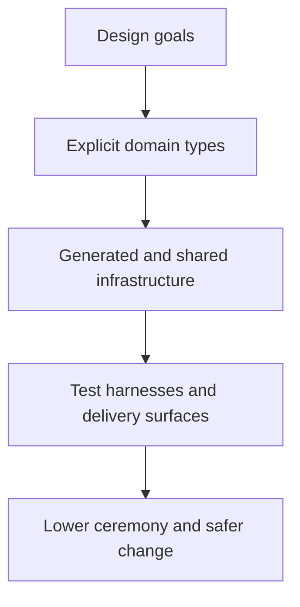

# Design Goals and Trade-Offs

## Overview

Mississippi is intentionally opinionated because it is optimizing for leverage, consistency, and change safety rather than for unlimited architectural freedom.

The framework is designed to reduce the non-domain work that usually makes event-sourced, Orleans-based systems feel expensive to build and maintain. Conventions, source generators, shared runtime building blocks, and focused test harnesses work together so teams spend more time on business behaviour and less time on wiring, duplicated DTOs, endpoint scaffolding, and repetitive test setup.

## The Problem This Solves

Teams building this style of system often repeat the same non-domain work:

- registering handlers, reducers, projections, and endpoints
- creating request and response DTOs that mirror domain types
- keeping gateway routes and client actions aligned with server behavior
- rebuilding Given/When/Then test setup for every aggregate and effect

Testing is a large part of that cost. In a typical Orleans application, validating domain behavior often means spinning up a `TestCluster`, mocking grain infrastructure, or mixing business-rule assertions with transport and hosting setup. Mississippi tries to separate those concerns so domain correctness can be exercised closer to the business model instead of requiring full runtime setup for every test.

That matters technically, but it also matters commercially. When teams spend less time recreating transport, registration, and test scaffolding, they can spend more time on product rules, workflow correctness, and delivery speed.

## Core Idea

Mississippi is low-ceremony, not no-code.

Developers still own the important logic:

- command validation
- event definitions
- reducer logic
- effect logic
- saga steps and compensation rules

The framework owns more of the repeatable structure around that logic so the architecture stays more consistent as the system grows.

## How It Works

This diagram shows the path from design goals to framework mechanisms.

The repository evidence shows Mississippi pursuing that goal through three main mechanisms.

1. Attribute-driven generation.
   `GenerateAggregateEndpointsAttribute`, `GenerateProjectionEndpointsAttribute`, `GenerateSagaEndpointsAttribute`, and `GenerateCommandAttribute` each drive concrete runtime, gateway, or client output.
2. Generic runtime building blocks.
   `GenericAggregateGrain<TAggregate>`, projection runtime support, and the root dispatcher types mean many applications do not need one handwritten runtime type or controller per domain concept.
3. Focused test harnesses.
   `AggregateTestHarness<TAggregate>`, `AggregateScenario<TAggregate>`, `ReducerTestHarness<TProjection>`, `EffectTestHarness<...>`, `FireAndForgetEffectTestHarness<...>`, and Reservoir's `StoreTestHarness<TState>` support Given/When/Then style testing around domain logic and client state without full infrastructure setup.

These mechanisms are trying to achieve a specific outcome: keep the business model explicit while making the surrounding system more repeatable. Teams still write the logic that matters, but they write less glue code around it.

## What Mississippi Optimizes For

Mississippi is optimized for a specific style of engineering work.

- **Explicit business behaviour**. Commands, events, reducers, effects, and projections stay visible in the codebase instead of being hidden behind broad service layers.
- **End-to-end alignment**. The same domain definitions drive runtime behavior, generated endpoints, client actions, and read-model delivery.
- **Fast domain-level testing**. Aggregate, reducer, effect, and store harnesses let teams test core logic in memory using the same concepts the production runtime uses.
- **Lower ceremony for complex systems**. Generation and shared runtime building blocks reduce the amount of repetitive code teams would otherwise write by hand.

## Why That Matters To Teams And Businesses

These goals are not just coding preferences. They change the economics of building and evolving a stateful platform.

- Teams can spend more time on workflow and rules, and less time on mirrored transport code.
- The architecture stays more coherent as more aggregates, projections, and clients are added.
- Testing stays closer to the business model, which makes change safer and regressions easier to catch.
- The framework is better suited to systems where correctness, traceability, and live visibility matter more than raw architectural looseness.

## Guarantees

- Mississippi provides real source generators for aggregate, projection, saga, gateway, and client scaffolding. This is not just a design aspiration.
- The repository includes dedicated test harnesses for aggregate scenarios, reducers and projections, synchronous effects, fire-and-forget effects, and Reservoir client-state scenarios.
- The current client model is explicitly Redux-style. `IStore`, Reservoir reducers, and Inlet projection actions all use that vocabulary directly.
- The repository is explicitly pre-1.0.

## Non-Guarantees

- Mississippi does not remove the need to understand distributed systems. Teams still need to reason about eventual consistency, side effects, retries, and compensation.
- Mississippi does not promise maximum architectural freedom. It expects developers to work with its conventions rather than around them.
- Mississippi does not make domain modeling optional. Teams still need to define commands, events, reducers, effects, and projections clearly.

## Trade-Offs

- Strong conventions make generator output more reliable, but they also make naming, namespace layout, and attribute placement matter more.
- Generated surfaces reduce repetitive code, but they can hide structure from developers who have not yet learned the model.
- Domain tests become simpler when handlers, reducers, effects, and feature-state transitions stay narrow. That same narrowness means business rules are often spread across several small types instead of one large service.
- The framework is strongest when teams accept the full shape of the model. Teams looking for a thin abstraction over conventional CRUD or ad hoc service layers may find Mississippi too structured.

## Why This Model Fits AI-Assisted Engineering

This section is a reasoned interpretation of the repository shape, not a runtime guarantee.

Mississippi is well positioned for AI-assisted development because it narrows how much infrastructure an engineer or coding agent has to recreate by hand. The generators, conventions, and harnesses define a smaller and more regular surface area:

- domain records and handlers follow repeatable conventions
- gateway and client scaffolding are generated from attributes instead of manually mirrored
- tests can focus on business rules with lightweight harnesses instead of full-host setup

That does not make the framework "AI-native" in a magical sense. It means the framework chooses explicit patterns that are easier for both humans and tools to extend consistently. In business terms, that makes AI assistance more likely to increase delivery speed without creating as much structural drift in the surrounding platform.

## Related Tasks and Reference

- Use [Architectural Model](./architectural-model.md) for the full subsystem picture.
- Use [Write Model](./write-model.md) and [Read Models and Client Sync](./read-models-and-client-sync.md) for runtime behavior.
- Use [Why Mississippi](../why-mississippi/index.md) when the question is primarily about executive value or platform strategy.
- Use [Mississippi vs CRUD](../why-mississippi/mississippi-vs-crud.md) when the comparison is with a more conventional application model.
- Use [Samples](../samples/index.md) when you want to see the generated and handwritten pieces together in one application.

## Summary

Mississippi trades some architectural freedom for delivery leverage. Its design goals are to keep business logic explicit, reduce repeated infrastructure work, and make testing and change safer. The cost is that teams have to accept stronger conventions and a more structured model. The benefit is a platform that can stay more coherent as complexity grows.

## Next Steps

- [Architectural Model](./architectural-model.md)
- [Write Model](./write-model.md)
- [Read Models and Client Sync](./read-models-and-client-sync.md)
- [Samples](../samples/index.md)
