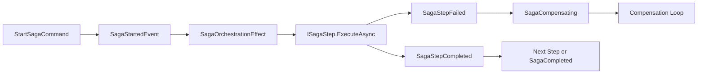

# Event Sourcing Sagas

## Overview

Mississippi sagas coordinate long-running workflows by combining event-sourced saga state with ordered steps and optional compensation.

Use this page to understand what sagas are for, how Mississippi models them, and what the framework does and does not guarantee. Use the Spring sample tutorial when you want to build one step by step.

## The Problem This Solves

Some workflows span more than one aggregate or more than one irreversible action.

In those cases, a single command handler is often the wrong abstraction because:

- each step may depend on the outcome of an earlier step
- failures may happen after partial forward progress
- rollback is often compensating business logic, not a database transaction rollback

Mississippi uses sagas for this class of workflow.

## Core Idea

A Mississippi saga combines four parts:

| Part | Role |
|------|------|
| `ISagaState` | Stores lifecycle state such as phase, last completed step, and correlation information |
| `ISagaStep<TSaga>` | Executes one ordered unit of work |
| `ICompensatable<TSaga>` | Optionally defines how to compensate a completed step |
| Saga orchestration infrastructure | Emits lifecycle events and advances execution or compensation |

The framework treats the saga itself as event-sourced workflow state. Steps execute in declared order, and compensation runs only for steps that expose compensation behavior.

## How It Works

This diagram shows the high-level orchestration flow rather than a concrete sample implementation.

### Orchestration Flow

At a high level:

1. A start command creates or advances saga state.
2. The orchestration effect runs the next ordered `ISagaStep<TSaga>`.
3. A successful step produces lifecycle progress and the next step can run.
4. A failed step moves the saga into a failure or compensation path.
5. Only steps implementing `ICompensatable<TSaga>` participate in compensation.

## Guarantees

- Mississippi gives saga state a defined contract through [`ISagaState`](https://github.com/Gibbs-Morris/mississippi/blob/main/src/DomainModeling.Abstractions/ISagaState.cs).
- Step ordering is explicit through [`SagaStepAttribute<TSaga>`](https://github.com/Gibbs-Morris/mississippi/blob/main/src/DomainModeling.Abstractions/SagaStepAttribute.cs) metadata and `SagaStepInfo` registration.
- Saga orchestration uses lifecycle events such as `SagaStartedEvent`, `SagaStepCompleted`, `SagaStepFailed`, `SagaCompensating`, `SagaCompleted`, and `SagaCompensated`.
- Compensation is opt-in per step through [`ICompensatable<TSaga>`](https://github.com/Gibbs-Morris/mississippi/blob/main/src/DomainModeling.Abstractions/ISagaStep.cs).

## Non-Guarantees

- This page does not claim distributed transaction semantics across aggregates or external systems.
- Mississippi does not compensate steps automatically unless the step exposes explicit compensation behavior.
- This page does not claim exactly-once delivery semantics for side effects or external systems.
- This page does not replace task guidance for building or wiring a concrete saga.

## Trade-Offs

- Sagas make long-running workflow state explicit, but they introduce additional lifecycle state and more moving parts than a single aggregate command flow.
- Compensation gives you business-level rollback behavior, but only where you define that behavior explicitly.
- Reusing existing aggregates inside saga steps keeps workflow logic aligned with domain rules, but failures can occur after partial forward progress and must be handled deliberately.

## Related Tasks And Reference

- [Saga Public APIs](../reference/event-sourcing-sagas-public-apis.md) - Reference for saga contracts, events, results, and registration helpers
- [Building a Saga](../spring-sample/tutorials/building-a-saga.md) - Spring sample tutorial for a concrete money-transfer saga
- [Building Projections](../spring-sample/tutorials/building-projections.md) - Tutorial for projections, including saga status projection generation
- [Domain Registration Generators](../reference/domain-registration-generators.md) - Reference for generated host registration methods used by sample and framework hosts
