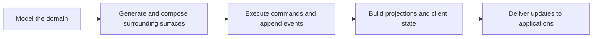

# Concepts

## Overview

Mississippi is for teams that want to model domain behavior directly and let the framework scaffold much of the surrounding transport, client, and runtime plumbing.

You define aggregates, commands, events, and projections. Mississippi then composes event sourcing, CQRS, Orleans execution, generated APIs, client actions, and real-time projection delivery into a single application model.

## What Mississippi Optimizes For

- keeping domain behavior explicit instead of burying it in infrastructure code
- reducing boilerplate through source generation and runtime composition
- separating write-side behavior, read models, and client state so each concern stays testable
- allowing some areas to be adopted independently when a full-stack Mississippi application is not needed

## Core Model

At a high level, Mississippi starts from domain definitions and builds outward.

In practice, that means:

- domain-modeling types describe aggregates, sagas, effects, and UX projections
- Brooks and Tributary provide event streams, reducers, and snapshot mechanics
- Inlet aligns runtime, HTTP, and client surfaces
- Reservoir and Refraction support predictable client behavior and UI composition

## Use This Section

Start here if you are new to Mississippi, evaluating whether it fits your system, or trying to understand how the major subsystems relate before choosing packages or samples.

Use the product-area sections after this page when you need detail about a specific subsystem.

## Learn More

- [Documentation Home](../index.md) - Return to the main landing page
- [Aqueduct](../aqueduct/index.md) - Explore the Orleans-backed SignalR backplane layer
- [Reservoir](../reservoir/index.md) - Explore the Redux-style client state layer
- [Samples](../samples/index.md) - See complete Mississippi applications
- [Archived Concepts](../archived/concepts/index.md) - Browse preserved concept material from the earlier docs set
