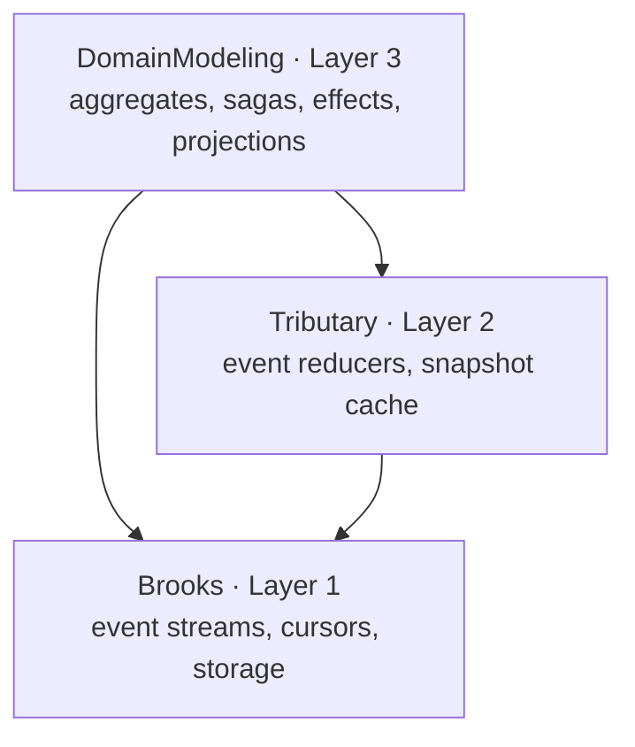
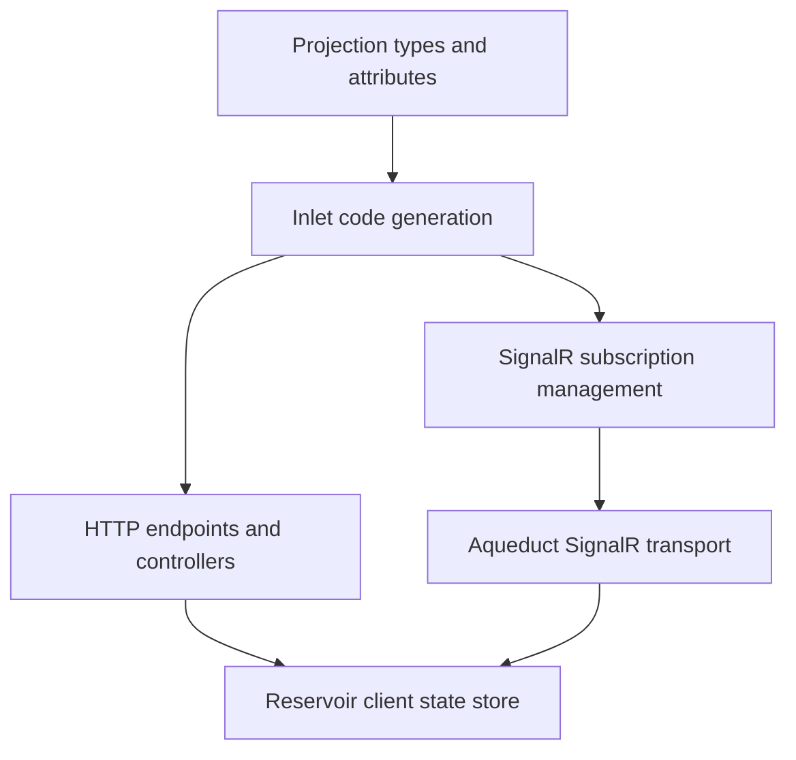

# Concepts

## Overview

Mississippi is an end-to-end application model for event-sourced systems built on Orleans.

Every subsystem in Mississippi — aggregates, event streams, reducers, projections, subscriptions, and SignalR transport — runs as Orleans grains. Teams write domain types: state records, command handlers, event reducers, and saga steps. The framework hosts those types in the appropriate grains, generates the HTTP, SignalR, and client surfaces around them, and manages registration, serialization, and storage.

## What This Section Covers

Use this section when you need the framework-level mental model before choosing a subsystem or a sample.

| Question | Start here |
| --- | --- |
| What Mississippi is and how the product areas relate | [Architectural Model](./architectural-model.md) |
| How commands, events, reducers, and effects work on the write side | [Write Model](./write-model.md) |
| How projections, HTTP reads, SignalR notifications, and client state fit together | [Read Models and Client Sync](./read-models-and-client-sync.md) |
| How saga orchestration and compensation work | [Sagas and Orchestration](./sagas-and-orchestration.md) |
| Why Mississippi is opinionated, what it optimizes for, and what it trades away | [Design Goals and Trade-Offs](./design-goals-and-trade-offs.md) |

## Layer Model

Mississippi is organized in three dependency layers. Each layer is built from Orleans grains and depends strictly downward.

- **Brooks** (Layer 1) owns event stream identity, append, cursor tracking, and storage provider contracts. Each aggregate instance has a brook — a logical event stream keyed by aggregate type and entity ID — served by writer, reader, and cursor grains.
- **Tributary** (Layer 2) owns event reducers and snapshot reconstruction. Reducers are pure functions that fold events into state. Snapshot cache grains store immutable, version-keyed state to avoid replaying full event histories.
- **DomainModeling** (Layer 3) owns aggregate command execution, saga orchestration, event effects, and projection delivery. `GenericAggregateGrain<T>` hosts any aggregate type, routes commands through handlers, writes events to Brooks, and dispatches synchronous and fire-and-forget effects after persistence.

## Delivery and Client Surface

Teams define projection types and mark them with attributes. The framework takes those definitions and delivers them to clients through generated endpoints, real-time notifications, and a predictable client state store.

- **Inlet** takes projection types, aggregates, and sagas marked with attributes such as `[GenerateAggregateEndpoints]` and `[GenerateProjectionEndpoints]` and generates HTTP controllers, client DTOs, client-side Redux actions and reducers, and MCP tool definitions. At runtime, Inlet manages per-connection projection subscriptions through a SignalR hub that notifies clients when projections change.
- **Aqueduct** provides the SignalR infrastructure that works across an Orleans cluster, so notifications reach clients regardless of which server they are connected to.
- **Reservoir** provides Redux-style client state management. Actions flow through reducers that produce immutable state slices. Action effects handle async side effects such as fetching updated projections after a change notification.
- **Refraction** provides a Blazor component library and design-token system for client UIs.

## Suggested Reading Path

If you are evaluating Mississippi as an architecture, read the pages in this order:

1. [Architectural Model](./architectural-model.md)
2. [Write Model](./write-model.md)
3. [Read Models and Client Sync](./read-models-and-client-sync.md)
4. [Sagas and Orchestration](./sagas-and-orchestration.md)
5. [Design Goals and Trade-Offs](./design-goals-and-trade-offs.md)

## Learn More

- [Architectural Model](./architectural-model.md) — Framework-wide subsystem map and composition model
- [Write Model](./write-model.md) — Aggregate command, event, reducer, and effect flow
- [Read Models and Client Sync](./read-models-and-client-sync.md) — How projections reach client state through HTTP and SignalR
- [Sagas and Orchestration](./sagas-and-orchestration.md) — Long-running workflow coordination and compensation
- [Design Goals and Trade-Offs](./design-goals-and-trade-offs.md) — Framework rationale, constraints, and trade-offs
- [Domain Modeling](../domain-modeling/index.md) — Aggregates, sagas, effects, and projections in depth
- [Brooks](../brooks/index.md) — Event stream identity, storage, and cursor mechanics
- [Tributary](../tributary/index.md) — Event reducers and snapshot reconstruction
- [Inlet](../inlet/index.md) — Code generation and projection subscriptions
- [Reservoir](../reservoir/index.md) — Redux-style client state management
- [Aqueduct](../aqueduct/index.md) — Orleans-backed SignalR infrastructure
- [Samples](../samples/index.md) — Complete Mississippi applications
