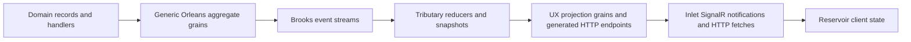

# Concepts

## Overview

Mississippi is an end-to-end application model for event-sourced systems built on Orleans.

It lets teams focus on the code that matters — domain records, command handlers, reducers, and saga steps — while the framework generates and manages the transport, registration, client synchronization, and real-time notification infrastructure around it. The domain model stays small and explicit. The boilerplate disappears.

## What This Section Covers

Use this section when you need the framework-level mental model before choosing a subsystem or a sample.

| Question | Start here |
| --- | --- |
| What Mississippi is and how the product areas relate | [Architectural Model](./architectural-model.md) |
| How commands, events, reducers, and effects work on the write side | [Write Model](./write-model.md) |
| How projections, HTTP reads, SignalR notifications, and client state fit together | [Read Models and Client Sync](./read-models-and-client-sync.md) |
| How saga orchestration and compensation work | [Sagas and Orchestration](./sagas-and-orchestration.md) |
| Why Mississippi is opinionated, what it optimizes for, and what it trades away | [Design Goals and Trade-Offs](./design-goals-and-trade-offs.md) |

## Core Frame

This diagram shows the verified top-level composition model.

At a high level:

- Domain Modeling owns aggregates, sagas, event effects, and UX projection runtime abstractions.
- Brooks owns event streams and event storage.
- Tributary owns reducers and snapshot reconstruction.
- Inlet aligns runtime registration, HTTP endpoints, SignalR subscriptions, and client code generation.
- Reservoir provides Redux-style client state management.
- Aqueduct provides Orleans-backed SignalR messaging infrastructure.

## Suggested Reading Paths

If you are evaluating Mississippi as an architecture, read the pages in this order:

1. [Architectural Model](./architectural-model.md)
2. [Write Model](./write-model.md)
3. [Read Models and Client Sync](./read-models-and-client-sync.md)
4. [Sagas and Orchestration](./sagas-and-orchestration.md)
5. [Design Goals and Trade-Offs](./design-goals-and-trade-offs.md)

If you already know the framework style and need a subsystem boundary, move to the product-area docs under [Domain Modeling](../domain-modeling/index.md), [Inlet](../inlet/index.md), [Reservoir](../reservoir/index.md), [Tributary](../tributary/index.md), and [Brooks](../brooks/index.md).

## Current Coverage

This section covers the verified framework model at the cross-cutting level. It explains the architecture that spans multiple product areas. For package-level detail, API reference, or operational guidance, see the individual product-area pages.

## Learn More

- [Documentation Home](../index.md) - Return to the main landing page
- [Architectural Model](./architectural-model.md) - See the framework-wide subsystem map and mental model
- [Write Model](./write-model.md) - Follow the aggregate command, event, reducer, and effect flow
- [Read Models and Client Sync](./read-models-and-client-sync.md) - See how projections move from event streams into client state
- [Sagas and Orchestration](./sagas-and-orchestration.md) - Understand long-running workflow coordination and compensation
- [Design Goals and Trade-Offs](./design-goals-and-trade-offs.md) - Review the framework rationale, constraints, and AI-related implications
- [Domain Modeling](../domain-modeling/index.md) - Go deeper on aggregates, sagas, effects, and UX projections
- [Inlet](../inlet/index.md) - Go deeper on generated client, API, and runtime alignment
- [Samples](../samples/index.md) - See complete Mississippi applications
- [About Benjamin Gibbs](./about-benjamin-gibbs-reference.md) - Learn about the creator of Mississippi
