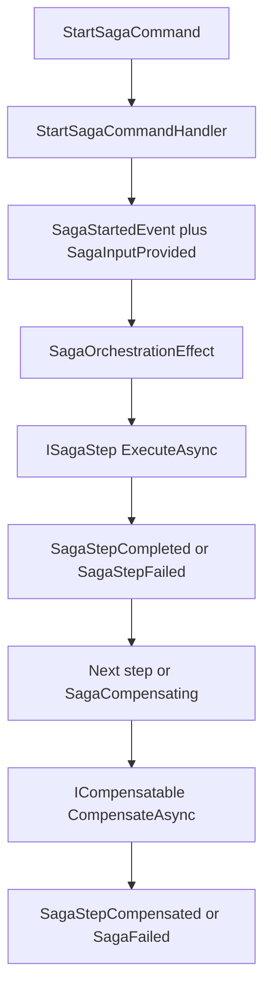

# Sagas and Orchestration

## Overview

Mississippi models a saga as explicit state plus ordered step execution.

A saga state record implements `ISagaState`. A start command creates lifecycle events. `SagaOrchestrationEffect<TSaga>` reacts to those lifecycle events, resolves ordered `ISagaStep<TSaga>` implementations, and emits further saga events as each step succeeds, fails, or compensates.

## The Problem This Solves

Some business operations span multiple aggregates and need coordinated execution with rollback capability.

Money transfer is the clearest example in the Spring sample: debit one account, credit another, and undo the debit if the credit fails. That kind of workflow is easy to describe but hard to build reliably when the alternative is ad hoc service code with scattered try/catch blocks and manual state tracking.

Mississippi addresses that by making workflow progress explicit in evented saga state — every step, every failure, and every compensation action is a first-class event in the stream.

## Core Idea

Sagas reuse the aggregate-style event pipeline, but with specialized orchestration semantics.

- Saga state is stored like other event-sourced state.
- Starting a saga emits lifecycle events rather than performing all work immediately.
- Ordered steps run in response to those lifecycle events.
- Compensation is explicit and opt-in for steps that implement `ICompensatable<TSaga>`.

## How It Works

This diagram shows the verified saga control flow.

The verified runtime behavior is:

1. `StartSagaCommandHandler<TSaga, TInput>` checks that the saga has not already started and that step metadata exists.
2. It emits `SagaStartedEvent` and `SagaInputProvided<TInput>`.
3. `SagaOrchestrationEffect<TSaga>` listens for saga lifecycle events.
4. On `SagaStartedEvent`, it resolves the first step using `ISagaStepInfoProvider<TSaga>` and dependency injection.
5. Each successful step may emit domain events and then yields `SagaStepCompleted`.
6. When there is no next step, the effect yields `SagaCompleted`.
7. On failure, the effect yields `SagaStepFailed` followed by `SagaCompensating`.
8. Compensation walks backward through prior steps. When no earlier step remains, the effect yields `SagaCompensated`.

## Guarantees

- Saga state has a defined contract through `ISagaState`, including `SagaId`, `Phase`, `LastCompletedStepIndex`, `StartedAt`, and `StepHash`.
- Saga steps are explicitly ordered through `[SagaStep<TSaga>(index)]` metadata.
- Start commands capture input into saga state through `SagaInputProvided<TInput>` so later steps can read the original input.
- Compensation runs only for steps that implement `ICompensatable<TSaga>`.
- Saga lifecycle transitions are represented as explicit events such as `SagaStartedEvent`, `SagaStepCompleted`, `SagaStepFailed`, `SagaCompensating`, `SagaCompleted`, `SagaCompensated`, and `SagaFailed`.

## Non-Guarantees

- Mississippi sagas are not distributed transactions. They coordinate work and compensation, but they do not make several aggregates commit atomically.
- Compensation is business-defined. The framework can call compensating steps, but it cannot infer what a safe undo operation should be.
- A saga can still end in `Failed` state during compensation if a compensating step cannot complete successfully.

## Trade-Offs

- Explicit lifecycle events make saga progress observable and testable, but they also add more state and event types than a one-off workflow service would.
- Ordered steps are easier to reason about than implicit orchestration, but they require developers to model forward progress and rollback rules carefully.
- Saga orchestration reuses the aggregate/event infrastructure, which keeps the model consistent. It also means teams need to learn the same evented thinking for workflows, not just for aggregates.

## Related Tasks and Reference

- Use [Write Model](./write-model.md) for single-aggregate command handling.
- Use [Read Models and Client Sync](./read-models-and-client-sync.md) for status projections and client update paths.
- Use [Domain Modeling](../domain-modeling/index.md) when you need the package boundary around saga abstractions and runtime support.

## Summary

Mississippi sagas turn multi-step workflows into observable, compensatable event streams — making workflow progress, failure, and recovery explicit rather than buried in ad hoc service code.

## Next Steps

- [Read Models and Client Sync](./read-models-and-client-sync.md)
- [Design Goals and Trade-Offs](./design-goals-and-trade-offs.md)
- [Domain Modeling](../domain-modeling/index.md)
- [Samples](../samples/index.md)
