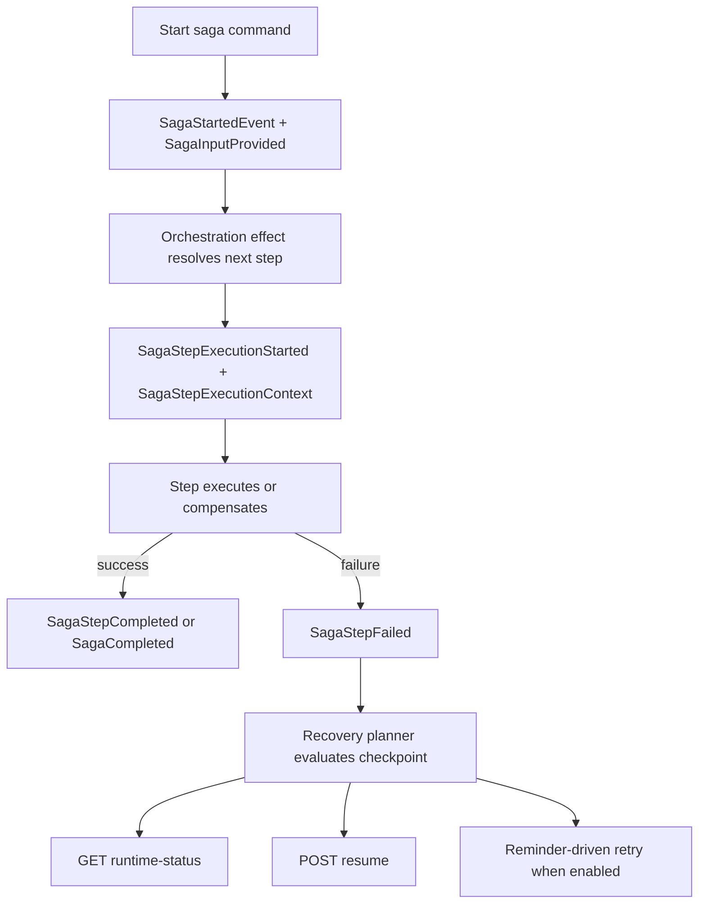

# Sagas and Orchestration

## Overview

Mississippi models a saga as explicit workflow state, ordered step execution, and a separate recovery surface for operators and tooling.

A saga state record implements `ISagaState`. `SagaOrchestrationEffect<TSaga>` reacts to saga lifecycle events, resolves ordered `ISagaStep<TSaga>` implementations, and emits further saga events as each step succeeds, fails, compensates, blocks, or resumes. Raw saga state stays business-focused, while `SagaRuntimeStatus` exposes metadata-only recovery state and `SagaResumeResponse` describes typed manual-resume outcomes.

## The Problem This Solves

Some business operations span multiple aggregates and need coordinated execution, recovery, and rollback capability.

Money transfer is the clearest example in the Spring sample: debit one account, credit another, and undo the debit if the credit fails. That kind of workflow is easy to describe but hard to build reliably when the alternative is ad hoc service code with scattered `try/catch` blocks, hidden retry loops, and no durable checkpoint of what already ran.

Mississippi addresses that by making workflow progress explicit in evented saga state. Every step, every failure, every compensation action, and every recovery decision is represented as state or events the runtime can inspect.

## Core Idea

Sagas reuse the aggregate-style event pipeline, but with specialized orchestration and recovery semantics.

- Saga state is stored like other event-sourced state.
- Starting a saga emits lifecycle events and captures the original input for later steps.
- Each step declares a forward recovery policy through `[SagaStep<TSaga>(index, forwardRecoveryPolicy)]`.
- Compensatable steps can declare `CompensationRecoveryPolicy` and receive the same `SagaStepExecutionContext` contract as forward execution.
- Automatic recovery and manual resume operate from framework-owned checkpoint metadata rather than mutating raw saga state.
- Generated HTTP and MCP surfaces keep raw saga state separate from metadata-only runtime status.

## How It Works

This page starts where the single-aggregate write model stops: when one business operation needs ordered work across several steps, and often across several aggregates.

The runtime behavior is:

1. `StartSagaCommandHandler<TSaga, TInput>` checks that the saga has not already started and that step metadata exists.
2. It emits `SagaStartedEvent` and `SagaInputProvided<TInput>`.
3. `SagaOrchestrationEffect<TSaga>` listens for saga lifecycle events and resolves the next step from `ISagaStepInfoProvider<TSaga>`.
4. Before invoking a step, the runtime records `SagaStepExecutionStarted` and passes a `SagaStepExecutionContext` that includes attempt identity, direction, source, and operation key.
5. On success, the effect yields `SagaStepCompleted`; when there is no next step, the effect yields `SagaCompleted`.
6. On failure, the runtime records `SagaStepFailed` and evaluates recovery metadata to determine whether the next action is automatic replay, manual intervention, compensation, terminal completion, or workflow-mismatch blocking.
7. When automatic recovery is enabled and the host has reminder delivery configured, reminder ticks re-enter the recovery planner. Operators can also inspect `SagaRuntimeStatus` or issue a typed manual resume request.

## Guarantees

- Saga state has a defined contract through `ISagaState`, including `SagaId`, `Phase`, `LastCompletedStepIndex`, `StartedAt`, and `StepHash`.
- Saga steps are explicitly ordered through `[SagaStep<TSaga>(...)]` metadata and `ISagaStepInfoProvider<TSaga>`.
- Start commands capture input into saga state through `SagaInputProvided<TInput>` so later steps can read the original input.
- Compensation runs only for steps that implement `ICompensatable<TSaga>`.
- Every forward execution and compensation call receives `SagaStepExecutionContext`, including `AttemptId`, `OperationKey`, `Direction`, `Source`, `StepIndex`, and `StepName`.
- Saga-level recovery behavior can be overridden with `[SagaRecovery(...)]`. When the attribute is omitted, generated runtime registration defaults to `SagaRecoveryMode.Automatic`.
- Generated saga HTTP surfaces keep raw state on `GET status` and add metadata-only `GET runtime-status` plus typed `POST resume`.
- Workflow hash drift surfaces as `WorkflowMismatch` rather than silently replaying a mismatched definition.

## Non-Guarantees

- Mississippi sagas are not distributed transactions. They coordinate work and compensation, but they do not make several aggregates commit atomically.
- Compensation is business-defined. The framework can call compensating steps, but it cannot infer what a safe undo operation should be.
- Automatic replay is only appropriate for steps declared `Automatic` and implemented to use the provided operation identity safely. Mississippi does not infer idempotency for you.
- Host applications still own reminder provider wiring and runtime option selection. Saga attributes do not provision reminder infrastructure by themselves.

## Trade-Offs

- Explicit lifecycle events, checkpoints, and execution context make workflow progress observable and testable, but they add more contract surface than a one-off workflow service would.
- Separate raw state and runtime status avoid leaking business state into operator tooling, but clients must choose the correct surface for each use case.
- Manual-only recovery policies protect non-idempotent work from accidental duplicate execution, but they can require human intervention before progress continues.

## Testability

Saga orchestration remains testable for the same reason the rest of Mississippi's write path remains testable: workflow progress is expressed through explicit events and explicit state.

Start commands, lifecycle events, ordered steps, recovery status, and compensation outcomes are all modeled directly. That makes it easier to test saga progress and failure handling at the domain level instead of hiding workflow behavior inside broad service methods with scattered control flow.

## Related Tasks and Reference

- Use [Write Model](./write-model.md) for single-aggregate command handling.
- Use [Read Models and Client Sync](./read-models-and-client-sync.md) for status projections and client update paths.
- Use [Building a Saga](../samples/spring-sample/tutorials/building-a-saga.md) for a verified sample walkthrough.
- Use [Upgrade saga code from < 0.0.1 to 0.0.1](../domain-modeling/migration/upgrade-saga-code-from-before-0-0-1-to-0-0-1.md) when migrating older saga implementations.
- Use [Domain Modeling](../domain-modeling/index.md) when you need the package boundary around saga abstractions and runtime support.

## Summary

Mississippi sagas turn multi-step workflows into observable, compensatable event streams with explicit recovery semantics, making workflow progress, failure, and operator intervention visible instead of buried in ad hoc service code.

## Next Steps

- [Read Models and Client Sync](./read-models-and-client-sync.md)
- [Design Goals and Trade-Offs](./design-goals-and-trade-offs.md)
- [Upgrade saga code from < 0.0.1 to 0.0.1](../domain-modeling/migration/upgrade-saga-code-from-before-0-0-1-to-0-0-1.md)
- [Domain Modeling](../domain-modeling/index.md)
- [Samples](../samples/index.md)
