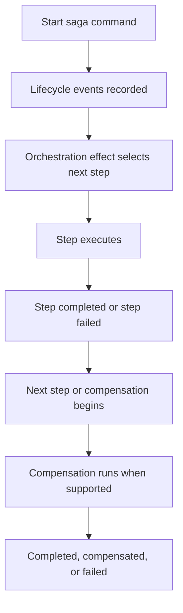
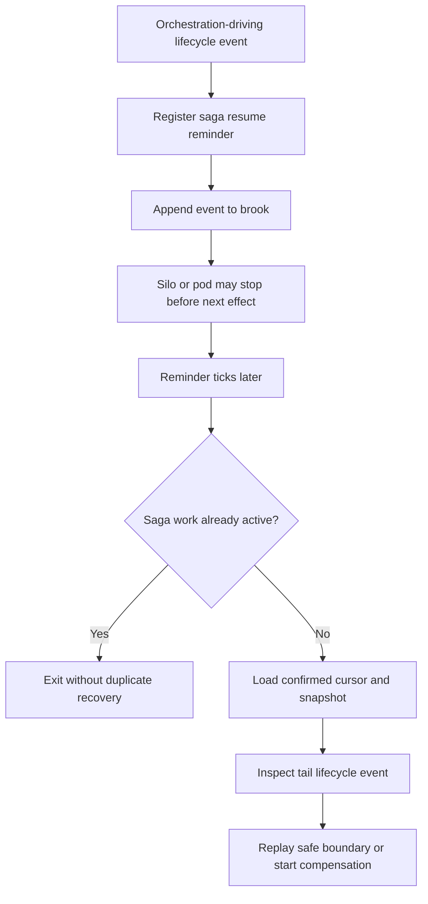

# Sagas and Orchestration

## Overview

Mississippi models a saga as explicit workflow state plus ordered step execution.

A saga state record implements `ISagaState`. A start command enters the same aggregate-style command pipeline used elsewhere in Mississippi, but the work that follows is long-running and step-oriented rather than a single aggregate decision. `SagaOrchestrationEffect<TSaga>` reacts to saga lifecycle events, resolves ordered `ISagaStep<TSaga>` implementations, and emits further saga events as each step succeeds, fails, or compensates.

## The Problem This Solves

Some business operations span multiple aggregates and need coordinated execution with rollback capability.

Money transfer is the clearest example in the Spring sample: debit one account, credit another, and undo the debit if the credit fails. That kind of workflow is easy to describe but hard to build reliably when the alternative is ad hoc service code with scattered try/catch blocks and manual state tracking.

Mississippi addresses that by making workflow progress explicit in evented saga state - every step, every failure, and every compensation action is a first-class event in the stream.

## Core Idea

Sagas reuse the aggregate-style event pipeline, but with specialized orchestration semantics.

- Saga state is stored like other event-sourced state.
- Starting a saga emits lifecycle events rather than performing all work immediately.
- Ordered steps run in response to those lifecycle events.
- Compensation is explicit and opt-in for steps that implement `ICompensatable<TSaga>`.

## How It Works

This page starts where the single-aggregate write model stops: when one business operation needs ordered work across several steps, and often across several aggregates.

This diagram shows the saga control flow.

The runtime behavior is:

1. `StartSagaCommandHandler<TSaga, TInput>` checks that the saga has not already started and that step metadata exists.
2. It emits `SagaStartedEvent` and `SagaInputProvided<TInput>`.
3. `SagaOrchestrationEffect<TSaga>` listens for saga lifecycle events.
4. On `SagaStartedEvent`, it resolves the first step using `ISagaStepInfoProvider<TSaga>` and dependency injection.
5. Each successful step may emit domain events and then yields `SagaStepCompleted`.
6. When there is no next step, the effect yields `SagaCompleted`.
7. On failure, the effect yields `SagaStepFailed` followed by `SagaCompensating`.
8. Compensation walks backward through prior steps. When no earlier step remains, the effect yields `SagaCompensated`.

### Reminder-Based Resume

Saga orchestration also has a durable wake-up path for lifecycle events that were recorded before a silo or pod stopped running the active grain.

Mississippi does not infer reminder eligibility from arbitrary domain events. The runtime uses a fixed set of orchestration-driving saga lifecycle events: `SagaStartedEvent`, `SagaStepCompleted`, `SagaStepFailed`, `SagaCompensating`, and `SagaStepCompensated`. These are the event types that either make `SagaOrchestrationEffect<TSaga>` continue the next step or compensation path, or need recovery help to create the next compensation boundary after a stopped activation.

When saga orchestration starts from one of those lifecycle boundaries, the base aggregate grain makes sure a deterministic Orleans reminder is registered before writing the boundary event. Lifecycle events yielded by the saga effect rely on that already registered reminder rather than updating the reminder from inside the effect-yield persistence loop. `SagaInputProvided<TInput>` does not register a reminder by itself; it is covered by the same start command batch that records `SagaStartedEvent`. Terminal events such as `SagaCompleted`, `SagaCompensated`, and `SagaFailed` do not register new resume reminders. If a later reminder tick sees terminal state, a terminal tail event, or no confirmed event after a pre-append registration, it unregisters the existing reminder.

If the same grain activation is already running saga work when the reminder ticks, the callback exits without doing more work. If no local saga work is active, the callback reloads the confirmed brook cursor, the latest confirmed snapshot, and the tail lifecycle event. It then resumes from a safe lifecycle boundary by dispatching the same saga orchestration effect used by the normal write path.

This diagram shows the recovery path after a lifecycle event is durable.

The reminder callback only resumes from lifecycle boundaries that the saga system knows how to replay safely. For example, it can replay `SagaStartedEvent`, `SagaStepCompleted`, `SagaCompensating`, and `SagaStepCompensated` through `SagaOrchestrationEffect<TSaga>`. If the confirmed tail is `SagaStepFailed`, the callback records a `SagaCompensating` boundary so compensation can continue. If the snapshot or tail event is terminal, the callback unregisters the reminder.

The callback deliberately does not replay arbitrary business events. If the latest confirmed tail is not a supported saga lifecycle boundary, Mississippi logs the unsafe tail and leaves the saga state unchanged rather than guessing how to repeat business work.

## Guarantees

- Saga state has a defined contract through `ISagaState`, including `SagaId`, `Phase`, `LastCompletedStepIndex`, `StartedAt`, and `StepHash`.
- Saga steps are explicitly ordered through `[SagaStep<TSaga>(index)]` metadata and `ISagaStepInfoProvider<TSaga>`.
- Start commands capture input into saga state through `SagaInputProvided<TInput>` so later steps can read the original input.
- Compensation runs only for steps that implement `ICompensatable<TSaga>`.
- Saga lifecycle transitions are represented as explicit events such as `SagaStartedEvent`, `SagaStepCompleted`, `SagaStepFailed`, `SagaCompensating`, `SagaCompleted`, `SagaCompensated`, and `SagaFailed`.
- Orchestration-driving lifecycle boundaries (`SagaStartedEvent`, `SagaStepCompleted`, `SagaStepFailed`, `SagaCompensating`, and `SagaStepCompensated`) are covered by a durable Orleans reminder, so a later reminder tick can resume saga orchestration after a silo or pod stops between lifecycle boundaries.
- Reminder-based recovery reads from the confirmed brook cursor and latest confirmed snapshot before taking recovery action.

## Non-Guarantees

- Mississippi sagas are not distributed transactions. They coordinate work and compensation, but they do not make several aggregates commit atomically.
- Compensation is business-defined. The framework can call compensating steps, but it cannot infer what a safe undo operation should be.
- A saga can still end in `Failed` state during compensation if a compensating step cannot complete successfully.
- Reminder-based recovery is at-least-once at safe lifecycle boundaries. Saga steps and compensation logic should be written so repeated boundary execution is safe for the domain.
- Reminder-based recovery does not provide exact intra-step resume. If a step started external work and the process stopped before the next lifecycle event was recorded, the framework cannot infer or replay that external side effect.
- Mississippi does not replay arbitrary non-saga business tail events during reminder recovery. Unsupported tails are logged and left unchanged.

## Hosting Requirements

Any Orleans silo that can host saga aggregate grains must configure an Orleans reminder provider. Without a reminder provider, the runtime cannot register the durable wake-up reminder before saga lifecycle events are appended.

Use the reminder provider that matches the deployment environment. For example, local tests can use an in-memory reminder service, while a production cluster should use a persistent reminder store supported by the Orleans hosting setup.

## Trade-Offs

- Explicit lifecycle events make saga progress observable and testable, but they also add more state and event types than a one-off workflow service would.
- Ordered steps are easier to reason about than implicit orchestration, but they require developers to model forward progress and rollback rules carefully.
- Saga orchestration reuses the aggregate/event infrastructure, which keeps the model consistent. It also means teams need to learn the same evented thinking for workflows, not just for aggregates.
- Reminder-based resume improves liveness after grain activation or silo failure, but it is intentionally conservative: it resumes known lifecycle boundaries and refuses to guess at arbitrary business-event recovery.

## Testability

Saga orchestration remains testable for the same reason the rest of Mississippi's write path remains testable: workflow progress is expressed through explicit events and explicit state.

Start commands, lifecycle events, ordered steps, and compensation outcomes are all modeled directly. That makes it easier to test saga progress and failure handling at the domain level instead of hiding workflow behavior inside broad service methods with scattered control flow.

## Related Tasks and Reference

- Use [Write Model](./write-model.md) for single-aggregate command handling.
- Use [Read Models and Client Sync](./read-models-and-client-sync.md) for status projections and client update paths.
- Use [Domain Modeling](../domain-modeling/index.md) when you need the package boundary around saga abstractions and runtime support.
- Use [Glossary](../reference/glossary.md) when you need a quick definition of Orleans grains, silos, reminders, sagas, or compensation.

## Summary

Mississippi sagas turn multi-step workflows into observable, compensatable event streams - making workflow progress, failure, and recovery explicit rather than buried in ad hoc service code.

## Next Steps

- [Read Models and Client Sync](./read-models-and-client-sync.md)
- [Design Goals and Trade-Offs](./design-goals-and-trade-offs.md)
- [Domain Modeling](../domain-modeling/index.md)
- [Samples](../samples/index.md)
