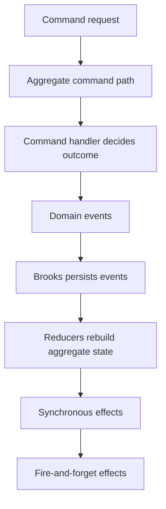

# Write Model

## Overview

Mississippi's write model is aggregate-centric.

One aggregate instance handles one command path for one entity ID at a time. The runtime loads the current aggregate state, asks command handlers to decide what should happen, persists the resulting events to the aggregate's brook, rebuilds state through reducers, and then runs any follow-on effects.

## The Problem This Solves

The hard part of event-sourced writes is usually not emitting events. The hard part is keeping the command path, state reconstruction, side effects, and transport surfaces consistent.

Mississippi addresses that by making the write flow explicit and repeatable:

- state lives in an aggregate record
- command validation lives in `CommandHandlerBase<TCommand, TAggregate>` implementations
- event application lives in `IEventReducer` and `IRootReducer` implementations
- generated gateway and client surfaces call the same underlying aggregate command path

## Core Idea

Aggregate state is never mutated directly by commands.

Commands decide whether an aggregate may move from its current state to a new one. Events record that decision. Reducers then derive the new state from the persisted event stream.

## How It Works

This diagram shows the aggregate write flow from command to persisted events and follow-on effects.

The concrete runtime sequence is:

1. A generated endpoint, generated client action, or another runtime component routes the command to the aggregate instance for a specific entity ID.
2. `IGenericAggregateGrain<TAggregate>` loads the latest brook position and current aggregate state.
3. `IRootCommandHandler<TAggregate>` dispatches the command to the matching `ICommandHandler` implementation.
4. The handler returns either an `OperationResult` failure or an ordered list of domain events.
5. The aggregate runtime appends those events to Brooks.
6. Tributary reducers rebuild aggregate state from the event stream and snapshots.
7. If a root event effect is registered, synchronous event effects run after persistence and may yield additional events.
8. If fire-and-forget effect registrations exist, they are dispatched after persistence in separate worker grains and are not awaited by the command path.

## Guarantees

- Commands do not write aggregate state directly. They succeed by returning events.
- Aggregate state is reconstructed through reducers, not by imperative mutation inside handlers.
- `GenericAggregateGrain<TAggregate>` supports optimistic concurrency through `ExecuteAsync(command, expectedVersion, ...)`.
- Synchronous event effects run after the original events are persisted.
- `EventEffectBase<TEvent, TAggregate>` effects may yield additional events, and the aggregate runtime persists those yielded events immediately.
- Fire-and-forget effects use `FireAndForgetEventEffectBase<TEvent, TAggregate>` and cannot yield additional events.
- The aggregate runtime caps synchronous effect chaining through `AggregateEffectOptions.MaxEffectIterations`, which defaults to `10`.

## Non-Guarantees

- Mississippi does not provide a cross-aggregate transaction boundary. Each aggregate command runs against one aggregate instance at a time.
- Synchronous event effects do not make the original command atomic with downstream side effects. The original events are already persisted before those effects run.
- Fire-and-forget effects are intentionally not part of the request completion path. A successful command does not mean every background side effect has finished.
- The framework does not provide a global ordering guarantee across aggregates. Ordering is meaningful within a brook, not across the entire system.

## Trade-Offs

- This model keeps domain decisions explicit, but it requires developers to think in events and reducers rather than direct state mutation.
- Synchronous effects are powerful because they can emit more events, but they also make it easier to create complex event chains. The iteration limit exists to stop accidental cycles.
- Fire-and-forget effects keep command latency low, but they shift some work into eventually observed background behavior.

## Testability

This write model is designed to keep domain behavior testable without Orleans infrastructure.

Because command handlers return events instead of mutating state directly, the core business decision stays narrow and observable. Reducers rebuild state from those events, and effects run over explicit event inputs. That makes it practical to test aggregate flows with `AggregateTestHarness<TAggregate>` and `AggregateScenario<TAggregate>`, and to test synchronous or fire-and-forget effects with `EffectTestHarness<...>` and `FireAndForgetEffectTestHarness<...>`, using Given/When/Then style scenarios rather than `TestCluster` setup or grain mocking.

## Related Tasks and Reference

- Use [Read Models and Client Sync](./read-models-and-client-sync.md) for the projection side of the same events.
- Use [Sagas and Orchestration](./sagas-and-orchestration.md) when one business operation spans several aggregates or steps.
- Use [Domain Modeling](../domain-modeling/index.md) for the package boundary around aggregates, effects, and test harnesses.

## Summary

Mississippi's write model keeps domain decisions in handlers and state reconstruction in reducers, making the entire command path explicit, testable, and free of infrastructure coupling.

## Next Steps

- [Read Models and Client Sync](./read-models-and-client-sync.md)
- [Sagas and Orchestration](./sagas-and-orchestration.md)
- [Design Goals and Trade-Offs](./design-goals-and-trade-offs.md)
- [Domain Modeling](../domain-modeling/index.md)
