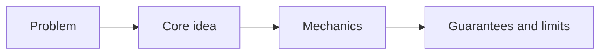

# Concept Pages

## Overview

Use a concepts page when the reader needs the model, guarantees, limits, or trade-offs behind Mississippi behavior.

Concept pages correspond to the explanation quadrant of Diataxis. They are where you explain why the system is shaped the way it is, not where you walk the reader through a task.

## Use This Page Type When

- the reader needs a mental model
- the topic is about architecture or lifecycle
- the page must explain guarantees and non-guarantees
- the topic depends on trade-offs, failure boundaries, or consistency semantics

## Required Structure

1. direct explanation statement
2. `## The problem this solves`
3. `## Core idea`
4. `## How it works`
5. `## Guarantees`
6. `## Non-guarantees` or `## Limits`
7. `## Trade-offs`
8. `## Related tasks and reference`

## Content Rules

- Explain ordering, concurrency, durability, visibility of state changes, failure boundaries, cancellation behavior, and versioning implications when they matter.
- Use comparisons only when the similarities and differences are evidence-based.
- Do not imply equivalence to Orleans, Akka, or another system unless Mississippi evidence supports the claim.
- Do not turn a concept page into a procedural task guide, release note, or reference dump.

## Diagram Guidance

Use a diagram when the model is easier to understand visually than textually.



Strong candidates include request flow, activation lifecycle, retry timeline, persistence boundary, message ordering, and cluster topology.

## Minimal Frontmatter Example

```yaml
---
title: Brook Event Ordering
description: Explain what Mississippi guarantees and does not guarantee about event ordering within and across brooks.
sidebar_position: 30
sidebar_label: Event Ordering
---
```

## Page Skeleton Example

```md
# Brook Event Ordering

Brook event ordering defines which event sequences Mississippi preserves and where those guarantees stop.

## The problem this solves

## Core idea

## How it works

## Guarantees

## Non-guarantees

## Trade-offs

## Related tasks and reference
```

## Summary

- concept pages explain mental models, guarantees, limits, and trade-offs
- they should avoid turning explanation into a task guide or reference dump
- distributed-systems concepts should make guarantees and non-guarantees explicit

## Next Steps

- [Documentation Guide](./documentation-guide.md)
- [How-To Guides](./documentation-how-to.md)
- [Reference Pages](./documentation-reference.md)
