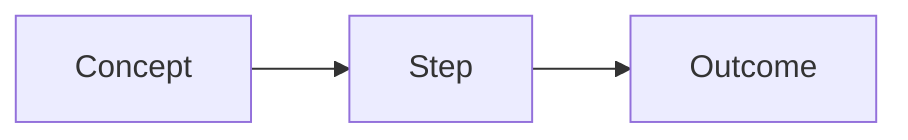

# Documentation Guide

## Overview

This guide codifies the structure and style used across the client-state-management documentation set and makes it mandatory for new Docusaurus docs in this repo.

## Scope

These rules apply to every new or edited Markdown/MDX doc under `docs/Docusaurus/docs/`.

## Tone and Language

### Purpose and Audience

- Define the reader (developer, architect, administrator, or executive) before writing.
- Write only what enables a decision or action.

### Concise, Factual Language

- Use active voice and present tense.
- Use one idea per sentence.
- Define abbreviations on first use.
- Avoid marketing language and vague qualifiers.

### RFC 2119 Keywords

- Use **MUST**, **SHOULD**, and **MAY** in rules sections only.
- Use **MUST NOT** and **SHOULD NOT** for explicit prohibitions.

## Required Page Structure

Every doc MUST follow this structure in order:

1. **Frontmatter**
2. **H1 title**
3. **Overview** section
4. **Core content sections** (problem/concept → mechanics → usage)
5. **Closing section** (rules below)

### Closing Section Rules

- If the page is a **section entry** (the doc referenced by a folder’s `_category_.json` link), the closing section MUST be **Learn More** with links to all child pages.
- Otherwise, the closing sections MUST be **Summary** followed by **Next Steps**.

## Frontmatter (Required)

Frontmatter MUST include all fields shown below and MUST be the first lines in the file.

```yaml
---
id: <kebab-case-doc-id>
title: <Title Case Page Title>
sidebar_label: <Short Sidebar Label>
sidebar_position: <number>
description: <One-sentence summary>
---
```

### Frontmatter Rules

- `id` MUST be kebab-case and stable.
- `title` MUST be concise and human-readable.
- `sidebar_label` MUST be short (1–3 words).
- `sidebar_position` MUST be an integer and MUST be unique within its folder.
- `description` MUST be a single sentence.
- Use kebab-case filenames to match `id`.
- Use `slug` only for section landing pages (example: [../index.md](../index.md)).

## Headings

- Use **one** H1 (`#`) per file.
- Use H2 (`##`) for main sections.
- Use H3 (`###`) only for subsections of a main section.
- Do NOT use H4+ headings.

## Markdown Usage Rules

### Tables

Use tables for enumerations or structured comparisons.

```markdown
| Item | Purpose |
|------|---------|
| **Reducer** | Pure state transition |
| **Effect** | Async side effect |
```

### Code Blocks

- All code blocks MUST declare a language (e.g., `csharp`, `json`, `bash`).
- Keep samples minimal and focused.
- Do NOT include example output unless it is verified from the repo.

### Admonitions

Use Docusaurus admonitions for callouts.

```markdown
:::note
Short, factual note that clarifies a rule.
:::
```

Use `:::warning` for risks or breaking behaviors.

## Mermaid Usage

Mermaid is enabled for this Docusaurus site. Use Mermaid for diagrams instead of images.
([docusaurus.config.ts](https://github.com/Gibbs-Morris/mississippi/blob/main/docs/Docusaurus/docusaurus.config.ts#L17-L21))



### Mermaid Rules

- Use `flowchart LR` by default for process diagrams.
- Keep diagrams small (7 nodes or fewer) unless the doc is explicitly about architecture.
- Prefer labels that match section terminology.
- Do NOT embed images for diagrams.

## Links

### Internal Doc Links

- Use relative links between docs (e.g., `./store.md`, `actions.md`).
- Link to the most relevant section, not the top of a long page.

### Source Code Links

- Use absolute GitHub URLs to source code.
- Prefer deep links to specific files; add line ranges when pointing at specific members.
- Use the `/blob/main/` path for source links.

## Evidence Rules (Non-Negotiable)

- Every technical statement MUST be backed by repository evidence.
- If a statement cannot be verified, rewrite it as a question or remove it.
- Do NOT speculate about behavior, defaults, or APIs.

## Tone and Voice

- Use direct, imperative language.
- Avoid hedging words like “might”, “could”, “maybe”, or “typically”.
- Prefer short sentences.

## Topic Scope

- One page MUST answer one question or cover one task.
- Split divergent tasks into separate pages and cross-link them.
- Use the `Overview` section to state scope boundaries explicitly.

## Navigation and Information Architecture

- Section entry pages MUST summarize their purpose and list child pages.
- Component pages MUST end with `Next Steps` links to at least two related pages.

## Visuals and Examples

- Use Mermaid for process and architecture diagrams.
- Code samples MUST compile in isolation or be copy-safe excerpts.
- Use tables for option matrices and comparative data.

## Maintenance Rules

- Update docs in the same change that modifies behavior or API surface.
- Keep one source of truth; link instead of duplicating content.
- Do NOT add "last updated" or timestamp fields; Git history is the source of truth.

## Writing Checklist

- [ ] Frontmatter is complete and valid.
- [ ] H1, Overview, and required closing sections are present.
- [ ] All code fences declare a language.
- [ ] All technical claims link to repository evidence.
- [ ] Mermaid diagrams are used instead of images.
- [ ] Internal links are relative; source links are absolute.

## Summary

- Follow the exact page structure.
- Use strict Markdown conventions.
- Use Mermaid for diagrams.
- Link to source with absolute GitHub URLs.

## Next Steps

- Review the client-state-management docs for canonical patterns.
- Add new docs only after verifying every technical claim.
