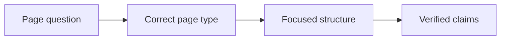
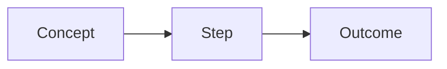

# Documentation Guide

## Overview

Write documentation for engineers building on Mississippi, not marketing copy for a product launch.

These rules apply to new and updated public docs under `docs/Docusaurus/docs/`, and they establish the authoring model that the rest of the documentation set will migrate toward over time.

## Mission

- Optimize for correctness, clarity, navigability, and maintainability.
- Treat source code, tests, verified samples, design docs, and runtime evidence as the only valid basis for technical claims.
- Prefer precise explanation over promotional tone.

## Non-Negotiable Truth Rules

- Do not invent APIs, configuration keys, defaults, guarantees, limits, exception types, or behavior.
- Do not assume Orleans behavior unless Mississippi source, tests, or verified docs prove the claim.
- If a claim cannot be verified from source code, tests, verified samples, ADRs, design docs, or runtime evidence, do not state it as fact.
- If sources conflict, reconcile them before publishing; if they cannot be reconciled, remove or narrow the claim.
- Distinguish guaranteed behavior, default behavior, typical behavior, implementation detail, unsupported behavior, and future intent.

## Choose The Page Type First

Every documentation page must answer one primary question and use one page type only.

| Page Type | Use It For | Do Not Turn It Into |
|-----------|------------|---------------------|
| `getting-started` | First successful outcome for a new user | A long tutorial or production guide |
| `tutorials` | Guided learning from start to finish | A reference dump |
| `how-to` | Fast task completion for a competent user | A beginner walkthrough |
| `concepts` | Mental models, architecture, guarantees, trade-offs | A procedural task guide |
| `reference` | Exact contracts, options, defaults, constraints | A concept essay |
| `operations` | Production guidance, safety, rollout, telemetry | Generic best-practice prose |
| `troubleshooting` | Symptom-driven diagnosis and resolution | A subsystem overview |
| `migration` | Version-to-version change guidance | Release notes |
| `release-notes` | Concise versioned changes and required action | A migration guide |

## Decide Which Page Type You Need

Use this decision matrix before writing.

| If the reader needs to... | Use this page type | Start here |
|---------------------------|--------------------|------------|
| Get to a first working result quickly | `getting-started` | [Getting-Started Pages](./documentation-getting-started.md) |
| Learn by building something end to end | `tutorials` | [Tutorial Pages](./documentation-tutorials.md) |
| Complete a specific task reliably | `how-to` | [How-To Guides](./documentation-how-to.md) |
| Understand how Mississippi works and what it guarantees | `concepts` | [Concept Pages](./documentation-concepts.md) |
| Look up exact contracts or configuration | `reference` | [Reference Pages](./documentation-reference.md) |
| Run Mississippi safely in production | `operations` | [Operations Pages](./documentation-operations.md) |
| Diagnose a specific failure from evidence | `troubleshooting` | [Troubleshooting Pages](./documentation-troubleshooting.md) |
| Upgrade between versions safely | `migration` | [Migration Pages](./documentation-migration.md) |
| See what changed in a release | `release-notes` | [Release Notes](./documentation-release-notes.md) |

## File And Navigation Rules

- Keep the Docusaurus filesystem aligned with the intended sidebar structure where practical.
- Every new public folder should include `_category_.yml`; prefer a generated index for section-level navigation pages.
- Use meaningful stable filenames instead of numbered filenames.
- Use `sidebar_position` for sibling ordering.
- Keep page scope narrow so one page answers one primary question.
- During the current migration, legacy folders may remain feature-oriented, but page type is still mandatory as the writing contract.

## Frontmatter Rules

Every public page must include these fields:

```yaml
---
title: Clear page title
description: One-sentence summary of what this page explains or helps the reader do.
sidebar_position: 10
---
```

Add these when they materially improve navigation or routing:

```yaml
sidebar_label: Short sidebar text
pagination_label: Short previous/next text
slug: /stable/public/url
tags: [controlled, taxonomy]
draft: true
id: stable-doc-id
```

Use `id` when the page needs a stable doc identifier. Existing Mississippi docs already rely on `id` in many places, so the field remains allowed and often useful during migration.

## Docusaurus Authoring Rules

- Use `.md` unless the page genuinely needs MDX components.
- Use relative Markdown links for internal docs links.
- Use tabs only for true parallel variants such as OS, language, or hosting mode.
- Reuse stable `groupId` values when the same tab choice should persist across pages.
- Use admonitions only when the information materially changes user behavior.
- Leave blank lines inside admonitions so formatting tools do not break them.
- Prefer Mermaid source over screenshots for diagrams.

## Mermaid Rules

Introduce every diagram with one sentence that explains what the reader should learn from it.


```mermaid
flowchart LR
    A[Page question] --> B[Correct page type]
    B --> C[Focused structure]
    C --> D[Verified claims]
```

- Use sequence diagrams for request flow, lifecycle, retries, and cross-component interactions.
- Use flowcharts or architecture diagrams for topology, deployment shape, and subsystem relationships.
- Keep diagrams small and focused on one main point.
- Label nodes and arrows with Mississippi terminology, not placeholders.

## Code Example Rules

- Every runnable example must come from an existing verified sample, a newly verified sample, or executable verification tied to tests or builds.
- Include enough surrounding code for reuse and orientation.
- Do not present partial snippets as copy-paste-ready programs.
- If code is intentionally omitted, mark the omission with language comments, not ellipses.
- Introduce each code block with one sentence that explains what it demonstrates.

## Distributed-Systems Checklist

Apply this checklist only when the page describes runtime semantics, lifecycle, persistence, messaging, deployment, or failure behavior.

- activation or lifecycle boundaries
- concurrency or scheduling assumptions
- ordering guarantees and non-guarantees
- retry behavior and timeout behavior
- persistence or durability semantics
- failure handling and recovery implications
- serialization and version compatibility implications
- deployment or cluster assumptions
- diagnostics or telemetry needed to validate behavior
- security constraints
- unsupported or dangerous patterns

## Definition Of Done

A documentation change is not done until all of the following are true:

- the page type is correct
- the page is in the correct folder for the current information architecture
- frontmatter is complete
- internal links resolve
- the Docusaurus site builds successfully
- code examples are verified
- claims about defaults, guarantees, and failure modes are evidenced
- terminology is consistent with the codebase
- the page links to adjacent content
- the page does not overclaim what the framework guarantees

## Migration Stance

Mississippi is in a hybrid transition.

- New or substantially rewritten docs should follow this model immediately.
- Existing feature docs may keep their current physical locations until they are touched.
- Page type is the required content contract even when folder layout still reflects older feature-oriented structure.

## Learn More

- [Concept Pages](./documentation-concepts.md)
- [Getting-Started Pages](./documentation-getting-started.md)
- [Tutorial Pages](./documentation-tutorials.md)
- [How-To Guides](./documentation-how-to.md)
- [Reference Pages](./documentation-reference.md)
- [Operations Pages](./documentation-operations.md)
- [Troubleshooting Pages](./documentation-troubleshooting.md)
- [Migration Pages](./documentation-migration.md)
- [Release Notes](./documentation-release-notes.md)

## Tone and Language

### Purpose and Audience

- Define the reader (developer, architect, administrator, or executive) before writing.
- Write only what enables a decision or action.

### Concise, Factual Language

- Use active voice and present tense.
- Use one idea per sentence.
- Define abbreviations on first use.
- Avoid marketing language and vague qualifiers.

### RFC 2119 Keywords

- Use **MUST**, **SHOULD**, and **MAY** in rules sections only.
- Use **MUST NOT** and **SHOULD NOT** for explicit prohibitions.

## Required Page Structure

Every doc MUST follow this structure in order:

1. **Frontmatter**
2. **H1 title**
3. **Overview** section
4. **Core content sections** (problem/concept → mechanics → usage)
5. **Closing section(s)** (rules below)

### Closing Section Rules

- If the page is a **section entry** (the doc referenced by a folder's `_category_.json` link), it MUST include a **Learn More** section with links to all child pages. Additional utility sections such as **Source Code**, **Changelog**, or **Release Notes** MAY follow **Learn More**.
- Otherwise, the page MUST include **Summary** followed by **Next Steps** as its final core content sections. Optional appendix-style sections such as **References** or **Further Reading** MAY follow.

## Frontmatter (Required)

Frontmatter MUST include all fields shown below and MUST be the first lines in the file.

```yaml
---
id: <kebab-case-doc-id>
title: <Title Case Page Title>
sidebar_label: <Short Sidebar Label>
sidebar_position: <number>
description: <One-sentence summary>
---
```

### Frontmatter Rules

- `id` MUST be kebab-case and stable.
- `title` MUST be concise and human-readable.
- `sidebar_label` MUST be short (1–3 words).
- `sidebar_position` MUST be an integer and MUST be unique within its folder.
- `description` MUST be a single sentence.
- Use kebab-case filenames to match `id`.
- Use `slug` only for section landing pages (example: [../index.md](../index.md)).

## Headings

- Use **one** H1 (`#`) per file.
- Use H2 (`##`) for main sections.
- Use H3 (`###`) only for subsections of a main section.
- Do NOT use H4+ headings.

## Markdown Usage Rules

### Tables

Use tables for enumerations or structured comparisons.

```markdown
| Item | Purpose |
|------|---------|
| **Reducer** | Pure state transition |
| **Effect** | Async side effect |
```

### Code Blocks

- All code blocks MUST declare a language (e.g., `csharp`, `json`, `bash`).
- Keep samples minimal and focused.
- Do NOT include example output unless it is verified from the repo.

### Admonitions

Use Docusaurus admonitions for callouts.

```markdown
:::note
Short, factual note that clarifies a rule.
:::
```

Use `:::warning` for risks or breaking behaviors.

## Mermaid Usage

Mermaid is enabled for this Docusaurus site. Use Mermaid for diagrams instead of images.
([docusaurus.config.ts](https://github.com/Gibbs-Morris/mississippi/blob/main/docs/Docusaurus/docusaurus.config.ts#L17-L21))


```mermaid
flowchart LR
    A[Concept] --> B[Step]
    B --> C[Outcome]
```

### Mermaid Rules

- **MUST** use `flowchart LR` (left-to-right) by default. Why: Documentation may be viewed on mobile screens where vertical (TB) diagrams overflow and require horizontal scrolling.
- **MUST NOT** use `flowchart TB` (top-to-bottom) unless the diagram explicitly represents a vertical hierarchy (e.g., class inheritance, call stacks) where LR would misrepresent the relationship.
- Keep diagrams small (7 nodes or fewer) unless the doc is explicitly about architecture.
- Prefer labels that match section terminology.
- Do NOT embed images for diagrams.

## Links

### Internal Doc Links

- Use relative links between docs (e.g., `./store.md`, `actions.md`).
- Link to the most relevant section, not the top of a long page.

### Source Code Links

- Use absolute GitHub URLs to source code.
- Prefer deep links to specific files; add line ranges when pointing at specific members.
- Use the `/blob/main/` path for source links.

## Evidence Rules (Non-Negotiable)

- Every technical statement MUST be backed by repository evidence.
- If a statement cannot be verified, rewrite it as a question or remove it.
- Do NOT speculate about behavior, defaults, or APIs.

## Tone and Voice

- Use direct, imperative language.
- Avoid hedging words like "might", "could", "maybe", or "typically".
- Prefer short sentences.

## Topic Scope

- One page MUST answer one question or cover one task.
- Split divergent tasks into separate pages and cross-link them.
- Use the `Overview` section to state scope boundaries explicitly.

## Navigation and Information Architecture

- Section entry pages MUST summarize their purpose and list child pages.
- Component pages MUST end with a closing navigation section that links to at least two related pages. Acceptable titles include `Next Steps` and `Related Documentation`; new or updated pages SHOULD standardize on `Next Steps`, while legacy pages MAY retain older patterns until they are revised.

## Feature Documentation Pattern

Feature docs for components with Inlet source generation (sagas, aggregates, UX projections) should follow a consistent branching structure. This pattern teaches concepts first, then guides users to the recommended path while preserving the manual path for understanding or customization.

:::note When to use this pattern
This pattern applies only to features that have **both** source-generated and manual registration options. API reference pages, client-state-management docs, and contributing guides use the standard page structure instead.
:::

### Required Structure

```markdown
# Feature Title

## Overview
What is this feature and why use it.

## Key Concepts
Core abstractions/types explained. Use tables for quick reference.

## Implementation

### Step 1: Define the State/Entity
Type definition with required interfaces.

### Step 2: Define Behavior
Behavior implementations (steps, reducers, effects).

### Step 3: Register

:::tip Registration Options
Mississippi supports two registration paths:
- **Source Generation (Recommended)**: Generators emit registration code.
- **Manual Registration**: Explicit DI calls for understanding or customization.
:::

#### Using Source Generation (Recommended)

Generator attribute and what it produces.

#### Manual Registration

Explicit DI registration calls.

## Summary

## Next Steps
```

### Pattern Rules

- Shared implementation steps should appear before the branching point.
- Source generation (recommended) should appear first in the branch.
- Both paths should result in equivalent runtime behavior.
- A `:::tip Registration Options` callout is expected to introduce the branching point.

### Canonical Example

See [Event Sourcing Sagas](../event-sourcing-sagas.md) for the reference implementation of this pattern.

## Visuals and Examples

- Use Mermaid for process and architecture diagrams.
- Code samples MUST compile in isolation or be copy-safe excerpts.
- Use tables for option matrices and comparative data.

## Maintenance Rules

- Update docs in the same change that modifies behavior or API surface.
- Keep one source of truth; link instead of duplicating content.
- Do NOT add "last updated" or timestamp fields; Git history is the source of truth.

## Writing Checklist

- [ ] Frontmatter is complete and valid.
- [ ] H1, Overview, and required closing sections are present.
- [ ] All code fences declare a language.
- [ ] All technical claims link to repository evidence.
- [ ] Mermaid diagrams are used instead of images.
- [ ] Internal links are relative; source links are absolute.

## Summary

- Follow the exact page structure.
- Use strict Markdown conventions.
- Use Mermaid for diagrams.
- Link to source with absolute GitHub URLs.

## Next Steps

- Review the client-state-management docs for canonical patterns.
- Add new docs only after verifying every technical claim.
