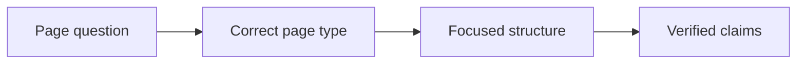

# Documentation Guide

## Overview

Write documentation for engineers building on Mississippi, not marketing copy for a product launch.

These rules apply to public docs under `docs/Docusaurus/docs/` and define the writing contract the rest of the docs set should follow.

## Mission

- optimize for correctness, clarity, navigability, and maintainability
- treat source code, tests, verified samples, design docs, and runtime evidence as the only valid basis for technical claims
- prefer precise explanation over promotional tone

## Non-Negotiable Truth Rules

- Do not invent APIs, configuration keys, defaults, guarantees, limits, exception types, or behavior.
- Do not assume Orleans behavior unless Mississippi evidence proves the claim.
- If a claim cannot be verified from source code, tests, verified samples, design docs, or runtime evidence, do not state it as fact.
- If sources conflict, reconcile them before publishing; if they cannot be reconciled, remove or narrow the claim.
- Distinguish guaranteed behavior, default behavior, typical behavior, implementation detail, unsupported behavior, and future intent.

## Choose The Page Type First

Every documentation page must answer one primary question and use one page type only.

| Page Type | Use It For | Do Not Turn It Into |
|-----------|------------|---------------------|
| `getting-started` | First successful outcome for a new user | A long tutorial or production guide |
| `tutorials` | Guided learning from start to finish | A reference dump |
| `how-to` | Fast task completion for a competent user | A beginner walkthrough |
| `concepts` | Mental models, architecture, guarantees, trade-offs | A procedural task guide |
| `reference` | Exact contracts, options, defaults, constraints | A concept essay |
| `operations` | Production guidance, safety, rollout, telemetry | Generic best-practice prose |
| `troubleshooting` | Symptom-driven diagnosis and resolution | A subsystem overview |
| `migration` | Version-to-version change guidance | Release notes |
| `release-notes` | Concise versioned changes and required action | A migration guide |

## Decide Which Page Type You Need

Use this decision matrix before writing.

| If the reader needs to... | Use this page type | Start here |
|---------------------------|--------------------|------------|
| Get to a first working result quickly | `getting-started` | [Getting-Started Pages](./documentation-getting-started.md) |
| Learn by building something end to end | `tutorials` | [Tutorial Pages](./documentation-tutorials.md) |
| Complete a specific task reliably | `how-to` | [How-To Guides](./documentation-how-to.md) |
| Understand how Mississippi works and what it guarantees | `concepts` | [Concept Pages](./documentation-concepts.md) |
| Look up exact contracts or configuration | `reference` | [Reference Pages](./documentation-reference.md) |
| Run Mississippi safely in production | `operations` | [Operations Pages](./documentation-operations.md) |
| Diagnose a specific failure from evidence | `troubleshooting` | [Troubleshooting Pages](./documentation-troubleshooting.md) |
| Upgrade between versions safely | `migration` | [Migration Pages](./documentation-migration.md) |
| See what changed in a release | `release-notes` | [Release Notes](./documentation-release-notes.md) |

## File And Navigation Rules

- Keep the Docusaurus filesystem aligned with the intended sidebar structure where practical.
- Every new public folder should include `_category_.yml`.
- Use meaningful stable filenames instead of numbered filenames.
- Use `sidebar_position` for sibling ordering.
- Keep page scope narrow so one page answers one primary question.

## Frontmatter Rules

Every public page must include these fields:

```yaml
---
id: <kebab-case-doc-id>
title: <Title Case Page Title>
sidebar_label: <Short Sidebar Label>
sidebar_position: <number>
description: <One-sentence summary>
---
```

Add these only when they materially improve navigation or routing:

```yaml
pagination_label: Short previous/next text
slug: /stable/public/url
tags: [controlled, taxonomy]
draft: true
```

## Required Page Structure

Every doc must follow this structure in order:

1. frontmatter
2. H1 title
3. `## Overview`
4. core content sections for the page type
5. closing section(s)

### Closing Section Rules

- If the page is a section entry page, it must end with `## Learn More`.
- Otherwise, the page must end its core content with `## Summary` followed by `## Next Steps`.
- Use the exact heading casing shown here. Do not substitute `Recap`, `Related content`, or lowercase variants of `Next Steps`.
- Optional appendix sections such as `## References` or `## Source Code` may follow those closing sections.

## Markdown And Docusaurus Rules

- Use `.md` unless the page genuinely needs MDX components.
- Use relative Markdown links for internal docs links.
- Use tabs only for true parallel variants such as OS, language, or hosting mode.
- Use admonitions only when the information materially changes reader behavior.
- All code fences must declare a language.
- Prefer Mermaid source over screenshots for diagrams.

## Mermaid Rules

Introduce every diagram with one sentence that explains what the reader should learn from it.


```mermaid
flowchart LR
    A[Page question] --> B[Correct page type]
    B --> C[Focused structure]
    C --> D[Verified claims]
```

- Use `flowchart LR` by default.
- Keep diagrams small and focused on one main point.
- Use labels that match Mississippi terminology.

## Code Example Rules

- Every runnable example must come from an existing verified sample, a newly verified sample, or executable verification tied to tests or builds.
- Include enough surrounding code for reuse and orientation.
- Do not present partial snippets as copy-paste-ready programs.
- If code is intentionally omitted, mark the omission with language comments, not ellipses.
- Introduce each code block with one sentence that explains what it demonstrates.

## Distributed-Systems Checklist

Apply this checklist only when the page describes runtime semantics, lifecycle, persistence, messaging, deployment, or failure behavior.

- activation or lifecycle boundaries
- concurrency or scheduling assumptions
- ordering guarantees and non-guarantees
- retry behavior and timeout behavior
- persistence or durability semantics
- failure handling and recovery implications
- serialization and version compatibility implications
- deployment or cluster assumptions
- diagnostics or telemetry needed to validate behavior
- security constraints
- unsupported or dangerous patterns

## Definition Of Done

A documentation change is not done until all of the following are true:

- the page type is correct
- the page is in the correct folder for the current information architecture
- frontmatter is complete
- internal links resolve
- the Docusaurus site builds successfully
- code examples are verified
- claims about defaults, guarantees, and failure modes are evidenced
- terminology is consistent with the codebase
- the page links to adjacent content
- the page does not overclaim what the framework guarantees

## Migration Stance

Mississippi is in a hybrid transition.

- New or substantially rewritten docs should follow this model immediately.
- Existing feature docs may keep their current physical locations until they are touched.
- Page type is the required content contract even when folder layout still reflects older feature-oriented structure.

## Tone And Language

- Define the reader before writing.
- Use active voice and present tense.
- Use one idea per sentence.
- Avoid marketing language and vague qualifiers.
- Use RFC 2119 terms only in rules sections.

## Summary

- choose the page type before writing
- keep every technical claim tied to repository evidence
- follow the required structure and closing-section rules
- validate links, examples, and build output before treating a docs change as complete

## Next Steps

- [Concept Pages](./documentation-concepts.md)
- [Getting-Started Pages](./documentation-getting-started.md)
- [Tutorial Pages](./documentation-tutorials.md)
- [How-To Guides](./documentation-how-to.md)
- [Reference Pages](./documentation-reference.md)
- [Operations Pages](./documentation-operations.md)
- [Troubleshooting Pages](./documentation-troubleshooting.md)
- [Migration Pages](./documentation-migration.md)
- [Release Notes](./documentation-release-notes.md)
