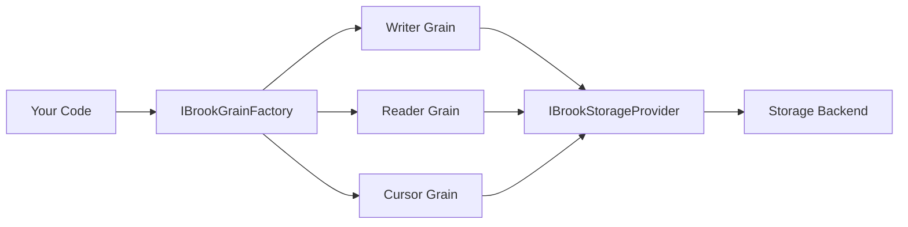

# Brooks

## Overview

Brooks are Mississippi's append-only event stream abstraction. Each brook represents a durable sequence of events for a single entity, identified by a composite key combining a brook name and entity identifier. Aggregates, sagas, and projections use brooks to persist and replay their event history.

This page focuses on **Public API / Developer Experience**.

## Key Concepts

| Concept | Description |
|---------|-------------|
| **Brook** | An append-only sequence of events for a single entity. |
| **BrookKey** | Composite identifier combining a brook name and entity ID. |
| **BrookPosition** | A logical position within a brook (0-based index, -1 means not set). |
| **BrookEvent** | The envelope containing event metadata and binary payload. |

## Architecture



Brooks consist of two packages:

| Package | Purpose |
|---------|---------|
| `Mississippi.EventSourcing.Brooks.Abstractions` | Public contracts and interfaces. |
| `Mississippi.EventSourcing.Brooks` | Orleans grain implementations. |

Storage providers are separate packages (e.g., `Mississippi.EventSourcing.Brooks.Cosmos`). See [Storage Providers](./storage-providers.md) for available implementations.

## Getting Started

### Step 1: Add Package References

```xml
<PackageReference Include="Mississippi.EventSourcing.Brooks" />
<PackageReference Include="Mississippi.EventSourcing.Brooks.Cosmos" />
```

### Step 2: Configure Orleans Silo

```csharp
// Configure Orleans streams (required for event notifications)
siloBuilder.AddMemoryStreams("EventStreams");
siloBuilder.AddMemoryGrainStorage("PubSubStore");

// Register Brooks with the stream provider name
siloBuilder.AddEventSourcing(options =>
{
    options.OrleansStreamProviderName = "EventStreams";
});

// Add a storage provider (Cosmos DB shown here)
services.AddCosmosBrookStorageProvider(
    cosmosConnectionString: configuration["Cosmos:ConnectionString"]!,
    blobStorageConnectionString: configuration["BlobStorage:ConnectionString"]!);
```

### Step 3: Define a Brook Name

Apply `[BrookName]` to your aggregate or projection type:

```csharp
[BrookName("MYAPP", "ORDERS", "ORDER")]
public sealed class OrderAggregateGrain : AggregateGrainBase<OrderState>
{
    // Implementation
}
```

The attribute enforces uppercase alphanumeric segments: `{AppName}.{ModuleName}.{Name}`.

### Step 4: Use the Grain Factory

Inject `IBrookGrainFactory` to access brook grains:

```csharp
public class OrderService
{
    private IBrookGrainFactory BrookFactory { get; }

    public OrderService(IBrookGrainFactory brookFactory)
    {
        BrookFactory = brookFactory;
    }

    public async Task<IReadOnlyList<BrookEvent>> ReadOrderHistory(string orderId)
    {
        BrookKey key = BrookKey.ForGrain<OrderAggregateGrain>(orderId);
        IBrookReaderGrain reader = BrookFactory.GetBrookReaderGrain(key);
        return await reader.ReadEventsBatchAsync();
    }
}
```

## Learn More

- [Brook Keys](./brook-keys.md) - Composite key structure and naming conventions.
- [Brook Events](./brook-events.md) - Event envelope format and metadata.
- [Reading and Writing](./reading-and-writing.md) - Grain-based stream operations.
- [Storage Providers](./storage-providers.md) - Pluggable persistence backends.
