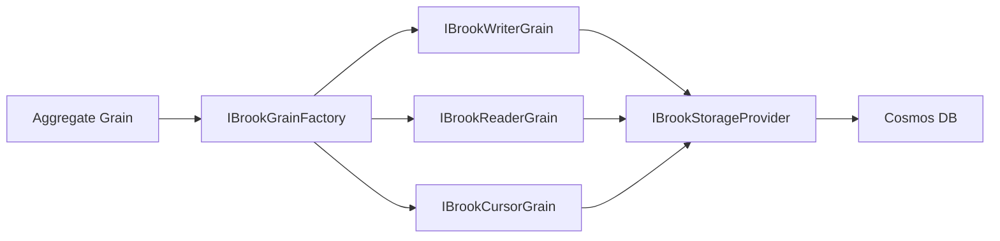

# Brooks Event Streams

## Overview

Brooks are Mississippi's append-only event stream abstraction. Each brook represents a durable sequence of events for a specific entity, identified by a composite key containing a brook name and entity identifier. Aggregates, sagas, and projections use brooks to persist and read their event history.

This page focuses on **Public API / Developer Experience** for consumers building on Mississippi's event sourcing capabilities.

## Key Concepts

| Concept | Description |
|---------|-------------|
| **Brook** | An append-only sequence of events for a single entity. |
| **BrookKey** | Composite identifier combining a brook name and entity ID. |
| **BrookPosition** | A logical position within a brook (0-based index). |
| **BrookEvent** | The envelope containing event metadata and binary payload. |
| **Cursor** | The current position (latest event index) of a brook. |

## Architecture



## Package Structure

Brooks span three NuGet packages with distinct responsibilities:

| Package | Purpose |
|---------|---------|
| `Mississippi.EventSourcing.Brooks.Abstractions` | Public contracts, interfaces, and types consumers depend on. |
| `Mississippi.EventSourcing.Brooks` | Orleans grain implementations and service registrations. |
| `Mississippi.EventSourcing.Brooks.Cosmos` | Cosmos DB storage provider implementation. |

([EventSourcing.Brooks.Abstractions](https://github.com/Gibbs-Morris/mississippi/tree/main/src/EventSourcing.Brooks.Abstractions), [EventSourcing.Brooks](https://github.com/Gibbs-Morris/mississippi/tree/main/src/EventSourcing.Brooks), [EventSourcing.Brooks.Cosmos](https://github.com/Gibbs-Morris/mississippi/tree/main/src/EventSourcing.Brooks.Cosmos))

## Getting Started

### Step 1: Add Package References

Add the Brooks packages to your Orleans silo project:

```xml
<PackageReference Include="Mississippi.EventSourcing.Brooks" />
<PackageReference Include="Mississippi.EventSourcing.Brooks.Cosmos" />
```

### Step 2: Configure the Silo

Register Brooks and the Cosmos storage provider in your silo builder:

```csharp
siloBuilder.AddEventSourcing(options =>
{
    options.OrleansStreamProviderName = "EventStreams";
});

services.AddCosmosBrookStorageProvider(
    cosmosConnectionString: configuration["Cosmos:ConnectionString"]!,
    blobStorageConnectionString: configuration["BlobStorage:ConnectionString"]!,
    configureOptions: options =>
    {
        options.DatabaseId = "myapp-events";
        options.ContainerId = "brooks";
    });

// Required: configure Orleans streams
siloBuilder.AddMemoryStreams("EventStreams");
siloBuilder.AddMemoryGrainStorage("PubSubStore");
```

### Step 3: Define a Brook Name

Apply the `[BrookName]` attribute to your aggregate or projection:

```csharp
[BrookName("MYAPP", "ORDERS", "ORDER")]
public sealed class OrderAggregateGrain : GenericAggregateGrain<OrderState>
{
    // Your aggregate implementation
}
```

### Step 4: Read and Write Events

Use `IBrookGrainFactory` to access brook grains:

```csharp
public class OrderService
{
    private IBrookGrainFactory BrookFactory { get; }

    public OrderService(IBrookGrainFactory brookFactory)
    {
        BrookFactory = brookFactory;
    }

    public async Task<BrookPosition> AppendOrderEvent(string orderId, BrookEvent evt)
    {
        BrookKey key = BrookKey.ForGrain<OrderAggregateGrain>(orderId);
        IBrookWriterGrain writer = BrookFactory.GetBrookWriterGrain(key);
        return await writer.AppendEventsAsync(ImmutableArray.Create(evt));
    }

    public async IAsyncEnumerable<BrookEvent> ReadOrderEvents(string orderId)
    {
        BrookKey key = BrookKey.ForGrain<OrderAggregateGrain>(orderId);
        IBrookAsyncReaderGrain reader = BrookFactory.GetBrookAsyncReaderGrain(key);
        await foreach (BrookEvent evt in reader.ReadEventsAsync())
        {
            yield return evt;
        }
    }
}
```

## Learn More

- [Brook Keys](./brook-keys.md) - Understand the composite key structure.
- [Brook Events](./brook-events.md) - Event envelope format and metadata.
- [Reading and Writing](./reading-and-writing.md) - Grain-based stream operations.
- [Storage Providers](./storage-providers.md) - Pluggable persistence backends.
