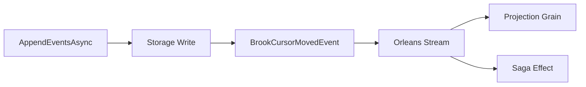

# Reading and Writing

## Overview

Mississippi provides Orleans grain interfaces for brook operations. Writer grains append events atomically, reader grains retrieve events in batches or streams, and cursor grains track the latest position. Access these grains through `IBrookGrainFactory`.

This page focuses on **Public API / Developer Experience**.

## Grain Types

| Grain | Purpose |
|-------|---------|
| [`IBrookWriterGrain`][writerinterface] | Appends events with optimistic concurrency. |
| [`IBrookReaderGrain`][readerinterface] | Reads events as batches (stateless worker). |
| [`IBrookAsyncReaderGrain`][asyncreaderinterface] | Reads events as `IAsyncEnumerable` (single-use). |
| [`IBrookCursorGrain`][cursorinterface] | Returns the current brook position. |

## IBrookGrainFactory

Inject [`IBrookGrainFactory`][factoryinterface] to resolve grain references:

```csharp
public interface IBrookGrainFactory
{
    IBrookWriterGrain GetBrookWriterGrain(BrookKey brookKey);
    IBrookReaderGrain GetBrookReaderGrain(BrookKey brookKey);
    IBrookAsyncReaderGrain GetBrookAsyncReaderGrain(BrookKey brookKey);
    IBrookCursorGrain GetBrookCursorGrain(BrookKey brookKey);
}
```

## Writing Events

### Appending Events

```csharp
IBrookGrainFactory factory = serviceProvider.GetRequiredService<IBrookGrainFactory>();
BrookKey key = BrookKey.ForGrain<OrderAggregateGrain>("order-123");

IBrookWriterGrain writer = factory.GetBrookWriterGrain(key);

ImmutableArray<BrookEvent> events = ImmutableArray.Create(
    new BrookEvent
    {
        Id = Guid.NewGuid().ToString(),
        EventType = "OrderPlaced",
        Source = key.BrookName,
        Time = DateTimeOffset.UtcNow,
        DataContentType = "application/json",
        Data = payload.ToImmutableArray(),
        DataSizeBytes = payload.Length
    });

BrookPosition newPosition = await writer.AppendEventsAsync(events);
```

### Optimistic Concurrency

Pass an expected position for concurrency control:

```csharp
BrookPosition newPosition = await writer.AppendEventsAsync(
    events,
    expectedCursorPosition: new BrookPosition(5));
```

If the actual position differs, the storage provider throws `OptimisticConcurrencyException`.

### Cursor Moved Events

After a successful append, the writer grain publishes a [`BrookCursorMovedEvent`][cursormovedevent] to an Orleans stream. Downstream consumers (projections, sagas, effects) subscribe to these events for real-time updates.



## Reading Events

### Batch Reads

`IBrookReaderGrain` is a stateless worker for parallel batch reads:

```csharp
IBrookReaderGrain reader = factory.GetBrookReaderGrain(key);

// Read specific range
ImmutableArray<BrookEvent> events = await reader.ReadEventsBatchAsync(
    readFrom: new BrookPosition(0),
    readTo: new BrookPosition(99));

// Read all events
ImmutableArray<BrookEvent> allEvents = await reader.ReadEventsBatchAsync();
```

### Streaming Reads

`IBrookAsyncReaderGrain` provides `IAsyncEnumerable` for memory-efficient streaming:

```csharp
IBrookAsyncReaderGrain asyncReader = factory.GetBrookAsyncReaderGrain(key);

await foreach (BrookEvent evt in asyncReader.ReadEventsAsync())
{
    // Process each event without loading all into memory
}
```

:::note Single-Use Semantics
Each call to `GetBrookAsyncReaderGrain` returns a unique grain instance with a random suffix in its key. The grain deactivates after enumeration completes.
:::

## Cursor Operations

Query the latest position without reading events:

```csharp
IBrookCursorGrain cursor = factory.GetBrookCursorGrain(key);

// Cached read (fast)
BrookPosition position = await cursor.GetLatestPositionAsync();

// Storage read (strongly consistent)
BrookPosition confirmed = await cursor.GetLatestPositionConfirmedAsync();
```

Use `GetLatestPositionConfirmedAsync` when you need strong consistency guarantees.

## Registration

### Silo Registration

```csharp
siloBuilder.AddEventSourcing(options =>
{
    options.OrleansStreamProviderName = "MyStreams";
});
```

The host must configure streams separately:

```csharp
siloBuilder.AddMemoryStreams("MyStreams");
siloBuilder.AddMemoryGrainStorage("PubSubStore");
```

### Service Registration

For non-Orleans hosts, register services directly:

```csharp
services.AddEventSourcingByService();
```

## Summary

Brook grains provide a clean abstraction over event stream operations. Writers append events atomically and publish cursor updates. Readers support both batch and streaming access patterns. The factory pattern keeps grain resolution consistent and testable.

## Next Steps

- [Storage Providers](./storage-providers.md) - Configure persistence backends.
- [Brooks](./brooks.md) - Return to the overview.

[writerinterface]: https://github.com/Gibbs-Morris/mississippi/blob/main/src/EventSourcing.Brooks.Abstractions/Writer/IBrookWriterGrain.cs
[readerinterface]: https://github.com/Gibbs-Morris/mississippi/blob/main/src/EventSourcing.Brooks.Abstractions/Reader/IBrookReaderGrain.cs
[asyncreaderinterface]: https://github.com/Gibbs-Morris/mississippi/blob/main/src/EventSourcing.Brooks.Abstractions/Reader/IBrookAsyncReaderGrain.cs
[cursorinterface]: https://github.com/Gibbs-Morris/mississippi/blob/main/src/EventSourcing.Brooks.Abstractions/Cursor/IBrookCursorGrain.cs
[factoryinterface]: https://github.com/Gibbs-Morris/mississippi/blob/main/src/EventSourcing.Brooks.Abstractions/Factory/IBrookGrainFactory.cs
[cursormovedevent]: https://github.com/Gibbs-Morris/mississippi/blob/main/src/EventSourcing.Brooks.Abstractions/Streaming/BrookCursorMovedEvent.cs
