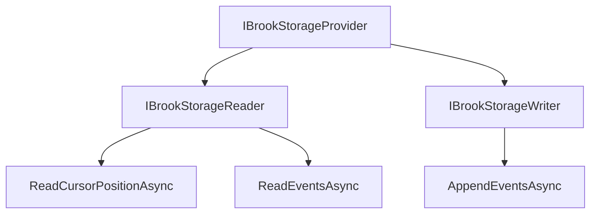
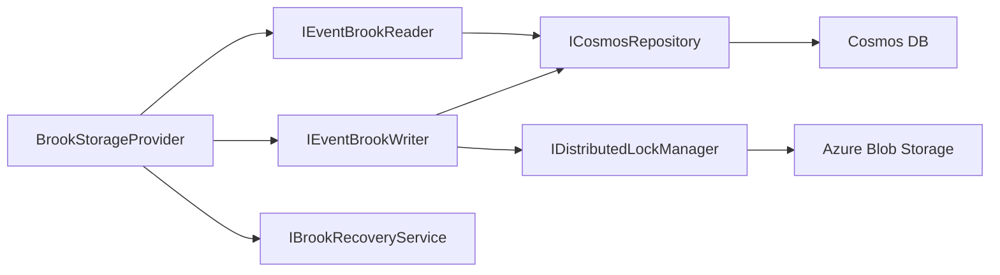

# Brook Storage Providers

## Overview

Brook storage providers implement the persistence layer for event streams. Mississippi defines a storage abstraction that separates grain logic from the underlying database. The default implementation uses Azure Cosmos DB, but the architecture supports custom providers.

This page focuses on **Public API / Developer Experience** for configuring and extending storage providers.

## Storage Abstraction

| Interface | Purpose |
|-----------|---------|
| [`IBrookStorageProvider`](https://github.com/Gibbs-Morris/mississippi/blob/main/src/EventSourcing.Brooks.Abstractions/Storage/IBrookStorageProvider.cs) | Combined read/write access with format identifier. |
| [`IBrookStorageReader`](https://github.com/Gibbs-Morris/mississippi/blob/main/src/EventSourcing.Brooks.Abstractions/Storage/IBrookStorageReader.cs) | Read cursor position and stream events. |
| [`IBrookStorageWriter`](https://github.com/Gibbs-Morris/mississippi/blob/main/src/EventSourcing.Brooks.Abstractions/Storage/IBrookStorageWriter.cs) | Append events with optimistic concurrency. |



## IBrookStorageReader

The reader interface provides two operations:

```csharp
public interface IBrookStorageReader
{
    Task<BrookPosition> ReadCursorPositionAsync(
        BrookKey brookId,
        CancellationToken cancellationToken = default);

    IAsyncEnumerable<BrookEvent> ReadEventsAsync(
        BrookRangeKey brookRange,
        CancellationToken cancellationToken = default);
}
```

([IBrookStorageReader source](https://github.com/Gibbs-Morris/mississippi/blob/main/src/EventSourcing.Brooks.Abstractions/Storage/IBrookStorageReader.cs))

## IBrookStorageWriter

The writer interface handles atomic appends:

```csharp
public interface IBrookStorageWriter
{
    Task<BrookPosition> AppendEventsAsync(
        BrookKey brookId,
        IReadOnlyList<BrookEvent> events,
        BrookPosition? expectedVersion = null,
        CancellationToken cancellationToken = default);
}
```

([IBrookStorageWriter source](https://github.com/Gibbs-Morris/mississippi/blob/main/src/EventSourcing.Brooks.Abstractions/Storage/IBrookStorageWriter.cs))

## Cosmos DB Provider

Mississippi includes a production-ready Cosmos DB provider in the `EventSourcing.Brooks.Cosmos` package.

### Registration

```csharp
services.AddCosmosBrookStorageProvider(
    cosmosConnectionString: "AccountEndpoint=...",
    blobStorageConnectionString: "DefaultEndpointsProtocol=...",
    configureOptions: options =>
    {
        options.DatabaseId = "myapp-events";
        options.ContainerId = "brooks";
    });
```

([BrookStorageProviderRegistrations source](https://github.com/Gibbs-Morris/mississippi/blob/main/src/EventSourcing.Brooks.Cosmos/BrookStorageProviderRegistrations.cs))

### Configuration Options

| Option | Default | Description |
|--------|---------|-------------|
| `DatabaseId` | `MississippiDefaults.DatabaseId` | Cosmos DB database identifier. |
| `ContainerId` | `MississippiDefaults.ContainerIds.Brooks` | Container for event storage. |
| `CosmosClientServiceKey` | `MississippiDefaults.ServiceKeys.CosmosBrooksClient` | Keyed service key for `CosmosClient`. |
| `LockContainerName` | `MississippiDefaults.ContainerIds.Locks` | Blob container for distributed locking. |
| `LeaseDurationSeconds` | `60` | Distributed lock lease duration. |
| `MaxEventsPerBatch` | (configurable) | Maximum events per batch operation. |

([BrookStorageOptions source](https://github.com/Gibbs-Morris/mississippi/blob/main/src/EventSourcing.Brooks.Cosmos/BrookStorageOptions.cs))

### Architecture

The Cosmos provider uses several internal components:

| Component | Purpose |
|-----------|---------|
| `IEventBrookReader` | Reads events from Cosmos containers. |
| `IEventBrookWriter` | Writes events with batching optimization. |
| `IBrookRecoveryService` | Manages cursor position recovery. |
| `IDistributedLockManager` | Coordinates concurrent writes via blob leases. |
| `ICosmosRepository` | Low-level Cosmos operations. |



### Container Initialization

The provider includes a hosted service that creates the Cosmos container on startup:

```csharp
services.AddHostedService<CosmosContainerInitializer>();
```

This ensures the required container exists before the application accepts requests.

## Custom Providers

To implement a custom storage provider:

1. Implement `IBrookStorageProvider` (or both `IBrookStorageReader` and `IBrookStorageWriter`).
2. Register your implementation in the DI container.
3. Use the registration helper to expose both reader and writer interfaces.

```csharp
public class SqlBrookStorageProvider : IBrookStorageProvider
{
    public string Format => "sql-server";

    public Task<BrookPosition> AppendEventsAsync(
        BrookKey brookId,
        IReadOnlyList<BrookEvent> events,
        BrookPosition? expectedVersion = null,
        CancellationToken cancellationToken = default)
    {
        // SQL Server implementation
    }

    public Task<BrookPosition> ReadCursorPositionAsync(
        BrookKey brookId,
        CancellationToken cancellationToken = default)
    {
        // SQL Server implementation
    }

    public IAsyncEnumerable<BrookEvent> ReadEventsAsync(
        BrookRangeKey brookRange,
        CancellationToken cancellationToken = default)
    {
        // SQL Server implementation
    }
}
```

Register using the helper extension:

```csharp
services.RegisterBrookStorageProvider<SqlBrookStorageProvider>();
```

([BrookStorageProviderExtensions source](https://github.com/Gibbs-Morris/mississippi/blob/main/src/EventSourcing.Brooks.Abstractions/Storage/BrookStorageProviderExtensions.cs))

## Optimistic Concurrency

Storage providers enforce optimistic concurrency when `expectedVersion` is provided. If the actual cursor position differs from the expected value, the provider throws `OptimisticConcurrencyException`.

```csharp
try
{
    await provider.AppendEventsAsync(
        brookId,
        events,
        expectedVersion: new BrookPosition(5));
}
catch (OptimisticConcurrencyException ex)
{
    // Handle conflict: reload state and retry
}
```

([OptimisticConcurrencyException source](https://github.com/Gibbs-Morris/mississippi/blob/main/src/EventSourcing.Brooks.Cosmos/OptimisticConcurrencyException.cs))

## Summary

Storage providers separate persistence concerns from grain logic. The Cosmos DB provider handles production workloads with batching, distributed locking, and automatic container initialization. Custom providers can target alternative databases by implementing the storage interfaces.

## Next Steps

- [Brooks](./brooks.md) - Return to the overview.
- [Brook Keys](./brook-keys.md) - Understand key structure.
