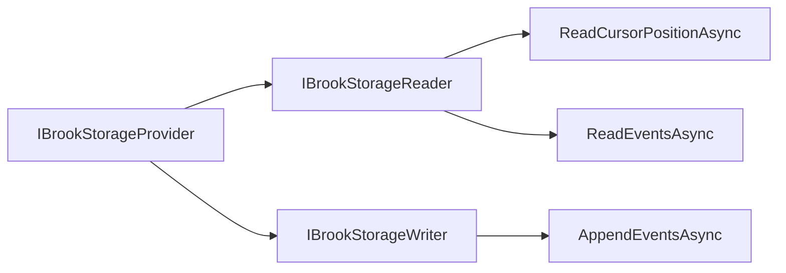

# Storage Providers

## Overview

Brook storage providers implement the persistence layer for event streams. Mississippi defines a storage abstraction that separates grain logic from the underlying database. The Cosmos DB provider ships as a reference implementation, but the architecture supports custom providers for other databases.

This page focuses on **Public API / Developer Experience** for configuring and extending storage providers.

## Storage Abstraction

| Interface | Purpose |
|-----------|---------|
| [`IBrookStorageProvider`][storageprovider] | Combined read/write access with format identifier. |
| [`IBrookStorageReader`][storagereader] | Read cursor position and stream events. |
| [`IBrookStorageWriter`][storagewriter] | Append events with optimistic concurrency. |



### IBrookStorageReader

```csharp
public interface IBrookStorageReader
{
    Task<BrookPosition> ReadCursorPositionAsync(
        BrookKey brookId,
        CancellationToken cancellationToken = default);

    IAsyncEnumerable<BrookEvent> ReadEventsAsync(
        BrookRangeKey brookRange,
        CancellationToken cancellationToken = default);
}
```

### IBrookStorageWriter

```csharp
public interface IBrookStorageWriter
{
    Task<BrookPosition> AppendEventsAsync(
        BrookKey brookId,
        IReadOnlyList<BrookEvent> events,
        BrookPosition? expectedVersion = null,
        CancellationToken cancellationToken = default);
}
```

### IBrookStorageProvider

Combines both interfaces and adds a format identifier:

```csharp
public interface IBrookStorageProvider : IBrookStorageReader, IBrookStorageWriter
{
    string Format { get; }
}
```

The `Format` property (e.g., `"cosmos"`, `"sql"`) enables the system to route operations to the appropriate storage implementation.

## Available Providers

| Package | Database | Status |
|---------|----------|--------|
| `Mississippi.EventSourcing.Brooks.Cosmos` | Azure Cosmos DB | Production-ready |

## Custom Providers

To implement a custom storage provider:

1. Implement `IBrookStorageProvider` (or both reader and writer interfaces).
2. Register your implementation in DI.
3. Use the registration helper to expose both reader and writer interfaces.

```csharp
public class SqlBrookStorageProvider : IBrookStorageProvider
{
    public string Format => "sql-server";

    public Task<BrookPosition> AppendEventsAsync(
        BrookKey brookId,
        IReadOnlyList<BrookEvent> events,
        BrookPosition? expectedVersion = null,
        CancellationToken cancellationToken = default)
    {
        // SQL Server implementation
    }

    public Task<BrookPosition> ReadCursorPositionAsync(
        BrookKey brookId,
        CancellationToken cancellationToken = default)
    {
        // SQL Server implementation
    }

    public IAsyncEnumerable<BrookEvent> ReadEventsAsync(
        BrookRangeKey brookRange,
        CancellationToken cancellationToken = default)
    {
        // SQL Server implementation
    }
}
```

Register using the helper extension:

```csharp
services.RegisterBrookStorageProvider<SqlBrookStorageProvider>();
```

## Optimistic Concurrency

Storage providers enforce optimistic concurrency when `expectedVersion` is provided:

```csharp
try
{
    await provider.AppendEventsAsync(
        brookId,
        events,
        expectedVersion: new BrookPosition(5));
}
catch (OptimisticConcurrencyException)
{
    // Handle conflict: reload state and retry
}
```

## Summary

Storage providers separate persistence concerns from grain logic. The abstraction enables multiple database implementations while keeping the grain layer unchanged. Implement `IBrookStorageProvider` to add support for your preferred database.

## Next Steps

- [Cosmos DB Provider](./cosmos-provider.md) - Configure the production Cosmos DB implementation.
- [Brooks](./brooks.md) - Return to the overview.

[storageprovider]: https://github.com/Gibbs-Morris/mississippi/blob/main/src/EventSourcing.Brooks.Abstractions/Storage/IBrookStorageProvider.cs
[storagereader]: https://github.com/Gibbs-Morris/mississippi/blob/main/src/EventSourcing.Brooks.Abstractions/Storage/IBrookStorageReader.cs
[storagewriter]: https://github.com/Gibbs-Morris/mississippi/blob/main/src/EventSourcing.Brooks.Abstractions/Storage/IBrookStorageWriter.cs
