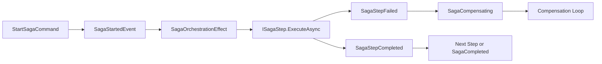

# Event Sourcing Sagas

## Overview

Mississippi saga orchestration coordinates long-running workflows using event-sourced state, ordered steps, and optional compensation. Sagas execute steps in sequence, emit lifecycle events, and roll back via compensation when a step fails.

## Key Concepts

| Concept | Description |
|---------|-------------|
| **Saga State** | A record implementing `ISagaState` that tracks saga phase, step progress, and optional input. |
| **Saga Step** | A class implementing `ISagaStep<TSaga>` that executes one unit of work and returns `StepResult`. |
| **Compensation** | Optional rollback logic via `ICompensatable<TSaga>`, returning `CompensationResult`. |
| **Orchestration Effect** | The effect that reacts to saga events and drives step execution or compensation. |

([ISagaState](https://github.com/Gibbs-Morris/mississippi/blob/main/src/EventSourcing.Sagas.Abstractions/ISagaState.cs), [ISagaStep](https://github.com/Gibbs-Morris/mississippi/blob/main/src/EventSourcing.Sagas.Abstractions/ISagaStep.cs), [SagaOrchestrationEffect](https://github.com/Gibbs-Morris/mississippi/blob/main/src/EventSourcing.Sagas/SagaOrchestrationEffect.cs))

### Orchestration Flow



## Implementation

### Step 1: Define the Saga State

Saga infrastructure reducers set values via reflection, so the saga state must have:

- A parameterless constructor (created with `Activator.CreateInstance`). ([SagaStateMutator](https://github.com/Gibbs-Morris/mississippi/blob/main/src/EventSourcing.Sagas/SagaStateMutator.cs))
- Public, writable properties for `ISagaState` members (`SagaId`, `Phase`, `LastCompletedStepIndex`, `CorrelationId`, `StartedAt`, `StepHash`). ([SagaStatePropertyMap](https://github.com/Gibbs-Morris/mississippi/blob/main/src/EventSourcing.Sagas/SagaStatePropertyMap.cs))
- An optional `Input` property if you want the start payload captured. ([SagaInputProvidedReducer](https://github.com/Gibbs-Morris/mississippi/blob/main/src/EventSourcing.Sagas/SagaInputProvidedReducer.cs))

```csharp
public sealed record TransferSagaState : ISagaState
{
    public string? CorrelationId { get; init; }
    public int LastCompletedStepIndex { get; init; } = -1;
    public SagaPhase Phase { get; init; }
    public Guid SagaId { get; init; }
    public DateTimeOffset? StartedAt { get; init; }
    public string? StepHash { get; init; }

    // Optional: capture the start command payload
    public TransferInput? Input { get; init; }
}
```

### Step 2: Define Saga Steps

Each step implements `ISagaStep<TSaga>` and is marked with `[SagaStep<TSaga>(order)]`. Steps that support rollback also implement `ICompensatable<TSaga>`.

```csharp
[SagaStep<TransferSagaState>(0)]
internal sealed class ValidateTransferStep : ISagaStep<TransferSagaState>
{
    public Task<StepResult> ExecuteAsync(TransferSagaState state, CancellationToken cancellationToken) =>
        Task.FromResult(StepResult.Succeeded());
}

[SagaStep<TransferSagaState>(1)]
internal sealed class ReserveFundsStep
    : ISagaStep<TransferSagaState>,
      ICompensatable<TransferSagaState>
{
    public Task<StepResult> ExecuteAsync(TransferSagaState state, CancellationToken cancellationToken) =>
        Task.FromResult(StepResult.Succeeded());

    public Task<CompensationResult> CompensateAsync(TransferSagaState state, CancellationToken cancellationToken) =>
        Task.FromResult(CompensationResult.Succeeded());
}
```

([ISagaStep](https://github.com/Gibbs-Morris/mississippi/blob/main/src/EventSourcing.Sagas.Abstractions/ISagaStep.cs), [StepResult](https://github.com/Gibbs-Morris/mississippi/blob/main/src/EventSourcing.Sagas.Abstractions/StepResult.cs), [ICompensatable](https://github.com/Gibbs-Morris/mississippi/blob/main/src/EventSourcing.Sagas.Abstractions/ICompensatable.cs))

### Step 3: Register the Saga

:::tip Registration Options
Mississippi supports two registration paths:

- **Source Generation (Recommended)**: Apply `[GenerateSagaEndpoints]` and let generators emit all registration code.
- **Manual Registration**: Call `AddSagaOrchestration` and `AddSagaStepInfo` explicitly for full control.
:::

#### Using Source Generation (Recommended)

Apply `[GenerateSagaEndpoints]` to your saga state. The silo generator emits an `Add{SagaName}Saga` method that registers orchestration, steps, and step metadata.

```csharp
[GenerateSagaEndpoints(
    InputType = typeof(StartTransferCommand),
    RoutePrefix = "transfer",
    FeatureKey = "transfer")]
public sealed record TransferSagaState : ISagaState
{
    // ... properties
}
```

The generated registration is called automatically when you use `AddInletSilo()`:

```csharp
// In your silo configuration
services.AddInletSilo();
```

([GenerateSagaEndpointsAttribute](https://github.com/Gibbs-Morris/mississippi/blob/main/src/Inlet.Generators.Abstractions/GenerateSagaEndpointsAttribute.cs), [SagaSiloRegistrationGenerator](https://github.com/Gibbs-Morris/mississippi/blob/main/src/Inlet.Silo.Generators/SagaSiloRegistrationGenerator.cs))

If you want a projection that tracks saga status, mark it with `[GenerateSagaStatusReducers]`:

```csharp
[GenerateSagaStatusReducers(typeof(TransferSagaState))]
public sealed record TransferSagaStatusProjection { /* ... */ }
```

([GenerateSagaStatusReducersAttribute](https://github.com/Gibbs-Morris/mississippi/blob/main/src/Inlet.Generators.Abstractions/GenerateSagaStatusReducersAttribute.cs))

#### Manual Registration

For full control or when not using Inlet generators, register explicitly:

```csharp
// Register orchestration (command handler, reducers, events, effect)
services.AddSagaOrchestration<TransferSagaState, TransferInput>();

// Register step implementations
services.AddTransient<ValidateTransferStep>();
services.AddTransient<ReserveFundsStep>();

// Register step metadata for the orchestration effect
services.AddSagaStepInfo<TransferSagaState>(new[]
{
    new SagaStepInfo(0, nameof(ValidateTransferStep), typeof(ValidateTransferStep), hasCompensation: false),
    new SagaStepInfo(1, nameof(ReserveFundsStep), typeof(ReserveFundsStep), hasCompensation: true),
});
```

([AddSagaOrchestration](https://github.com/Gibbs-Morris/mississippi/blob/main/src/EventSourcing.Sagas/SagaRegistrations.cs), [AddSagaStepInfo](https://github.com/Gibbs-Morris/mississippi/blob/main/src/EventSourcing.Sagas.Abstractions/SagaStepInfoRegistrations.cs))

## Learn More

- [Saga Public APIs](./public-apis.md) - Contracts, events, and registration helpers.
