# Aqueduct.Grains Classes

Class diagram for the Aqueduct.Grains project.

**Types:** 15 | **Relationships:** 3

```mermaid
classDiagram
    class AqueductGrainFactory
    class AqueductGrainFactoryLoggerExtensions
    class AqueductGrainsRegistrations
    class AqueductMetrics
    class AqueductSiloOptions
    class SignalRClientGrain
    class SignalRClientGrainLoggerExtensions
    class SignalRClientState {
        <<record>>
    }
    class SignalRGroupGrain
    class SignalRGroupGrainLoggerExtensions
    class SignalRGroupState {
        <<record>>
    }
    class SignalRServerDirectoryGrain
    class SignalRServerDirectoryGrainLoggerExtensions
    class SignalRServerDirectoryState {
        <<record>>
    }
    class SignalRServerInfo {
        <<record>>
    }

    SignalRClientState *-- SignalRClientGrain
    SignalRGroupState *-- SignalRGroupGrain
    SignalRServerDirectoryState *-- SignalRServerDirectoryGrain
```

## Type List

| Type | Kind | Namespace |
|------|------|-----------|
| AqueductGrainFactory | class | Mississippi.Aqueduct.Grains |
| AqueductGrainFactoryLoggerExtensions | class | Mississippi.Aqueduct.Grains |
| AqueductGrainsRegistrations | class | Mississippi.Aqueduct.Grains |
| AqueductMetrics | class | Mississippi.Aqueduct.Grains.Diagnostics |
| AqueductSiloOptions | class | Mississippi.Aqueduct.Grains |
| SignalRClientGrain | class | Mississippi.Aqueduct.Grains.Grains |
| SignalRClientGrainLoggerExtensions | class | Mississippi.Aqueduct.Grains.Grains |
| SignalRClientState | record | Mississippi.Aqueduct.Grains.Grains.State |
| SignalRGroupGrain | class | Mississippi.Aqueduct.Grains.Grains |
| SignalRGroupGrainLoggerExtensions | class | Mississippi.Aqueduct.Grains.Grains |
| SignalRGroupState | record | Mississippi.Aqueduct.Grains.Grains.State |
| SignalRServerDirectoryGrain | class | Mississippi.Aqueduct.Grains.Grains |
| SignalRServerDirectoryGrainLoggerExtensions | class | Mississippi.Aqueduct.Grains.Grains |
| SignalRServerDirectoryState | record | Mississippi.Aqueduct.Grains.Grains.State |
| SignalRServerInfo | record | Mississippi.Aqueduct.Grains.Grains.State |
