# Aqueduct Classes

Class diagram for the Aqueduct project.

**Types:** 17 | **Relationships:** 4

```mermaid
classDiagram
    class AqueductGrainFactory
    class AqueductGrainFactoryLoggerExtensions
    class AqueductHubLifetimeManager
    class AqueductHubLifetimeManagerLoggerExtensions
    class AqueductNotifier
    class AqueductNotifierLoggerExtensions
    class AqueductRegistrations
    class ConnectionRegistry
    class HeartbeatManager
    class HeartbeatManagerLoggerExtensions
    class IConnectionRegistry {
        <<interface>>
    }
    class ILocalMessageSender {
        <<interface>>
    }
    class LocalMessageSender
    class LocalMessageSenderLoggerExtensions
    class ServerIdProvider
    class StreamSubscriptionManager
    class StreamSubscriptionManagerLoggerExtensions

    IConnectionRegistry *-- AqueductHubLifetimeManager
    ILocalMessageSender *-- AqueductHubLifetimeManager
    IConnectionRegistry <|.. ConnectionRegistry
    ILocalMessageSender <|.. LocalMessageSender
```

## Type List

| Type | Kind | Namespace |
|------|------|-----------|
| AqueductGrainFactory | class | Mississippi.Aqueduct |
| AqueductGrainFactoryLoggerExtensions | class | Mississippi.Aqueduct |
| AqueductHubLifetimeManager | class | Mississippi.Aqueduct |
| AqueductHubLifetimeManagerLoggerExtensions | class | Mississippi.Aqueduct |
| AqueductNotifier | class | Mississippi.Aqueduct |
| AqueductNotifierLoggerExtensions | class | Mississippi.Aqueduct |
| AqueductRegistrations | class | Mississippi.Aqueduct |
| ConnectionRegistry | class | Mississippi.Aqueduct |
| HeartbeatManager | class | Mississippi.Aqueduct |
| HeartbeatManagerLoggerExtensions | class | Mississippi.Aqueduct |
| IConnectionRegistry | interface | Mississippi.Aqueduct |
| ILocalMessageSender | interface | Mississippi.Aqueduct |
| LocalMessageSender | class | Mississippi.Aqueduct |
| LocalMessageSenderLoggerExtensions | class | Mississippi.Aqueduct |
| ServerIdProvider | class | Mississippi.Aqueduct |
| StreamSubscriptionManager | class | Mississippi.Aqueduct |
| StreamSubscriptionManagerLoggerExtensions | class | Mississippi.Aqueduct |
