# samples Project References

This diagram shows the project reference dependencies in the samples solution.

**Projects:** 76 | **Dependencies:** 162

```mermaid
graph LR
    Aqueduct["Aqueduct"]
    Aqueduct_Abstractions["Aqueduct.Abstractions"]
    Aqueduct_Abstractions_L0Tests["Aqueduct.Abstractions.L0Tests"]
    Aqueduct_Grains["Aqueduct.Grains"]
    Aqueduct_Grains_L0Tests["Aqueduct.Grains.L0Tests"]
    Aqueduct_L0Tests["Aqueduct.L0Tests"]
    Architecture_L0Tests["Architecture.L0Tests"]
    Cascade_AppHost["Cascade.AppHost"]
    Cascade_Client["Cascade.Client"]
    Cascade_Contracts["Cascade.Contracts"]
    Cascade_Domain["Cascade.Domain"]
    Cascade_Domain_L0Tests["Cascade.Domain.L0Tests"]
    Cascade_Grains_Abstractions["Cascade.Grains.Abstractions"]
    Cascade_Server["Cascade.Server"]
    Cascade_Silo["Cascade.Silo"]
    Common_Abstractions["Common.Abstractions"]
    Common_Abstractions_L0Tests["Common.Abstractions.L0Tests"]
    Common_Cosmos["Common.Cosmos"]
    Common_Cosmos_L0Tests["Common.Cosmos.L0Tests"]
    Crescent_AppHost["Crescent.AppHost"]
    Crescent_L2Tests["Crescent.L2Tests"]
    DocumentationGenerator["DocumentationGenerator"]
    DocumentationGenerator_L0Tests["DocumentationGenerator.L0Tests"]
    EventSourcing_Aggregates["EventSourcing.Aggregates"]
    EventSourcing_Aggregates_Abstractions["EventSourcing.Aggregates.Abstractions"]
    EventSourcing_Aggregates_Abstractions_L0Tests["EventSourcing.Aggregates.Abstractions.L0Tests"]
    EventSourcing_Aggregates_Generators["EventSourcing.Aggregates.Generators"]
    EventSourcing_Aggregates_L0Tests["EventSourcing.Aggregates.L0Tests"]
    EventSourcing_Brooks["EventSourcing.Brooks"]
    EventSourcing_Brooks_Abstractions["EventSourcing.Brooks.Abstractions"]
    EventSourcing_Brooks_Abstractions_L0Tests["EventSourcing.Brooks.Abstractions.L0Tests"]
    EventSourcing_Brooks_Cosmos["EventSourcing.Brooks.Cosmos"]
    EventSourcing_Brooks_Cosmos_L0Tests["EventSourcing.Brooks.Cosmos.L0Tests"]
    EventSourcing_Brooks_L0Tests["EventSourcing.Brooks.L0Tests"]
    EventSourcing_Reducers["EventSourcing.Reducers"]
    EventSourcing_Reducers_Abstractions["EventSourcing.Reducers.Abstractions"]
    EventSourcing_Reducers_Abstractions_L0Tests["EventSourcing.Reducers.Abstractions.L0Tests"]
    EventSourcing_Reducers_L0Tests["EventSourcing.Reducers.L0Tests"]
    EventSourcing_Serialization_Abstractions["EventSourcing.Serialization.Abstractions"]
    EventSourcing_Serialization_Json["EventSourcing.Serialization.Json"]
    EventSourcing_Serialization_Json_L0Tests["EventSourcing.Serialization.Json.L0Tests"]
    EventSourcing_Serialization_L0Tests["EventSourcing.Serialization.L0Tests"]
    EventSourcing_Snapshots["EventSourcing.Snapshots"]
    EventSourcing_Snapshots_Abstractions["EventSourcing.Snapshots.Abstractions"]
    EventSourcing_Snapshots_Abstractions_L0Tests["EventSourcing.Snapshots.Abstractions.L0Tests"]
    EventSourcing_Snapshots_Cosmos["EventSourcing.Snapshots.Cosmos"]
    EventSourcing_Snapshots_Cosmos_L0Tests["EventSourcing.Snapshots.Cosmos.L0Tests"]
    EventSourcing_Snapshots_L0Tests["EventSourcing.Snapshots.L0Tests"]
    EventSourcing_UxProjections["EventSourcing.UxProjections"]
    EventSourcing_UxProjections_Abstractions["EventSourcing.UxProjections.Abstractions"]
    EventSourcing_UxProjections_Abstractions_L0Tests["EventSourcing.UxProjections.Abstractions.L0Tests"]
    EventSourcing_UxProjections_Api["EventSourcing.UxProjections.Api"]
    EventSourcing_UxProjections_Api_Generators["EventSourcing.UxProjections.Api.Generators"]
    EventSourcing_UxProjections_Api_Generators_L0Tests["EventSourcing.UxProjections.Api.Generators.L0Tests"]
    EventSourcing_UxProjections_Api_L0Tests["EventSourcing.UxProjections.Api.L0Tests"]
    EventSourcing_UxProjections_L0Tests["EventSourcing.UxProjections.L0Tests"]
    Inlet["Inlet"]
    Inlet_Abstractions["Inlet.Abstractions"]
    Inlet_Abstractions_L0Tests["Inlet.Abstractions.L0Tests"]
    Inlet_Blazor_Server["Inlet.Blazor.Server"]
    Inlet_Blazor_Server_L0Tests["Inlet.Blazor.Server.L0Tests"]
    Inlet_Blazor_WebAssembly["Inlet.Blazor.WebAssembly"]
    Inlet_Blazor_WebAssembly_L0Tests["Inlet.Blazor.WebAssembly.L0Tests"]
    Inlet_L0Tests["Inlet.L0Tests"]
    Inlet_Orleans["Inlet.Orleans"]
    Inlet_Orleans_L0Tests["Inlet.Orleans.L0Tests"]
    Inlet_Orleans_SignalR["Inlet.Orleans.SignalR"]
    Inlet_Orleans_SignalR_L0Tests["Inlet.Orleans.SignalR.L0Tests"]
    Inlet_Projection_Abstractions["Inlet.Projection.Abstractions"]
    Reservoir["Reservoir"]
    Reservoir_Abstractions["Reservoir.Abstractions"]
    Reservoir_Abstractions_L0Tests["Reservoir.Abstractions.L0Tests"]
    Reservoir_Blazor["Reservoir.Blazor"]
    Reservoir_Blazor_L0Tests["Reservoir.Blazor.L0Tests"]
    Reservoir_L0Tests["Reservoir.L0Tests"]
    Testing_Utilities["Testing.Utilities"]

    Aqueduct --> Aqueduct_Abstractions
    Aqueduct_Abstractions --> Common_Abstractions
    Aqueduct_Abstractions_L0Tests --> Aqueduct_Abstractions
    Aqueduct_Grains --> Aqueduct_Abstractions
    Aqueduct_Grains_L0Tests --> Aqueduct_Grains
    Aqueduct_Grains_L0Tests --> Testing_Utilities
    Aqueduct_L0Tests --> Aqueduct
    Aqueduct_L0Tests --> Aqueduct_Grains
    Aqueduct_L0Tests --> Testing_Utilities
    Architecture_L0Tests --> Aqueduct
    Architecture_L0Tests --> Aqueduct_Abstractions
    Architecture_L0Tests --> Aqueduct_Grains
    Architecture_L0Tests --> Common_Abstractions
    Architecture_L0Tests --> Common_Cosmos
    Architecture_L0Tests --> EventSourcing_Aggregates
    Architecture_L0Tests --> EventSourcing_Aggregates_Abstractions
    Architecture_L0Tests --> EventSourcing_Brooks
    Architecture_L0Tests --> EventSourcing_Brooks_Abstractions
    Architecture_L0Tests --> EventSourcing_Brooks_Cosmos
    Architecture_L0Tests --> EventSourcing_Reducers
    Architecture_L0Tests --> EventSourcing_Reducers_Abstractions
    Architecture_L0Tests --> EventSourcing_Serialization_Abstractions
    Architecture_L0Tests --> EventSourcing_Serialization_Json
    Architecture_L0Tests --> EventSourcing_Snapshots
    Architecture_L0Tests --> EventSourcing_Snapshots_Abstractions
    Architecture_L0Tests --> EventSourcing_Snapshots_Cosmos
    Architecture_L0Tests --> EventSourcing_UxProjections
    Architecture_L0Tests --> EventSourcing_UxProjections_Abstractions
    Architecture_L0Tests --> EventSourcing_UxProjections_Api
    Architecture_L0Tests --> Inlet
    Architecture_L0Tests --> Inlet_Abstractions
    Architecture_L0Tests --> Inlet_Blazor_Server
    Architecture_L0Tests --> Inlet_Blazor_WebAssembly
    Architecture_L0Tests --> Inlet_Orleans
    Architecture_L0Tests --> Inlet_Orleans_SignalR
    Architecture_L0Tests --> Reservoir
    Architecture_L0Tests --> Reservoir_Abstractions
    Architecture_L0Tests --> Reservoir_Blazor
    Cascade_AppHost --> Cascade_Server
    Cascade_AppHost --> Cascade_Silo
    Cascade_Client --> Cascade_Contracts
    Cascade_Client --> Inlet
    Cascade_Client --> Inlet_Blazor_WebAssembly
    Cascade_Client --> Reservoir
    Cascade_Client --> Reservoir_Blazor
    Cascade_Contracts --> Inlet_Projection_Abstractions
    Cascade_Domain --> EventSourcing_Aggregates
    Cascade_Domain --> EventSourcing_Aggregates_Generators
    Cascade_Domain --> EventSourcing_Reducers
    Cascade_Domain --> EventSourcing_Snapshots
    Cascade_Domain --> EventSourcing_UxProjections
    Cascade_Domain --> Inlet_Projection_Abstractions
    Cascade_Domain_L0Tests --> Cascade_Domain
    Cascade_Server --> Aqueduct
    Cascade_Server --> Cascade_Client
    Cascade_Server --> Cascade_Contracts
    Cascade_Server --> Cascade_Domain
    Cascade_Server --> Cascade_Grains_Abstractions
    Cascade_Server --> EventSourcing_Serialization_Json
    Cascade_Server --> EventSourcing_UxProjections_Api
    Cascade_Server --> Inlet_Orleans_SignalR
    Cascade_Silo --> Aqueduct_Abstractions
    Cascade_Silo --> Aqueduct_Grains
    Cascade_Silo --> Cascade_Domain
    Cascade_Silo --> Cascade_Grains_Abstractions
    Cascade_Silo --> EventSourcing_Aggregates
    Cascade_Silo --> EventSourcing_Brooks
    Cascade_Silo --> EventSourcing_Brooks_Cosmos
    Cascade_Silo --> EventSourcing_Serialization_Json
    Cascade_Silo --> EventSourcing_Snapshots_Cosmos
    Cascade_Silo --> Inlet_Orleans
    Common_Abstractions_L0Tests --> Common_Abstractions
    Common_Cosmos_L0Tests --> Common_Cosmos
    Crescent_L2Tests --> Crescent_AppHost
    Crescent_L2Tests --> EventSourcing_Aggregates
    Crescent_L2Tests --> EventSourcing_Brooks
    Crescent_L2Tests --> EventSourcing_Brooks_Cosmos
    Crescent_L2Tests --> EventSourcing_Reducers
    Crescent_L2Tests --> EventSourcing_Serialization_Json
    Crescent_L2Tests --> EventSourcing_Snapshots
    Crescent_L2Tests --> EventSourcing_Snapshots_Cosmos
    Crescent_L2Tests --> EventSourcing_UxProjections
    DocumentationGenerator_L0Tests --> DocumentationGenerator
    EventSourcing_Aggregates --> EventSourcing_Aggregates_Abstractions
    EventSourcing_Aggregates --> EventSourcing_Brooks
    EventSourcing_Aggregates --> EventSourcing_Reducers
    EventSourcing_Aggregates --> EventSourcing_Serialization_Abstractions
    EventSourcing_Aggregates --> EventSourcing_Snapshots_Abstractions
    EventSourcing_Aggregates_Abstractions --> EventSourcing_Brooks_Abstractions
    EventSourcing_Aggregates_Abstractions_L0Tests --> EventSourcing_Aggregates_Abstractions
    EventSourcing_Aggregates_L0Tests --> EventSourcing_Aggregates
    EventSourcing_Brooks --> EventSourcing_Brooks_Abstractions
    EventSourcing_Brooks_Abstractions --> Common_Abstractions
    EventSourcing_Brooks_Abstractions_L0Tests --> EventSourcing_Brooks_Abstractions
    EventSourcing_Brooks_Cosmos --> Common_Abstractions
    EventSourcing_Brooks_Cosmos --> Common_Cosmos
    EventSourcing_Brooks_Cosmos --> EventSourcing_Brooks_Abstractions
    EventSourcing_Brooks_Cosmos_L0Tests --> EventSourcing_Brooks_Cosmos
    EventSourcing_Brooks_L0Tests --> EventSourcing_Brooks
    EventSourcing_Brooks_L0Tests --> Testing_Utilities
    EventSourcing_Reducers --> EventSourcing_Reducers_Abstractions
    EventSourcing_Reducers_Abstractions_L0Tests --> EventSourcing_Reducers_Abstractions
    EventSourcing_Reducers_L0Tests --> EventSourcing_Reducers
    EventSourcing_Serialization_Json --> EventSourcing_Serialization_Abstractions
    EventSourcing_Serialization_Json_L0Tests --> EventSourcing_Serialization_Json
    EventSourcing_Serialization_L0Tests --> EventSourcing_Serialization_Abstractions
    EventSourcing_Snapshots --> EventSourcing_Aggregates_Abstractions
    EventSourcing_Snapshots --> EventSourcing_Brooks
    EventSourcing_Snapshots --> EventSourcing_Reducers_Abstractions
    EventSourcing_Snapshots --> EventSourcing_Serialization_Abstractions
    EventSourcing_Snapshots --> EventSourcing_Snapshots_Abstractions
    EventSourcing_Snapshots_Abstractions --> EventSourcing_Brooks_Abstractions
    EventSourcing_Snapshots_Abstractions_L0Tests --> EventSourcing_Snapshots_Abstractions
    EventSourcing_Snapshots_Cosmos --> Common_Abstractions
    EventSourcing_Snapshots_Cosmos --> Common_Cosmos
    EventSourcing_Snapshots_Cosmos --> EventSourcing_Snapshots_Abstractions
    EventSourcing_Snapshots_Cosmos_L0Tests --> EventSourcing_Snapshots_Cosmos
    EventSourcing_Snapshots_L0Tests --> EventSourcing_Snapshots
    EventSourcing_UxProjections --> EventSourcing_Brooks
    EventSourcing_UxProjections --> EventSourcing_Reducers_Abstractions
    EventSourcing_UxProjections --> EventSourcing_Snapshots_Abstractions
    EventSourcing_UxProjections --> EventSourcing_UxProjections_Abstractions
    EventSourcing_UxProjections_Abstractions --> EventSourcing_Brooks_Abstractions
    EventSourcing_UxProjections_Abstractions --> Inlet_Projection_Abstractions
    EventSourcing_UxProjections_Abstractions_L0Tests --> EventSourcing_UxProjections_Abstractions
    EventSourcing_UxProjections_Api --> EventSourcing_UxProjections_Abstractions
    EventSourcing_UxProjections_Api --> Inlet_Projection_Abstractions
    EventSourcing_UxProjections_Api_Generators_L0Tests --> EventSourcing_UxProjections_Api_Generators
    EventSourcing_UxProjections_Api_L0Tests --> EventSourcing_UxProjections_Api
    EventSourcing_UxProjections_L0Tests --> EventSourcing_UxProjections
    EventSourcing_UxProjections_L0Tests --> Testing_Utilities
    Inlet --> Inlet_Abstractions
    Inlet --> Reservoir
    Inlet_Abstractions --> Reservoir_Abstractions
    Inlet_Abstractions_L0Tests --> Inlet_Abstractions
    Inlet_Blazor_Server --> Inlet_Abstractions
    Inlet_Blazor_Server_L0Tests --> Inlet_Blazor_Server
    Inlet_Blazor_WebAssembly --> Inlet
    Inlet_Blazor_WebAssembly --> Inlet_Projection_Abstractions
    Inlet_Blazor_WebAssembly --> Reservoir_Blazor
    Inlet_Blazor_WebAssembly_L0Tests --> Inlet_Blazor_WebAssembly
    Inlet_L0Tests --> Inlet
    Inlet_Orleans --> Aqueduct_Abstractions
    Inlet_Orleans --> EventSourcing_Brooks_Abstractions
    Inlet_Orleans --> Inlet_Abstractions
    Inlet_Orleans --> Inlet_Projection_Abstractions
    Inlet_Orleans_L0Tests --> Aqueduct_Grains
    Inlet_Orleans_L0Tests --> EventSourcing_Brooks
    Inlet_Orleans_L0Tests --> Inlet_Orleans
    Inlet_Orleans_L0Tests --> Testing_Utilities
    Inlet_Orleans_SignalR --> Aqueduct
    Inlet_Orleans_SignalR --> Common_Abstractions
    Inlet_Orleans_SignalR --> Inlet_Orleans
    Inlet_Orleans_SignalR_L0Tests --> Inlet_Orleans_SignalR
    Inlet_Orleans_SignalR_L0Tests --> Testing_Utilities
    Reservoir --> Reservoir_Abstractions
    Reservoir_Abstractions_L0Tests --> Reservoir_Abstractions
    Reservoir_Blazor --> Reservoir_Abstractions
    Reservoir_Blazor_L0Tests --> Reservoir
    Reservoir_Blazor_L0Tests --> Reservoir_Blazor
    Reservoir_L0Tests --> Reservoir
    Testing_Utilities --> EventSourcing_Brooks_Abstractions
```

## Project List

| Project | Dependencies |
|---------|--------------|
| Aqueduct | 1 |
| Aqueduct.Abstractions | 1 |
| Aqueduct.Abstractions.L0Tests | 1 |
| Aqueduct.Grains | 1 |
| Aqueduct.Grains.L0Tests | 2 |
| Aqueduct.L0Tests | 3 |
| Architecture.L0Tests | 29 |
| Cascade.AppHost | 2 |
| Cascade.Client | 5 |
| Cascade.Contracts | 1 |
| Cascade.Domain | 6 |
| Cascade.Domain.L0Tests | 1 |
| Cascade.Grains.Abstractions | 0 |
| Cascade.Server | 8 |
| Cascade.Silo | 10 |
| Common.Abstractions | 0 |
| Common.Abstractions.L0Tests | 1 |
| Common.Cosmos | 0 |
| Common.Cosmos.L0Tests | 1 |
| Crescent.AppHost | 0 |
| Crescent.L2Tests | 9 |
| DocumentationGenerator | 0 |
| DocumentationGenerator.L0Tests | 1 |
| EventSourcing.Aggregates | 5 |
| EventSourcing.Aggregates.Abstractions | 1 |
| EventSourcing.Aggregates.Abstractions.L0Tests | 1 |
| EventSourcing.Aggregates.Generators | 0 |
| EventSourcing.Aggregates.L0Tests | 1 |
| EventSourcing.Brooks | 1 |
| EventSourcing.Brooks.Abstractions | 1 |
| EventSourcing.Brooks.Abstractions.L0Tests | 1 |
| EventSourcing.Brooks.Cosmos | 3 |
| EventSourcing.Brooks.Cosmos.L0Tests | 1 |
| EventSourcing.Brooks.L0Tests | 2 |
| EventSourcing.Reducers | 1 |
| EventSourcing.Reducers.Abstractions | 0 |
| EventSourcing.Reducers.Abstractions.L0Tests | 1 |
| EventSourcing.Reducers.L0Tests | 1 |
| EventSourcing.Serialization.Abstractions | 0 |
| EventSourcing.Serialization.Json | 1 |
| EventSourcing.Serialization.Json.L0Tests | 1 |
| EventSourcing.Serialization.L0Tests | 1 |
| EventSourcing.Snapshots | 5 |
| EventSourcing.Snapshots.Abstractions | 1 |
| EventSourcing.Snapshots.Abstractions.L0Tests | 1 |
| EventSourcing.Snapshots.Cosmos | 3 |
| EventSourcing.Snapshots.Cosmos.L0Tests | 1 |
| EventSourcing.Snapshots.L0Tests | 1 |
| EventSourcing.UxProjections | 4 |
| EventSourcing.UxProjections.Abstractions | 2 |
| EventSourcing.UxProjections.Abstractions.L0Tests | 1 |
| EventSourcing.UxProjections.Api | 2 |
| EventSourcing.UxProjections.Api.Generators | 0 |
| EventSourcing.UxProjections.Api.Generators.L0Tests | 1 |
| EventSourcing.UxProjections.Api.L0Tests | 1 |
| EventSourcing.UxProjections.L0Tests | 2 |
| Inlet | 2 |
| Inlet.Abstractions | 1 |
| Inlet.Abstractions.L0Tests | 1 |
| Inlet.Blazor.Server | 1 |
| Inlet.Blazor.Server.L0Tests | 1 |
| Inlet.Blazor.WebAssembly | 3 |
| Inlet.Blazor.WebAssembly.L0Tests | 1 |
| Inlet.L0Tests | 1 |
| Inlet.Orleans | 4 |
| Inlet.Orleans.L0Tests | 4 |
| Inlet.Orleans.SignalR | 3 |
| Inlet.Orleans.SignalR.L0Tests | 2 |
| Inlet.Projection.Abstractions | 0 |
| Reservoir | 1 |
| Reservoir.Abstractions | 0 |
| Reservoir.Abstractions.L0Tests | 1 |
| Reservoir.Blazor | 1 |
| Reservoir.Blazor.L0Tests | 2 |
| Reservoir.L0Tests | 1 |
| Testing.Utilities | 1 |
