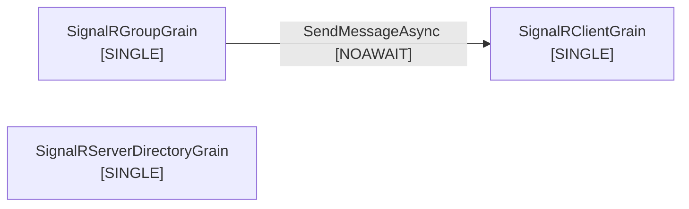

# Grain Call Graph

This diagram shows the call relationships between Orleans grains in the Mississippi framework.

**Grains:** 3 | **Interfaces:** 3 | **Call Edges:** 1

## Legend

- **[STATELESS]**: StatelessWorker grain (scales out automatically)
- **[REENTRANT]**: Reentrant grain (allows concurrent calls)
- **[SINGLE]**: Single-activation grain (default)
- **[RO]**: Read-only method call
- **[AWAIT]**: Awaited call
- **[NOAWAIT]**: Non-awaited (fire-and-forget) call

