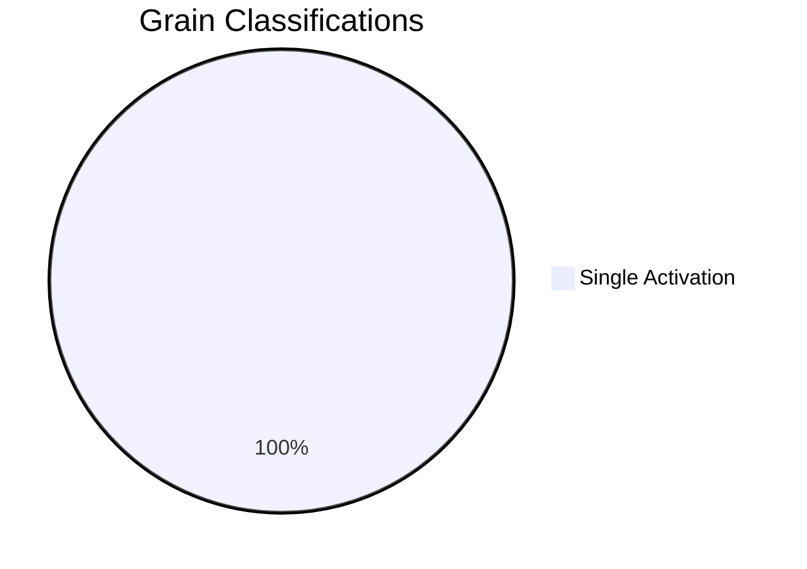

# Orleans Grain Analysis

This section contains Orleans grain call mappings for the Mississippi framework.

## Overview

## Reports

- [Grain Call Graph](./grain-call-graph) - Visual diagram of grain interactions
- [Grain Call Matrix](./grain-call-matrix) - Detailed call analysis table

## Grain Types

| Classification | Count | Description |
|----------------|-------|-------------|
| Stateless | 0 | StatelessWorker grains that scale horizontally |
| Reentrant | 0 | Grains allowing concurrent calls |
| Single | 3 | Default single-activation grains |
