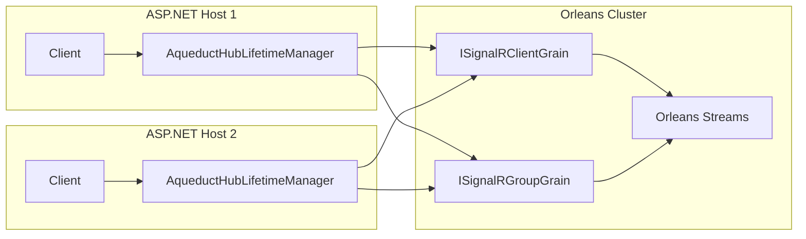

# Aqueduct & Server Glossary

Mississippi's server-side framework terminology. Aqueduct provides Orleans-backed SignalR scaling, source generators produce client/server code, and Refraction provides the UI component library.

## Aqueduct (Orleans SignalR Backplane)

### Aqueduct

Mississippi's Orleans-backed SignalR backplane that enables cross-server SignalR message delivery without external dependencies (Redis, Azure Service Bus, SQL Server). Aqueduct replaces `HubLifetimeManager` with grain-based coordination, providing automatic persistence, location transparency, and failure recovery.

**Architecture**:

**Benefits**:

- No external backplane infrastructure required
- Seamless Orleans integration
- Grain-based failure detection
- Unified observability with Orleans metrics
- Location transparency for message routing

**Source**: [AqueductHubLifetimeManager](https://github.com/Gibbs-Morris/mississippi/blob/main/src/Aqueduct/AqueductHubLifetimeManager.cs), [Aqueduct documentation](https://github.com/Gibbs-Morris/mississippi/blob/main/docs/Docusaurus/docs/old/platform/aqueduct.md)

### AqueductHubLifetimeManager

The core Aqueduct component that replaces SignalR's default `HubLifetimeManager`. Routes all connection, group, and message operations through Orleans grains and streams instead of external backplanes.

**Responsibilities**:

- Register/unregister connections with `ISignalRClientGrain`
- Manage group membership via `ISignalRGroupGrain`
- Route messages through Orleans streams for cross-server delivery
- Coordinate with local SignalR infrastructure for final client delivery

**Source**: [AqueductHubLifetimeManager](https://github.com/Gibbs-Morris/mississippi/blob/main/src/Aqueduct/AqueductHubLifetimeManager.cs)

### ISignalRClientGrain

Orleans grain tracking a single SignalR connection. Keyed by `{HubName}:{ConnectionId}`, it stores which server hosts the connection and coordinates message delivery.

**Source**: [ISignalRClientGrain](https://github.com/Gibbs-Morris/mississippi/blob/main/src/Aqueduct.Abstractions/Grains/ISignalRClientGrain.cs)

### ISignalRGroupGrain

Orleans grain managing a SignalR group. Keyed by `{HubName}:{GroupName}`, it maintains the member set and handles fan-out logic for group broadcasts.

**Source**: [ISignalRGroupGrain](https://github.com/Gibbs-Morris/mississippi/blob/main/src/Aqueduct.Abstractions/Grains/ISignalRGroupGrain.cs)

### IAqueductNotifier

Interface allowing domain grains to send real-time notifications to SignalR clients. Bridges Orleans aggregate/projection grains to the SignalR infrastructure without direct SignalR dependencies.

## Source Generation

### Source Generation

Compile-time code generation using Roslyn incremental generators (`IIncrementalGenerator`) to produce boilerplate code automatically. Source generators analyze attributes in Domain projects and emit `.g.cs` files during compilation.

**Benefits**:

- Type safety across client/server boundaries
- Reduced manual boilerplate
- Smaller WASM bundle size (Domain types excluded via `ExcludeAssets="runtime"`)
- Consistent naming conventions

### Client Generators

Generators in `Inlet.Client.Generators` that produce client-side code from domain definitions:

| Generator | Output |
|-----------|--------|
| `CommandClientDtoGenerator` | Client-side request DTOs from commands |
| `ProjectionClientDtoGenerator` | Client-side projection DTOs |
| `CommandClientActionsGenerator` | Reservoir actions for commands |
| `CommandClientReducersGenerator` | Client-side reducers |
| `CommandClientMappersGenerator` | `IMapper<Action, RequestDto>` implementations |
| `CommandClientRegistrationGenerator` | Service registration extensions |

**Source**: [Inlet.Client.Generators](https://github.com/Gibbs-Morris/mississippi/tree/main/src/Inlet.Client.Generators)

### Server Generators

Generators in `Inlet.Server.Generators` that produce server-side code:

| Generator | Output |
|-----------|--------|
| `CommandServerDtoGenerator` | Server-side DTOs with JSON attributes and mappers |
| `ProjectionEndpointsGenerator` | Controllers, DTOs, mappers, and registrations for projections |

**Source**: [Inlet.Server.Generators](https://github.com/Gibbs-Morris/mississippi/tree/main/src/Inlet.Server.Generators)

### Silo Generators

Generators in `Inlet.Silo.Generators` that produce Orleans silo code:

| Generator | Output |
|-----------|--------|
| `ProjectionSiloRegistrationGenerator` | Reducer/effect registrations for projections |

**Source**: [Inlet.Silo.Generators](https://github.com/Gibbs-Morris/mississippi/tree/main/src/Inlet.Silo.Generators)

### UxProjectionControllerBase

Base class for projection controllers generated by `ProjectionEndpointsGenerator`. Provides three endpoints with ETag support for optimistic caching:

- `GET /` — Latest projection (304 Not Modified if unchanged)
- `GET /version` — Latest version number
- `GET /at/{version}` — Specific historical version

**Pattern**: Controllers use `IMapper<TProjection, TDto>` to transform projections before returning responses.

**Source**: [UxProjectionControllerBase](https://github.com/Gibbs-Morris/mississippi/blob/main/src/EventSourcing.UxProjections.Api/UxProjectionControllerBase%7BTProjection,TDto%7D.cs)

### IMapper

Interface for bidirectional transformations between domain types and DTOs. Mappers are registered in DI and used by controllers/effects to convert between representations.

**Pattern**: `IMapper<TSource, TDestination>` with `Map(TSource source)` method.

**Source**: [IMapper](https://github.com/Gibbs-Morris/mississippi/blob/main/src/Common.Abstractions/Mapping/IMapper.cs)

## Refraction (UI Component Library)

### Refraction

Mississippi's HUD-style Blazor UI component library implementing Atomic Design. Provides reusable atoms, molecules, and organisms with a consistent design token system.

**Component hierarchy**:

- **Atoms**: `InputField`, `Reticle`, `NotificationPulse`, `CalloutLine`, `ProgressArc`, `Emitter`
- **Molecules**: `TelemetryStrip`, `CommandOrbit`
- **Organisms**: `Pane`, `SchematicViewer`

**Design principles**:

- State-down, events-up component pattern
- Explicit anatomy documentation (e.g., "I0 Label", "G0 Glass surface")
- CSS design token system for theming

**Source**: [Refraction components](https://github.com/Gibbs-Morris/mississippi/tree/main/src/Refraction/Components)

### RefractionTokens

CSS design token system used by Refraction components. Defines raw tokens (base palette) and semantic tokens (purpose-based aliases).

**Token categories**:

- **Colors**: Neo Blue palette, neutrals, status colors
- **Spacing**: Scale from 0.25rem to 3rem
- **Typography**: Font families, text sizes
- **Effects**: Alpha values, glow radius, stroke widths
- **Timing**: Animation durations and easing curves

**Source**: [RefractionTokens.css](https://github.com/Gibbs-Morris/mississippi/blob/main/src/Refraction/Themes/RefractionTokens.css)

## Storage Providers

### Storage Provider

An abstraction layer that decouples Mississippi's event sourcing and snapshot infrastructure from specific storage implementations. Storage providers implement read/write interfaces for persisting and retrieving data.

**Types in Mississippi**:

| Provider | Purpose |
|----------|---------|
| Brook Storage Provider | Event stream persistence (`IBrookStorageProvider`) |
| Snapshot Storage Provider | Snapshot persistence (`ISnapshotStorageProvider`) |

**Pattern**: Providers expose a `Format` property (e.g., `"cosmos-db"`) identifying the implementation.

### Cosmos DB Storage Providers

The production storage implementations using Azure Cosmos DB:

**Brook Storage** (`AddCosmosBrookStorageProvider`):

- Container: "brooks" (configurable)
- Partition key: `/brookPartitionKey`
- Transactional batch writes with optimistic concurrency

**Snapshot Storage** (`AddCosmosSnapshotStorageProvider`):

- Stores `SnapshotEnvelope` records with serialized state and metadata

**Source**: [BrookStorageProvider](https://github.com/Gibbs-Morris/mississippi/blob/main/src/EventSourcing.Brooks.Cosmos/BrookStorageProvider.cs)

---

## See Also

- [Industry Concepts Glossary](industry-concepts.md) — Standard technologies (SignalR, ASP.NET Core)
- [Event Sourcing Glossary](event-sourcing.md) — Brooks, Aggregates, Projections
- [Reservoir & Inlet Glossary](reservoir-inlet.md) — Client-side state and real-time subscriptions
