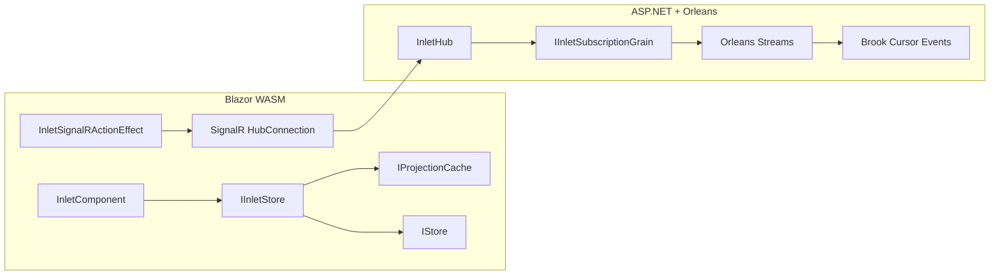

# Reservoir & Inlet Glossary

Mississippi's client-side framework terminology. Reservoir provides Redux-style state management for Blazor, while Inlet bridges clients to server-side projections via SignalR.

## Reservoir (State Management)

### Reservoir

Mississippi's Redux-style state management framework for Blazor applications. Provides a central state container with actions, reducers, and effects for predictable, testable client-side state management. Reservoir powers client-side state and is used by Inlet to manage projection state and UI updates.

**Key concepts**: Store (central container), Action (event descriptor), ActionReducer (state transformer), ActionEffect (side effect handler), FeatureState (state slice).

**Source**: [IStore interface](https://github.com/Gibbs-Morris/mississippi/blob/main/src/Reservoir.Abstractions/IStore.cs)

### Store

The central state container in Reservoir that holds all feature states and coordinates action dispatch. Implements a Redux-like pattern where actions flow through middleware → reducers → effects. The Store is the single source of truth for application state and notifies subscribers when state changes occur.

**Data flow**: Dispatch action → reducers compute new state synchronously → effects run asynchronously → yield additional actions.

**Source**: [Store class](https://github.com/Gibbs-Morris/mississippi/blob/main/src/Reservoir/Store.cs)

### Action

A marker interface representing events that trigger state changes or side effects in Reservoir. Actions are immutable records dispatched to the Store and processed by ActionReducers (synchronously) and ActionEffects (asynchronously).

**Key principle**: Actions describe *what happened* or *what the user intends*, carrying minimal data needed for reducers and effects.

**Source**: [IAction interface](https://github.com/Gibbs-Morris/mississippi/blob/main/src/Reservoir.Abstractions/Actions/IAction.cs)

### ActionReducer

A pure function that handles a specific action type and produces new immutable state. ActionReducers process actions synchronously during dispatch to update feature state. They must be deterministic with no side effects—given the same state and action, they always produce the same result.

**Pattern**: Inherit from `ActionReducerBase<TAction, TState>` to implement custom reducers.

**Source**: [ActionReducerBase class](https://github.com/Gibbs-Morris/mississippi/blob/main/src/Reservoir.Abstractions/ActionReducerBase.cs), [IActionReducer interface](https://github.com/Gibbs-Morris/mississippi/blob/main/src/Reservoir.Abstractions/IActionReducer.cs)

### ActionEffect

An asynchronous handler that performs side effects triggered by actions. ActionEffects run after reducers complete and can execute async operations (HTTP calls, timers, navigation) and yield new actions as results.

**Best practice**: Extract all needed data from the action itself (not current state) to remain pure and testable.

**Pattern**: Inherit from `ActionEffectBase<TAction, TState>` to implement custom effects.

**Source**: [ActionEffectBase class](https://github.com/Gibbs-Morris/mississippi/blob/main/src/Reservoir.Abstractions/ActionEffectBase.cs), [IActionEffect interface](https://github.com/Gibbs-Morris/mississippi/blob/main/src/Reservoir.Abstractions/IActionEffect{TState}.cs)

### FeatureState

An immutable record representing a slice of application state (e.g., UI state, form state, session state) identified by a unique key. Feature states implement `IFeatureState` and are registered with the Store.

**Key characteristic**: Each feature state is a self-contained domain with its own reducers and effects, enabling modular state organization.

**Source**: [IFeatureState interface](https://github.com/Gibbs-Morris/mississippi/blob/main/src/Reservoir.Abstractions/State/IFeatureState.cs)

### StoreComponent

A Blazor component base class that integrates with the Reservoir Store. Provides automatic state subscription, re-rendering on state changes, and helper methods for dispatching actions.

**Usage**: Inherit from `StoreComponent` instead of `ComponentBase` for state-aware components.

## Inlet (Real-Time Projections)

### Inlet

Mississippi's WASM-to-ASP.NET bridge that manages UX projection subscriptions, real-time updates, and client-side projection state. Inlet connects Blazor WebAssembly clients to server-side UX projections via SignalR, abstracting away Orleans and Brook infrastructure so clients interact only with projection paths and entity IDs.

**Architecture overview**:

**Key design principles**:

- **Path-based addressing**: Clients use `{feature}/{module}` paths from `[ProjectionPath]` attribute
- **Deduplication**: Multiple projections sharing same brook share one stream subscription
- **Version-based refresh**: Notifications include version; client re-fetches if newer than cache
- **Connection lifecycle**: Automatic reconnection and re-subscription

**Source**: [Inlet documentation](https://github.com/Gibbs-Morris/mississippi/blob/main/docs/Docusaurus/docs/old/platform/inlet.md)

### InletComponent

Abstract Blazor base class (extends `StoreComponent`) for projection-aware UI components. Provides methods for subscribing to and reading projection state.

**Methods**:

- `SubscribeToProjection<T>(entityId)`: Subscribe to real-time updates
- `UnsubscribeFromProjection<T>(entityId)`: Stop receiving updates
- `GetProjection<T>(entityId)`: Read current cached projection
- `IsProjectionConnected<T>(entityId)`: Check subscription status

**Source**: [InletComponent](https://github.com/Gibbs-Morris/mississippi/blob/main/src/Inlet.Blazor.WebAssembly/InletComponent.cs)

### IInletStore

Composite interface combining `IStore` (Redux-style actions/reducers) and `IProjectionCache` (projection data/state). Provides unified access to both local state management and server-synced projections.

**Source**: [IInletStore](https://github.com/Gibbs-Morris/mississippi/blob/main/src/Inlet.Abstractions/IInletStore.cs)

### IProjectionCache

Cache for server-synced projection states. Provides methods to read projections and their metadata.

**Methods**:

- `GetProjection<T>(entityId)`: Returns cached projection data
- `GetProjectionVersion<T>(entityId)`: Returns cached version number
- `IsProjectionLoading<T>(entityId)`: Returns true while fetching

**Source**: [IProjectionCache](https://github.com/Gibbs-Morris/mississippi/blob/main/src/Inlet.Abstractions/IProjectionCache.cs)

### InletHub

SignalR hub on the server that handles projection subscription requests. Exposes `SubscribeAsync(path, entityId)` and `UnsubscribeAsync(subscriptionId, path, entityId)` methods. Each connection gets a dedicated `IInletSubscriptionGrain`.

**Source**: [InletHub](https://github.com/Gibbs-Morris/mississippi/blob/main/src/Inlet.Orleans.SignalR/InletHub.cs)

### IInletSubscriptionGrain

Orleans grain (keyed by SignalR ConnectionId) managing all subscriptions for a connection. Handles brook stream subscriptions with deduplication—multiple projections sharing the same brook and entity ID share a single Orleans stream subscription.

**Source**: [IInletSubscriptionGrain](https://github.com/Gibbs-Morris/mississippi/blob/main/src/Inlet.Orleans/Grains/IInletSubscriptionGrain.cs)

### InletSignalRActionEffect

Action effect handling SignalR connection lifecycle and projection subscription actions. Registers callback for `ProjectionUpdatedAsync` notifications and handles reconnection with automatic re-subscription.

**Subscription flow**:

1. Client calls `SubscribeToProjection<T>(entityId)` → dispatches `SubscribeToProjectionAction<T>`
2. Effect invokes `InletHub.SubscribeAsync(path, entityId)` via SignalR
3. Server-side grain registers subscription and subscribes to brook stream
4. Initial projection data fetched via HTTP
5. When brook cursor moves → grain fans out → SignalR notification → client re-fetches

### [ProjectionPath] Attribute

Attribute applied to projection types defining the path for Inlet subscriptions. Maps projection types to `{feature}/{module}` paths used by clients.

**Example**: `[ProjectionPath("accounts/balance")]` allows clients to subscribe using `SubscribeToProjection<AccountBalanceProjection>(accountId)`.

### IProjectionBrookRegistry

Server-side registry mapping projection paths to brook names. Populated at startup from `[ProjectionPath]` attributes.

## Inlet Projects

The Inlet subsystem spans multiple projects:

| Project | Purpose |
|---------|---------|
| `Inlet`, `Inlet.Abstractions` | Core registration, `IInletStore`, `IProjectionCache` |
| `Inlet.Blazor.WebAssembly`, `Inlet.Blazor.WebAssembly.Abstractions` | Client-side `InletComponent`, action effects |
| `Inlet.Orleans`, `Inlet.Orleans.SignalR` | Server-side grains and `InletHub` |
| `Inlet.Projection.Abstractions` | `[ProjectionPath]` attribute |
| `Inlet.Client.Generators`, `Inlet.Server.Generators`, `Inlet.Silo.Generators` | Source generators |

---

## See Also

- [Industry Concepts Glossary](industry-concepts.md) — Standard technologies (Blazor, SignalR, Redux)
- [Event Sourcing Glossary](event-sourcing.md) — Brooks, Aggregates, Projections
- [Aqueduct & Server Glossary](aqueduct-server.md) — Server-side Mississippi components
