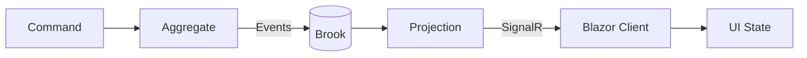
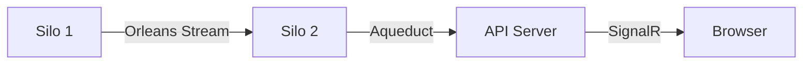
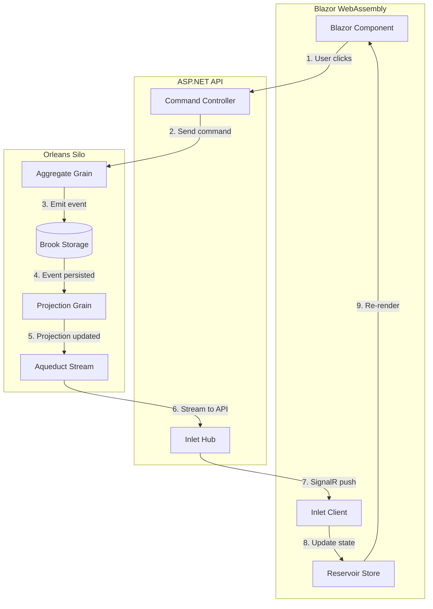

Mississippi is an **event sourcing framework** for .NET that moves domain
changes from Orleans grains into live Blazor WebAssembly UX state—in real time.

If you're building a CQRS/ES application where users need to see changes the
moment they happen (collaborative editing, dashboards, notifications), Mississippi
provides the full vertical stack from command handling to browser state updates.

## The Problem Mississippi Solves

Traditional web applications poll or refresh to see changes. Event-sourced
systems add complexity: you need to store events, build read models, push
updates to clients, and keep browser state in sync. Mississippi handles all of
this with a unified set of patterns.



**The flow**: A user action becomes a command → the aggregate validates and
emits events → events persist in a brook → projections rebuild and push to
clients → client state updates and the UI re-renders. All of this is automatic
once you wire up the pieces.

## Conceptual Building Blocks

Mississippi is organized into **six core concepts** plus supporting components.
Each solves one part of the event sourcing puzzle:

### 1. Aggregates — Command Handling

Aggregates are the **write side** of CQRS. They receive commands, enforce
business rules, and emit domain events. In Mississippi, aggregates are Orleans
grains with identity (e.g., `OrderAggregate/order-123`).

```csharp
// Conceptual flow inside an aggregate
public async Task Handle(PlaceOrderCommand cmd)
{
    if (State.IsPlaced) throw new InvalidOperationException("Already placed");
    await Emit(new OrderPlacedEvent(cmd.OrderId, cmd.Items));
}
```

→ [Learn more about Aggregates](./platform/aggregates.md)

### 2. Brooks — Event Storage

Brooks are **append-only event streams**. When an aggregate emits an event, it's
persisted to a brook. Brooks are immutable—you never update or delete events,
you only append new ones. Mississippi stores brooks in Azure Cosmos DB by
default.

```text
Brook: orders/order-123
├── Event 1: OrderPlacedEvent
├── Event 2: ItemAddedEvent
└── Event 3: OrderShippedEvent
```

→ [Learn more about Brooks](./platform/brooks.md)

### 3. UX Projections — Read Models

UX projections are the **read side** of CQRS. They subscribe to events and
build query-optimized views for the UI. Projections are also Orleans grains,
cached in memory for fast reads.

```csharp
// A projection subscribes to events and builds state
public class OrderSummaryProjection : IProjection
{
    public void Apply(OrderPlacedEvent e) => State = new OrderSummary(e.OrderId, "Placed");
    public void Apply(OrderShippedEvent e) => State = State with { Status = "Shipped" };
}
```

→ [Learn more about UX Projections](./platform/ux-projections.md)

### 4. Aqueduct — Real-Time Delivery

Aqueduct is the **SignalR backplane** that pushes projection updates to
connected clients. It uses Orleans streams under the hood, so updates flow
across a multi-server cluster to whichever API server the client is connected
to.



→ [Learn more about Aqueduct](./platform/aqueduct.md)

### 5. Inlet — Client Bridge

Inlet is the **Blazor WebAssembly client** that subscribes to projections and
receives updates. It manages SignalR connections, handles reconnection, and
delivers state changes to your Blazor components.

```csharp
// In a Blazor component
@inject IInletClient Inlet

@code {
    protected override async Task OnInitializedAsync()
    {
        await Inlet.Subscribe<OrderSummary>("order-123", OnOrderUpdated);
    }
}
```

→ [Learn more about Inlet](./platform/inlet.md)

### 6. Reservoir — Client State

Reservoir is a **Redux-style state container** for Blazor. It holds your
application state, processes actions through reducers, and notifies components
when state changes. Inlet pushes projection updates into Reservoir automatically.

```csharp
// Actions describe what happened
public record AddToCart(Product Product) : IAction;

// Reducers transform state
public static CartState Reduce(CartState state, AddToCart action)
    => state with { Items = state.Items.Add(action.Product) };
```

→ [Learn more about Reservoir](./reservoir/index.md)

## How the Pieces Connect

Here's the full picture from command to UI:



**The developer experience**: You define aggregates, events, and projections.
Mississippi handles event persistence, projection updates, SignalR delivery,
and client state synchronization. Source generators reduce boilerplate for
commands and endpoints.

## Supporting Components

Beyond the six core concepts, Mississippi includes:

| Component | Purpose |
| --- | --- |
| **Snapshots** | Periodic projection state saves for faster rebuilds |
| **Reducers** | Shared event-folding logic used by both projections and aggregates |
| **Refraction** | Planned component library for common UI patterns |
| **SDK Packages** | Meta-packages that bundle dependencies by deployment target |

## Where to Go Next

**Understand the architecture:**

1. [Architecture](./concepts/architecture.md) — Deployment stack showing where components live
2. [Why Mississippi?](./concepts/why-mississippi.md) — Enterprise benefits and comparisons

**If you're new to Mississippi:**

1. Read the [Getting Started](./getting-started/index.md) guide for installation
2. Explore [Components](./platform/index.md) for a component-by-component tour
3. Try the [Reservoir Tutorial](./reservoir/getting-started.md) to build a client app

**If you're building a specific feature:**

- Commands and events → [Aggregates](./platform/aggregates.md)
- Event storage → [Brooks](./platform/brooks.md)
- Read models → [UX Projections](./platform/ux-projections.md)
- Real-time updates → [Aqueduct](./platform/aqueduct.md) and [Inlet](./platform/inlet.md)
- Client state → [Reservoir](./reservoir/index.md)

**If you want to see working code:**

- The `samples/Spring` folder contains a reference implementation
- The `samples/Crescent` folder shows additional patterns
