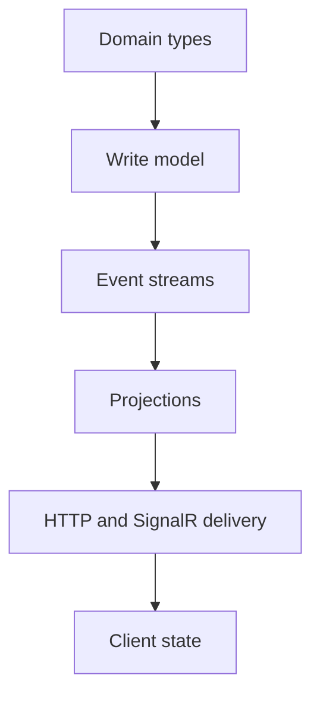

# Mississippi Documentation

## Overview

Mississippi gives teams one coherent model for building stateful, event-driven systems that need durable history, explicit business behavior, real-time visibility, and predictable client state.

You define aggregates, commands, events, reducers, saga steps, and projections. Mississippi then composes event sourcing, CQRS, Orleans execution, generated APIs, real-time delivery, and client-state updates around those types so the whole system follows one architectural shape.

Use this landing page to decide where to start: why Mississippi if you need the business case, concepts if you need the mental model, a product area if you need one capability, or samples if you want to see a complete application.

## Start Here

| If you want to... | Start here |
| --- | --- |
| Understand the business value of Mississippi | [Why Mississippi](./why-mississippi/index.md) |
| Understand what Mississippi is for and how the pieces fit together | [Concepts](./concepts/index.md) |
| Evaluate or adopt a specific subsystem | The product-area sections below |
| Find package names for independently adoptable areas | [Package Entry Points](#package-entry-points) |
| See a complete working application | [Samples](./samples/index.md) |

## Why Mississippi Exists

Mississippi is designed for systems where business state changes matter over time, several read models need to stay aligned to the same truth, and users need to see those changes quickly and reliably.

At a high level, it is optimizing for four outcomes:

- **Control** over how business state changes
- **Visibility** into what happened and what is happening now
- **Resilience** for long-lived, stateful, concurrent workflows
- **Consistency** across runtime execution, read models, live delivery, and client state

If that is the question you are trying to answer, start with [Why Mississippi](./why-mississippi/index.md). If you already accept the business case and need the technical model, continue below.

## Architecture At A Glance

This diagram shows the high-level path from domain behavior to live client state.

```mermaid
flowchart TB
    D[Domain types] --> W[Write model]
    W --> E[Event streams]
    E --> P[Projections]
    P --> H[HTTP and SignalR delivery]
    H --> C[Client state]
```

That high-level flow maps to Mississippi's product areas like this:

- **Event Streams** live in Brooks, the event-stream and storage foundation.
- **Reducers & Snapshots** live in Tributary, the derived-state reconstruction layer.
- **Domain Behavior** lives in Domain Modeling, where aggregates, sagas, effects, and UX projections are expressed.
- **API & Client Sync** lives in Inlet, which aligns generated gateway, runtime, and client surfaces.
- **SignalR Backplane** lives in Aqueduct, the Orleans-backed real-time transport layer.
- **Client State** lives in Reservoir, the Redux-style state-management layer.
- **Blazor UI** lives in Refraction, the component and design-token layer.

For the detailed subsystem map and concepts reading path, use [Concepts](./concepts/index.md).

## Choose Your Path

Use the path that matches your immediate goal.

| Question | Start here |
| --- | --- |
| Why would a team or organization choose Mississippi? | [Why Mississippi](./why-mississippi/index.md) |
| How do the main architecture layers fit together? | [Concepts](./concepts/index.md) |
| How do commands, events, reducers, and effects work? | [Write Model](./concepts/write-model.md) |
| How do projections reach HTTP and client state? | [Read Models and Client Sync](./concepts/read-models-and-client-sync.md) |
| How are long-running workflows modeled? | [Sagas and Orchestration](./concepts/sagas-and-orchestration.md) |
| What is Mississippi optimizing for, and what does it cost? | [Design Goals and Trade-Offs](./concepts/design-goals-and-trade-offs.md) |

## Independent Foundations

These areas can be adopted on their own without requiring the full Mississippi stack.

| Area | What it covers |
| --- | --- |
| [SignalR Backplane](./aqueduct/index.md) | Aqueduct provides Orleans-backed SignalR backplane support for distributed real-time messaging |
| [Blazor UI](./refraction/index.md) | Refraction provides Blazor UX components built around a state-down, events-up interaction model |
| [Client State](./reservoir/index.md) | Reservoir provides Redux-style client state management |
| [Event Streams](./brooks/index.md) | Brooks provides event streams and event storage |

## Package Entry Points

These independent areas also expose package entry points that can be adopted without taking the full Mississippi stack.

The package IDs below come from the packable projects under `src/` and use the repository-wide `Mississippi.` package prefix.

| Area | Representative packages | Notes |
| --- | --- | --- |
| [SignalR Backplane](./aqueduct/index.md) | `Mississippi.Aqueduct.Abstractions`, `Mississippi.Aqueduct.Gateway`, `Mississippi.Aqueduct.Runtime` | Aqueduct contracts plus gateway and Orleans runtime integrations for the backplane |
| [Blazor UI](./refraction/index.md) | `Mississippi.Refraction.Abstractions`, `Mississippi.Refraction.Client`, `Mississippi.Refraction.Client.StateManagement` | Refraction UX contracts, runtime components, and page-composition helpers |
| [Client State](./reservoir/index.md) | `Mississippi.Reservoir.Abstractions`, `Mississippi.Reservoir.Core`, `Mississippi.Reservoir.Client`, `Mississippi.Reservoir.TestHarness` | Reservoir state-management contracts, runtime, Blazor integration, and testing support |
| [Event Streams](./brooks/index.md) | `Mississippi.Brooks.Abstractions`, `Mississippi.Brooks.Runtime`, `Mississippi.Brooks.Serialization.Abstractions`, `Mississippi.Brooks.Serialization.Json` | Brooks event-streaming contracts, runtime, and serialization seams |

Use the area pages above when you want the architectural view. Use the package names in this table when you are deciding what to reference from an application or library.

## Core Architecture Areas

These areas form the end-to-end Mississippi application model.

| Area | What it covers |
| --- | --- |
| [Domain Behavior](./domain-modeling/index.md) | Domain Modeling covers aggregates, sagas, effects, and projections |
| [Reducers & Snapshots](./tributary/index.md) | Tributary covers reducers and snapshots |
| [Event Streams](./brooks/index.md) | Brooks covers event streams, cursor tracking, and storage contracts |
| [API & Client Sync](./inlet/index.md) | Inlet covers source-generated alignment across client, HTTP, and runtime layers |
| [SignalR Backplane](./aqueduct/index.md) | Aqueduct covers Orleans-backed SignalR transport and connection infrastructure |
| [Client State](./reservoir/index.md) | Reservoir covers Redux-style client state management |
| [Blazor UI](./refraction/index.md) | Refraction covers the Blazor component library and design tokens |

## Samples

This section covers complete applications that show how multiple Mississippi areas compose in practice.

| Area | What it covers |
| --- | --- |
| [Samples](./samples/index.md) | End-to-end sample applications, guided walkthroughs, and sample-specific validation paths |

## Current Coverage

This documentation set currently provides:

- a business-oriented explanation of why the framework exists
- a concepts path covering architecture, writes, reads, sagas, and design trade-offs
- product-area entry pages for the main Mississippi subsystems
- sample documentation showing how the pieces compose in complete applications

Earlier material is still preserved for reference, but the active top-level sections above are the right place to start for new reading.

## Legacy Material

Earlier documentation is still available under [Archived Documentation](./archived/index.md).

Use that material when you need preserved reference pages from the older docs set, but prefer the active top-level sections for new navigation.

## Learn More

- [Why Mississippi](./why-mississippi/index.md) - Start with the business case and platform value
- [Concepts](./concepts/index.md) - Start with the framework overview and mental model
- [Domain Modeling](./domain-modeling/index.md) - Start with the Domain Behavior section for aggregates, sagas, and projections
- [Tributary](./tributary/index.md) - Start with the Reducers & Snapshots section
- [Brooks](./brooks/index.md) - Start with the Event Streams section
- [Inlet](./inlet/index.md) - Start with the API & Client Sync section
- [Aqueduct](./aqueduct/index.md) - Start with the SignalR Backplane section
- [Reservoir](./reservoir/index.md) - Start with the Client State section
- [Refraction](./refraction/index.md) - Start with the Blazor UI section
- [Samples](./samples/index.md) - Explore complete applications built with Mississippi
- [Archived Documentation](./archived/index.md) - Browse the preserved pre-reset docs set
