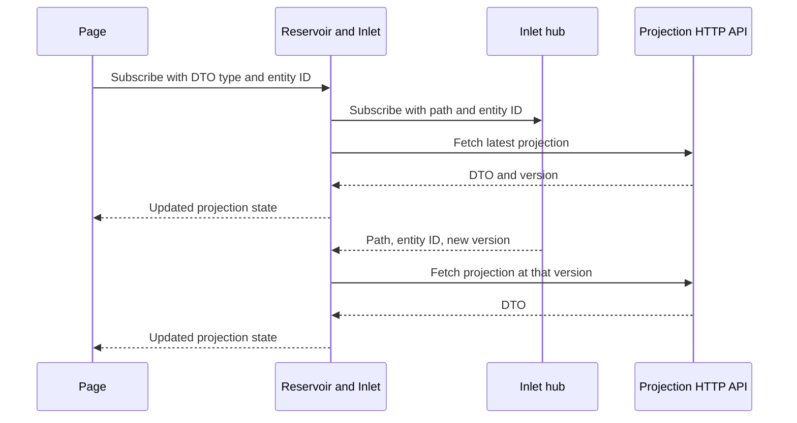

# Generated Application Contracts

## Overview

Inlet generates the repetitive application boundary around your domain types. You write commands, business rules, events, and reducers; generated code connects those decisions to HTTP endpoints and client features.

This reference maps the contracts in the Spring sample across its runtime, gateway, and Blazor client. Use it when choosing where to register a capability or tracing a generated type back to its source.

## Applies To

- The Inlet runtime, gateway, and client generators and their shared attributes.
- Applications with generator references configured, such as [Spring](../../samples/spring-sample/index.md).
- The SDK packages for each host role; see the [package and capability map](../../reference/capability-map.md) for their library dependencies and the sample's explicit analyzer references.

## Domain Inputs And Generated Outputs

| Domain input | Generated application surface | Consumer responsibility |
|------------|-------------------------------|-------------------------|
| Aggregate state with `[GenerateAggregateEndpoints]` and commands with `[GenerateCommand]` | Aggregate controller, command DTOs and mappings, client actions/effects/state/reducers, registration methods | Implement the command handlers and event reducers; register the infrastructure and generated features |
| Projection with `[GenerateProjectionEndpoints]` and `[ProjectionPath]` | Projection controller, DTOs and mappings, and client projection reducers | Define the read model and its reducers; connect its brook and projection path to the hosts |
| Saga with `[GenerateSagaEndpoints]` or its generic input form | Saga endpoints, client feature, and runtime registration | Define saga input, steps, state transitions, and compensation behavior |

Generation runs during compilation. Edit the domain input and application configuration, then rebuild the consuming projects to update their generated contracts. Keep business decisions in the handlers and reducers that you own.

That division gives teams one place to review a rule such as “withdraw only an available balance.” It also gives an AI coding assistant a bounded task: change the domain rule, supply its examples and tests, rebuild the contracts, and verify the consumer behavior.

## Host Registration Map

These are different registration surfaces, each with a specific receiver.

| Host | Generated method for Spring's domain | Receiver | Includes |
|------|--------------------------------------|----------|----------|
| Runtime | `AddMississippiSamplesSpringDomainSilo()` | `IServiceCollection` | Generated aggregate, saga, and projection registrations discovered for the domain |
| Gateway | `AddMississippiSamplesSpringDomainServer()` | `IServiceCollection` | Generated aggregate and projection mapper registrations |
| Client | `AddMississippiSamplesSpringDomainClient()` | `MississippiClientBuilder` | Generated aggregate and saga Reservoir features, plus projection feature registration |

The domain name comes from the domain root namespace. The generated extension namespaces follow the consuming project's root namespace:

| Host | Spring extension namespace |
|------|----------------------------|
| Runtime | `MississippiSamples.Spring.Runtime.Registrations` |
| Gateway | `MississippiSamples.Spring.Gateway.Controllers.Mappers` |
| Client | `MississippiSamples.Spring.Client.Features` |

You can compose individual generated registrations instead. Spring's runtime and gateway currently select individual methods, while its client calls the domain-level method. For example, `AddBankAccountAggregate()` registers runtime behavior, `AddBankAccountAggregateMappers()` registers gateway mappings, and `AddBankAccountAggregateFeature()` registers client command handling on `IReservoirBuilder`.

### Infrastructure Around Generated Registrations

Generated domain registrations compose application types. Supply their host infrastructure as part of startup:

| Host | Spring composition to follow |
|------|------------------------------|
| Runtime | Orleans silo and stream provider, event sourcing and snapshot storage, `AddInletSilo()`, projection assembly scan, and generated domain registrations |
| Gateway | Orleans client, JSON serialization, aggregate and UX projection support, SignalR and Aqueduct services, configured authentication/authorization and `AddInletServer(...)`, projection assembly scan and generated mappers; map controllers and `MapInletHub()` |
| Client | An `HttpClient` with the gateway base address, `AddMississippiClient(...)`, generated domain features, `AddInletClient()` and `AddInletBlazorSignalR(...)` on the Reservoir builder |

Use the complete [Spring host configuration](../../samples/spring-sample/concepts/host-applications.md) as a starting point. In particular, retain Spring's explicit `AddAqueduct<InletHub>(...)` services and matching stream-provider configuration alongside `AddInletServer()`.

Pass all domain projection assemblies together to `ScanProjectionAssemblies(...)` in each server host. Each call installs registries built from that call's exported projection types; a single combined scan retains mappings for every supplied domain.

### Authorization For An Exposed Gateway

Before exposing a gateway, configure its ASP.NET Core authentication handler, authorization policies, and authentication/authorization middleware. Choose a policy that permits the users, roles, or claims appropriate for the generated application surface.

For example, after defining an `application-access` policy, replace the bare Inlet registration with this startup configuration:

```csharp
builder.Services.AddInletServer(options =>
{
    options.GeneratedApiAuthorization.Mode =
        GeneratedApiAuthorizationMode.RequireAuthorizationForAllGeneratedEndpoints;
    options.GeneratedApiAuthorization.DefaultPolicy = "application-access";
    options.GeneratedApiAuthorization.AllowAnonymousOptOut = false;
});
```

`GeneratedApiAuthorizationMode` is in `Mississippi.Inlet.Gateway`, with default `Disabled`. Put `[GenerateAuthorization(Policy = "application-access")]` metadata on each protected generated command, projection, and saga, or use aggregate-level metadata that covers its controller, and verify every action. Force mode adds a default controller filter only when neither the controller nor any action has explicit authorization metadata. A mixed controller therefore needs explicit protection for its otherwise-unannotated actions. The configuration above complements that deliberate contract coverage.

Protect an exposed MCP endpoint and its tools separately through the application, or restrict them to a trusted local development environment. Generated controller and Inlet subscription authorization settings apply to those interfaces; MCP tools invoke domain grains directly.

The hub applies projection authorization when a client subscribes. Its authorization callback receives the user and a null resource. Use these policies for identity-based access; entity-specific permissions require an application boundary that receives and checks the requested entity ID before granting access.

Verify anonymous and insufficiently privileged requests as well as successful access. [Spring auth-proof mode](../../samples/spring-sample/how-to/auth-proof-mode.md) provides executable HTTP `401`/`403` checks with development identities. Add application-specific SignalR integration tests for allowed and denied subscriptions. Configure the deployment's real authentication mechanism for an exposed application.

## Projection Identity Across The Boundary

Spring's `BankAccountBalanceProjection` declares these distinct identities:

| Metadata | Value | Purpose |
|----------|-------|---------|
| `[BrookName]` | `SPRING`, `BANKING`, `ACCOUNT` | Select the account event stream family |
| `[SnapshotStorageName]` | `SPRING`, `BANKING`, `ACCOUNTBALANCE` | Select the projection's snapshot storage identity |
| `[ProjectionPath]` | `bank-account-balance` | Connect the HTTP projection route, client DTO, and subscription path |

The entity ID selects the particular account within that family. Generated DTOs retain the projection-path metadata so `ScanProjectionDtos(...)` can map a DTO type to its server route.

With the default automatic fetcher route prefix, the client reads:

| Request | Route |
|---------|-------|
| Latest projection | `/api/projections/bank-account-balance/{entityId}` |
| Projection at a notified version | `/api/projections/bank-account-balance/{entityId}/at/{version}` |

The fetcher escapes the entity ID as a URL path segment. Latest reads obtain the version from the HTTP `ETag`. Configure `WithRoutePrefix(...)` when your projection endpoints use a different prefix, and keep the server routes aligned with it.

## Command State And Projection State

A generated command action starts an HTTP operation through a generated effect. For Spring's `DepositFundsAction`, the generated lifecycle actions are `DepositFundsExecutingAction`, `DepositFundsSucceededAction`, and `DepositFundsFailedAction`.

Use command state to show progress and the command's result. Use projection state to display the read model. A successful command response and a refreshed projection are separate observations; keep the loading and error presentation for each tied to its own state.

One possible successful projection update sequence is shown below. The arrows illustrate the data path rather than an enforced ordering between concurrent HTTP reads:

Initial, refresh, and notification-triggered reads can complete out of order. The projection reducers assign the returned data and version as responses arrive. If a view requires monotonic versions, supply application coordination that serializes its reads or rejects older results before they update state.



The notification identifies what to read. The HTTP request supplies the projection data, and Reservoir publishes the resulting state to subscribed components. On a successful transport reconnection, Inlet re-establishes its active subscriptions and fetches their latest projections.

## Source Code

- Domain inputs: [BankAccountBalanceProjection.cs](https://github.com/Gibbs-Morris/mississippi/blob/main/samples/Spring/Spring.Domain/Projections/BankAccountBalance/BankAccountBalanceProjection.cs) and [generator attributes](https://github.com/Gibbs-Morris/mississippi/tree/main/src/Inlet.Generators.Abstractions).
- Authorization contracts: [GeneratedApiAuthorizationOptions.cs](https://github.com/Gibbs-Morris/mississippi/blob/main/src/Inlet.Gateway/GeneratedApiAuthorizationOptions.cs) and [InletHub.cs](https://github.com/Gibbs-Morris/mississippi/blob/main/src/Inlet.Gateway/InletHub.cs).
- Host composition: [runtime](https://github.com/Gibbs-Morris/mississippi/blob/main/samples/Spring/Spring.Runtime/Program.cs), [gateway](https://github.com/Gibbs-Morris/mississippi/blob/main/samples/Spring/Spring.Gateway/Program.cs), and [client](https://github.com/Gibbs-Morris/mississippi/blob/main/samples/Spring/Spring.Client/Program.cs).
- Domain registration generators: [silo](https://github.com/Gibbs-Morris/mississippi/blob/main/src/Inlet.Runtime.Generators/DomainSiloRegistrationGenerator.cs), [server](https://github.com/Gibbs-Morris/mississippi/blob/main/src/Inlet.Gateway.Generators/DomainServerRegistrationGenerator.cs), and [client](https://github.com/Gibbs-Morris/mississippi/blob/main/src/Inlet.Client.Generators/DomainClientRegistrationGenerator.cs).
- Client behavior: [command effects generator](https://github.com/Gibbs-Morris/mississippi/blob/main/src/Inlet.Client.Generators/CommandClientActionEffectsGenerator.cs), [InletSignalRActionEffect.cs](https://github.com/Gibbs-Morris/mississippi/blob/main/src/Inlet.Client/ActionEffects/InletSignalRActionEffect.cs), and [AutoProjectionFetcher.cs](https://github.com/Gibbs-Morris/mississippi/blob/main/src/Inlet.Client/ActionEffects/AutoProjectionFetcher.cs).

## Summary

Domain metadata aligns generated contracts across hosts. Register each host's infrastructure, add its generated domain surface, and use command and projection state for their respective user-visible outcomes.

## Next Steps

- [Compose an Inlet client](../how-to/how-to.md).
- [Keep a workspace projection live](../how-to/subscribe-to-projections.md).
- [Add a business command](../../samples/spring-sample/tutorials/building-an-aggregate.md) with tested rules and reducers.
