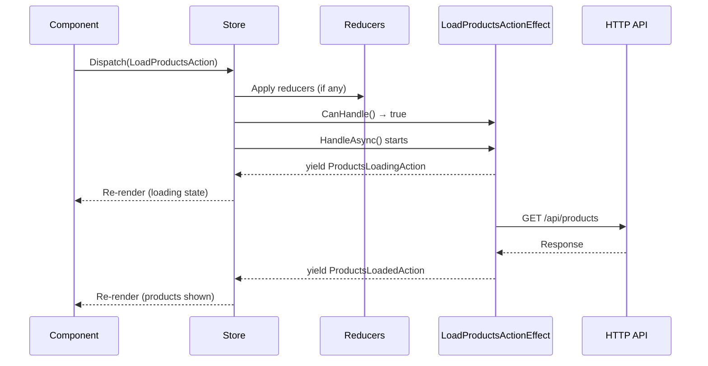

# Action Effects

Action effects handle asynchronous operations triggered by actions. While reducers must be pure and synchronous, action effects can perform API calls, interact with browser APIs, set timers, and emit new actions over time. Action effects are where side effects belong in a Reservoir application.

## When to Use Action Effects

Use action effects when you need to:

- Make HTTP requests to APIs
- Access browser storage (localStorage, IndexedDB)
- Interact with real-time services (SignalR, WebSockets)
- Perform delayed or periodic operations
- Navigate or interact with browser APIs
- Coordinate complex multi-step workflows

## The IActionEffect Interface

```csharp
/// <summary>
/// Handles asynchronous side effects triggered by actions.
/// </summary>
public interface IActionEffect
{
    /// <summary>
    /// Determines whether this effect can handle the given action.
    /// </summary>
    /// <param name="action">The action to check.</param>
    /// <returns>True if this effect handles the action; otherwise, false.</returns>
    bool CanHandle(IAction action);

    /// <summary>
    /// Handles the action asynchronously and yields resulting actions.
    /// </summary>
    /// <param name="action">The action to handle.</param>
    /// <param name="cancellationToken">A token to cancel the operation.</param>
    /// <returns>An async enumerable of actions to dispatch.</returns>
    IAsyncEnumerable<IAction> HandleAsync(
        IAction action,
        CancellationToken cancellationToken);
}
```

Action effects use `IAsyncEnumerable<IAction>` to support streaming multiple actions over time—perfect for progress updates, polling, or multi-step workflows.

## Implementing Action Effects

### Basic Action Effect Pattern

```csharp
using System.Collections.Generic;
using System.Net.Http;
using System.Net.Http.Json;
using System.Runtime.CompilerServices;
using System.Threading;
using Mississippi.Reservoir.Abstractions;
using Mississippi.Reservoir.Abstractions.Actions;

public sealed class LoadProductsActionEffect : IActionEffect
{
    public LoadProductsActionEffect(HttpClient httpClient)
        => Http = httpClient ?? throw new ArgumentNullException(nameof(httpClient));

    private HttpClient Http { get; }

    public bool CanHandle(IAction action) => action is LoadProductsAction;

    public async IAsyncEnumerable<IAction> HandleAsync(
        IAction action,
        [EnumeratorCancellation] CancellationToken cancellationToken)
    {
        // Signal that loading has started
        yield return new ProductsLoadingAction();

        string[]? products = null;
        string? errorMessage = null;

        try
        {
            products = await Http.GetFromJsonAsync<string[]>(
                "api/products", 
                cancellationToken);
        }
        catch (HttpRequestException ex)
        {
            errorMessage = ex.Message;
        }

        if (errorMessage is not null)
        {
            yield return new ProductsLoadFailedAction(errorMessage);
            yield break;
        }

        if (products is null)
        {
            yield return new ProductsLoadFailedAction("No products returned from API");
            yield break;
        }

        yield return new ProductsLoadedAction([.. products]);
    }
}
```

### Action Effect Lifecycle

1. **Action dispatched** — User or system dispatches an action
2. **CanHandle check** — Store calls `CanHandle()` on each registered action effect
3. **HandleAsync execution** — For matching action effects, `HandleAsync()` runs asynchronously
4. **Actions yielded** — Each yielded action is dispatched back to the store
5. **Concurrent execution** — Action effects run concurrently; they don't block the UI



## Dependency Injection

Action effects support constructor injection for services:

```csharp
public sealed class AuthenticationActionEffect : IActionEffect
{
    public AuthenticationActionEffect(
        IAuthService authService,
        ILogger<AuthenticationActionEffect> logger)
    {
        AuthService = authService;
        Logger = logger;
    }

    private IAuthService AuthService { get; }
    private ILogger<AuthenticationActionEffect> Logger { get; }

    public bool CanHandle(IAction action) 
        => action is LoginAction or LogoutAction;

    public async IAsyncEnumerable<IAction> HandleAsync(
        IAction action,
        [EnumeratorCancellation] CancellationToken cancellationToken)
    {
        switch (action)
        {
            case LoginAction login:
                await foreach (var resultAction in HandleLoginAsync(login, cancellationToken))
                {
                    yield return resultAction;
                }
                break;

            case LogoutAction:
                await AuthService.LogoutAsync(cancellationToken);
                yield return new LoggedOutAction();
                break;
        }
    }

    private async IAsyncEnumerable<IAction> HandleLoginAsync(
        LoginAction login,
        [EnumeratorCancellation] CancellationToken cancellationToken)
    {
        yield return new LoginStartedAction();

        try
        {
            var result = await AuthService.LoginAsync(
                login.Username, 
                login.Password, 
                cancellationToken);

            if (result.IsSuccess)
            {
                yield return new LoginSucceededAction(result.User);
            }
            else
            {
                yield return new LoginFailedAction(result.Error);
            }
        }
        catch (Exception ex)
        {
            Logger.LogError(ex, "Login failed unexpectedly");
            yield return new LoginFailedAction("An unexpected error occurred");
        }
    }
}
```

## Streaming Multiple Actions

Action effects excel at streaming actions over time:

### Progress Updates

```csharp
public sealed class FileUploadActionEffect : IActionEffect
{
    public bool CanHandle(IAction action) => action is UploadFileAction;

    public async IAsyncEnumerable<IAction> HandleAsync(
        IAction action,
        [EnumeratorCancellation] CancellationToken cancellationToken)
    {
        var upload = (UploadFileAction)action;
        
        yield return new UploadStartedAction(upload.FileName);

        var progress = new Progress<int>(percent => { });
        
        // Simulate chunked upload with progress
        for (int i = 0; i <= 100; i += 10)
        {
            await Task.Delay(100, cancellationToken);
            yield return new UploadProgressAction(upload.FileName, i);
        }

        yield return new UploadCompletedAction(upload.FileName);
    }
}
```

### Polling

```csharp
public sealed class NotificationPollingActionEffect : IActionEffect
{
    private readonly INotificationService notificationService;

    public NotificationPollingActionEffect(INotificationService notificationService)
        => this.notificationService = notificationService;

    public bool CanHandle(IAction action) => action is StartPollingAction;

    public async IAsyncEnumerable<IAction> HandleAsync(
        IAction action,
        [EnumeratorCancellation] CancellationToken cancellationToken)
    {
        while (!cancellationToken.IsCancellationRequested)
        {
            var notifications = await notificationService.GetNewAsync(cancellationToken);
            
            if (notifications.Any())
            {
                yield return new NotificationsReceivedAction(notifications);
            }

            await Task.Delay(TimeSpan.FromSeconds(30), cancellationToken);
        }
    }
}
```

## Error Handling

Action effects are responsible for their own error handling. The store catches and swallows exceptions to prevent action effect failures from breaking dispatch:

```csharp
public async IAsyncEnumerable<IAction> HandleAsync(
    IAction action,
    [EnumeratorCancellation] CancellationToken cancellationToken)
{
    var loadAction = (LoadDataAction)action;
    
    yield return new DataLoadingAction();

    try
    {
        var data = await dataService.LoadAsync(
            loadAction.Id, 
            cancellationToken);
        yield return new DataLoadedAction(data);
    }
    catch (HttpRequestException ex)
    {
        yield return new DataLoadFailedAction($"Network error: {ex.Message}");
    }
    catch (UnauthorizedAccessException)
    {
        yield return new DataLoadFailedAction("Access denied");
        yield return new ForceLogoutAction();
    }
    catch (OperationCanceledException)
    {
        // Don't emit error action for cancellation
        yield break;
    }
    catch (Exception ex)
    {
        // Log unexpected errors and emit generic failure
        logger.LogError(ex, "Unexpected error loading data {Id}", loadAction.Id);
        yield return new DataLoadFailedAction("An unexpected error occurred");
    }
}
```

## Registration

Register action effects with dependency injection:

```csharp
// Program.cs
builder.Services.AddActionEffect<LoadProductsActionEffect>();
builder.Services.AddActionEffect<AuthenticationActionEffect>();
builder.Services.AddActionEffect<FileUploadActionEffect>();

// Action effects are resolved when the Store is created
builder.Services.AddReservoir(store => store.RegisterState<AppState>());
```

Action effects are registered with **scoped lifetime**:

- In Blazor WebAssembly, scoped behaves as singleton
- In Blazor Server, each circuit gets its own action effect instances

## Rules and Limitations

### Rules

1. **Action effects must be stateless between actions.** Don't store state that persists across action handling. Use the store for persistent state.

2. **Action effects must handle their own errors.** The store swallows exceptions; emit error actions for the UI to display.

3. **Action effects should respect cancellation.** Check `cancellationToken.IsCancellationRequested` and handle `OperationCanceledException`.

4. **Action effects must not access the store directly.** Use yielded actions to trigger state changes.

### Limitations

1. **No guaranteed execution order.** Action effects run concurrently; don't depend on ordering between action effects.

2. **No transaction support.** Multiple yielded actions are dispatched independently.

3. **Action effects are fire-and-forget.** The `Dispatch()` call returns before action effects complete.

## Best Practices

### Do

- ✅ Emit loading/started actions immediately before async work
- ✅ Emit success/failure actions after async work completes
- ✅ Handle all expected exception types explicitly
- ✅ Use `[EnumeratorCancellation]` attribute on the cancellation token parameter
- ✅ Implement `IDisposable` if the action effect holds resources
- ✅ Keep action effects focused on a single concern
- ✅ Use constructor injection for dependencies

### Don't

- ❌ Store mutable state in action effect fields
- ❌ Directly modify component state or UI
- ❌ Catch and swallow exceptions silently (emit error actions instead)
- ❌ Perform synchronous blocking calls
- ❌ Access `HttpContext` or other request-scoped services (use scoped services appropriately)

## Testing Action Effects

Test action effects by invoking `HandleAsync` and collecting yielded actions:

```csharp
public sealed class LoadProductsActionEffectTests
{
    [Fact]
    public async Task HandleAsync_EmitsLoadingThenLoadedActions()
    {
        // Arrange
        var mockHttp = new MockHttpMessageHandler();
        mockHttp.When("/api/products")
            .Respond("application/json", """["Widget", "Gadget"]""");
        
        var httpClient = new HttpClient(mockHttp) 
        { 
            BaseAddress = new Uri("https://api.example.com") 
        };
        
        var sut = new LoadProductsActionEffect(httpClient);
        var action = new LoadProductsAction();
        var actions = new List<IAction>();

        // Act
        await foreach (var resultAction in sut.HandleAsync(action, CancellationToken.None))
        {
            actions.Add(resultAction);
        }

        // Assert
        Assert.Equal(2, actions.Count);
        Assert.IsType<ProductsLoadingAction>(actions[0]);
        Assert.IsType<ProductsLoadedAction>(actions[1]);
        
        var loaded = (ProductsLoadedAction)actions[1];
        Assert.Equal(["Widget", "Gadget"], loaded.Products);
    }

    [Fact]
    public async Task HandleAsync_OnNetworkError_EmitsFailedAction()
    {
        // Arrange
        var mockHttp = new MockHttpMessageHandler();
        mockHttp.When("/api/products")
            .Throw(new HttpRequestException("Connection refused"));
        
        var httpClient = new HttpClient(mockHttp) 
        { 
            BaseAddress = new Uri("https://api.example.com") 
        };
        
        var sut = new LoadProductsActionEffect(httpClient);
        var action = new LoadProductsAction();
        var actions = new List<IAction>();

        // Act
        await foreach (var resultAction in sut.HandleAsync(action, CancellationToken.None))
        {
            actions.Add(resultAction);
        }

        // Assert
        Assert.Equal(2, actions.Count);
        Assert.IsType<ProductsLoadingAction>(actions[0]);
        Assert.IsType<ProductsLoadFailedAction>(actions[1]);
    }

    [Fact]
    public void CanHandle_WithLoadProductsAction_ReturnsTrue()
    {
        // Arrange
        var sut = new LoadProductsActionEffect(new HttpClient());

        // Act & Assert
        Assert.True(sut.CanHandle(new LoadProductsAction()));
        Assert.False(sut.CanHandle(new SomeOtherAction()));
    }
}
```

## Disposable Action Effects

Action effects that hold resources should implement `IDisposable`:

```csharp
public sealed class WebSocketActionEffect : IActionEffect, IDisposable
{
    private readonly ClientWebSocket webSocket = new();
    private bool disposed;

    public bool CanHandle(IAction action) 
        => action is ConnectWebSocketAction or DisconnectWebSocketAction;

    public async IAsyncEnumerable<IAction> HandleAsync(
        IAction action,
        [EnumeratorCancellation] CancellationToken cancellationToken)
    {
        // Implementation...
        yield break;
    }

    public void Dispose()
    {
        if (disposed) return;
        disposed = true;
        webSocket.Dispose();
    }
}
```

The store will dispose action effects that implement `IDisposable` when the store is disposed.

## Next Steps

- Learn how the [Store](./store.md) coordinates action effects with reducers
- Review [Actions](./actions.md) for defining action effect triggers
- See [Reducers](./reducers.md) for handling actions yielded by action effects
