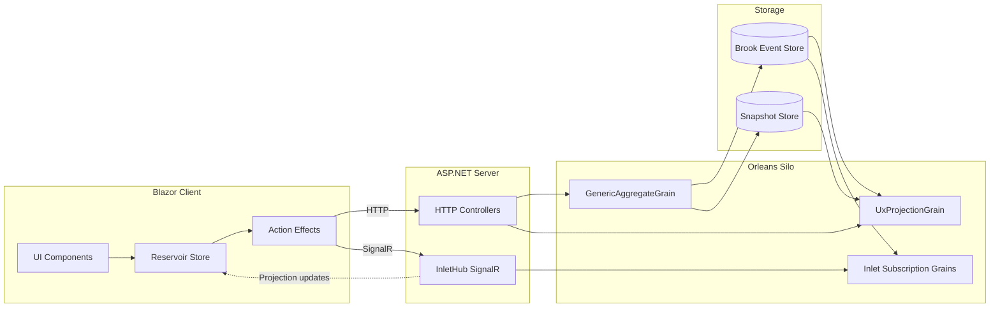

# Mississippi Architecture

## Overview

This page describes the runtime architecture used by Mississippi across the client, server, Orleans silo, and storage layers. It focuses on the concrete components used by the framework and the Spring sample.

## System Topology

Key runtime components:

- Aggregates are hosted by `GenericAggregateGrain` ([GenericAggregateGrain](https://github.com/Gibbs-Morris/mississippi/blob/main/src/EventSourcing.Aggregates/GenericAggregateGrain.cs)).
- Projections are served by `UxProjectionGrain` ([UxProjectionGrain](https://github.com/Gibbs-Morris/mississippi/blob/main/src/EventSourcing.UxProjections/UxProjectionGrain.cs)).
- Real-time updates flow through `InletHub` and subscription grains ([InletHub](https://github.com/Gibbs-Morris/mississippi/blob/main/src/Inlet.Server/InletHub.cs), [InletSubscriptionGrain](https://github.com/Gibbs-Morris/mississippi/blob/main/src/Inlet.Silo/Grains/InletSubscriptionGrain.cs)).
- Client state is managed by `Store` and optional Blazor integration via `StoreComponent` ([Store](https://github.com/Gibbs-Morris/mississippi/blob/main/src/Reservoir/Store.cs), [StoreComponent](https://github.com/Gibbs-Morris/mississippi/blob/main/src/Reservoir.Blazor/StoreComponent.cs)).

## Command Execution Flow

Commands enter via generated HTTP controllers and are routed to `GenericAggregateGrain`, which:

1. Reads the current brook position.
2. Loads state from the snapshot cache grain.
3. Executes a registered command handler.
4. Appends events to the brook writer grain.
5. Dispatches synchronous and fire-and-forget event effects.

The execution behavior is implemented in `GenericAggregateGrain` ([GenericAggregateGrain](https://github.com/Gibbs-Morris/mississippi/blob/main/src/EventSourcing.Aggregates/GenericAggregateGrain.cs)). Reducers are composed by `RootReducer` and must return new projection instances ([RootReducer](https://github.com/Gibbs-Morris/mississippi/blob/main/src/EventSourcing.Reducers/RootReducer.cs)).

## Projection Subscription Flow

Inlet provides real-time projection updates without exposing brook details to clients:

1. Clients dispatch `SubscribeToProjectionAction<T>`.
2. `InletSignalRActionEffect` establishes the SignalR connection and issues the subscription call.
3. `InletHub` routes the subscription to an `InletSubscriptionGrain` keyed by connection ID.
4. When a brook cursor moves, the subscription grain notifies the client using the hub method.
5. `InletSignalRActionEffect` fetches the projection DTO and dispatches `ProjectionUpdatedAction<T>`.

Supporting types:

- `SubscribeToProjectionAction<T>` ([SubscribeToProjectionAction](https://github.com/Gibbs-Morris/mississippi/blob/main/src/Inlet.Client.Abstractions/Actions/SubscribeToProjectionAction.cs))
- `ProjectionUpdatedAction<T>` ([ProjectionUpdatedAction](https://github.com/Gibbs-Morris/mississippi/blob/main/src/Inlet.Client.Abstractions/Actions/ProjectionUpdatedAction.cs))
- `InletSignalRActionEffect` ([InletSignalRActionEffect](https://github.com/Gibbs-Morris/mississippi/blob/main/src/Inlet.Client/ActionEffects/InletSignalRActionEffect.cs))
- `InletHub` and `InletSubscriptionGrain` ([InletHub](https://github.com/Gibbs-Morris/mississippi/blob/main/src/Inlet.Server/InletHub.cs), [InletSubscriptionGrain](https://github.com/Gibbs-Morris/mississippi/blob/main/src/Inlet.Silo/Grains/InletSubscriptionGrain.cs))

## Storage and Naming

Event and snapshot storage are abstracted behind provider interfaces:

- `IBrookStorageProvider` for event streams ([IBrookStorageProvider](https://github.com/Gibbs-Morris/mississippi/blob/main/src/EventSourcing.Brooks.Abstractions/Storage/IBrookStorageProvider.cs))
- `ISnapshotStorageProvider` for snapshots ([ISnapshotStorageProvider](https://github.com/Gibbs-Morris/mississippi/blob/main/src/EventSourcing.Snapshots.Abstractions/ISnapshotStorageProvider.cs))

Stable naming is enforced through attributes:

- `BrookNameAttribute` for brook names ([BrookNameAttribute](https://github.com/Gibbs-Morris/mississippi/blob/main/src/EventSourcing.Brooks.Abstractions/Attributes/BrookNameAttribute.cs))
- `EventStorageNameAttribute` for event storage names ([EventStorageNameAttribute](https://github.com/Gibbs-Morris/mississippi/blob/main/src/EventSourcing.Brooks.Abstractions/Attributes/EventStorageNameAttribute.cs))
- `SnapshotStorageNameAttribute` for snapshot storage names ([SnapshotStorageNameAttribute](https://github.com/Gibbs-Morris/mississippi/blob/main/src/EventSourcing.Brooks.Abstractions/Attributes/SnapshotStorageNameAttribute.cs))

The Cosmos providers use the format identifier `"cosmos-db"` ([BrookStorageProvider](https://github.com/Gibbs-Morris/mississippi/blob/main/src/EventSourcing.Brooks.Cosmos/BrookStorageProvider.cs), [SnapshotStorageProvider](https://github.com/Gibbs-Morris/mississippi/blob/main/src/EventSourcing.Snapshots.Cosmos/SnapshotStorageProvider.cs)).

## Observability

Mississippi emits OpenTelemetry-compatible metrics via the following meters:

- Aggregates: `AggregateMetrics` ([AggregateMetrics](https://github.com/Gibbs-Morris/mississippi/blob/main/src/EventSourcing.Aggregates/Diagnostics/AggregateMetrics.cs))
- Brooks: `BrookMetrics` ([BrookMetrics](https://github.com/Gibbs-Morris/mississippi/blob/main/src/EventSourcing.Brooks/Diagnostics/BrookMetrics.cs))
- Inlet: `InletMetrics` ([InletMetrics](https://github.com/Gibbs-Morris/mississippi/blob/main/src/Inlet.Silo/Diagnostics/InletMetrics.cs))

The Spring sample wires OpenTelemetry in the silo and server programs ([Spring.Silo Program.cs](https://github.com/Gibbs-Morris/mississippi/blob/main/samples/Spring/Spring.Silo/Program.cs), [Spring.Server Program.cs](https://github.com/Gibbs-Morris/mississippi/blob/main/samples/Spring/Spring.Server/Program.cs)).

## Summary

Mississippi’s architecture centers on Orleans grains for command execution and projections, Inlet for real-time projection subscriptions, and storage providers for brooks and snapshots.

## Next Steps

- [How It Works](./how-it-works.md) - Detailed walkthrough of aggregates, reducers, and projections
- [Overview](./index.md) - Marketing preview landing page
