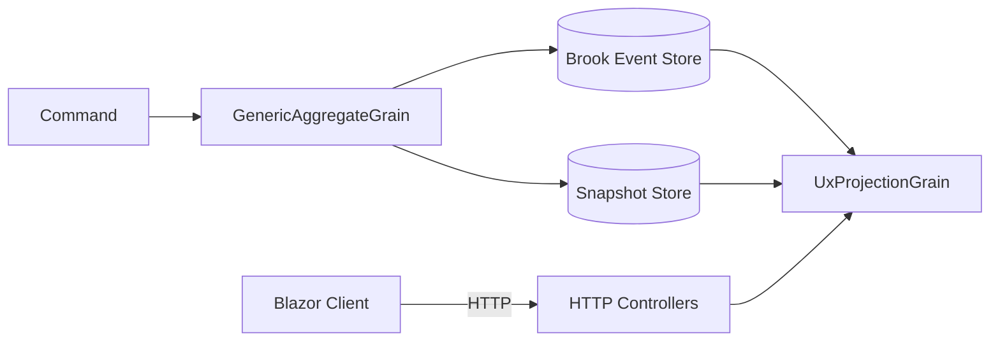

# Mississippi for Startups

Ship your MVP faster. Focus on business logic while Mississippi handles the distributed infrastructure.

:::caution Early Alpha
Mississippi is in early alpha. APIs may change without notice. Evaluate carefully before committing to production.
:::

## Overview

Startups need speed. Mississippi reduces boilerplate with source generators and provides infrastructure for commands, events, and real-time projections. Define your domain, and the framework generates HTTP controllers, client actions, and state classes via [`GenerateAggregateEndpointsAttribute`](https://github.com/Gibbs-Morris/mississippi/blob/main/src/Inlet.Generators.Abstractions/GenerateAggregateEndpointsAttribute.cs) and [`GenerateCommandAttribute`](https://github.com/Gibbs-Morris/mississippi/blob/main/src/Inlet.Generators.Abstractions/GenerateCommandAttribute.cs).

## What You Get

### Low Code, High Domain Focus

Define commands with attributes. The framework generates everything else:

```csharp
[GenerateCommand(Route = "deposit")]
[GenerateSerializer]
public sealed record DepositFunds
{
    [Id(0)] public decimal Amount { get; init; }
}
```

This generates (per [`GenerateCommandAttribute`](https://github.com/Gibbs-Morris/mississippi/blob/main/src/Inlet.Generators.Abstractions/GenerateCommandAttribute.cs)):

- `{Command}Action` client action
- `{Command}RequestDto` client request DTO
- `{Command}ActionMapper` client mapper
- `{Command}Effect` HTTP dispatch effect
- `{Command}Dto` server request DTO
- `{Command}DtoMapper` server mapper
- Controller action for the command endpoint

See the [DepositFunds command](https://github.com/Gibbs-Morris/mississippi/blob/main/samples/Spring/Spring.Domain/Aggregates/BankAccount/Commands/DepositFunds.cs) in the sample application.

### Out-of-the-Box Infrastructure

Orleans grains handle command execution with optimistic concurrency ([GenericAggregateGrain](https://github.com/Gibbs-Morris/mississippi/blob/main/src/EventSourcing.Aggregates/GenericAggregateGrain.cs)). The Spring sample shows Cosmos-backed storage wiring:



The [`GenericAggregateGrain`](https://github.com/Gibbs-Morris/mississippi/blob/main/src/EventSourcing.Aggregates/GenericAggregateGrain.cs) eliminates the need for custom grain classes per aggregate, and the Spring Silo config wires Cosmos providers ([Spring.Silo Program.cs](https://github.com/Gibbs-Morris/mississippi/blob/main/samples/Spring/Spring.Silo/Program.cs)).

### Real-Time UI

[`InletHub`](https://github.com/Gibbs-Morris/mississippi/blob/main/src/Inlet.Server/InletHub.cs) pushes projection updates via SignalR. Subscribe to a projection DTO and render updates as they arrive:

```csharp
store.Dispatch(
    new SubscribeToProjectionAction<BankAccountBalanceProjectionDto>(accountId));
```

The [`InletSignalRActionEffect`](https://github.com/Gibbs-Morris/mississippi/blob/main/src/Inlet.Client/ActionEffects/InletSignalRActionEffect.cs) manages subscriptions and dispatches projection updates into the client store.

### Testing Without Infrastructure

[`AggregateTestHarness`](https://github.com/Gibbs-Morris/mississippi/blob/main/src/EventSourcing.Testing/Aggregates/AggregateTestHarness.cs) enables Given/When/Then tests without databases:

```csharp
ForAggregate<BankAccountAggregate>()
    .WithHandler<DepositFundsHandler>()
    .WithReducer<FundsDepositedReducer>()
    .CreateScenario()
    .Given(new AccountOpened { HolderName = "Test", InitialDeposit = 100m })
    .When(new DepositFunds { Amount = 50m })
    .ThenEmits<FundsDeposited>(e => e.Amount.Should().Be(50m))
    .ThenState(s => s.Balance.Should().Be(150m));
```

Iterate on domain logic with confidence before wiring in infrastructure.

## Startup Benefits

| Benefit | How Mississippi Delivers |
|---------|--------------------------|
| **Speed** | Source generators eliminate boilerplate ([GenerateCommandAttribute](https://github.com/Gibbs-Morris/mississippi/blob/main/src/Inlet.Generators.Abstractions/GenerateCommandAttribute.cs)) |
| **Scale** | Aggregates and projections run as Orleans grains ([GenericAggregateGrain](https://github.com/Gibbs-Morris/mississippi/blob/main/src/EventSourcing.Aggregates/GenericAggregateGrain.cs), [UxProjectionGrain](https://github.com/Gibbs-Morris/mississippi/blob/main/src/EventSourcing.UxProjections/UxProjectionGrain.cs)) |
| **Real-time** | SignalR pushes projection updates via [`InletHub`](https://github.com/Gibbs-Morris/mississippi/blob/main/src/Inlet.Server/InletHub.cs) |
| **Flexibility** | Projections are separate read models identified by [`ProjectionPathAttribute`](https://github.com/Gibbs-Morris/mississippi/blob/main/src/Inlet.Abstractions/ProjectionPathAttribute.cs) |
| **Testability** | Fluent test harness for fast iteration on business rules ([AggregateTestHarness](https://github.com/Gibbs-Morris/mississippi/blob/main/src/EventSourcing.Testing/Aggregates/AggregateTestHarness.cs)) |

## Sample Application

The Spring sample demonstrates a banking application with:

- Account opening, deposits, and withdrawals
- Real-time balance projections
- Transaction ledger with recent entries
- High-value transaction flagging for compliance

See the [Spring sample](https://github.com/Gibbs-Morris/mississippi/tree/main/samples/Spring) for a complete working example.

## Summary

Mississippi lets startups focus on business logic. Source generators handle the plumbing, Orleans grains host the aggregates, and Inlet provides real-time projection updates.

## Next Steps

- [How It Works](./how-it-works.md) - Understand the architecture
- [For Enterprise](./for-enterprise.md) - Patterns for scaling teams
- [Overview](./index.md) - Return to the main landing page
