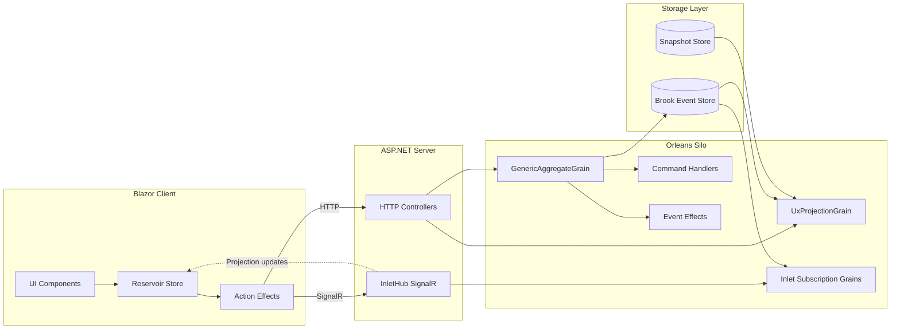

# How Mississippi Works

A technical overview of Mississippi's architecture: aggregates, events, reducers, projections, and client integration.

:::caution Early Alpha
Mississippi is in early alpha. APIs may change without notice.
:::

## Overview

Mississippi uses Orleans grains for command execution and read models. Commands are handled by [`GenericAggregateGrain`](https://github.com/Gibbs-Morris/mississippi/blob/main/src/EventSourcing.Aggregates/GenericAggregateGrain.cs), which appends events to brooks and dispatches effects. Reducers apply those events to rebuild state. Projections are served via [`UxProjectionGrain`](https://github.com/Gibbs-Morris/mississippi/blob/main/src/EventSourcing.UxProjections/UxProjectionGrain.cs), and Inlet uses SignalR via [`InletHub`](https://github.com/Gibbs-Morris/mississippi/blob/main/src/Inlet.Server/InletHub.cs) to notify subscribed clients of projection updates.

## Architecture Diagram



## Aggregate Lifecycle

### Defining the Model

Aggregates are records in the Spring sample, decorated with attributes:

```csharp
[BrookName("SPRING", "BANKING", "ACCOUNT")]
[SnapshotStorageName("SPRING", "BANKING", "ACCOUNTSTATE")]
[GenerateAggregateEndpoints]
[GenerateSerializer]
public sealed record BankAccountAggregate
{
    [Id(0)] public decimal Balance { get; init; }
    [Id(3)] public int DepositCount { get; init; }
    [Id(2)] public string HolderName { get; init; }
    [Id(1)] public bool IsOpen { get; init; }
    [Id(4)] public int WithdrawalCount { get; init; }
}
```

See [BankAccountAggregate.cs](https://github.com/Gibbs-Morris/mississippi/blob/main/samples/Spring/Spring.Domain/Aggregates/BankAccount/BankAccountAggregate.cs).

### Commands

Commands are input messages decorated with `[GenerateCommand]`:

```csharp
[GenerateCommand(Route = "deposit")]
[GenerateSerializer]
public sealed record DepositFunds
{
    [Id(0)] public decimal Amount { get; init; }
}
```

Source generators produce HTTP controller actions, client actions, and DTOs based on [`GenerateCommandAttribute`](https://github.com/Gibbs-Morris/mississippi/blob/main/src/Inlet.Generators.Abstractions/GenerateCommandAttribute.cs).

### Handlers

Command handlers inherit from `CommandHandlerBase` and implement `HandleCore`:

```csharp
protected override OperationResult<IReadOnlyList<object>> HandleCore(
    DepositFunds command,
    BankAccountAggregate? state)
{
    if (state?.IsOpen != true)
    {
        return OperationResult.Fail<IReadOnlyList<object>>(
            AggregateErrorCodes.InvalidState,
            "Account must be open before depositing funds.");
    }

    if (command.Amount <= 0)
    {
        return OperationResult.Fail<IReadOnlyList<object>>(
            AggregateErrorCodes.InvalidCommand,
            "Deposit amount must be positive.");
    }

    return OperationResult.Ok<IReadOnlyList<object>>(
        new object[]
        {
            new FundsDeposited
            {
                Amount = command.Amount,
            },
        });
}
```

See [DepositFundsHandler.cs](https://github.com/Gibbs-Morris/mississippi/blob/main/samples/Spring/Spring.Domain/Aggregates/BankAccount/Handlers/DepositFundsHandler.cs).

### Executing Commands

[`GenericAggregateGrain`](https://github.com/Gibbs-Morris/mississippi/blob/main/src/EventSourcing.Aggregates/GenericAggregateGrain.cs) coordinates command execution:

1. Read the current brook position
2. Fetch current state from the snapshot cache grain
3. Execute the registered command handler
4. Append events to the brook writer grain
5. Dispatch synchronous and fire-and-forget event effects

### Reducers

Reducers transform events into state:

```csharp
public sealed class FundsDepositedReducer 
    : IEventReducer<BankAccountAggregate>
{
    public BankAccountAggregate Reduce(
        FundsDeposited @event, 
        BankAccountAggregate state)
    {
        return (state ?? new()) with
        {
            Balance = (state?.Balance ?? 0) + @event.Amount,
            DepositCount = (state?.DepositCount ?? 0) + 1,
        };
    }
}
```

[`RootReducer`](https://github.com/Gibbs-Morris/mississippi/blob/main/src/EventSourcing.Reducers/RootReducer.cs) indexes reducers by event type for efficient dispatch.

### Event Effects (Side Effects)

Effects run after events persist. The [HighValueTransactionEffect](https://github.com/Gibbs-Morris/mississippi/blob/main/samples/Spring/Spring.Domain/Aggregates/BankAccount/Effects/HighValueTransactionEffect.cs) demonstrates cross-aggregate command dispatch:

```csharp
protected override async Task HandleSimpleAsync(
    FundsDeposited eventData,
    BankAccountAggregate currentState,
    string brookKey,
    long eventPosition,
    CancellationToken cancellationToken)
{
    if (eventData.Amount <= AmlThreshold)
    {
        return;
    }

    IGenericAggregateGrain<TransactionInvestigationQueueAggregate> grain =
        AggregateGrainFactory.GetGenericAggregate<TransactionInvestigationQueueAggregate>("global");
    await grain.ExecuteAsync(new FlagTransaction { ... }, cancellationToken);
}
```

## Projections

Projections create read-optimised views from event streams:

```csharp
[ProjectionPath("bank-account-balance")]
[BrookName("SPRING", "BANKING", "ACCOUNT")]
[SnapshotStorageName("SPRING", "BANKING", "ACCOUNTBALANCE")]
[GenerateProjectionEndpoints]
public sealed record BankAccountBalanceProjection
{
    [Id(0)] public decimal Balance { get; init; }
    [Id(1)] public string HolderName { get; init; }
    [Id(2)] public bool IsOpen { get; init; }
}
```

See [BankAccountBalanceProjection.cs](https://github.com/Gibbs-Morris/mississippi/blob/main/samples/Spring/Spring.Domain/Projections/BankAccountBalance/BankAccountBalanceProjection.cs).

`[ProjectionPath]` defines the API and SignalR routing path. [`GenerateProjectionEndpointsAttribute`](https://github.com/Gibbs-Morris/mississippi/blob/main/src/Inlet.Generators.Abstractions/GenerateProjectionEndpointsAttribute.cs) generates read-only HTTP endpoints, and client subscription code is emitted when `GenerateProjectionEndpointsAttribute.GenerateClientSubscription` is `true`.

## Client-Side Integration

### Reservoir Store

[`Store`](https://github.com/Gibbs-Morris/mississippi/blob/main/src/Reservoir/Store.cs) implements a Redux-like pattern:

- Feature states implement [`IFeatureState`](https://github.com/Gibbs-Morris/mississippi/blob/main/src/Reservoir.Abstractions/State/IFeatureState.cs)
- Actions are dispatched through middleware and reducers ([`IStore`](https://github.com/Gibbs-Morris/mississippi/blob/main/src/Reservoir.Abstractions/IStore.cs))
- Effects handle async operations via [`IActionEffect`](https://github.com/Gibbs-Morris/mississippi/blob/main/src/Reservoir.Abstractions/IActionEffect%7BTState%7D.cs)
 

### SignalR Connection

[`InletSignalRActionEffect`](https://github.com/Gibbs-Morris/mississippi/blob/main/src/Inlet.Client/ActionEffects/InletSignalRActionEffect.cs) manages the SignalR connection:

- Subscribes to projections via [`SubscribeToProjectionAction<T>`](https://github.com/Gibbs-Morris/mississippi/blob/main/src/Inlet.Client.Abstractions/Actions/SubscribeToProjectionAction.cs)
- Handles reconnection and resubscription
- Dispatches [`ProjectionUpdatedAction<T>`](https://github.com/Gibbs-Morris/mississippi/blob/main/src/Inlet.Client.Abstractions/Actions/ProjectionUpdatedAction.cs) when updates arrive

### UI Binding

Blazor components can use [`StoreComponent`](https://github.com/Gibbs-Morris/mississippi/blob/main/src/Reservoir.Blazor/StoreComponent.cs) to subscribe to store changes and re-render on updates. The [Index.razor.cs](https://github.com/Gibbs-Morris/mississippi/blob/main/samples/Spring/Spring.Client/Pages/Index.razor.cs) in the Spring sample demonstrates:

- Command dispatch (deposit, withdraw)
- Projection subscription management
- Real-time balance and ledger display

## Storage Abstraction

Mississippi is not tied to specific storage:

| Interface | Purpose |
|-----------|---------|
| [`IBrookStorageProvider`](https://github.com/Gibbs-Morris/mississippi/blob/main/src/EventSourcing.Brooks.Abstractions/Storage/IBrookStorageProvider.cs) | Event stream storage |
| [`ISnapshotStorageProvider`](https://github.com/Gibbs-Morris/mississippi/blob/main/src/EventSourcing.Snapshots.Abstractions/ISnapshotStorageProvider.cs) | Snapshot storage |

Each provider declares a `Format` identifier (for example, the Cosmos providers use `"cosmos-db"`). Register custom providers via extension methods:

- [`RegisterBrookStorageProvider`](https://github.com/Gibbs-Morris/mississippi/blob/main/src/EventSourcing.Brooks.Abstractions/Storage/BrookStorageProviderExtensions.cs)
- [`RegisterSnapshotStorageProvider`](https://github.com/Gibbs-Morris/mississippi/blob/main/src/EventSourcing.Snapshots.Abstractions/SnapshotStorageProviderExtensions.cs)

## Testing

[`AggregateTestHarness`](https://github.com/Gibbs-Morris/mississippi/blob/main/src/EventSourcing.Testing/Aggregates/AggregateTestHarness.cs) enables Given/When/Then tests:

```csharp
ForAggregate<BankAccountAggregate>()
    .WithHandler<OpenAccountHandler>()
    .WithReducer<AccountOpenedReducer>()
    .CreateScenario()
    .Given() // Empty state
    .When(new OpenAccount { HolderName = "Test", InitialDeposit = 100m })
    .ThenEmits<AccountOpened>()
    .ThenState(s => s.Balance.Should().Be(100m));
```

Test domain logic without infrastructure.

## Summary

Mississippi combines Orleans grains, event streams, and SignalR-based subscriptions:

1. Commands enter via generated controllers
2. `GenericAggregateGrain` executes handlers and persists events
3. Reducers rebuild state from events
4. Effects handle cross-aggregate and external side effects
5. Projections provide read-optimised views
6. SignalR pushes updates to clients
7. Reservoir store manages client state

## Next Steps

- [For Startups](./for-startups.md) - Rapid development patterns
- [For Enterprise](./for-enterprise.md) - Scaling teams
- [For Financial Services](./for-financial-services.md) - Compliance patterns
- [Architecture](./architecture.md) - System topology and runtime flows
- [Overview](./index.md) - Return to the main landing page
