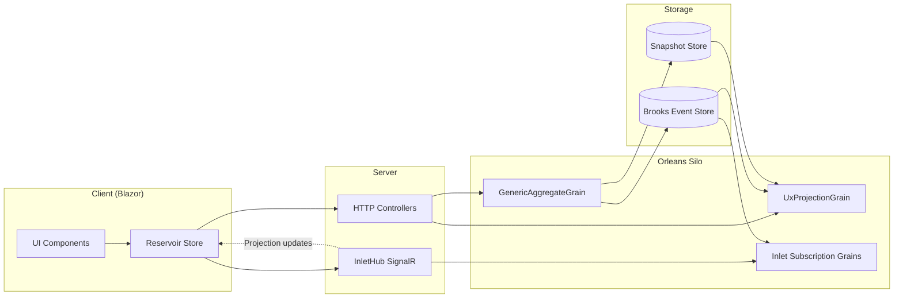

# Mississippi Framework

Overview of the Mississippi framework components and runtime flow.

:::caution Early Alpha
Mississippi is in early alpha. APIs may change without notice. Not recommended for production use at this time. See the
[README warning](https://github.com/Gibbs-Morris/mississippi/blob/main/README.md#L3).
:::

## Overview

Mississippi targets .NET 10 and C# 14 ([Directory.Build.props](https://github.com/Gibbs-Morris/mississippi/blob/main/Directory.Build.props#L6-L7)).
Aggregates and UX projections run as Orleans grains ([GenericAggregateGrain](https://github.com/Gibbs-Morris/mississippi/blob/main/src/EventSourcing.Aggregates/GenericAggregateGrain.cs#L27-L55),
[UxProjectionGrain](https://github.com/Gibbs-Morris/mississippi/blob/main/src/EventSourcing.UxProjections/UxProjectionGrain.cs#L31-L67)).
Code generation is driven by attributes such as
[GenerateAggregateEndpointsAttribute](https://github.com/Gibbs-Morris/mississippi/blob/main/src/Inlet.Generators.Abstractions/GenerateAggregateEndpointsAttribute.cs#L7-L33)
and [GenerateCommandAttribute](https://github.com/Gibbs-Morris/mississippi/blob/main/src/Inlet.Generators.Abstractions/GenerateCommandAttribute.cs#L7-L37).

## Why Mississippi

| Challenge | Mississippi Solution |
|-----------|---------------------|
| **Boilerplate** | Source generators produce server controllers and client actions from attributes ([GenerateAggregateEndpointsAttribute](https://github.com/Gibbs-Morris/mississippi/blob/main/src/Inlet.Generators.Abstractions/GenerateAggregateEndpointsAttribute.cs#L7-L33), [GenerateCommandAttribute](https://github.com/Gibbs-Morris/mississippi/blob/main/src/Inlet.Generators.Abstractions/GenerateCommandAttribute.cs#L7-L37)) |
| **Scalability** | Aggregates and UX projections run as Orleans grains ([GenericAggregateGrain](https://github.com/Gibbs-Morris/mississippi/blob/main/src/EventSourcing.Aggregates/GenericAggregateGrain.cs#L27-L55), [UxProjectionGrain](https://github.com/Gibbs-Morris/mississippi/blob/main/src/EventSourcing.UxProjections/UxProjectionGrain.cs#L31-L67)) |
| **Audit trails** | Events use stable storage names via [`EventStorageNameAttribute`](https://github.com/Gibbs-Morris/mississippi/blob/main/src/EventSourcing.Brooks.Abstractions/Attributes/EventStorageNameAttribute.cs#L7-L52) |
| **Real-time UI** | Inlet subscription grains send projection update notifications to SignalR clients connected to [`InletHub`](https://github.com/Gibbs-Morris/mississippi/blob/main/src/Inlet.Server/InletHub.cs#L15-L94) ([InletSubscriptionGrain](https://github.com/Gibbs-Morris/mississippi/blob/main/src/Inlet.Silo/Grains/InletSubscriptionGrain.cs#L191-L224)) |
| **Testing** | `AggregateTestHarness` supports Given/When/Then aggregate scenarios ([AggregateTestHarness](https://github.com/Gibbs-Morris/mississippi/blob/main/src/EventSourcing.Testing/Aggregates/AggregateTestHarness.cs#L11-L98)) |

## Core Components

Mississippi provides a set of libraries:

| Library | Purpose |
|---------|---------|
| **Brooks** | Event stream naming attributes [`BrookNameAttribute`](https://github.com/Gibbs-Morris/mississippi/blob/main/src/EventSourcing.Brooks.Abstractions/Attributes/BrookNameAttribute.cs#L7-L52) and [`EventStorageNameAttribute`](https://github.com/Gibbs-Morris/mississippi/blob/main/src/EventSourcing.Brooks.Abstractions/Attributes/EventStorageNameAttribute.cs#L7-L52) |
| **Aggregates** | Generic aggregate grain for command execution ([`GenericAggregateGrain`](https://github.com/Gibbs-Morris/mississippi/blob/main/src/EventSourcing.Aggregates/GenericAggregateGrain.cs#L27-L55)) |
| **Reducers** | Root reducer that composes event reducers ([`RootReducer`](https://github.com/Gibbs-Morris/mississippi/blob/main/src/EventSourcing.Reducers/RootReducer.cs#L18-L60)) |
| **Reservoir** | Client store with actions, reducers, middleware, and effects ([`Store`](https://github.com/Gibbs-Morris/mississippi/blob/main/src/Reservoir/Store.cs#L14-L120)) |
| **Inlet** | SignalR hub for projection subscriptions ([`InletHub`](https://github.com/Gibbs-Morris/mississippi/blob/main/src/Inlet.Server/InletHub.cs#L15-L94)) |
| **Generators** | Source generator attributes [`GenerateAggregateEndpoints`](https://github.com/Gibbs-Morris/mississippi/blob/main/src/Inlet.Generators.Abstractions/GenerateAggregateEndpointsAttribute.cs#L7-L76) and [`GenerateCommand`](https://github.com/Gibbs-Morris/mississippi/blob/main/src/Inlet.Generators.Abstractions/GenerateCommandAttribute.cs#L7-L73) |
| **Testing** | `AggregateTestHarness` for Given/When/Then aggregate scenarios ([AggregateTestHarness](https://github.com/Gibbs-Morris/mississippi/blob/main/src/EventSourcing.Testing/Aggregates/AggregateTestHarness.cs#L11-L98)) |

## Technology Stack

- **.NET 10.0** with **C# 14.0** ([Directory.Build.props](https://github.com/Gibbs-Morris/mississippi/blob/main/Directory.Build.props#L6-L7))
- **Microsoft Orleans** packages for grains and clustering ([Directory.Packages.props](https://github.com/Gibbs-Morris/mississippi/blob/main/Directory.Packages.props#L43-L52))
- **Azure Cosmos DB** providers for event and snapshot storage ([BrookStorageProvider](https://github.com/Gibbs-Morris/mississippi/blob/main/src/EventSourcing.Brooks.Cosmos/BrookStorageProvider.cs#L12-L92), [SnapshotStorageProvider](https://github.com/Gibbs-Morris/mississippi/blob/main/src/EventSourcing.Snapshots.Cosmos/SnapshotStorageProvider.cs#L12-L118))
- **SignalR** hub for projection subscriptions ([InletHub](https://github.com/Gibbs-Morris/mississippi/blob/main/src/Inlet.Server/InletHub.cs#L15-L94))
- **Blazor** components wired to the Reservoir store ([StoreComponent](https://github.com/Gibbs-Morris/mississippi/blob/main/src/Reservoir.Blazor/StoreComponent.cs#L12-L82))

## Summary

This page summarizes the core components and how client, server, silo, and storage pieces connect in the overview diagram.

## Next Steps

Choose your path based on your role:

- [For Startups](./for-startups.md) - Build MVPs faster with less infrastructure code
- [For Enterprise](./for-enterprise.md) - Scale teams with consistent patterns
- [For Financial Services](./for-financial-services.md) - Meet regulatory requirements with built-in audit trails
- [For Game Developers](./for-game-developers.md) - Real-time multiplayer with event replay
- [For AI-Assisted Development](./for-ai-developers.md) - Opinionated patterns that amplify AI productivity
- [How It Works](./how-it-works.md) - Technical deep dive into the architecture
- [Architecture](./architecture.md) - System topology and runtime flows
