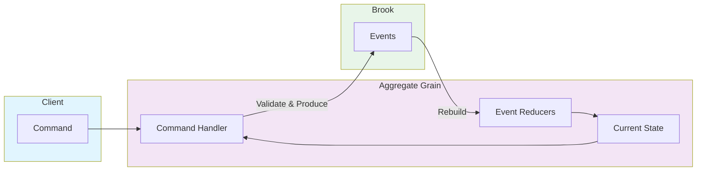
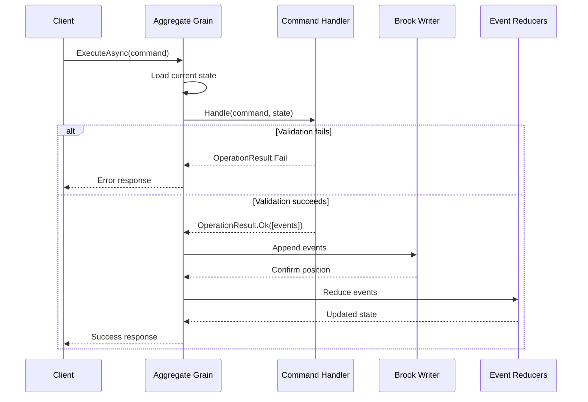

# Aggregates

Aggregates are the command-processing core of Mississippi event sourcing. They enforce business rules, validate commands against current state, and emit domain events that become the immutable source of truth.

## Overview

In Mississippi, aggregates follow the Command Query Responsibility Segregation (CQRS) pattern:

- **Commands** express intent to change state
- **Command handlers** validate commands and produce events
- **Events** are persisted to brooks (event streams)
- **Event reducers** rebuild aggregate state from events



## Key Concepts

| Concept | Description |
|---------|-------------|
| **Aggregate** | A record type representing the aggregate state, decorated with storage attributes |
| **Command** | An immutable record expressing intent to change state |
| **Command Handler** | Validates commands against current state and produces events |
| **Event** | An immutable fact that has occurred, persisted to the brook |
| **Event Reducer** | Transforms events into aggregate state |

## Defining an Aggregate

An aggregate is a record that represents your domain entity's state. Decorate it with the required attributes:

```csharp
using Mississippi.EventSourcing.Brooks.Abstractions.Attributes;
using Mississippi.Inlet.Generators.Abstractions;
using Orleans;

[BrookName("MYAPP", "BANKING", "ACCOUNT")]
[SnapshotStorageName("MYAPP", "BANKING", "ACCOUNTSTATE")]
[GenerateAggregateEndpoints]
[GenerateSerializer]
[Alias("MyApp.Domain.BankAccountAggregate")]
public sealed record BankAccountAggregate
{
    [Id(0)]
    public decimal Balance { get; init; }

    [Id(1)]
    public bool IsOpen { get; init; }

    [Id(2)]
    public string HolderName { get; init; } = string.Empty;

    [Id(3)]
    public int DepositCount { get; init; }

    [Id(4)]
    public int WithdrawalCount { get; init; }
}
```

### Required Attributes

| Attribute | Purpose |
|-----------|---------|
| `[BrookName]` | Defines the event stream storage location |
| `[SnapshotStorageName]` | Defines where snapshots are stored |
| `[GenerateAggregateEndpoints]` | Enables source generation for API endpoints |
| `[GenerateSerializer]` | Orleans serialization support |
| `[Alias]` | Stable type name for serialization |

## Defining Commands

Commands are immutable records that express user intent. They carry the data needed to validate and execute the operation:

```csharp
using Mississippi.Inlet.Generators.Abstractions;
using Orleans;

[GenerateCommand(Route = "open")]
[GenerateSerializer]
[Alias("MyApp.Domain.Commands.OpenAccount")]
public sealed record OpenAccount(
    [property: Id(0)] string HolderName,
    [property: Id(1)] decimal InitialDeposit = 0
);

[GenerateCommand(Route = "deposit")]
[GenerateSerializer]
[Alias("MyApp.Domain.Commands.DepositFunds")]
public sealed record DepositFunds(
    [property: Id(0)] decimal Amount
);

[GenerateCommand(Route = "withdraw")]
[GenerateSerializer]
[Alias("MyApp.Domain.Commands.WithdrawFunds")]
public sealed record WithdrawFunds(
    [property: Id(0)] decimal Amount
);
```

### Command Naming Conventions

| Pattern | Example |
|---------|---------|
| Action-oriented verbs | `OpenAccount`, `DepositFunds`, `WithdrawFunds` |
| Clear intent | `TransferFunds` not `DoTransfer` |
| Include necessary data | All data needed for validation |

## Defining Events

Events represent facts that have occurred. They are immutable and stored permanently in the brook:

```csharp
using Mississippi.EventSourcing.Brooks.Abstractions.Attributes;
using Orleans;

[EventStorageName("MYAPP", "BANKING", "ACCOUNTOPENED")]
[GenerateSerializer]
[Alias("MyApp.Domain.Events.AccountOpened")]
internal sealed record AccountOpened
{
    [Id(0)]
    public string HolderName { get; init; } = string.Empty;

    [Id(1)]
    public decimal InitialDeposit { get; init; }
}

[EventStorageName("MYAPP", "BANKING", "FUNDSDEPOSITED")]
[GenerateSerializer]
[Alias("MyApp.Domain.Events.FundsDeposited")]
internal sealed record FundsDeposited
{
    [Id(0)]
    public decimal Amount { get; init; }
}

[EventStorageName("MYAPP", "BANKING", "FUNDSWITHDRAWN")]
[GenerateSerializer]
[Alias("MyApp.Domain.Events.FundsWithdrawn")]
internal sealed record FundsWithdrawn
{
    [Id(0)]
    public decimal Amount { get; init; }
}
```

### Event Naming Conventions

| Pattern | Example |
|---------|---------|
| Past tense | `AccountOpened`, `FundsDeposited` |
| Describe what happened | `FundsWithdrawn` not `WithdrawFunds` |
| Include relevant data | All data needed to rebuild state |

## Implementing Command Handlers

Command handlers contain business logic. They validate commands against current state and produce events on success:

```csharp
using System.Collections.Generic;
using Mississippi.EventSourcing.Aggregates.Abstractions;

internal sealed class OpenAccountHandler
    : CommandHandlerBase<OpenAccount, BankAccountAggregate>
{
    protected override OperationResult<IReadOnlyList<object>> HandleCore(
        OpenAccount command,
        BankAccountAggregate? state)
    {
        // Validate: prevent re-opening
        if (state?.IsOpen == true)
        {
            return OperationResult.Fail<IReadOnlyList<object>>(
                AggregateErrorCodes.AlreadyExists,
                "Account is already open.");
        }

        // Validate: holder name required
        if (string.IsNullOrWhiteSpace(command.HolderName))
        {
            return OperationResult.Fail<IReadOnlyList<object>>(
                AggregateErrorCodes.InvalidCommand,
                "Account holder name is required.");
        }

        // Validate: no negative deposits
        if (command.InitialDeposit < 0)
        {
            return OperationResult.Fail<IReadOnlyList<object>>(
                AggregateErrorCodes.InvalidCommand,
                "Initial deposit cannot be negative.");
        }

        // Success: produce event
        return OperationResult.Ok<IReadOnlyList<object>>(
        [
            new AccountOpened
            {
                HolderName = command.HolderName,
                InitialDeposit = command.InitialDeposit,
            },
        ]);
    }
}

internal sealed class DepositFundsHandler
    : CommandHandlerBase<DepositFunds, BankAccountAggregate>
{
    protected override OperationResult<IReadOnlyList<object>> HandleCore(
        DepositFunds command,
        BankAccountAggregate? state)
    {
        // Validate: account must be open
        if (state?.IsOpen != true)
        {
            return OperationResult.Fail<IReadOnlyList<object>>(
                AggregateErrorCodes.NotFound,
                "Account is not open.");
        }

        // Validate: positive amount
        if (command.Amount <= 0)
        {
            return OperationResult.Fail<IReadOnlyList<object>>(
                AggregateErrorCodes.InvalidCommand,
                "Deposit amount must be positive.");
        }

        return OperationResult.Ok<IReadOnlyList<object>>(
        [
            new FundsDeposited { Amount = command.Amount },
        ]);
    }
}

internal sealed class WithdrawFundsHandler
    : CommandHandlerBase<WithdrawFunds, BankAccountAggregate>
{
    protected override OperationResult<IReadOnlyList<object>> HandleCore(
        WithdrawFunds command,
        BankAccountAggregate? state)
    {
        if (state?.IsOpen != true)
        {
            return OperationResult.Fail<IReadOnlyList<object>>(
                AggregateErrorCodes.NotFound,
                "Account is not open.");
        }

        if (command.Amount <= 0)
        {
            return OperationResult.Fail<IReadOnlyList<object>>(
                AggregateErrorCodes.InvalidCommand,
                "Withdrawal amount must be positive.");
        }

        if (state.Balance < command.Amount)
        {
            return OperationResult.Fail<IReadOnlyList<object>>(
                AggregateErrorCodes.InvalidCommand,
                "Insufficient funds.");
        }

        return OperationResult.Ok<IReadOnlyList<object>>(
        [
            new FundsWithdrawn { Amount = command.Amount },
        ]);
    }
}
```

### OperationResult Pattern

Command handlers return `OperationResult<IReadOnlyList<object>>`:

```csharp
// Success with events
return OperationResult.Ok<IReadOnlyList<object>>([event1, event2]);

// Failure with error
return OperationResult.Fail<IReadOnlyList<object>>(
    AggregateErrorCodes.InvalidCommand,
    "Human-readable error message.");
```

### Standard Error Codes

| Code | Use Case |
|------|----------|
| `AlreadyExists` | Entity already exists (duplicate creation) |
| `NotFound` | Entity does not exist |
| `InvalidCommand` | Command data validation failed |
| `ConcurrencyConflict` | Optimistic concurrency check failed |
| `CommandHandlerNotFound` | No handler registered for command type |

## Implementing Event Reducers

Event reducers transform events into aggregate state. They must be pure functions that return new state instances:

```csharp
using Mississippi.EventSourcing.Reducers.Abstractions;

internal sealed class AccountOpenedReducer
    : EventReducerBase<AccountOpened, BankAccountAggregate>
{
    protected override BankAccountAggregate ReduceCore(
        BankAccountAggregate state,
        AccountOpened @event)
    {
        return (state ?? new()) with
        {
            IsOpen = true,
            HolderName = @event.HolderName,
            Balance = @event.InitialDeposit,
        };
    }
}

internal sealed class FundsDepositedReducer
    : EventReducerBase<FundsDeposited, BankAccountAggregate>
{
    protected override BankAccountAggregate ReduceCore(
        BankAccountAggregate state,
        FundsDeposited @event)
    {
        return state with
        {
            Balance = state.Balance + @event.Amount,
            DepositCount = state.DepositCount + 1,
        };
    }
}

internal sealed class FundsWithdrawnReducer
    : EventReducerBase<FundsWithdrawn, BankAccountAggregate>
{
    protected override BankAccountAggregate ReduceCore(
        BankAccountAggregate state,
        FundsWithdrawn @event)
    {
        return state with
        {
            Balance = state.Balance - @event.Amount,
            WithdrawalCount = state.WithdrawalCount + 1,
        };
    }
}
```

### Reducer Rules

1. **Pure functions** — Same inputs always produce same outputs
2. **No side effects** — No I/O, logging, or external calls
3. **Immutable updates** — Always return new state with `with` expression
4. **Handle null state** — First event may have null initial state

## Command Flow

The complete flow from command to persisted event:



## Folder Structure

Organize aggregate code by domain concept:

```text
Domain/
└── Aggregates/
    └── BankAccount/
        ├── BankAccountAggregate.cs    # Aggregate state
        ├── Commands/
        │   ├── OpenAccount.cs
        │   ├── DepositFunds.cs
        │   └── WithdrawFunds.cs
        ├── Events/
        │   ├── AccountOpened.cs
        │   ├── FundsDeposited.cs
        │   └── FundsWithdrawn.cs
        ├── Handlers/
        │   ├── OpenAccountHandler.cs
        │   ├── DepositFundsHandler.cs
        │   └── WithdrawFundsHandler.cs
        └── Reducers/
            ├── AccountOpenedReducer.cs
            ├── FundsDepositedReducer.cs
            └── FundsWithdrawnReducer.cs
```

## Orleans Threading Model

Aggregates run as Orleans grains with **single-threaded execution**:

- One aggregate instance handles one entity ID
- Commands execute sequentially, never concurrently
- This eliminates race conditions within an aggregate
- But can become a bottleneck if one aggregate handles too much

See [Design Patterns](./design-patterns.md) for guidance on aggregate sizing.

## Registration

Register aggregate components in your silo:

```csharp
// In Silo configuration
siloBuilder.ConfigureServices(services =>
{
    // Register command handlers
    services.AddCommandHandler<OpenAccountHandler, BankAccountAggregate>();
    services.AddCommandHandler<DepositFundsHandler, BankAccountAggregate>();
    services.AddCommandHandler<WithdrawFundsHandler, BankAccountAggregate>();

    // Register event reducers
    services.AddEventReducer<AccountOpenedReducer, BankAccountAggregate>();
    services.AddEventReducer<FundsDepositedReducer, BankAccountAggregate>();
    services.AddEventReducer<FundsWithdrawnReducer, BankAccountAggregate>();
});
```

## Best Practices

### Keep Aggregates Focused

Each aggregate should represent a single consistency boundary:

```csharp
// ✅ Good: Focused on one entity
public sealed record BankAccountAggregate { ... }
public sealed record CustomerAggregate { ... }

// ❌ Bad: Multiple concerns in one aggregate
public sealed record BankingAggregate
{
    public List<Account> Accounts { get; init; }
    public List<Customer> Customers { get; init; }
    public List<Transaction> Transactions { get; init; }
}
```

### Validate Early, Fail Fast

Check all preconditions before producing events:

```csharp
protected override OperationResult<IReadOnlyList<object>> HandleCore(
    WithdrawFunds command,
    BankAccountAggregate? state)
{
    // Validate all conditions first
    if (state?.IsOpen != true)
        return OperationResult.Fail<IReadOnlyList<object>>(...);

    if (command.Amount <= 0)
        return OperationResult.Fail<IReadOnlyList<object>>(...);

    if (state.Balance < command.Amount)
        return OperationResult.Fail<IReadOnlyList<object>>(...);

    // Only produce events after all validation passes
    return OperationResult.Ok<IReadOnlyList<object>>([...]);
}
```

### Events Are Facts

Events describe what happened, not what should happen:

```csharp
// ✅ Good: Past tense, describes the fact
new FundsDeposited { Amount = 100 }

// ❌ Bad: Future tense or imperative
new DepositFunds { Amount = 100 }
```
