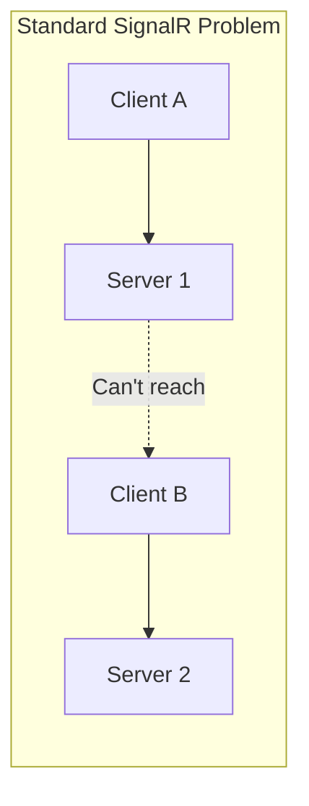
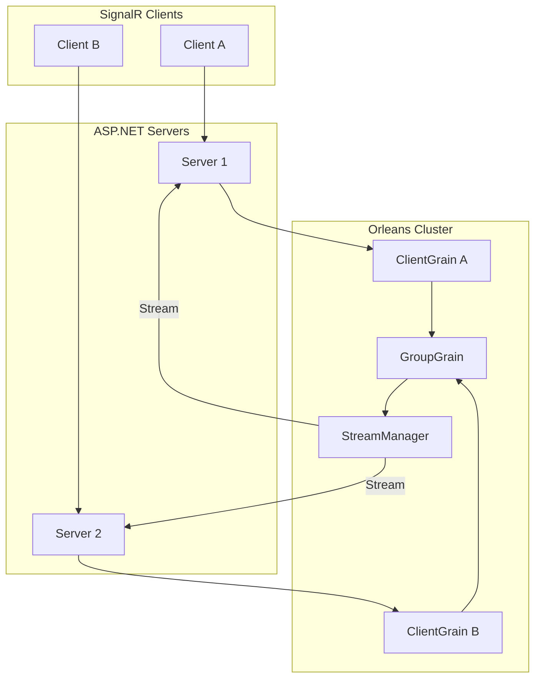
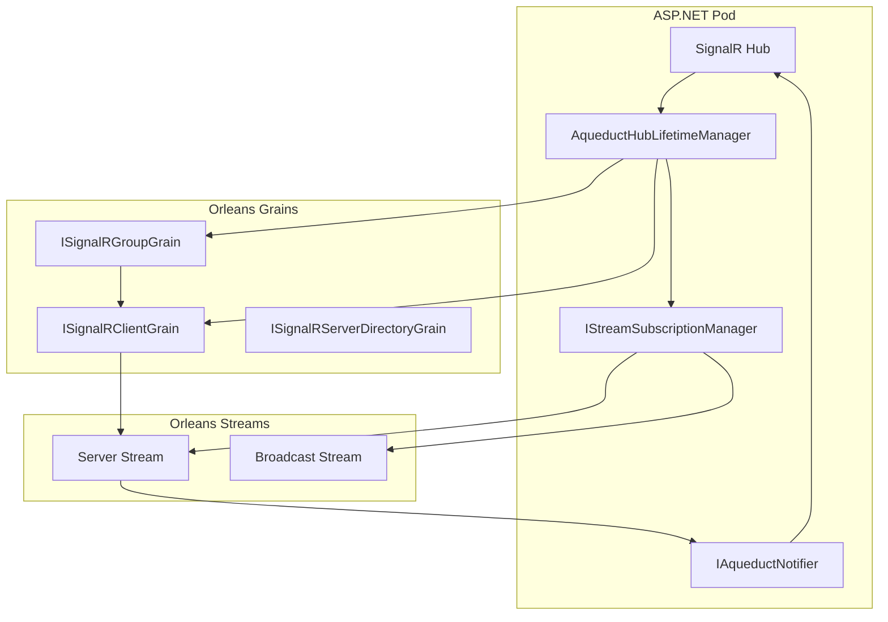
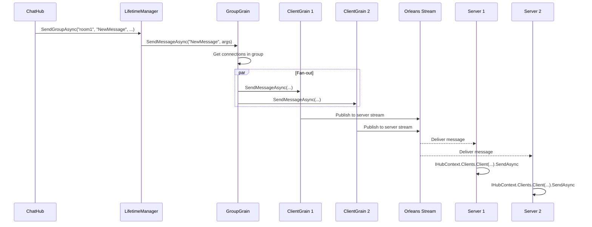
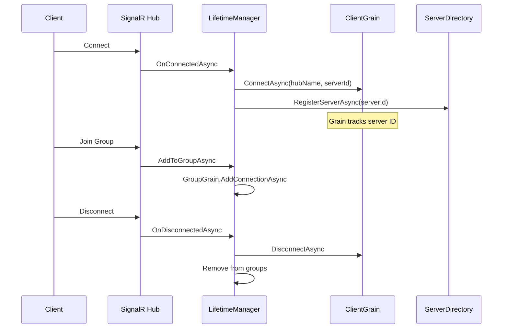

Aqueduct is an Orleans-backed SignalR backplane that enables real-time messaging
across multiple servers without external dependencies like Redis or Azure SignalR
Service.

## The Problem

Standard SignalR works great on a single server, but breaks in distributed
scenarios:



When Client A sends a message that should reach Client B, Server 1 has no way to
deliver it—Client B is connected to Server 2.

## The Solution

Aqueduct uses Orleans grains to track connections and route messages:



## Core Concepts

### SignalR Client Grain

Each SignalR connection gets a corresponding Orleans grain:

```csharp
public interface ISignalRClientGrain : IGrainWithStringKey
{
    Task ConnectAsync(string hubName, string serverId);
    Task DisconnectAsync();
    Task<string?> GetServerIdAsync();
    Task SendMessageAsync(string method, ImmutableArray<object?> args);
}
```

The grain:

- Tracks which server hosts the connection
- Routes messages through Orleans streams
- Handles graceful cleanup on disconnect

### SignalR Group Grain

Groups are managed by dedicated grains:

```csharp
public interface ISignalRGroupGrain : IGrainWithStringKey
{
    Task AddConnectionAsync(string connectionId);
    Task RemoveConnectionAsync(string connectionId);
    Task<ImmutableHashSet<string>> GetConnectionsAsync();
    Task SendMessageAsync(string method, ImmutableArray<object?> args);
}
```

When sending to a group, the grain fans out to individual client grains.

### Hub Lifetime Manager

Aqueduct replaces SignalR's default `HubLifetimeManager<THub>`:

```csharp
services.AddAqueduct<ChatHub>();
```

This routes all hub operations (send to user, group, all) through Orleans grains.

## Architecture



### Message Flow: Send to Group



## Getting Started

### 1. Configure Orleans Client

Your ASP.NET application needs Orleans client connectivity:

```csharp
builder.UseOrleansClient(client =>
{
    client.UseLocalhostClustering(); // Development
    // or
    client.UseAzureStorageClustering(...); // Production
});
```

### 2. Configure Stream Provider

Aqueduct uses Orleans streams for message delivery:

```csharp
siloBuilder.AddMemoryStreams("Aqueduct");
// or for production:
siloBuilder.AddAzureQueueStreams("Aqueduct", ...);
```

### 3. Register Aqueduct

Register Aqueduct for each hub:

```csharp
// Simple registration
services.AddAqueduct<ChatHub>();

// With options
services.AddAqueduct<ChatHub>(options =>
{
    options.StreamProviderName = "Aqueduct";
    options.HeartbeatInterval = TimeSpan.FromSeconds(30);
});
```

### 4. Use Your Hub Normally

Your hub code stays unchanged:

```csharp
public class ChatHub : Hub
{
    public async Task SendMessage(string room, string message)
    {
        await Clients.Group(room).SendAsync("ReceiveMessage", message);
    }

    public override async Task OnConnectedAsync()
    {
        await Groups.AddToGroupAsync(Context.ConnectionId, "general");
        await base.OnConnectedAsync();
    }
}
```

## Sending from Grains

Grains can send messages directly through the group grain:

```csharp
public class OrderProcessorGrain : Grain, IOrderProcessorGrain
{
    private IAqueductGrainFactory AqueductFactory { get; }

    public async Task ProcessOrder(Order order)
    {
        // Process the order...

        // Notify the user's group
        var groupGrain = AqueductFactory.GetGroupGrain(
            "OrderHub",
            $"user-{order.UserId}");

        await groupGrain.SendMessageAsync(
            "OrderUpdated",
            ImmutableArray.Create<object?>(order.Id, order.Status));
    }
}
```

## IAqueductNotifier

For ASP.NET-side notifications (where you have `IHubContext`):

```csharp
public interface IAqueductNotifier
{
    Task SendToAllAsync(
        string hubName,
        string method,
        ImmutableArray<object?> args,
        CancellationToken cancellationToken = default
    );

    Task SendToConnectionAsync(
        string hubName,
        string connectionId,
        string method,
        ImmutableArray<object?> args,
        CancellationToken cancellationToken = default
    );

    Task SendToGroupAsync(
        string hubName,
        string groupName,
        string method,
        ImmutableArray<object?> args,
        CancellationToken cancellationToken = default
    );
}
```

**Important:** `IAqueductNotifier` is for ASP.NET pods only. Grains should use
`ISignalRGroupGrain.SendMessageAsync` directly.

## Configuration Options

```csharp
public class AqueductOptions
{
    /// <summary>
    /// Orleans stream provider name. Default: "Aqueduct"
    /// </summary>
    public string StreamProviderName { get; set; } = "Aqueduct";

    /// <summary>
    /// Namespace for Orleans streams. Default: "signalr"
    /// </summary>
    public string StreamNamespace { get; set; } = "signalr";

    /// <summary>
    /// Interval between server heartbeats. Default: 30 seconds
    /// </summary>
    public TimeSpan HeartbeatInterval { get; set; }
        = TimeSpan.FromSeconds(30);

    /// <summary>
    /// Time before a server is considered dead. Default: 90 seconds
    /// </summary>
    public TimeSpan ServerTimeout { get; set; }
        = TimeSpan.FromSeconds(90);
}
```

## Server Directory

The `ISignalRServerDirectoryGrain` tracks active servers:

```csharp
public interface ISignalRServerDirectoryGrain : IGrainWithStringKey
{
    Task RegisterServerAsync(string serverId);
    Task UnregisterServerAsync(string serverId);
    Task<ImmutableHashSet<string>> GetActiveServersAsync();
    Task HeartbeatAsync(string serverId);
}
```

This enables:

- Detection of dead servers
- Cleanup of orphaned connections
- Load balancing awareness

## Connection Lifecycle



## Comparison to Other Backplanes

| Feature | Aqueduct | Redis | Azure SignalR |
| --- | --- | --- | --- |
| External dependency | Orleans | Redis server | Azure service |
| Group management | Grain-based | Redis sets | Service-managed |
| Message delivery | Orleans streams | Pub/sub | Managed |
| Connection tracking | Grain state | Redis keys | Managed |
| Scale-out | Orleans cluster | Redis cluster | Automatic |
| Cost | Compute only | Redis hosting | Per-unit pricing |

## Best Practices

### Group Naming

Use structured group names for clarity:

```csharp
// Good: Clear hierarchy
$"user-{userId}"
$"room-{roomId}"
$"tenant-{tenantId}:notifications"

// Avoid: Ambiguous or collision-prone
$"{userId}"
$"room"
```

### Message Size

Keep message payloads reasonable:

- Small payloads (< 1KB) work best
- For large data, send a reference and let clients fetch details
- Consider compression for repeated large payloads

### Connection Cleanup

Aqueduct handles cleanup automatically, but for explicit control:

```csharp
public override async Task OnDisconnectedAsync(Exception? exception)
{
    // Any explicit cleanup
    await base.OnDisconnectedAsync(exception);
}
```

### Deployment Boundaries

Remember the deployment split:

- **ASP.NET pods**: `IAqueductNotifier`, `HubLifetimeManager`
- **Orleans silos**: `ISignalRClientGrain`, `ISignalRGroupGrain`

Grains should never inject `IHubContext` or `IAqueductNotifier`.
